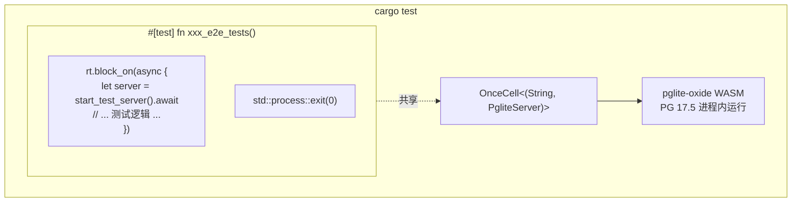

# 内嵌测试数据库（pglite-oxide）

## 概述

shittim-chest 使用 [pglite-oxide](https://crates.io/crates/pglite-oxide) 作为内嵌 PostgreSQL 用于所有集成和端到端测试。无需外部 Postgres、Docker 或 `testcontainers`——测试只需在任意机器上执行 `cargo test` 即可运行。

## 设计动机

此前，集成测试依赖 `postgresql_embedded`，会在运行时下载完整 PostgreSQL 二进制（约 100 MB）。这导致启动缓慢、平台特定故障和 CI 不稳定。pglite-oxide 将 PostgreSQL 17.5 打包为 WASM 模块，通过 wasmer 运行时运行——进程内、可移植、快速（约 96 ms 冷启动）。

## 架构



## 关键决策

| 决策 | 理由 |
| --- | --- |
| `pglite-oxide`（WASM）代替 `postgresql_embedded`（原生二进制） | 无需约 100 MB 下载，无平台特定 PG 二进制，约 96 ms 启动 |
| `pglite-oxide` 代替 `pglite-rust-bindings` | 已发布至 crates.io（v0.5.0），启动更快，成熟的 builder API 支持扩展 |
| `tower::ServiceExt::oneshot` 代替 `reqwest` | 避免 sqlx 连接池后台任务与 hyper HTTP 服务之间的 tokio 运行时死锁 |
| 单一 `#[test]` 运行器配合 `std::process::exit(0)` | sqlx `PgPool` 会生成持久后台任务（空闲回收器、健康检查），这些任务会保持 tokio 运行时存活。`exit(0)` 绕过此挂起 |
| `max_connections=1` | PGlite 基本限制——仅支持单连接 |
| `OnceCell<(String, PgliteServer)>` | 共享 PG 实例供同一次二进制运行中的子测试使用；`PgliteServer` 必须保持存活（不被 drop） |
| `pglite-oxide` 仅在 `[dev-dependencies]` 中 | wasmer 运行时不得泄漏到生产构建中 |

## 测试夹具模式

```rust
// tests/common/mod.rs
static PG: OnceCell<(String, PgliteServer)> = OnceCell::const_new();

async fn ensure_pg_url() -> String {
    PG.get_or_init(|| async {
        let server = PgliteServer::builder()
            .start()
            .expect("启动 pglite-oxide 失败");
        let url = server.database_url();
        // 连接、运行迁移、关闭初始连接
        (url, server)
    }).await.0.clone()
}

pub async fn start_test_server() -> TestServer {
    let db_url = ensure_pg_url().await;
    let db = Database::connect(/* max_connections=1 */).await;
    // 构建 AppState、Router，返回包装 tower oneshot 的 TestServer
}
```

```rust
// tests/xxx_tests.rs
# [test]
fn xxx_e2e_tests() {
    let rt = tokio::runtime::Runtime::new().unwrap();
    rt.block_on(async {
        let mut server = common::start_test_server().await;
        // ... 所有使用 server.request() 的子测试 ...
    });
    std::process::exit(0);
}
```

## 创建的表

测试设置期间通过 SeaORM 迁移创建全部 13 张表：

`auth_users`、`sessions`、`api_keys`、`oauth_connections`、`channel_configs`、`channel_messages`、`channel_pairings`、`conversations`、`messages`、`llm_providers`、`remote_devices`、`device_sessions`、`system_settings`、`workspace_sessions`

## PGlite 限制

1. **单连接**：`max_connections` 必须为 1。多个连接池指向同一 PGlite 实例将挂起。
1. **严格类型转换**：PGlite 比标准 PostgreSQL 更严格。如 `uuid_column = text_value` 这类查询将失败——始终显式转换。
1. **禁止并发测试运行器**：共享同一 PGlite 实例的所有异步测试必须在单个 `#[test]` 函数内顺序运行。
1. **连接池挂起**：`sqlx::PgPool::close()` 可能无限挂起。使用 `std::process::exit(0)` 终止测试进程。
