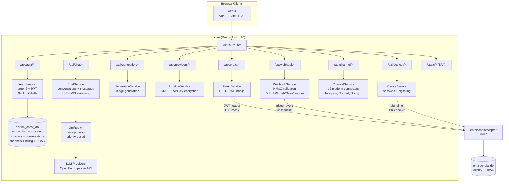
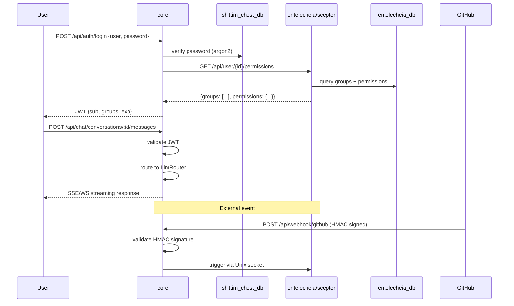

# 架构

> **版本**：0.1.0 — 活跃开发中。
> **最后验证时间**：2026-06-14
> 本项目是 [entelecheia](https://github.com/celestia-island/entelecheia) 面向用户的壳层。

## 范围

shittim-chest 是一个混合的 Cargo + pnpm monorepo。它拥有包装 entelecheia 智能体编排核心的面向用户层。两个项目通过 JWT 认证的 HTTP/WebSocket 进行通信 — shittim-chest 从不直接访问 entelecheia 的数据库进行智能体操作。

| 组件 | 技术 | 角色 | 状态 |
| --- | --- | --- | --- |
| **core** | Rust + Axum | 统一后端：认证（JWT + OAuth）、独立 LLM 路由、聊天 API、图像生成、webhook 入口、scepter 代理、远程设备信令、渠道集成、计费、RBAC、工作空间 | 🟢 已实现 |
| **cli** | Rust | Docker 编排器：dev、up、down、migrate、logs、status | 🟢 已实现 |
| **webui** | Vue 3 + Vite（TSX） | 前端：聊天界面、管理面板（20+ 视图）、2D SCADA 拓扑、3D 全息预览 | 🟡 部分 |
| **协议类型** | Rust（`arona` crate）+ ts-rs | 由外部 `arona` git crate 提供的 JSON-RPC 2.0 协议类型；TS 绑定供 webui 消费 | 🟢 已实现 |
| **IDE 插件** | TS + Kotlin + Rust + Lua | VS Code、IntelliJ、Zed、Neovim、LSP 桥接 | 🟡 可用 |
| **Tauri 应用** | Rust + Tauri | 桌面、移动、共享 DTO | 🟡 可用 |
| **harmony** | ArkTS | 鸿蒙应用 | 🟡 可用 |

## 架构图

### core 后端详情



### 跨项目通信



## 后端模块

所有模块位于 `packages/core/src/` 下。后端约 3.4 万行，分布在 135 个 Rust 文件中（含测试文件为 138 个）。

### 认证（`packages/core/src/auth/`）

全面实现：

- 用户名/密码注册和登录，使用 argon2 哈希
- JWT 访问令牌 + 刷新令牌系统，含轮换
- GitHub OAuth 2.0 集成（重定向 + 回调，自动创建用户）
- 会话管理（`sessions` 表的 CRUD）
- 在所有路由中使用的令牌验证中间件

### 聊天（`packages/core/src/chat/`）

全面实现：

- 会话 CRUD（创建、列出、获取、更新、删除）
- 消息发送/接收，含 LLM 路由
- SSE（服务器发送事件）流式响应（`/api/chat/stream`）
- WebSocket 流式传输（`/ws/chat/stream`）
- 使用 ILIKE 的消息搜索（`/api/chat/search?q=`）
- 会话导出（`/api/chat/conversations/:id/export?format=json|md`）

### LLM（`packages/core/src/llm/`）

全面实现：

- 用于聊天和图像生成的 OpenAI 兼容 HTTP 客户端
- 基于优先级选择的多提供商路由器
- 含 API 密钥加密（AES-256-GCM）的提供商 CRUD
- 模型列表和提供商测试端点
- 请求超时和流缓冲配置

### 生成（`packages/core/src/generation/`）

全面实现：

- 图像生成端点（`/api/generation/images`、`/api/generation/models`）
- 使用已配置的 LLM 提供商

### Webhook（`packages/core/src/webhook.rs`）

全面实现（约 1,000+ 行）：

- 含 HMAC-SHA256 验证的 GitHub webhook
- 含令牌验证的 GitLab webhook
- 含 HMAC + 令牌回退的 Gitee webhook
- 自定义 webhook 端点（`/api/webhook/custom/{name}`）
- 重复投递检测（LRU 缓存，最多 10,000 个 ID）
- 含列表 API 的投递日志
- Webhook 来源的 IP 白名单系统（独立的 `webhook_ip_whitelist.rs`）
- 通过 Unix 套接字向 scepter 转发触发器

### 设备（`packages/core/src/devices/`）

信令中继已实现（需要外部 scepter 进行 WebRTC 握手）：

- 设备列表、详情、会话 CRUD 的 REST 端点
- WebRTC 的 WebSocket 信令中继 — 通过 Unix 套接字将 SDP offer/ICE 候选转发到 scepter；SDP answer 必须来自 scepter（如果 scepter 不可达，`forward_sdp_to_scepter` 返回空字符串）
- 终端中继（通过 WebSocket 到 xterm.js）— 将击键转发到 scepter
- 桌面帧中继
- SFTP 文件浏览器后端
- 可配置项：每用户最大会话数、帧缓冲区大小、ICE 服务器
- 设备模型管理（`device_models/` 模块）

> **差距：** 中继是真实的，但没有运行中的 scepter 实例无法完成 WebRTC 握手。当 scepter 宕机时，SDP answer 为空，WebRTC 优雅失败。

### 渠道（`packages/core/src/channel/`）

全面实现（22 个模块文件 + `mod.rs`）：

- 12 个平台连接器：Telegram、Discord、Slack、Lark/飞书、QQ Bot、企业微信、IRC、Matrix、Mattermost、Google Chat、Microsoft Teams、LINE
- 每个平台的真实 API 客户端实现
- DM 策略控制（`dm_policy.rs`）
- 速率限制（`rate_limit.rs`）
- 健康检查（`health_check.rs`）
- 渠道配对（`pairing.rs`）
- 插件系统（`plugin.rs`）
- 加密凭证存储（`crypto.rs`）
- 中央注册表（`registry.rs`）和路由（`routes.rs`）

### 其他后端模块

| 模块 | 描述 |
| --- | --- |
| `proxy/` | Scepter HTTP/WS 桥接（`ws_bridge.rs` 是代码库中最大的单文件） |
| `rbac/` | 基于角色的访问控制 |
| `workspace/` | 工作空间管理 |
| `oauth.rs` | OAuth 提供商集成 |
| `billing.rs` | Stripe 支付集成（webhook HMAC 验证、checkout/subscription 事件、配额执行、支付去重） |
| `container/` | Docker 容器管理 |
| `cruise/` | Cruise（自动化工作流）支持 |
| `audio/` | 音频/语音服务支持 |
| `skills.rs` | **桩** — 返回空数组；尚无数据库支持或 scepter 集成 |
| `tools.rs` | **桩** — 返回空数组；尚无数据库支持或 scepter 集成 |
| `system_settings.rs` | 系统配置 |
| `trigger_forward.rs` | 事件触发器转发 |
| `quota_guard.rs` / `resource_quotas.rs` | 资源配额执行 |
| `avatar_platforms.rs` | 头像平台集成 |

### 数据库

通过 SeaORM 1.x 的 PostgreSQL，包含 **5 个迁移**和 **25 个实体模型**：

`auth_users`、`avatar_platforms`、`channel_configs`、`channel_messages`、`channel_pairings`、`channel_plugins`、`conversations`、`cruise_history`、`device_models`、`device_sessions`、`llm_providers`、`messages`、`oauth_connections`、`payment_events`、`projects`、`rbac_grants`、`rbac_groups`、`rbac_user_groups`、`remote_devices`、`scene_configs`、`sessions`、`system_settings`、`webhook_deliveries`、`workspace_alias_registry`、`workspace_sessions`

## 前端

### webui（`packages/webui/`）

Vue 3 + Vite 前端，用 TSX 编写（通过 `@vitejs/plugin-vue-jsx` — 无 `.vue` SFC 文件）。npm 包：`@celestia-island/webui`。约 3.1 万行。

#### 视图

| 视图组 | 描述 |
| --- | --- |
| `demiurge/` | 主聊天界面（DemiurgeView）— 流式响应、智能体状态、工具调用 |
| `auth/` | LoginView、RegisterView、SetupView |
| `admin/` | 20+ 管理视图：Dashboard、Providers、Agents、RBAC、Webhooks、Channels、System、Device Models、Devices Settings、Skills、MCP Tools、OAuth Providers、Token Usage、Workspaces、Voice Service、Resource Quota 等 |
| `topology/` | 2D SCADA 拓扑：TopologyOverview、TopologyBoxDetail、TopologyDeviceDetail。传输是真实的（WS JSON-RPC 转发到 scepter）；**没有 scepter 时，TopologyOverview 回退到硬编码的 `SIMULATED_DEVICES`（19 个演示设备）和中文遥测芯片；TopologyBoxDetail 显示空状态** |
| `holographic/` | 3D 全息预览：HolographicOverview、HolographicBoxZoom、HolographicModelDetail。**3D 模型加载是真实的**（从本地后端加载实际的 GLB 文件、项目、场景配置）；遥测参数芯片需要 scepter，失败时回退到空 |

#### 组件系统

| 目录 | 描述 |
| --- | --- |
| `base/` | 50+ 个 `S` 前缀的设计系统组件（SButton、SCard、SModal、STable、STabs、STimeline、STreeView、SMarkdownRenderer、SMorphingTabs 等） |
| `chat/` | 聊天特定组件（ChatBubble、AgentStatusBar、FloatingChatBar、ThinkingDots、ReportViewer、NodeMinimap 等） |
| `header/` | 头部组件（面包屑栏、模式切换） |
| `layout/` | 应用壳（SAppShell、SSidebar、SDrawer、SWallpaperRenderer 等） |
| `preview/` | SCADA 符号库、拓扑、全息组件 |
| `cruise/` | Cruise 工作流组件 |
| `panels/`、`popups/`、`shared/` | 支持 UI |

#### 动画系统

webui 中所有 CSS 驱动的运动和逐帧采样都通过**一个共享的 rAF 循环**运行，该循环由 `packages/webui/src/theme/animationBus.ts` 拥有 — 每个对话框、模态框、弹出框、抽屉、提示和列表过渡都应向此注册的"动画上下文"。该总线是进程级单例；空闲时自关闭，仅在有进行中的工作时旋转，因此空闲标签页不会消耗帧。

该总线暴露四个工作注册 API 加两个附带通道标志：

| API | 用途 | 帧模型 |
| --- | --- | --- |
| `onFrame(cb, priority?)` | 注册逐帧回调。`priority` ∈ `sync` / `normal` / `idle`。返回 `{ disconnect() }`。 | 每帧调用（sync），节流至约 30 Hz 预算（normal），或约 0.5 Hz 预算（idle）。 |
| `onceFrame(cb)` | 在下一帧运行回调，然后自动断开。即发即弃（无可取消句柄）。 | 一次性。 |
| `scheduleFrame(cb)` | 在下一帧运行回调；返回 `{ disconnect() }` 以在触发前取消。用于"将多次调用合并为一个帧后回调"的节流模式（替代手写的 `if(rafId)cancel; rafId=rAF(cb)` 惯用法）。 | 一次性（可取消）。 |
| `reportTransition(durationMs)` | **声明式**：声明"一个持续时间为 N 的 CSS 过渡正在进行"，无需逐帧回调。总线仅在此窗口期间保持其循环活跃，以便采样 `onFrame` 的观察者不会在过渡期间挂起。 | 零每帧成本；仅状态。 |
| `notifyScrollStart()` | 在 150 毫秒滚动窗口期间，抑制 `normal` 优先级回调（节省电力；sync 和 idle 不受影响）。 | 附带通道标志。 |
| `setReducedMotion(flag)` | 遵循用户的 `prefers-reduced-motion` / `html.reduce-motion` 类 — 设置时停止**动画**循环。一次性回调（`onceFrame` / `scheduleFrame`）是工具性工作（测量、刷新），而非动画，因此它们在单独的 drainer rAF 上继续排空，从不暂停。 | 附带通道标志。 |

该总线之上的组合层是 `packages/webui/src/composables/useReportedTransition.ts`。**这是推荐的使用接口**，适用于任何使用共享 `--duration-*` 令牌运行 CSS `transition` / `animation` 的组件。它在组件卸载时自动取消，并合并快速切换。总线跟踪时间线；CSS 执行视觉工作；两者通过共享令牌保持同步。

```ts
// single-transition component (dialog opens OR closes — mutually exclusive)
const anim = useReportedTransition(300);
function onBeforeEnter() { anim.run(); }
function onAfterEnter()  { anim.cancel(); }

// overlapping transitions (e.g. a TransitionGroup whose items enter AND leave
// at the same time) — split by track so a leave's run() can't cancel an
// in-flight enter's report:
const anim = useReportedTransition(300);
const enter = anim.track("enter");
const leave = anim.track("leave");
//   onBeforeEnter={enter.run} onAfterEnter={enter.cancel}
//   onBeforeLeave={leave.run} onAfterLeave={leave.cancel}
```

DOM 总线有意与 **`packages/webui/src/composables/three/animationBus3D.ts`** 分开，后者为 three.js 渲染管道拥有自己的 rAF 循环。3D 帧时序绝不能影响 DOM 过渡调度，反之亦然；两者可以独立暂停或调试。两者暴露相同的 `onFrame → { disconnect }` 形状。

**运动令牌**（`packages/webui/src/theme/theme.scss`）是持续时间/缓动的唯一事实来源：`--duration-instant/short/normal/long` 用于移动，`--duration-fade` 用于透明度/颜色渐变，以及 `--ease-spring/out-expo/in-expo/standard` 用于曲线。`prefers-reduced-motion` / `html.reduce-motion` 将移动令牌压缩为 `0s`，但**有意保持 `--duration-fade` 非零** — 抑制触发前庭的*移动*而非状态变化的透明度，是无障碍正确的行为。始终使用 `reportTransition(--duration-*)`，以便 CSS 过渡的总线时间线与其视觉时间线匹配。

**覆盖率**：webui 中的每个 2D-DOM rAF 延迟现在都通过总线 — `onFrame` / `reportTransition` 用于连续动画，`onceFrame` / `scheduleFrame` 用于一次性工具延迟（测量、节流重新计算、批量刷新）。唯一剩余的原始 `requestAnimationFrame` 调用点是 3D 管道（`composables/three/*`，它有自己的 `animationBus3D.ts`）和总线自身的内部循环调度；两者都是有意的。新工作永远不应直接调用 `requestAnimationFrame` — 选择适当的总线 API。

#### 导入路径

webui 通过**两个故意不同的路径别名**（均在 `vite.config.ts` + `tsconfig.json` 中声明）消费其自身的 `src/`，整个代码库遵循此分离：

| 别名 | 解析为 | 用于 |
| --- | --- | --- |
| `@/<path>` | `src/*` | **内部深层导入** — 直接访问特定模块（`@/api/client`、`@/composables/useReportedTransition`、`@/theme/animationBus`）。约 600 处；从不作为裸桶使用。 |
| `@celestia-island/shared_ui` | `src/`（→ `src/index.ts` barrel） | **仅限精选的公共 API 接口** — 始终是裸说明符，从不编码子路径。约 92 处。 |

此分离强制执行了公共/私有边界（类似于包的 `exports` 映射）：桶（`src/index.ts`）是唯一可作为"包"导入的东西，而 `@/` 允许内部代码访问实现模块。将桶视为契约 — 当某物应公开时，添加到 `src/index.ts`。共享设计系统资源（`theme/*.scss`、`res/*`）也可在 `shared_ui` 命名空间下访问。遗留的 `@shared_ui` 别名是 `@celestia-island/shared_ui` 的重复，仍被少数 SCSS `@use` 语句引用；新代码应使用 `@celestia-island/shared_ui`。

### 协议类型（`arona` crate）

JSON-RPC 2.0 协议类型和共享枚举由外部 [`arona`](https://github.com/celestia-island/arona) Rust crate 提供，在 `Cargo.toml` 中声明为 git 依赖。该 crate 派生 `ts-rs` 绑定，生成到 `packages/webui/src/types/arona/`，并通过 `@celestia-island/arona` 路径别名供 webui 消费。

### 管理面板

管理视图位于 webui 的 `admin/` 路由组下：Dashboard、Providers（CRUD + 添加提供商向导）、Agents、Agent Detail、RBAC（组 + 授权）、Webhooks、Channels、System、Device Models、Devices Settings、Skills、MCP Tools、OAuth Providers、Token Usage、Workspaces、Voice Service、Resource Quota。

### i18n

webui 使用**`vue-i18n`**（非自定义实现），包含**11 种声明的语言环境**：阿拉伯语（`ar`）、德语（`de`）、英语（`en`）、西班牙语（`es`）、法语（`fr`）、日语（`ja`）、韩语（`ko`）、葡萄牙语（`pt`）、俄语（`ru`）、简体中文（`zhs`）、繁体中文（`zht`）。

每种语言环境有**17 个命名空间 JSON 文件**（admin、auth、chat、cmd、common、devices、errors、footer、help、logs、models、reports、skills、timeline、tokenUsage、tools、workspace）。应用内语言切换可通过头部语言选择器使用。

> **翻译完整性差异显著**（对照 950 个英文参考键审计）：
> | 层级 | 语言环境 | 英文直通 | 键缺失 |
> |------|---------|-------------------|---------|
> | 翻译良好 | `ja`、`ko`、`zhs`、`zht` | ~5% | `zhs` 缺失 18 个键；其他缺失 112 个 |
> | 大部分已翻译 | `de`、`fr`、`pt`、`es`、`ar` | ~9–14% | 缺失共享的 112 键块 |
> | 翻译实质不足 | `ru` | **~76%** | 键完全对等，但值是无区别的英文 |
> 共享的 112 键差距涵盖较新功能：`admin.agents.*`、`admin.deviceModels.*`、`admin.projects.*`、`admin.rbac.*`、`admin.resourceQuota.*`、`auth.protocol.*`、`chat.cruise.*`、`chat.voice_*`。

## RBAC 架构

### 数据分离

数据所有权在两个项目之间分离，以维护清晰边界：

| 数据 | 数据库 | 所有者 | 理由 |
| --- | --- | --- | --- |
| 用户凭证（密码哈希、OAuth、API 密钥） | shittim_chest_db | shittim-chest | 展示层拥有登录流程 |
| 活跃会话、刷新令牌 | shittim_chest_db | shittim-chest | 会话管理是前端关注的问题 |
| 会话、消息 | shittim_chest_db | shittim-chest | 聊天数据是面向用户的 |
| LLM 提供商配置 | shittim_chest_db | shittim-chest | 提供商管理是面向用户的 |
| 渠道配置、计费、工作空间 | shittim_chest_db | shittim-chest | 面向用户的运营数据 |
| 用户身份、组、角色分配 | entelecheia_db | entelecheia | 编排核心执行权限 |
| GroupPermissions（提供商配额、智能体白名单） | entelecheia_db | entelecheia | 智能体级别的策略与智能体同存 |

### 认证流程

1. 用户通过 core 认证（密码 / OAuth）
1. core 对照 `shittim_chest_db` 验证凭证（密码使用 argon2）
1. core 查询 entelecheia 获取用户的组权限（或从 TTL 缓存读取）
1. core 签发 JWT，包含 `{ sub: user_id, groups: [...] }`
1. 所有后续请求携带 JWT → core 验证 → 转发到 scepter 进行代理路由
1. scepter 验证 JWT（通过环境变量共享密钥）并强制执行组级别的权限

## 跨项目依赖

### Rust crate

shittim-chest 依赖 celestia-island 生态系统中的两个外部 crate：

```toml
# External protocol crate — shared between shittim-chest and entelecheia
arona = { git = "https://github.com/celestia-island/arona.git", branch = "dev" }

# Versioned JSON serialization (migrate-on-read for JSON/JSONB columns)
hifumi = { path = "../hifumi/packages/types" }
```

`arona` crate 提供两个项目共享的 JSON-RPC 协议类型和共享枚举。`hifumi` crate 为数据库列提供版本化的 JSON 序列化。

### npm 包

webui 通过 `@celestia-island/arona` 路径别名消费 `arona` crate 的 TS 绑定，该别名指向 `packages/webui/src/types/arona/`（`ts-rs` 输出位置）。webui 的 `@celestia-island/shared_ui` 是指向 `packages/webui/src/` 的自别名，用于内部导入。

## 当前差距

> **本节记录已知限制和不完整的区域。**

### 依赖 Scepter 的功能

以下功能在 shittim-chest 中有真实实现，但需要运行中的 [entelecheia/scepter](https://github.com/celestia-island/entelecheia) 实例才能完全发挥作用：

| 功能 | 什么可用 | 需要 scepter 什么 |
| --- | --- | --- |
| 拓扑 SCADA | WS 传输、SVG 渲染、面包屑导航 | 实时遥测数据（转发到 scepter 的 `topology.*` RPC） |
| 全息 3D | GLB 模型加载、场景配置、摄像机控制 | 遥测参数芯片 |
| 设备 WebRTC | 信令中继、JWT 认证、ICE 转发 | SDP answer 生成 |
| Cruise 仪表板 | 组件渲染、WS 订阅 | 实时智能体流数据 |
| Scepter 代理 | HTTP/WS 桥接（`ws_bridge.rs`，2K 行） | 所有代理的智能体操作 |

没有 scepter 时，拓扑回退到 `SIMULATED_DEVICES`（硬编码演示数据）；全息芯片和设备 WebRTC 显示空/失败状态。

### i18n 差距

参见上方的 [i18n 部分](#i18n)获取完整审计。摘要：`ru` 结构完整但约 76% 英文直通；8 种语言环境共享由新功能造成的 112 键差距。

### 测试覆盖

后端有针对认证、聊天、webhook HMAC 验证、计费（8 个 Stripe 签名测试）和工作空间 API 的集成测试。前端有针对组合函数（`useToast`、`useConfirm`、`useSolarTime`、`useAsyncData`）和实用工具（验证、uuid、错误）的单元测试。

**未测试区域：** 大多数 CRUD 管理路由、渠道连接器 API 调用（全部 12 个连接器文件零测试；仅 `crypto.rs` 和 `rate_limit.rs` 被测试）、设备信令中继、音频模块（940 行、零测试）、拓扑/全息页面、IDE 插件运行时、Tauri/HarmonyOS 应用流程。相对于约 6.5 万行代码，覆盖率较低。

### 后端桩

`skills.rs` 和 `tools.rs` REST 端点仍为仅回退桩（返回 `[]`），但**主要 WS 路径已全面接入**，通过 `ws_bridge.rs` 中的通用通知-响应桥接实现。该桥接将 webui 请求-响应方法转换为 scepter 通知风格的配对操作：

| WS 方法 | Scepter 配对 | 状态 |
| --- | --- | --- |
| `skills.list` | `Skill.ListSkills` → `SkillsListResponse` | ✅ 已桥接（字段映射器） |
| `tools.list` | `Mcp.ListTools` → `ToolsListResponse` | ✅ 已桥接（字段映射器） |
| `layer2.agents.list` | `Tui.Layer2AgentList` → Response | ✅ 已桥接（身份） |
| `layer2.tools.list` | `Tui.Layer2AgentMcpTools` → Response | ✅ 已桥接（按智能体关联） |
| `layer2.skills.list` | `Tui.Layer2AgentSkills` → Response | ✅ 已桥接（按智能体关联） |

要添加新的桥接方法，在 `ws_bridge.rs` 的 `NOTIFICATION_BRIDGES` 中添加一个条目 — 不需要新的处理函数。REST 端点（`skills.rs`、`tools.rs`）仅在 WS 不可用时作为 HTTP 回退被访问。

`chat.stop` 现在将 `request.cancel` 转发到 scepter（通过 `cancel_active_request()` 中止运行中的技能链），而不仅仅是清除客户端流显示。

### 模拟模式

后端有一个 `SHITTIM_CHEST_MOCK_MODE` 环境标志（`config.rs`），在开发时跳过 JWT 验证和 HMAC 检查。这是一个**安全绕过**，不是数据模拟层 — 它发出响亮的警告，绝不应在生产中使用。

## 许可证

| 参数 | 值 |
| --- | --- |
| 商业许可证 | Business Source License 1.1（BUSL-1.1） |
| 非商业使用 | Synthetic Source License 1.0（SySL-1.0） |
| 附加使用授权 | 允许内部生产、学术、政府和非商业用途 |
| 限制 | 第三方托管/管理/转售服务需要商业许可证 |
