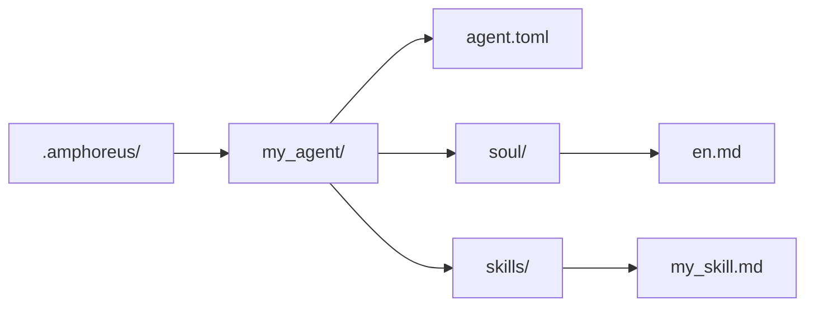

# Agent 开发教程

> 以当前仓库现实为准的 Agent 开发说明

## 概述

当前仓库中有三种实际可用的扩展层级。

| 层级 | 当前含义 |
| --- | --- |
| Layer1 | 以 Rust crate 实现并编译进 workspace 的核心 Agent |
| Layer2 | Web Automation 这一活跃内置领域 Agent，加上若干归档或规划材料 |
| Layer3 | 用户自定义 Agent（计划中，尚未实现） |

不要再把历史文档中出现的所有 Layer2 方案都理解为当前仍然活跃的内置 Agent。

## Layer3 是最简单的扩展路径

> **注意**：Layer3 目前仅处于设计阶段。`.amphoreus/` 目录、Agent 加载器（`Layer3Workspace`）及配置框架尚未实现。本节描述的是未来使用的目标设计。

如果你希望扩展 Entelecheia（玄枢），但不修改 Rust workspace，优先使用 Layer3（待实现后）。

### 最小结构

### Layer3 当前能提供什么

- 基于 prompt 的 soul 文件
- 基于 prompt 的 skill
- 复用现有平台工具
- 加载时的预检扫描

### Layer3 当前不能自动提供什么

- 新的 Rust MCP 后端
- 完整沙箱保证
- 每条 skill/tool 路径天然具备生产可用性

## 内置 Agent 开发

内置 Agent 是位于 `packages/agents/<agent>/` 下的 Rust crate。

常见组成包括：

- `src/lib.rs`
- `src/state.rs`
- `src/skills.rs`
- `src/mcp/registry.rs`
- `src/mcp/tools/*.rs`

同时还需要在 `res/prompts/agents/<agent>/` 下维护对应文档。

## 当前对 Layer2 的建议

仓库历史上曾包含大量 Layer2 领域 Agent 设计。当前应按以下方式理解：

- 当前 workspace 中活跃的内置 Layer2 crate 是 Web Automation
- 旧 Layer2 文档很多描述的是设计目标或归档材料
- 新的内置 Layer2 开发应被视为真实产品开发，而不是仅靠恢复文档即可“启用”

## 当前安全提示

- 预检扫描已存在，但仍是基于关键字的规则扫描。
- 工具是否可用，取决于对应 MCP 工具背后的真实实现。
- 文档中提到的部分工具和 skill 仍可能是部分实现或 stub。

## 参考路径

- `packages/shared/custom_agent/src/`
- `packages/agents/hubris/`
- `packages/agents/kalos/`
- `packages/agents/aporia/`
- `res/prompts/agents/`

## 测试建议

当前更建议直接验证：

- Layer3 的解析与加载
- skill 解析
- Rust 中 MCP 工具的直接测试
- 你实际修改的那条 agent/tool 路径

不要再把旧架构文案当成“某个 Layer2 路径已经活跃”的证据。
