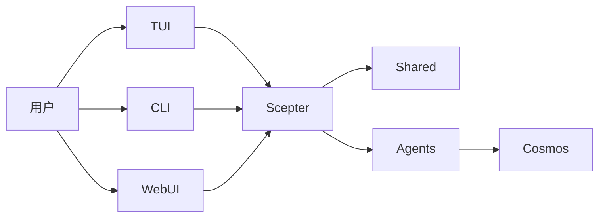

# 架构

> 以当前运行时结构为准，而不是目标态想象图

## 运行时概览

当前平台的核心是 `packages/scepter`、`packages/shared` 和 `packages/tui`。

## 当前最成熟的部分

- Scepter 服务端编排
- Shared 中的配置、工具名、prompt 和状态类型
- TUI 用户链路
- 基于容器的执行路径

## 当前仍属部分实现的部分

- CLI 命令覆盖度
- 高级 memory / RAG 集成
- 大多数领域化 Layer2 方案

## 当前活跃的 Agent 结构

### Layer1

workspace 当前编译 12 个 Layer1 Agent，覆盖消息路由、规划、文件、容器、脚本、知识、搜索、调度、安全、记忆与设备相关能力。

### Layer2

当前 workspace 有两个活跃的内置 Layer2 crate：**Web Automation**（浏览器自动化）和**经典软件工程**（静态分析、代码评审、质量度量、重构、LSP 诊断/符号/重构）。旧文档中列出的 11 个专用 Agent 描述的是这两个之外已归档或规划中的内容。

### Layer3

Layer3 仍是基于 `.amphoreus/` 的自定义 Agent 扩展点（设计阶段，尚未实现）。

## 执行模型

### 模型可见工具

模型通常只看到：

- `exec`
- `write_to_var`
- `write_to_var_json`

内部 MCP 工具通过运行时间接调用。

### 进程内与容器路径

部分逻辑在 Scepter 进程内执行，另一部分工作则通过容器化路径和运行时辅助模块完成。

### WebUI / IDE / Tauri

Web UI（arona）、管理面板（malkuth）、IDE 插件与 Tauri 应用已迁移至姊妹项目 **shittim-chest** 并从本仓库移除。本仓库的首选界面是 **TUI**；Web/IDE 层位于 shittim-chest，通过 JWT + WebSocket/HTTP 与 Scepter 通信。

## Memory 与知识能力

RAG 与 memory 比旧概览所述更成熟，但仍有部分集成胶水待补：

- 已实现三种嵌入后端：API（OpenAI 兼容）、本地 ONNX 推理（`FastEmbeddingService`，默认 BGE-M3）、SHA-256 哈希兜底
- 内存态向量文档与 **PgVector** 存储（HNSW 索引）均可用
- 图遍历与混合检索（RRF 融合）已可用
- embedding→RAG 自动接线和 RAG 订阅同步仍待集成
