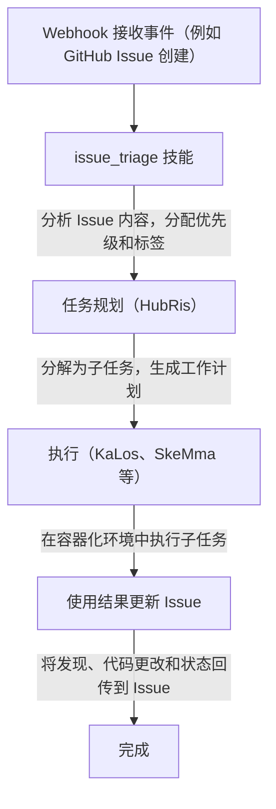

# Issue 跟踪集成

> 将外部 Issue 跟踪系统连接到 Entelecheia（玄枢） 的 Agent 工作流
> 当前状态说明：HubRis 当前确实提供 issue 的创建、更新、搜索和评论辅助能力，仓库中也存在 webhook 集成。但本文不应被理解为“已经存在一个完整统一的跨平台 issue 产品面”。

-----------------------------------------------------------------------------

## 目录

- [概述](#概述)
- [容器三层标识](#容器三层标识)
- [绑定 ID 格式](#绑定-id-格式)
- [Agent 如何与 Issue 交互](#agent-如何与-issue-交互)
- [Issue 驱动的工作流](#issue-驱动的工作流)
- [平台前缀注册表](#平台前缀注册表)
- [容器 Fork 分支命名](#容器-fork-分支命名)
- [WebUI 集成](#webui-集成)

-----------------------------------------------------------------------------

## 概述

当前 Entelecheia 的 issue 相关能力主要来自两个方向：

- webhook 集成可把外部事件转发进系统
- HubRis 提供 issue 风格的增删改查辅助能力

跨平台 issue 自动化可以视为已经存在的方向与部分实现，但不应默认认为本文中的每条工作流都已经完整闭环。

-----------------------------------------------------------------------------

## 容器三层标识

Entelecheia 中的容器使用三层 ID 系统，在不同上下文中维护身份：

| 层级 | 格式 | 生命周期 | 用途 |
| --- | --- | --- | --- |
| UUID | 标准 UUID（例如 `550e8400-e29b-41d4-a716-446655440000`） | 永久 | 数据库主键、跨重启追踪 |
| 绑定 ID | `@platform#id`（例如 `@github#234`） | 稳定 | 外部资源绑定、分支命名 |
| 运行时 ID | `#xxx`（例如 `#616`） | 每次会话 | TUI 显示、Unix socket 路由 |

**绑定 ID** 将容器链接到外部平台资源。它在 Scepter 重启后保持稳定，不像运行时 ID 在每次启动时重新分配。

-----------------------------------------------------------------------------

## 绑定 ID 格式

绑定 ID 的通用格式为：

```text
@platform#id[@#floor]
```

- `platform` —— 平台前缀（例如 `github`、`gitee`、`gitlab`）
- `id` —— 平台上的 Issue 或资源编号
- `@#floor` —— 可选的楼层号，用于嵌套引用（例如评论）

### 示例

| 绑定 ID | 含义 |
| --- | --- |
| `@github#123` | GitHub Issue #123 |
| `@gitee#456` | Gitee Issue #456 |
| `@gitlab#789` | GitLab Issue #789 |
| `@github#123@#5` | GitHub Issue #123 的第 5 条评论 |
| `@feishu#abc123` | 飞书消息话题 abc123 |

绑定 ID 用于：

- 容器标签和元数据
- Issue 驱动开发的分支名称
- Agent 技能参数
- WebUI Issue 列表过滤

-----------------------------------------------------------------------------

## Agent 如何与 Issue 交互

Agent 通过 HubRis MCP 工具与外部 Issue 交互。这些工具封装了平台特定的 API：

### 可用的 Issue 操作

| 工具 | 描述 |
| --- | --- |
| `$.agent.HubRis.issue_create()` | 在外部平台上创建新 Issue |
| `$.agent.HubRis.issue_update()` | 更新现有 Issue（标题、正文、状态、标签） |
| `$.agent.HubRis.issue_search()` | 跨平台搜索 Issue 并应用过滤器 |
| `$.agent.HubRis.issue_comment()` | 向现有 Issue 添加评论 |

### 在 exec 代码中使用

```typescript
$.agent.HubRis.issue_create({
  platform: "github",
  repository: "celestia-island/entelecheia",
  title: "Fix WebSocket reconnection logic",
  body: "The WebSocket client does not retry on connection loss.",
  labels: ["bug", "priority:high"]
});
```

```typescript
$.agent.HubRis.issue_search({
  platform: "github",
  repository: "celestia-island/entelecheia",
  state: "open",
  labels: ["bug"]
});
```

```typescript
$.agent.HubRis.issue_comment({
  binding_id: "@github#123",
  body: "Investigation complete. Root cause identified in src/ws/client.rs:42."
});
```

-----------------------------------------------------------------------------

## Issue 驱动的工作流

默认的 Issue 驱动工作流遵循以下流水线：



### 逐步示例

1. 开发者创建了标题为 "Memory leak in container cleanup" 的 Issue `@github#42`
1. GitHub Webhook 将事件转发到 Scepter
1. `issue_triage` 技能将其分类为 **bug**，优先级为 **high**
1. HubRis 分解任务：(a) 复现泄漏 (b) 找到根因 (c) 实现修复
1. KaLos 读取相关源文件，SkeMma 运行诊断脚本
1. Agent 提交修复并在 `@github#42` 上评论解决方案

-----------------------------------------------------------------------------

## 平台前缀注册表

平台前缀映射是可配置的。默认注册表包括：

| 前缀 | 平台 | Issue URL 模式 |
| --- | --- | --- |
| `github` | GitHub | `https://github.com/{repo}/issues/{id}` |
| `gitee` | Gitee | `https://gitee.com/{repo}/issues/{id}` |
| `gitlab` | GitLab | `https://gitlab.com/{repo}/-/issues/{id}` |
| `feishu` | 飞书 / Lark | 内部消息链接 |
| `discord` | Discord | 频道消息链接 |
| `telegram` | Telegram | 聊天消息链接 |

### 国际化支持

平台前缀支持国际化名称。例如，飞书可以通过以下方式引用：

- `@feishu#123`（英文名称）
- `@飞书#123`（中文名称）

前缀注册表内部会将这些标准化为规范前缀。

-----------------------------------------------------------------------------

## 容器 Fork 分支命名

当 Agent 为 Issue 驱动的工作创建分支时，分支遵循命名约定：

### 格式

```text
cosmos-<binding_id>-<reason>
```

或

```text
cosmos-<uuid8>-<reason>
```

### 示例

| 分支名称 | 上下文 |
| --- | --- |
| `cosmos-@github#42-fix-memory-leak` | 修复 GitHub Issue #42 |
| `cosmos-@gitee#15-add-ci-pipeline` | Gitee Issue #15 的功能开发 |
| `cosmos-a1b2c3d4-refactor-auth-module` | 使用 UUID 前缀的内部任务 |

绑定 ID 格式确保分支可以追溯到其原始 Issue。

-----------------------------------------------------------------------------

## WebUI 集成

Entelecheia WebUI 提供了跨所有连接平台的 Issue 统一视图。

### 左侧边栏 —— 聚合 Issue 列表

- 在单一列表中显示所有平台的 Issue
- 每条记录显示：平台图标、Issue 编号、标题、状态、分配的 Agent
- 点击 Issue 打开其详情视图

### 过滤

Issue 可以按以下条件过滤：

- **平台**：仅显示 GitHub、Gitee、GitLab 等
- **状态**：开放、已关闭、进行中
- **优先级**：高、中、低（从标签派生）
- **分配的 Agent**：按当前正在处理该 Issue 的 Agent 过滤

### Issue 详情视图

详情视图显示：

- 完整的 Issue 标题和正文（从 Markdown 渲染）
- 平台链接（在浏览器中打开原始 Issue）
- Agent 活动日志（技能调用、发布的评论）
- 关联的容器和分支

-----------------------------------------------------------------------------

## 下一步

- 阅读 [Webhook 平台设置](webhook-setup.md)连接您的平台
- 浏览[架构](architecture.md)了解 HubRis Agent 设计
- IDE 集成已迁移至 [shittim-chest](https://github.com/celestia-island/shittim-chest) 兄弟仓库
