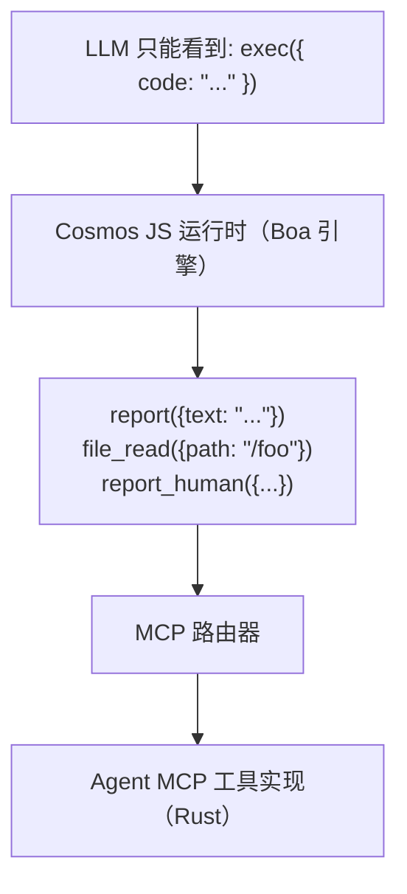
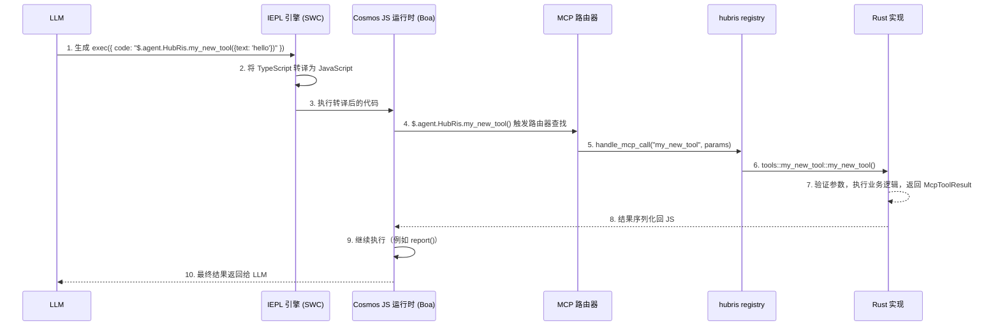

+++
title = "MCP 工具开发教程"
description = """> 如何在 Entelecheia（玄枢） 平台中创建和注册 MCP 工具"""
lang = "zhs"
category = "guides"
subcategory = "core"
+++

# MCP 工具开发教程

> 如何在 Entelecheia（玄枢） 平台中创建和注册 MCP 工具

---

## 目录

- [Exec-Only 微内核](#exec-only-微内核)
- [MCP 工具结构](#mcp-工具结构)
- [添加新的 MCP 工具](#添加新的-mcp-工具)
- [最佳实践](#最佳实践)
- [测试 MCP 工具](#测试-mcp-工具)

---

## Exec-Only 微内核

Entelecheia 使用**微内核架构**进行工具访问。LLM 只能看到三个工具——`exec`、`write_to_var`、`write_to_var_json`——所有实际工作都在其 TypeScript 运行时（IEPL 引擎）内部完成。



**核心原则**：LLM 永远不会直接调用 MCP 工具。它生成通过 ES 模块导入调用工具函数 API 的 TypeScript 代码（例如 `import { report } from 'hubris'; report()`），IEPL 引擎将其转译为 JavaScript 并分发到实际的 Rust 实现。

- ES 模块导入 — 通用模式（例如 `import { report } from 'hubris'; report()`、`file_read()`）
- `exec`、`write_to_var`、`write_to_var_json` 是所有 Agent 仅注册的三个工具（参见 `packages/shared/domain_skills/src/tool_names.rs:265-283`）

Skill 的 TOML frontmatter 中的 `related_tools` 声明决定了哪些 ES 模块导入 API 会在发送给 LLM 的提示词中提供文档。

---

## MCP 工具结构

一个 MCP 工具由三部分组成：

1. **Rust 实现** — 实际逻辑，位于 `packages/agents/<agent>/src/mcp/tools/`
1. **Registry 分发** — 路由，位于 `packages/agents/<agent>/src/mcp/registry.rs`
1. **工具名称常量** — 字符串常量，位于 `packages/shared/domain_skills/src/tool_names.rs`

### mcp/registry.rs 中的工具定义

每个 Agent 都有一个 `handle_mcp_call` 函数，将工具名称路由到对应的实现：

```rust
// packages/agents/kalos/src/mcp/registry.rs

use serde_json::Value;
use tracing::info;
use crate::{mcp::tools, state::KalosState};
use _shared::skills::{mcp_tools::McpToolResult, tool_names};

pub async fn handle_mcp_call(
    state: &std::sync::Arc<tokio::sync::RwLock<KalosState>>,
    tool_name: &str,
    parameters: Value,
) -> McpToolResult {
    info!("Calling Kalos MCP tool: {}", tool_name);

    match tool_name {
        tool_names::kalos::FILE_READ => tools::file_read(state, parameters).await,
        tool_names::kalos::FILE_WRITE => tools::file_write(state, parameters).await,
        tool_names::kalos::FILE_EDIT => tools::file_edit(state, parameters).await,
        // ...
        _ => McpToolResult::failure(format!("Unknown tool: {}", tool_name)),
    }
}
```

### 使用 validate_required_params 进行参数验证

对于有必需参数的工具，使用共享的验证辅助函数：

```rust
use _shared::skills::mcp_tools::validate_required_params;

pub async fn my_tool(parameters: Value) -> McpToolResult {
    if let Some(failure) = validate_required_params(
        &parameters,
        &["title", "content"],  // 必需参数名称
        "my_tool",              // 用于错误消息的工具名称
    ) {
        return failure;
    }

    let title = parameters.get("title").unwrap().as_str().unwrap();
    // ...
}
```

`validate_required_params` 检查每个必需参数是否存在且为非空字符串。如果全部有效则返回 `None`，否则返回包含描述性错误信息的 `Some(McpToolResult::failure(...))`。

参考：`packages/shared/domain_skills/src/mcp_tools.rs:12-41`。

### 返回值：McpToolResult

每个工具必须返回一个 `McpToolResult`。主要的构造函数：

```rust
// 成功并返回任意 JSON 数据
McpToolResult::success(serde_json::to_value(my_struct).unwrap_or_default())

// 成功并返回可序列化的结构体
McpToolResult::success_struct(&my_result)

// 成功并返回纯文本
McpToolResult::success_text("Operation completed".into())

// 成功并返回 LLM 用量跟踪
McpToolResult::success_with_usage(
    "Result text".into(),
    Some("gpt-4".into()),
    Some((prompt_tokens, completion_tokens)),
)

// 失败并返回错误消息
McpToolResult::failure("Missing required parameter: title".into())

// 失败并返回多条错误
McpToolResult::failure_lines(vec!["Error 1".into(), "Error 2".into()])
```

参考：`packages/shared/domain_skills/src/mcp_tools.rs:62-136`。

---

## 添加新的 MCP 工具

本步骤指南以 HubRis 为例，演示如何为现有 Agent 添加新的工具。

### 步骤 1：添加工具名称常量

编辑 `packages/shared/domain_skills/src/tool_names.rs`：

```rust
/// HubRis tool names
pub mod hubris {
    pub const REPORT: &str = "report";
    pub const CREATE_TODO: &str = "create_todo";
    // ... 现有工具 ...
    pub const MY_NEW_TOOL: &str = "my_new_tool";  // 添加此行
}
```

### 步骤 2：实现工具

创建新文件 `packages/agents/hubris/src/mcp/tools/my_new_tool.rs`：

```rust
use serde::Serialize;
use serde_json::Value;
use std::sync::Arc;
use tokio::sync::RwLock;

use crate::state::HubrisState;
use _shared::skills::mcp_tools::{validate_required_params, McpToolResult};

# [derive(Serialize, Debug, Clone)]
struct MyNewToolResult {
    id: String,
    message: String,
}

pub async fn my_new_tool(
    state: &Arc<RwLock<HubrisState>>,
    parameters: Value,
) -> McpToolResult {
    if let Some(failure) = validate_required_params(&parameters, &["text"], "my_new_tool") {
        return failure;
    }

    let text = parameters.get("text").and_then(|v| v.as_str()).unwrap();
    let id = uuid::Uuid::now_v7().to_string();

    let result = MyNewToolResult {
        id,
        message: format!("Processed: {}", text),
    };

    McpToolResult::success(serde_json::to_value(result).unwrap_or_default())
}
```

### 步骤 3：在模块中注册

编辑 `packages/agents/hubris/src/mcp/tools/mod.rs`：

```rust
pub mod report;
pub mod todo_ops;
pub mod my_new_tool;  // 添加此行
```

### 步骤 4：添加到 Registry 分发

编辑 `packages/agents/hubris/src/mcp/registry.rs`：

```rust
pub async fn handle_mcp_call(
    state: &Arc<RwLock<HubrisState>>,
    todo_store: &Option<Arc<TodoStore>>,
    tool_name: &str,
    parameters: Value,
) -> McpToolResult {
    match tool_name {
        // ... 现有工具 ...
        tool_names::hubris::MY_NEW_TOOL => {
            crate::mcp::tools::my_new_tool::my_new_tool(state, parameters).await
        },
        _ => McpToolResult::failure(format!(
            "HubRis does not provide tool: {}",
            tool_name
        )),
    }
}
```

### 步骤 5：创建 MCP 工具文档

创建 `res/prompts/agents/hubris/mcp/my_new_tool.md`：

```markdown
+++
name = "my_new_tool"
agent = "hubris"

[description]
en = "Process text and return a structured result."
zhs = "处理文本并返回结构化结果。"
+++

# my_new_tool

Process text and return a structured result.

## Parameters

- **text** (string, required): The text to process

## Returns

### Success

\`\`\`json
{ "id": "...", "message": "Processed: ..." }
\`\`\`

### Failure

\`\`\`text
Missing required parameter(s) for my_new_tool: text
\`\`\`
```

### 步骤 6：通过 Skill 中的 related_tools 暴露

为了让 LLM 感知到你的工具，将其添加到 Skill 的 frontmatter 中：

```toml
[[related_tools]]
agent_name = "hubris"
tool_name = "my_new_tool"
```

这会将工具的 API 文档注入到 Skill 提示词中，使 LLM 能够调用 `$.agent.HubRis.my_new_tool()`。

### 步骤 7：通过 exec 使用（提示词注入）

当 LLM 处理一个 `related_tools` 中列出了 `my_new_tool` 的 Skill 时，它会生成 TypeScript 代码：

```typescript
const result: { id: string; message: string } = await $.agent.HubRis.my_new_tool({ text: "some content to process" });
```

IEPL 引擎将 TypeScript 转译为 JavaScript，然后 Cosmos JS 运行时拦截调用，通过 MCP 路由器分发到 Rust 实现，并将结果返回到 JavaScript 上下文。

### 完整调用链



---

## 最佳实践

### 1. 始终使用 write_to_var 处理多行输出

在 `exec` 代码中构造多行字符串时，使用 `write_to_var` 避免 Token 开销过大的内联字符串：

```typescript
// 不推荐——大型内联字符串
exec({ code: "report({text: 'line1\\nline2\\nline3\\n...very long...'})" })

// 推荐——逐步构建
exec({ code: `
  let output: string = '';
  $write_to_var('step1', 'First part of the content');
  $write_to_var('step2', 'Second part of the content');
  output = $read_var('step1') + '\\n' + $read_var('step2');
  report({text: output});
` })
```

### 2. 使用 env.aporia.language 设置输出语言

产出面向用户文本的 Skill 应该检查配置的输出语言：

```typescript
const lang: string = env.aporia.language;  // 例如 "en"、"zhs"、"ja"
const greeting: string = lang === "en" ? "Hello" : lang === "zhs" ? "你好" : "Hello";
```

Skill 的 frontmatter 可以声明此依赖：

```toml
config = ["user_language"]
```

### 3. 使用 TypeScript，始终使用 const/let，绝不使用 var

`exec` 中的所有代码都应使用 TypeScript 语法：

```typescript
// 正确
const result = file_read({path: '/src/main.rs'});
let items: string[] = result.content.split('\n');

// 错误
var result = file_read({path: '/src/main.rs'});
```

### 4. 逐步构建对象

对于复杂的参数对象，逐步构建它们：

```typescript
let params: Record<string, unknown> = {};
params.title = "My Task";
params.description = "Detailed description";
params.priority = "high";

if (hasDueDate) {
    params.due_date = dueDate;
}

$.agent.HubRis.create_todo(params);
```

### 5. 通过 report() 报告结果

每个 Skill 必须在结束前至少调用一次 `report()`。这是捕获结果并将其路由到 Skill 链中下一步的方式：

```typescript
report({text: "Task decomposition complete. Found 3 sub-tasks."});
```

多次调用会被聚合——所有内容在思考阶段结束时会合并。

### 6. 参数命名惯例

- 参数名称使用 `snake_case`（例如 `parent_id`、`due_date`、`workspace_id`）
- 字符串 ID 应使用 UUID 格式
- 时间戳应使用 ISO 8601 / RFC 3339 格式
- 可选参数应记录明确的默认值

### 8. IEPL 批量优先工具设计（关键）

在传统 MCP 中，工具是细粒度的——CPU、内存、磁盘分别调用不同的工具。在 IEPL 中，每次往返都会消耗 LLM Token 和延迟。**设计工具时最多通过 1-2 次调用返回所有相关数据。**

```rust
// 不推荐：三个独立的工具分别获取设备信息
pub const CPU_INFO: &str = "cpu_info";
pub const MEMORY_INFO: &str = "memory_info";
pub const STORAGE_INFO: &str = "storage_info";

// 推荐：一个工具返回完整的系统配置
pub const SYSTEM_INFO: &str = "system_info";
// 返回: { cpu: {...}, memory: {...}, storage: {...}, pci: [...], gpu: {...}, os: {...} }
```

对于从外部来源（设备、协议、数据库）读取数据的工具，接受 `scan` 或 `ranges` 参数以支持批量查询：

```typescript
// 批量 Modbus 读取——一次调用读取多个寄存器范围
const result = $.agent.SkeMma.modbus_read({
  endpoint: "/dev/ttyUSB0",
  scan: [
    { register_type: "holding", start_address: 0, count: 10 },
    { register_type: "input", start_address: 100, count: 5 }
  ]
});
```

**细粒度工具仅在以下情况下可接受**：针对特定地址的写操作，或调用者明确请求窄范围数据的查询。

### 7. 工具中的错误处理

返回描述性的错误消息，帮助 LLM 自我纠正：

```rust
// 推荐——具体、可执行
McpToolResult::failure("Missing required parameter(s) for create_todo: title".into())

// 推荐——带上下文
McpToolResult::failure(format!("TODO item {} not found", id))

// 不推荐——模糊不清
McpToolResult::failure("Error".into())
```

---

## 测试 MCP 工具

### 单元测试单个工具

通过构造 `Value` 参数并断言 `McpToolResult`，直接测试每个工具函数：

```rust
# [tokio::test]
async fn test_report_success() {
    use std::sync::Arc;
    use tokio::sync::RwLock;

    let state = Arc::new(RwLock::new(HubrisState::new()));
    let params = serde_json::json!({
        "text": "Test report content"
    });

    let result = crate::mcp::tools::report::report(&state, params).await;

    assert!(result.success);
    assert!(result.data.get("summary").is_some());

    // 验证状态已更新
    let state = state.read().await;
    assert_eq!(state.pending_reports.len(), 1);
    assert_eq!(state.pending_reports[0], "Test report content");
}

# [tokio::test]
async fn test_report_empty_text() {
    let state = Arc::new(RwLock::new(HubrisState::new()));
    let params = serde_json::json!({
        "text": ""
    });

    let result = crate::mcp::tools::report::report(&state, params).await;

    assert!(!result.success);
    assert!(!result.error.is_empty());
}
```

### 测试 Registry 分发

测试 registry 是否正确路由工具名称：

```rust
# [tokio::test]
async fn test_registry_routes_known_tool() {
    let state = Arc::new(RwLock::new(HubrisState::new()));
    let params = serde_json::json!({"text": "hello"});

    let result = handle_mcp_call(&state, &None, "report", params).await;
    assert!(result.success);
}

# [tokio::test]
async fn test_registry_rejects_unknown_tool() {
    let state = Arc::new(RwLock::new(HubrisState::new()));
    let params = serde_json::json!({});

    let result = handle_mcp_call(&state, &None, "nonexistent_tool", params).await;
    assert!(!result.success);
    assert!(result.error[0].contains("does not provide tool"));
}
```

### 测试参数验证

直接测试 `validate_required_params` 辅助函数：

```rust
# [test]
fn test_validate_required_params_all_present() {
    let params = serde_json::json!({"title": "test", "content": "body"});
    let result = validate_required_params(&params, &["title", "content"], "test_tool");
    assert!(result.is_none());
}

# [test]
fn test_validate_required_params_missing() {
    let params = serde_json::json!({"title": "test"});
    let result = validate_required_params(&params, &["title", "content"], "test_tool");
    assert!(result.is_some());
    let failure = result.unwrap();
    assert!(!failure.success);
    assert!(failure.error[0].contains("content"));
}

# [test]
fn test_validate_required_params_empty_string() {
    let params = serde_json::json!({"title": ""});
    let result = validate_required_params(&params, &["title"], "test_tool");
    assert!(result.is_some());
}
```

### 使用数据库 Store 进行测试

对于依赖数据库 Store 的工具，通常使用内存或测试数据库进行测试：

```rust
# [tokio::test]
async fn test_create_todo_success() {
    // 设置：创建测试 TodoStore（依赖测试基础设施）
    let todo_store = create_test_store().await;
    let params = serde_json::json!({
        "title": "Test Task",
        "workspace_id": test_workspace_id.to_string()
    });

    let result = create_todo(&todo_store, params).await;

    assert!(result.success);
    let id = result.data.get("id").unwrap().as_str().unwrap();
    assert!(!id.is_empty());
    assert_eq!(result.data.get("title").unwrap().as_str(), Some("Test Task"));
}
```

### 运行测试

```bash
# 运行所有测试
just test

# 运行特定 Agent crate 的测试
cargo test -p hubris
cargo test -p kalos

# 运行特定测试
cargo test -p hubris test_report_success

# 带输出运行
cargo test -p hubris -- --nocapture
```

---

## 快速参考：关键文件

| 用途 | 路径 |
| --- | --- |
| `McpToolResult` 定义 | `packages/shared/domain_skills/src/mcp_tools.rs` |
| `validate_required_params` | `packages/shared/domain_skills/src/mcp_tools.rs:12-41` |
| 工具名称常量 | `packages/shared/domain_skills/src/tool_names.rs` |
| `agent_allowed_tools()` | `packages/shared/domain_skills/src/tool_names.rs:166-169` |
| HubRis MCP registry | `packages/agents/hubris/src/mcp/registry.rs` |
| HubRis report 工具 | `packages/agents/hubris/src/mcp/tools/report.rs` |
| HubRis TODO CRUD 工具 | `packages/agents/hubris/src/mcp/tools/todo_ops.rs` |
| KaLos MCP registry | `packages/agents/kalos/src/mcp/registry.rs` |
| MCP 工具文档示例 | `res/prompts/agents/hubris/mcp/` |
| Skill 提示词示例 | `res/prompts/agents/hubris/skills/` |
