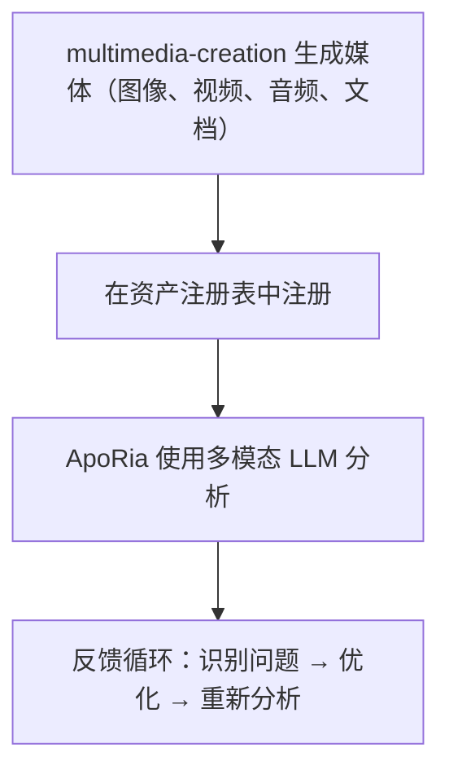

# 多模态流水线

> **⚠️ 已归档 Agent 参考 — 不在开发管线中**
> 本文档引用的 `multimedia-creation` Layer2 Agent已经**归档**。其 Rust 代码、`.d.ts` 绑定及 Agent 注册均已删除。本文描述的多模态管线是**设计目标**，不是已交付功能。除非开发者明确要求，否则不要实施或排期此管线的工作。
> 使用 multimedia-creation 和 ApoRia 生成、注册和分析媒体
> 当前状态说明：本文主要描述目标工作流。当前代码库中确实存在 ApoRia 的多模态相关工具，但尚未完全达到下文所描述的集中式资产注册表与完整闭环能力。

---

## 目录

- [概述](#概述)
- [资产注册表](#资产注册表)
- [生成工具](#生成工具)
- [注册](#注册)
- [多模态分析](#多模态分析)
- [审查循环](#审查循环)
- [Office 文档](#office-文档)
- [完整示例](#完整示例)

---

## 概述

Entelecheia（玄枢） 当前包含多模态相关基础模块，尤其是 ApoRia 侧的早期工具。但这里描述的 multimedia-creation -> 集中式资产注册 -> 多模态审查闭环，更适合视为目标设计而不是完整现状。



---

## 资产注册表

资产注册表是 ApoRia 管理的集中式媒体元数据存储。它跟踪：

- 文件路径和存储位置
- MIME 类型
- 生成元数据（提示词、参数、时间戳）
- 分析历史和质量评分

### 注册 / 检索工作流

```typescript
const asset = $.agent.ApoRia.media_asset_register({
  file_path: "/output/marketing-banner.png",
  mime_type: "image/png",
  metadata: {
    prompt: "A futuristic city skyline at sunset",
    generator: "multimedia-creation",
    model: "stable-diffusion-xl"
  }
});

const asset_id: string = asset.id;

const retrieved = $.agent.ApoRia.media_asset_retrieve({
  asset_id: asset_id
});
```

---

## 生成工具

multimedia-creation 为各种媒体类型提供生成工具。所有工具通过 exec 代码中的 `$multimedia-creation.<tool>()` 调用。

### 图像生成

```typescript
$multimedia-creation.image_generate({
  prompt: "A futuristic city skyline at sunset, cyberpunk style",
  width: 1024,
  height: 512,
  model: "stable-diffusion-xl",
  output_path: "/output/city-skyline.png"
});
```

### 视频生成

```typescript
$multimedia-creation.video_generate({
  prompt: "Camera panning across a mountain landscape at golden hour",
  duration_seconds: 10,
  fps: 24,
  resolution: "1080p",
  output_path: "/output/mountain-pan.mp4"
});
```

### 音频生成

```typescript
$multimedia-creation.audio_generate({
  prompt: "Ambient electronic background music, calm and atmospheric",
  duration_seconds: 30,
  format: "mp3",
  output_path: "/output/ambient-bg.mp3"
});
```

### 文档生成

```typescript
$multimedia-creation.doc_generate({
  template: "technical-report",
  title: "Q4 Performance Analysis",
  content: report_markdown,
  format: "docx",
  output_path: "/output/q4-report.docx"
});
```

### 电子表格生成

```typescript
$multimedia-creation.sheet_generate({
  title: "Budget Forecast 2025",
  data: budget_data,
  format: "xlsx",
  output_path: "/output/budget-2025.xlsx"
});
```

### 幻灯片生成

```typescript
$multimedia-creation.slide_generate({
  title: "Product Roadmap Presentation",
  sections: slide_sections,
  format: "pptx",
  output_path: "/output/roadmap.pptx"
});
```

---

## 注册

生成媒体后，在资产注册表中注册，以便 ApoRia 进行分析：

```typescript
const result = $multimedia-creation.image_generate({
  prompt: "Product hero shot on white background",
  width: 1920,
  height: 1080,
  output_path: "/output/hero-shot.png"
});

const asset = $.agent.ApoRia.media_asset_register({
  file_path: result.output_path,
  mime_type: "image/png",
  metadata: {
    prompt: "Product hero shot on white background",
    generator: "multimedia-creation",
    dimensions: "1920x1080"
  }
});

const asset_id: string = asset.id;
```

---

## 多模态分析

ApoRia 通过 `$.agent.ApoRia.multimodal_chat()` 提供多模态分析。传入一个或多个资产 ID 以及文本提示：

```typescript
const analysis = $.agent.ApoRia.multimodal_chat({
  prompt: "Analyze this image for composition, color balance, and visual hierarchy. Rate each aspect from 1-10.",
  asset_ids: [asset_id]
});
```

### 分析多个资产

```typescript
const comparison = $.agent.ApoRia.multimodal_chat({
  prompt: "Compare these two design variations. Which one has better visual balance and why?",
  asset_ids: [variant_a_id, variant_b_id]
});
```

### 带上下文的分析

```typescript
const context_analysis = $.agent.ApoRia.multimodal_chat({
  prompt: "Does this image match the brand guidelines? Guidelines: primary color blue (#0066CC), clean layout, sans-serif typography.",
  asset_ids: [asset_id]
});
```

---

## 审查循环

多模态流水线支持迭代审查周期：

1. **生成** —— multimedia-creation 创建初始媒体
1. **注册** —— 存储到资产注册表
1. **分析** —— ApoRia 使用多模态 LLM 评估媒体
1. **识别问题** —— 从分析中提取具体的改进点
1. **优化** —— multimedia-creation 根据反馈调整参数重新生成
1. **重新分析** —— ApoRia 评估优化后的输出

### exec 代码中的审查循环示例

```typescript
let iteration: number = 0;
const max_iterations: number = 3;
const quality_threshold: number = 8.0;
let current_prompt: string = "A serene mountain lake at dawn, photorealistic";

while (iteration < max_iterations) {
  iteration++;

  const gen_result = $multimedia-creation.image_generate({
    prompt: current_prompt,
    width: 1024,
    height: 768,
    output_path: `/output/lake-v${iteration}.png`
  });

  const asset = $.agent.ApoRia.media_asset_register({
    file_path: gen_result.output_path,
    mime_type: "image/png",
    metadata: { prompt: current_prompt, iteration: iteration }
  });

  const analysis = $.agent.ApoRia.multimodal_chat({
    prompt: "Rate this image on composition (1-10), color harmony (1-10), and overall quality (1-10). Provide specific improvement suggestions.",
    asset_ids: [asset.id]
  });

  const overall_score: number = analysis.data.overall_quality;

  if (overall_score >= quality_threshold) {
    report({ text: `Quality threshold met at iteration ${iteration}. Score: ${overall_score}` });
    break;
  }

  const suggestions = analysis.data.improvement_suggestions;
  current_prompt = current_prompt + ". " + suggestions.join(". ");

  if (iteration === max_iterations) {
    report({ text: `Max iterations reached. Final score: ${overall_score}` });
  }
}
```

---

## Office 文档

multimedia-creation 可以生成 Office 兼容的文档：

### Word 文档（`doc_generate`）

从 Markdown 或结构化内容生成 `.docx` 文件。支持常见文档类型的模板：

- 技术报告
- 会议纪要
- 提案

```typescript
$multimedia-creation.doc_generate({
  template: "meeting-notes",
  title: "Sprint Planning - Week 12",
  content: meeting_content,
  format: "docx",
  output_path: "/output/sprint-12-notes.docx"
});
```

### Excel 电子表格（`sheet_generate`）

生成包含结构化数据、公式和格式的 `.xlsx` 文件：

```typescript
$multimedia-creation.sheet_generate({
  title: "Monthly Revenue",
  data: revenue_data,
  format: "xlsx",
  output_path: "/output/revenue.xlsx"
});
```

### PowerPoint 演示文稿（`slide_generate`）

生成包含章节、项目符号和可选图片嵌入的 `.pptx` 文件：

```typescript
$multimedia-creation.slide_generate({
  title: "Quarterly Business Review",
  sections: [
    { title: "Revenue", bullets: ["Q1: $1.2M", "Q2: $1.5M"] },
    { title: "Goals", bullets: ["Launch v2.0", "Expand to APAC"] }
  ],
  format: "pptx",
  output_path: "/output/qbr.pptx"
});
```

---

## 完整示例

本示例演示完整的流水线：生成营销图像、注册、分析并优化。

### 步骤 1：生成初始图像

```typescript
const gen = $multimedia-creation.image_generate({
  prompt: "A modern SaaS product dashboard mockup, clean UI, blue and white color scheme",
  width: 1920,
  height: 1080,
  output_path: "/output/dashboard-v1.png"
});
```

### 步骤 2：注册资产

```typescript
const asset = $.agent.ApoRia.media_asset_register({
  file_path: gen.output_path,
  mime_type: "image/png",
  metadata: {
    prompt: "SaaS dashboard mockup",
    purpose: "marketing",
    version: 1
  }
});
```

### 步骤 3：分析构图

```typescript
const analysis = $.agent.ApoRia.multimodal_chat({
  prompt: "Analyze this dashboard mockup for: 1) Visual hierarchy, 2) Color consistency, 3) Readability of data elements. Provide a score (1-10) for each and specific suggestions for improvement.",
  asset_ids: [asset.id]
});
```

### 步骤 4：根据反馈优化

```typescript
const refined = $multimedia-creation.image_generate({
  prompt: "A modern SaaS product dashboard mockup, clean UI, blue and white color scheme. " + analysis.data.suggestions.join(". "),
  width: 1920,
  height: 1080,
  output_path: "/output/dashboard-v2.png"
});
```

### 步骤 5：注册并重新分析

```typescript
const refined_asset = $.agent.ApoRia.media_asset_register({
  file_path: refined.output_path,
  mime_type: "image/png",
  metadata: {
    prompt: "SaaS dashboard mockup (refined)",
    purpose: "marketing",
    version: 2,
    previous_version: asset.id
  }
});

const final_analysis = $.agent.ApoRia.multimodal_chat({
  prompt: "Compare this refined version to the original. Has the visual hierarchy improved? Rate the overall quality 1-10.",
  asset_ids: [asset.id, refined_asset.id]
});

report({
  text: `Marketing image pipeline complete. Initial score: ${analysis.data.overall_score}, Refined score: ${final_analysis.data.overall_score}`
});
```

---

## 下一步

- 阅读[基础指南](fundamentals.md)了解 multimedia-creation 和 ApoRia Agent 详情
- 浏览[架构](architecture.md)了解完整的 Agent 系统概览
- 设置 [Webhook 集成](webhook-setup.md)从外部事件触发生成
