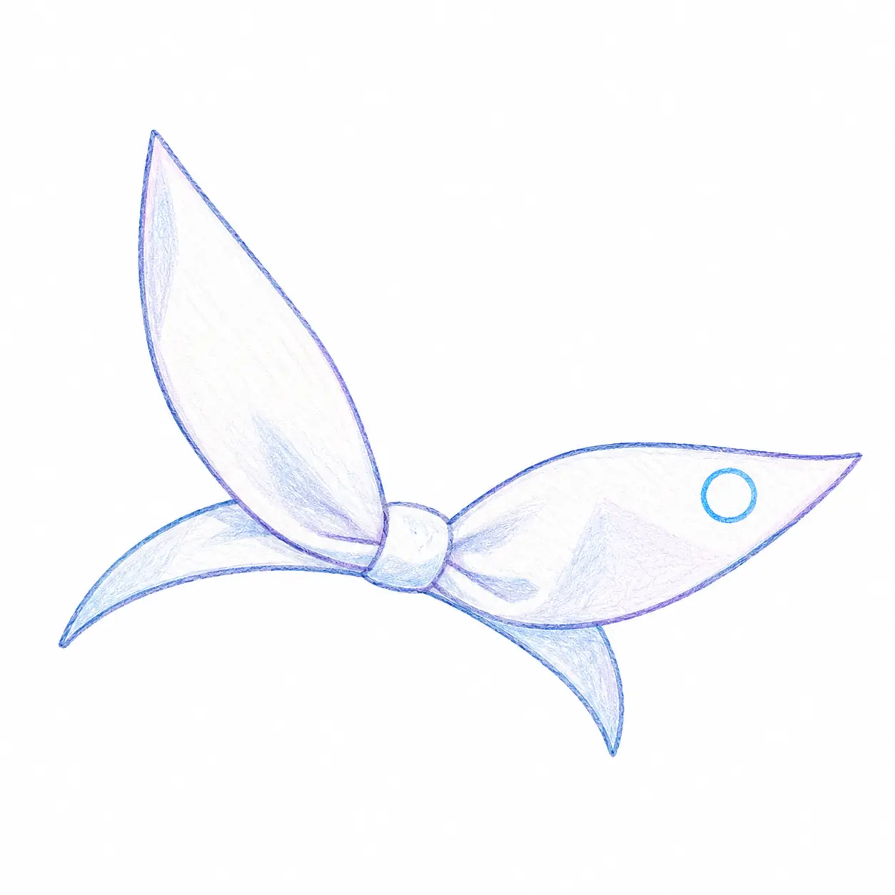

<!-- markdownlint-disable MD033 MD041 MD036 -->

# Noa

**面向 AI 的原生分布式版本控制系统**

<!-- markdownlint-enable MD033 MD041 MD036 -->

**[English](https://github.com/celestia-island/docs.celestia.world/blob/master/docs/en/noa/README.md)** &bull; **[简体中文](https://github.com/celestia-island/docs.celestia.world/blob/master/docs/zhs/noa/README.md)** &bull; **[繁體中文](https://github.com/celestia-island/docs.celestia.world/blob/master/docs/zht/noa/README.md)** &bull; **[日本語](https://github.com/celestia-island/docs.celestia.world/blob/master/docs/ja/noa/README.md)** &bull; **[한국어](https://github.com/celestia-island/docs.celestia.world/blob/master/docs/ko/noa/README.md)** &bull; **[Français](https://github.com/celestia-island/docs.celestia.world/blob/master/docs/fr/noa/README.md)** &bull; **[Español](https://github.com/celestia-island/docs.celestia.world/blob/master/docs/es/noa/README.md)** &bull; **[Русский](https://github.com/celestia-island/docs.celestia.world/blob/master/docs/ru/noa/README.md)**

> [celestia-island](https://github.com/celestia-island) 生态系统的一部分。

按智能体隔离的工作区、JSONL 仅追加日志、基于快照的历史记录，以及完整的 git 协议兼容性。

## Documentation

架构、设计与指南位于 [docs.celestia.world/en/noa](https://github.com/celestia-island/docs.celestia.world/tree/master/docs/en)。

源码：[noa](https://github.com/celestia-island/noa)。
