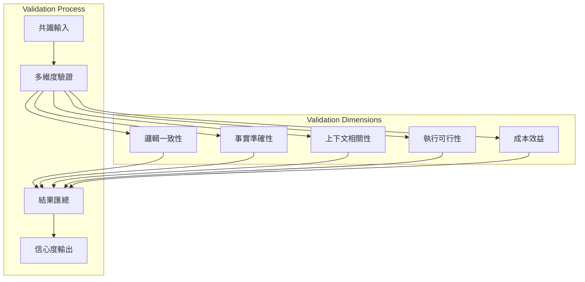
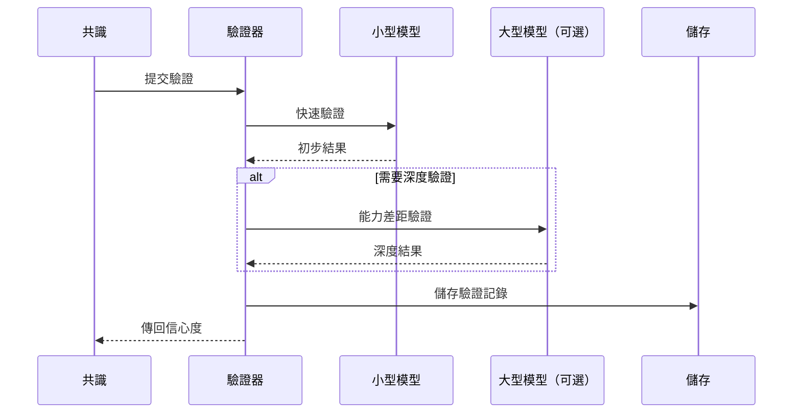
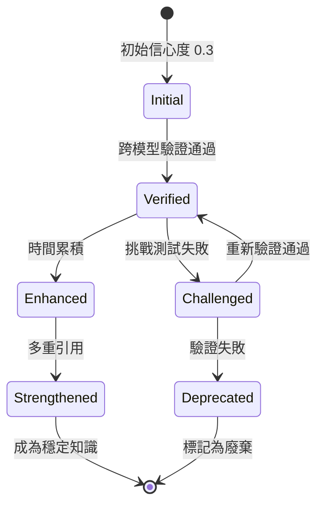
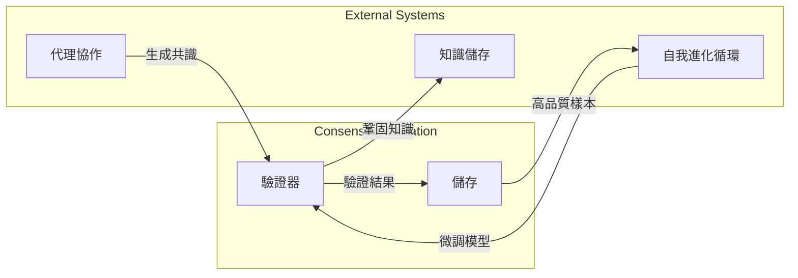

+++
title = "共識驗證機制"
description = """共識驗證機制是多代理協作系統的核心組件，用於驗證和評估多個代理形成的共識之可靠性與準確性，確保系統輸出品質"""
lang = "zht"
category = "design"
subcategory = "core"
+++

# 共識驗證機制

## 概述

共識驗證機制是多代理協作系統的核心組件，用於驗證和評估多個代理形成的共識之可靠性與準確性，確保系統輸出品質。

## 核心原則

### 多維度驗證框架

系統透過五個維度進行全面驗證：

### 驗證維度說明

| 維度 | 驗證目標 | 關鍵指標 |
| --- | --- | --- |
| 邏輯一致性 | 共識是否自洽 | 無矛盾、推理完整 |
| 事實準確性 | 事實陳述是否正確 | 與已知知識一致 |
| 上下文相關性 | 是否與當前任務相關 | 相關性分數 |
| 執行可行性 | 方案是否可執行 | 可操作性評估 |
| 成本效益 | 成本效益是否合理 | 投資回報率評估 |

## 架構設計

### 漸進式驗證流程

### 信心度累積機制

## 與其他系統的整合

## 設計考量

### 成本控制

- 優先使用小型模型進行驗證
- 僅在必要時啟用大型模型
- 驗證結果快取與重用

### 品質保證

- 多維度交叉驗證
- 時間累積增強可信度
- 挑戰測試發現潛在問題

### 可追溯性

- 完整的驗證歷史記錄
- 支援稽核與回溯
- 統計分析支援
