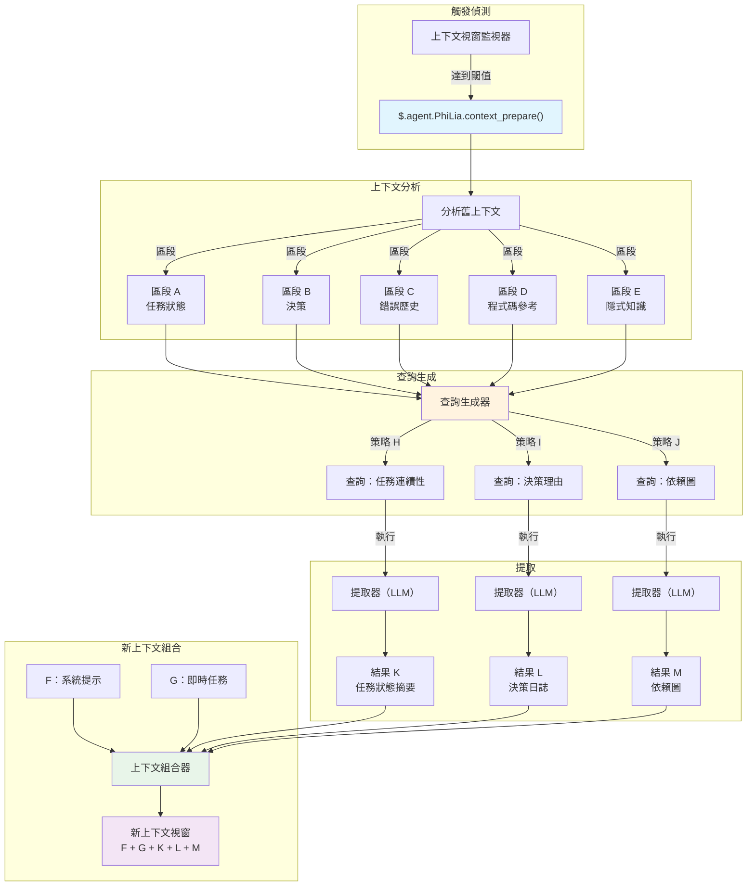
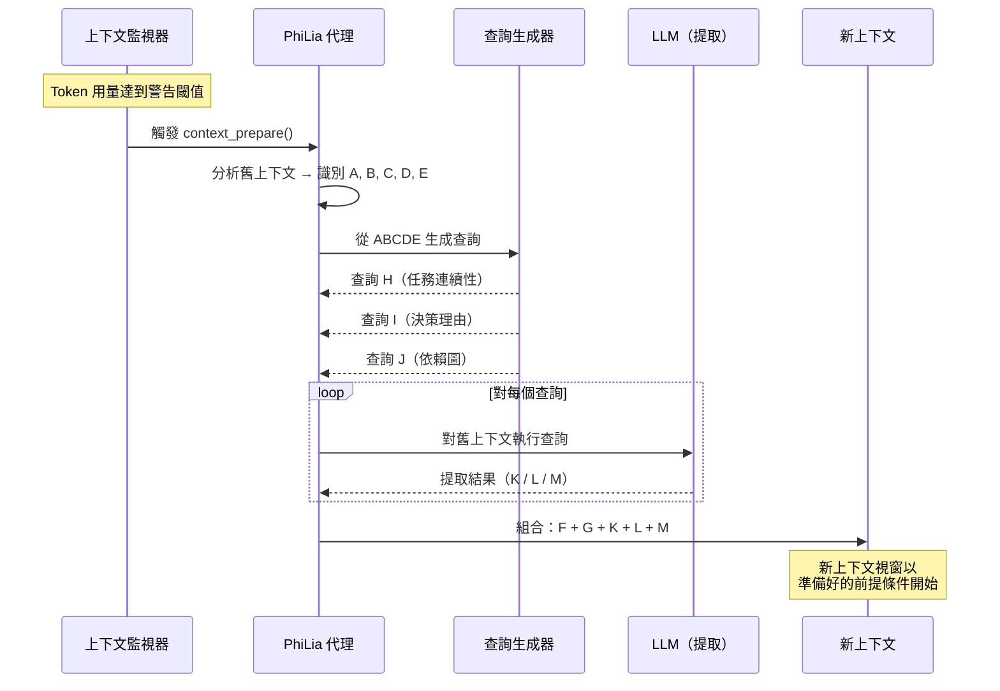

+++
title = "上下文準備機制"
description = """上下文準備是一種主動提取機制，取代傳統的上下文壓縮。與其有損壓縮舊的對話歷史，它分析現有上下文、生成針對性查詢，並精確提取為新上下文視窗播種所需的資訊。該機制由 PhiLia 代理擁有"""
lang = "zht"
category = "design"
subcategory = "core"
+++

# 上下文準備機制

## 概述

上下文準備是一種主動提取機制，取代傳統的上下文壓縮。與其有損壓縮舊的對話歷史，它分析現有上下文、生成針對性查詢，並精確提取為新上下文視窗播種所需的資訊。該機制由 PhiLia 代理擁有，並透過 `$.agent.PhiLia.context_prepare()` 暴露。

## 問題陳述

### 上下文視窗限制

LLM 代理在有限的上下文視窗內運行。長期任務 — 多檔案重構、跨越數十條訊息的除錯會話、複雜的多步驟工作流程 — 最終會耗盡可用的 Token 預算。當這發生時，系統必須決定保留什麼和丟棄什麼。

### 壓縮遺失細節

傳統的上下文壓縮方法（摘要、截斷、滑動視窗）本質上是有損的。壓縮器不知道*下一個*上下文需要什麼，所以它必須猜測。關鍵細節不可避免地會被丟棄：

- 變數名稱及其當前值
- 中間決策及其理由
- 出現且已部分解決的錯誤狀態
- 任務之間的隱式依賴

根本缺陷：**壓縮優化的是簡潔性，而非相關性**。

### 跨任務干擾

當上下文視窗包含多個任務或主題時，壓縮一個任務的歷史通常會損壞另一個任務所需的資訊。一個保留任務 A 狀態的摘要可能會模糊任務 B 的關鍵錯誤鏈。沒有通用的壓縮策略能夠滿足所有可能的未來需求。

### 真正的問題

> 下一個上下文視窗需要從當前上下文中知道什麼？

這不是一個壓縮問題。這是一個**資訊檢索**問題 — 答案取決於接下來發生什麼，而非之前發生什麼。

## 核心概念

### 主動提取 vs. 壓縮

| 面向 | 壓縮 | 上下文準備 |
| --- | --- | --- |
| 方向 | 過去 → 更短的過去 | 過去 → 面向未來的提取物 |
| 對未來的了解 | 無 | 查詢預測即將到來的需求 |
| 資訊遺失 | 不可避免、無針對性 | 有針對性、有意圖 |
| 類比 | 壓縮檔案 | 搜尋資料庫 |
| 品質上限 | 摘要品質 | 提取精確度 |

上下文準備將舊的上下文視為**資料來源** — 類似於 RAG 對外部文件語料庫的處理方式 — 但語料庫是對話本身。它不是將所有內容壓縮成摘要，而是對舊上下文提出針對性問題並收集答案。

### ABCDE/KLM 模型

該機制使用基於字母的標記法來描述資訊流：

```text
舊上下文：  A + B + C + D + E
                     ↓（分析）
查詢：       ABCDE+H  ABCDE+I  ABCDE+J
                     ↓（提取）
結果：            K        L        M
                     ↓（組合）
新上下文：  F + G + K + L + M
```

- **A–E**：舊上下文的不同區段/面向（任務狀態、決策、錯誤歷史、程式碼參考、隱式知識）
- **H、I、J**：從分析 A–E 的關鍵元素推導出的查詢策略。每個策略針對不同的資訊需求
- **K、L、M**：提取結果 — 每個查詢的精確答案
- **F、G**：新視窗的新系統提示和即時任務上下文
- **新上下文**接收 F + G（全新）+ K + L + M（已提取），跳過完整的 A–E 歷史

### 為何這取代了壓縮

一旦上下文準備存在，傳統壓縮變得不再必要，因為：

1. **資訊不會因猜測而遺失** — 查詢是基於新上下文實際需要的內容生成的
1. **提取在結構上是確定性的** — 相同的查詢策略始終產生相同類別的答案
1. **多角度確保覆蓋** — H/I/J 查詢涵蓋不同維度（任務狀態、錯誤上下文、決策理由）
1. **舊上下文保持可存取** — 它沒有被丟棄，而是在準備階段*按需查詢*

## 架構

### 高階流程



### 序列圖



## API 設計

### `$.agent.PhiLia.context_prepare()`

主要進入點。當上下文視窗監視器偵測到 Token 用量已達到警告閾值時呼叫。

```typescript
interface ContextPrepareRequest {
    old_context: string;
    current_task: string;
    warning_threshold: number;
    current_usage: number;
    max_tokens: number;
}

interface ContextPrepareResult {
    segments: ContextSegment[];
    queries: GeneratedQuery[];
    extractions: ExtractionResult[];
    prepared_context: string;
    metadata: {
        old_context_tokens: number;
        prepared_context_tokens: number;
        compression_ratio: number;
        queries_executed: number;
        extraction_time_ms: number;
    };
}

// PhiLia API 端點
$.agent.PhiLia.context_prepare(request: ContextPrepareRequest): ContextPrepareResult
```

### `$.agent.PhiLia.context_query()`

較低層級的 API，用於對上下文執行個別查詢。由 `context_prepare()` 內部使用，但也適用於臨時查詢。

```typescript
interface ContextQueryRequest {
    context: string;
    query: string;
    strategy: "task_continuity" | "decision_rationale" | "dependency_map" | "custom";
    max_result_tokens: number;
}

interface ContextQueryResult {
    result: string;
    confidence: number;
    source_segments: string[];
    tokens_used: number;
}

$.agent.PhiLia.context_query(request: ContextQueryRequest): ContextQueryResult
```

### `$.agent.PhiLia.context_segment()`

分析上下文並將其分解為標籤區段（A–E）。

```typescript
interface SegmentRequest {
    context: string;
    max_segments: number;
}

interface Segment {
    id: string;           // "A"、"B"、"C" 等
    label: string;        // "任務狀態"、"決策" 等
    content: string;
    token_count: number;
    importance_rank: number;
}

$.agent.PhiLia.context_segment(request: SegmentRequest): Segment[]
```

## 查詢策略

### H/I/J 查詢如何生成

查詢生成過程獲取區段化的舊上下文（A–E）並產生三個類別的查詢，每個類別針對新上下文所需的不同資訊維度。

### 策略 H：任務連續性

**目的**：確保新上下文能夠恢復當前任務而不遺失進度。

**生成邏輯**：

1. 從區段 A 和 E（任務狀態 + 隱式知識）識別活躍任務
1. 提取當前進度指標（已完成什麼、進行中什麼、受阻什麼）
1. 生成一個查詢，詢問：*「所有活躍任務的當前狀態是什麼，以及下一步是什麼？」*

**範例查詢**：

```text
鑑於對話歷史，識別：
1. 所有正在進行的任務及其完成狀態
2. 任何阻礙或未解決的錯誤
3. 即將採取的確切下一步
4. 目前正在修改的檔案路徑和行號
```

### 策略 I：決策理由

**目的**：保留決策背後的*原因*，而不僅僅是*內容*。

**生成邏輯**：

1. 掃描區段 B 和 C（決策 + 錯誤歷史）中的選擇點
1. 識別曾考慮和拒絕替代方案的決策
1. 生成一個查詢，詢問：*「做出了哪些決策，拒絕了哪些替代方案，以及為什麼？」*

**範例查詢**：

```text
從此對話中提取：
1. 所有做出的架構或實作決策
2. 對每個決策：考慮了哪些替代方案
3. 對每個決策：選擇的方案被偏好的具體原因
4. 影響這些選擇的任何約束或需求
```

### 策略 J：依賴圖

**目的**：捕獲程式碼元素、檔案和概念之間的關係。

**生成邏輯**：

1. 掃描區段 D 和 E（程式碼參考 + 隱式知識）中的實體關係
1. 映射哪些檔案依賴哪些、哪些函數呼叫哪些、哪些概念相關
1. 生成一個查詢，詢問：*「所討論的實體之間有哪些關鍵依賴關係和關聯？」*

**範例查詢**：

```text
分析對話並映射：
1. 所有提到的檔案/模組及其關係
2. 討論或修改的函數呼叫鏈
3. 組件之間的資料流
4. 配置值及其使用位置
5. 未直接陳述但由工作隱含的任何隱式依賴
```

### 可擴展性

三個策略（H、I、J）是預設集合。系統支援自訂策略：

```typescript
interface QueryStrategy {
    id: string;
    name: string;
    description: string;
    source_segments: string[];     // 要分析的區段
    query_template: string;        // 帶有 {segment_X} 佔位符的範本
    priority: number;              // 執行優先級
    max_result_tokens: number;
}
```

新策略可以透過配置註冊，允許特定領域的提取模式。

## 整合點

### 上下文視窗監視器

上下文準備的觸發器存在於上下文視窗監控子系統中。當 Token 用量超過警告閾值（預設：最大值的 80%），監視器呼叫 `$.agent.PhiLia.context_prepare()`。

```rust
// 在上下文視窗監視器中（概念性）
fn check_context_health(&mut self) {
    let usage_ratio = self.current_tokens as f64 / self.max_tokens as f64;
    if usage_ratio >= self.warning_threshold {
        let result = philia.context_prepare(ContextPrepareRequest {
            old_context: self.get_full_context(),
            current_task: self.get_current_task_description(),
            warning_threshold: self.warning_threshold,
            current_usage: self.current_tokens,
            max_tokens: self.max_tokens,
        });
        self.spawn_new_context(result.prepared_context);
    }
}
```

### skill_chain.rs 整合

技能鏈執行器必須感知上下文準備。當技能鏈跨越多個上下文視窗時，準備機制確保：

1. 技能鏈狀態被捕獲在區段 A（任務狀態）中
1. 當前技能的輸入/輸出被捕獲在區段 D（程式碼參考）中
1. 鏈的剩餘步驟被保留在提取結果 K（任務連續性）中

```rust
// skill_chain.rs（概念性整合）
impl SkillChainExecutor {
    fn execute_step(&mut self, step: ChainStep) -> Result<StepResult> {
        // 在執行之前，檢查是否需要上下文準備
        if self.context_monitor.should_prepare() {
            let prepared = self.philia.context_prepare(
                self.build_prepare_request()
            )?;
            self.context = prepared.prepared_context;
        }
        // 繼續步驟執行
        self.execute_with_context(step, &self.context)
    }
}
```

### PhiLia 代理擁有權

上下文準備是 PhiLia 擁有的能力。這意味著：

- `$.agent.PhiLia.context_prepare()` API 註冊為 PhiLia 技能
- PhiLia 管理查詢生成範本和提取策略
- 其他代理透過標準的技能呼叫協定向 PhiLia 請求上下文準備
- PhiLia 可以利用其知識庫，使用歷史模式豐富查詢

### 上下文生成

當系統生成新的上下文視窗時，準備好的上下文（F + G + K + L + M）取代了傳統的壓縮摘要：

```rust
fn spawn_new_context(&mut self, prepared: ContextPrepareResult) {
    let system_prompt = self.build_system_prompt();      // F
    let immediate_task = self.get_current_task();         // G
    let new_context = format!(
        "{}\n\n{}\n\n---\n## 上下文準備結果\n### 任務狀態\n{}\n### 決策日誌\n{}\n### 依賴關係\n{}\n",
        system_prompt,    // F
        immediate_task,   // G
        prepared.extractions[0].result,  // K
        prepared.extractions[1].result,  // L
        prepared.extractions[2].result,  // M
    );
    self.launch_context(new_context);
}
```

## 實作階段

### 階段 1：基礎（MVP）

- 實作 `$.agent.PhiLia.context_segment()` — 上下文分析和區段化
- 實作三個預設查詢策略（H：任務連續性、I：決策理由、J：依賴圖）
- 實作 `$.agent.PhiLia.context_prepare()` — 區段 → 查詢 → 提取 → 組合的編排
- 與上下文視窗監視器觸發器整合
- 使用單任務對話驗證

### 階段 2：穩健性

- 為提取結果添加信心度評分
- 當提取信心度低時實作後備策略
- 為大型上下文添加串流支援
- 效能優化：並行查詢執行
- 為臨時查詢添加 `$.agent.PhiLia.context_query()`

### 階段 3：智慧化

- 從歷史準備結果學習最佳查詢策略
- 基於任務類型的自適應區段加權
- 跨上下文引用解析（跨多次生成的連結準備結果）
- 與記憶沉積整合以實現長期保留

### 階段 4：完全取代

- 移除舊有的上下文壓縮程式碼路徑
- 上下文準備成為上下文轉換的唯一機制
- 完整的遙測和品質指標
- 自訂代理的文件和遷移指南

## 範例

### 範例 1：多檔案重構

**情境**：一個代理正在重構一個 Rust crate，修改跨 3 個模組的 15 個檔案。在修改檔案 10 後上下文視窗填滿。

**舊上下文（A–E）**：

- **A**（任務狀態）：已修改 10/15 個檔案，模組 `auth` 和 `storage` 完成，`api` 進行中
- **B**（決策）：選擇基於 trait 的抽象而非 enum 派送；透過 `#[deprecated]` 保持向下相容
- **C**（錯誤）：在 `storage/mod.rs:142` 遇到生命週期問題，使用 `Arc<Mutex<>>` 解決
- **D**（程式碼參考）：`auth/traits.rs`、`storage/mod.rs:142`、`api/handler.rs:38-56`
- **E**（隱式）：`User` 結構必須對下游 crate 保持 `Clone`；測試覆蓋率有追蹤

**生成的查詢**：

- **H**（任務連續性）：「還有哪些檔案需要修改，正在套用什麼模式，下一個要重構的檔案是什麼？」
- **I**（決策理由）：「為何選擇基於 trait 的抽象而非 enum 派送，存在哪些向下相容約束？」
- **J**（依賴圖）：「映射 `auth`、`storage` 和 `api` 模組之間的依賴關係，記錄哪些結構/trait 跨越模組邊界。」

**提取結果（K、L、M）** 與新的系統提示（F）和下一個任務指令（G）組合。

### 範例 2：除錯會話

**情境**：除錯一個 WebSocket 連線問題，跨越多個假設和測試嘗試。

**舊上下文（A–E）**：

- **A**（任務狀態）：問題縮小到握手階段；心跳不是原因
- **B**（決策）：排除 TLS 配置錯誤；排除代理干擾；當前假設是標頭順序
- **C**（錯誤）：`ConnectionReset` 在 3 秒標記處，使用 curl 可一致重現但瀏覽器不行
- **D**（程式碼參考）：`ws/handshake.rs:67-89`、`headers/mod.rs:23`、測試檔案 `tests/ws_test.rs`
- **E**（隱式）：伺服器在 nginx 後面；問題僅在生產環境出現，本地開發不行

**生成的查詢**將除錯狀態、被拒絕的假設和剩餘的調查路徑提取到新上下文中。

### 範例 3：跨代理技能鏈

**情境**：PhiLia 將任務鏈委派給 Skemma（模式設計），然後是 Logos（文件）。上下文在 Logos 的工作期間填滿。

**舊上下文（A–E）**：

- **A**（任務狀態）：模式設計完成，文件完成 60%
- **B**（決策）：根據 PhiLia 的架構指導，模式對 M:N 關聯使用連接表
- **C**（錯誤）：Skemma 報告 `user_roles` 基數不明確，透過添加 `UNIQUE` 約束解決
- **D**（程式碼參考）：`schema.sql:45-67`、`docs/api/endpoints.md:12-34`
- **E**（隱式）：文件必須符合專案中其他地方使用的 OpenAPI 3.0 規範格式

準備確保 Logos 的新上下文接收模式決策和文件格式約束，而無需完整的 Skemma 設計對話。
