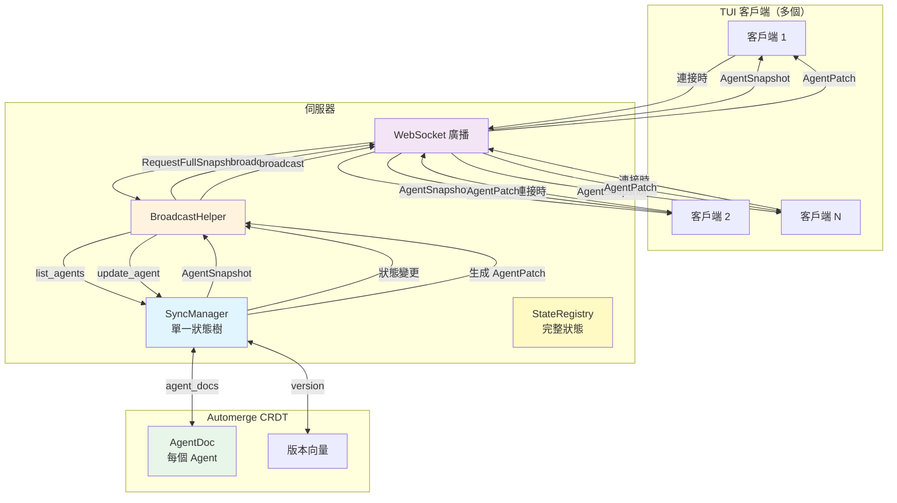
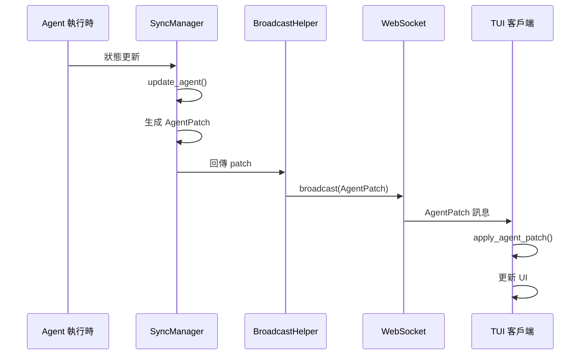
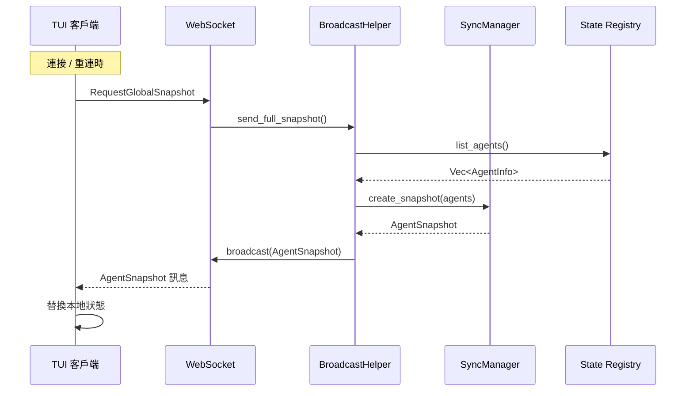
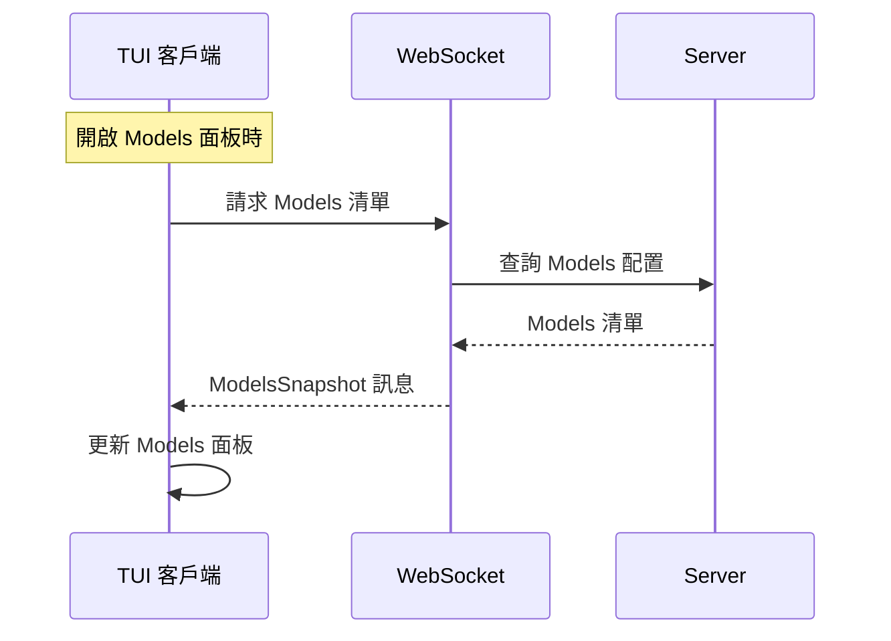
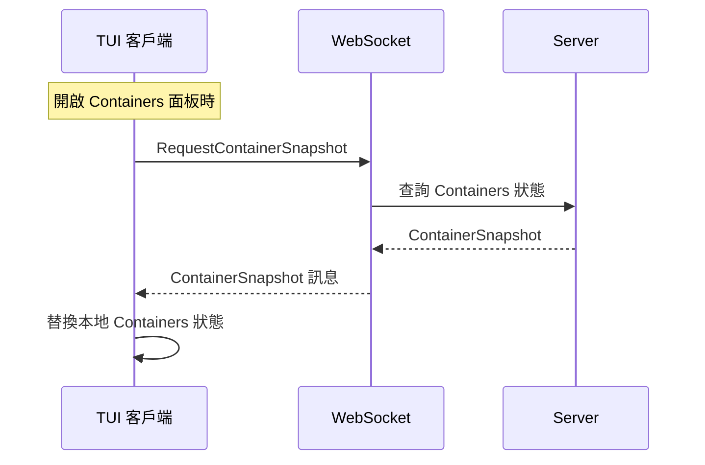
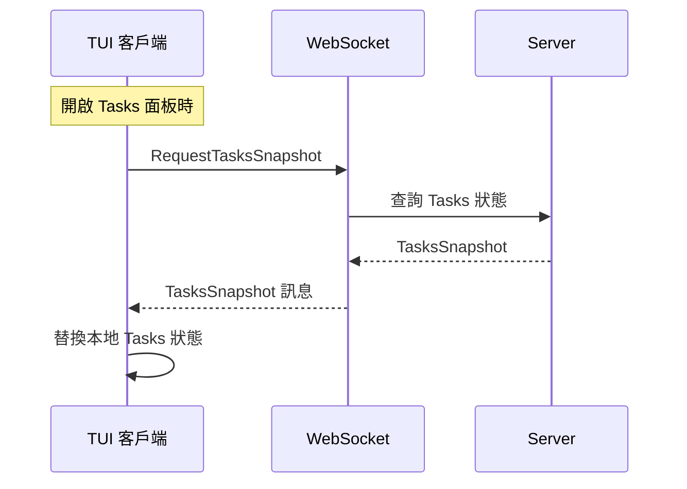

+++
title = "增量同步架構"
description = """基於 Automerge CRDT 的多客戶端狀態增量同步機制，支援即時增量更新與連接/重連時全量同步，涵蓋所有 TUI 面板"""
lang = "zht"
category = "design"
subcategory = "core"
+++

# 增量同步架構

## 概述

基於 Automerge CRDT 的多客戶端狀態增量同步機制，支援即時增量更新與連接/重連時全量同步，涵蓋所有 TUI 面板。

## 架構圖



## 同步策略矩陣

| 面板 | 同步方式 | 觸發條件 | 頻率 | 訊息類型 |
| --- | --- | --- | --- | --- |
| **Agents 時間線** | 增量 + 全量 | 連接時同步 + 即時推送 | 連接時 / 即時 | `AgentPatch` / `GlobalSnapshot` |
| **Containers** | 增量 + 全量 | 連接時同步 + 即時推送 | 連接時 / 即時 | `ContainerPatch` / `GlobalSnapshot` |
| **Tasks** | 增量 + 全量 | 連接時同步 + 即時推送 | 連接時 / 即時 | `TaskPatch` / `GlobalSnapshot` |
| **Models 清單** | 全量 | 客戶端主動請求 | 開啟面板時 | `ModelsSnapshot` |
| **Providers 配置** | 全量 | 客戶端主動請求 | 開啟面板時 | `ProvidersSnapshot` |

## 訊息流程

### 增量更新流程（Agents）



### 全量同步流程



### Models 清單同步流程



### Containers 全量同步流程



### Tasks 全量同步流程



## 資料結構

### AgentPatch（增量更新）

```rust
pub struct AgentPatch {
    pub agent_id: String,
    pub version: u64,
    pub llm_working_changed: Option<bool>,
    pub work_status: Option<String>,
    pub current_model: Option<String>,
    pub token_usage_delta: Option<(u32, u32)>,
    pub token_usage_absolute: Option<(u32, u32)>,
    pub request_state: Option<RequestState>,
    pub cpu_usage: Option<f64>,
    pub memory_mb: Option<u64>,
}
```

### AgentSnapshot（全量快照）

```rust
pub struct AgentSnapshot {
    pub version: u64,
    pub timestamp: i64,
    pub agents: Vec<TuiAgentInfo>,
}
```

### GlobalSnapshot（全域快照）

```rust
pub struct GlobalSnapshot {
    pub version: u64,
    pub timestamp: i64,
    pub agents: Vec<TuiAgentInfo>,
    pub models: Vec<ModelInfo>,
    pub providers: Vec<ProviderInfo>,
    pub active_tasks: Vec<TaskInfo>,
}
```

### ModelsSnapshot（Models 清單）

```rust
pub struct ModelsSnapshot {
    pub models: Vec<ModelInfo>,
}
```

### ContainerPatch（Container 狀態增量）

```rust
pub struct ContainerPatch {
    pub container_id: String,
    pub version: u64,
    pub status_changed: Option<String>,
    pub cpu_usage_changed: Option<f64>,
    pub memory_usage_changed: Option<u64>,
}
```

### ContainerSnapshot（Container 狀態全量）

```rust
pub struct ContainerSnapshot {
    pub version: u64,
    pub timestamp: i64,
    pub containers: Vec<ContainerInfo>,
}
```

### TaskPatch（Task 狀態增量）

```rust
pub struct TaskPatch {
    pub task_id: Uuid,
    pub version: u64,
    pub status_changed: Option<String>,
    pub progress_changed: Option<u8>,
}
```

### TasksSnapshot（Tasks 狀態全量）

```rust
pub struct TasksSnapshot {
    pub version: u64,
    pub timestamp: i64,
    pub tasks: Vec<TaskInfo>,
}
```

## 同步策略

| 類型 | 方向 | 觸發條件 | 頻率 |
| --- | --- | --- | --- |
| Agent 增量更新 | 伺服器 → 客戶端 | 狀態變更 | 即時 |
| Agent 全量同步 | 伺服器 → 客戶端 | 連接時 | 連接時 / 重連時 |
| Containers 增量 | 伺服器 → 客戶端 | 狀態變更 | 即時 |
| Containers 全量同步 | 伺服器 → 客戶端 | 連接時 | 連接時 / 重連時 |
| Tasks 增量 | 伺服器 → 客戶端 | 狀態變更 | 即時 |
| Tasks 全量同步 | 伺服器 → 客戶端 | 連接時 | 連接時 / 重連時 |
| Models 清單 | 客戶端 → 伺服器 | 主動請求 | 開啟面板時 |
| Providers 配置 | 客戶端 → 伺服器 | 主動請求 | 開啟面板時 |

## 核心特性

- **單一狀態樹**：伺服器維護一個 `SyncManager`，所有客戶端接收相同的狀態更新
- **CRDT 衝突解決**：基於 Automerge 的自動衝突解決
- **增量更新**：僅傳輸變更的欄位以減少網路流量
- **最終一致性**：連接時全量同步保證最終一致性
- **按需拉取**：Models 與 Providers 在開啟其面板時按需請求，避免不必要的網路傳輸
- **首頁同步**：Agents、Containers 與 Tasks 在連接時同步，因其在首頁可見

## 實作狀態

- ✅ Agents 增量/全量同步
- ✅ Models 清單同步
- ✅ Providers 配置同步
- ✅ Containers 增量/全量同步
- ✅ Tasks 增量/全量同步
- ✅ 狀態持久化（/tmp 儲存，重啟時重新載入）
