+++
title = "Provider TOML 配置系統設計"
description = """Provider TOML 配置系統將所有 LLM Provider 配置從硬編碼值遷移至 TOML 配置檔案，實現配置與程式碼分離，提升可維護性與可擴充性"""
lang = "zht"
category = "design"
subcategory = "core"
+++

# Provider TOML 配置系統設計

## 概述

Provider TOML 配置系統將所有 LLM Provider 配置從硬編碼值遷移至 TOML 配置檔案，實現配置與程式碼分離，提升可維護性與可擴充性。

## 核心目標

| 目標 | 說明 |
| --- | --- |
| 可維護性 | 配置與程式碼分離，修改無需重新編譯 |
| 可擴充性 | 新增 Provider 僅需新增 TOML 檔案 |
| 可讀性 | 配置檔案清晰易懂 |
| 可重用性 | 配置可在不同環境間共享 |

## 架構設計

### 配置載入流程

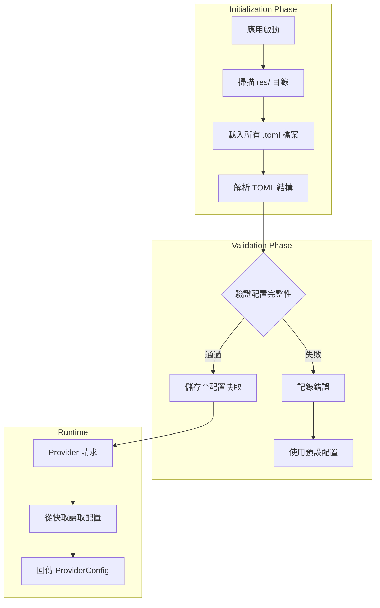
```mermaid
flowchart TB
    subgraph Initialization Phase
        A[應用啟動] --> B[掃描 res/ 目錄]
        B --> C[載入所有 .toml 檔案]
        C --> D[解析 TOML 結構]
    end

    subgraph Validation Phase
        D --> E{驗證配置完整性}
        E -->|通過| F[儲存至配置快取]
        E -->|失敗| G[記錄錯誤]
        G --> H[使用預設配置]
    end

    subgraph Runtime
        F --> I[Provider 請求]
        I --> J[從快取讀取配置]
        J --> K[回傳 ProviderConfig]
    end
```

### 配置階層

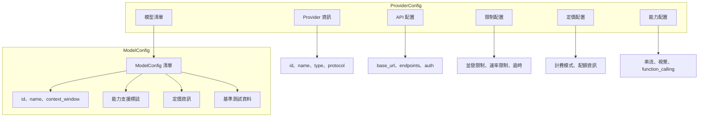
```mermaid
graph TB
    subgraph ProviderConfig
        A[Provider 資訊]
        B[API 配置]
        C[限制配置]
        D[定價配置]
        E[能力配置]
        F[模型清單]
    end

    A --> A1[id、name、type、protocol]
    B --> B1[base_url、endpoints、auth]
    C --> C1[並發限制、速率限制、逾時]
    D --> D1[計費模式、配額資訊]
    E --> E1[串流、視覺、function_calling]
    F --> F1[ModelConfig 清單]

    subgraph ModelConfig
        F1 --> M1[id、name、context_window]
        F1 --> M2[能力支援標誌]
        F1 --> M3[定價資訊]
        F1 --> M4[基準測試資料]
    end
```

## 配置優先級

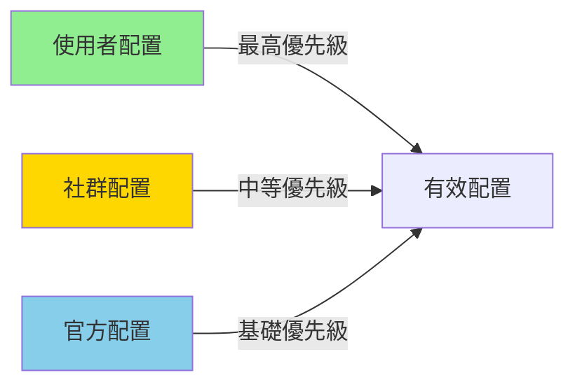
```mermaid
graph LR
    A[使用者配置] -->|最高優先級| D[有效配置]
    B[社群配置] -->|中等優先級| D
    C[官方配置] -->|基礎優先級| D

    style A fill:#90EE90
    style B fill:#FFD700
    style C fill:#87CEEB
```

### 優先級合併規則

| 層級 | 來源 | 說明 |
| --- | --- | --- |
| 1 | 官方配置 | Provider 官方文件資料，作為基礎預設值 |
| 2 | 社群配置 | 社群貢獻的優化配置，覆蓋官方資料 |
| 3 | 使用者配置 | 使用者自訂配置，最高優先級 |

## 定價模型

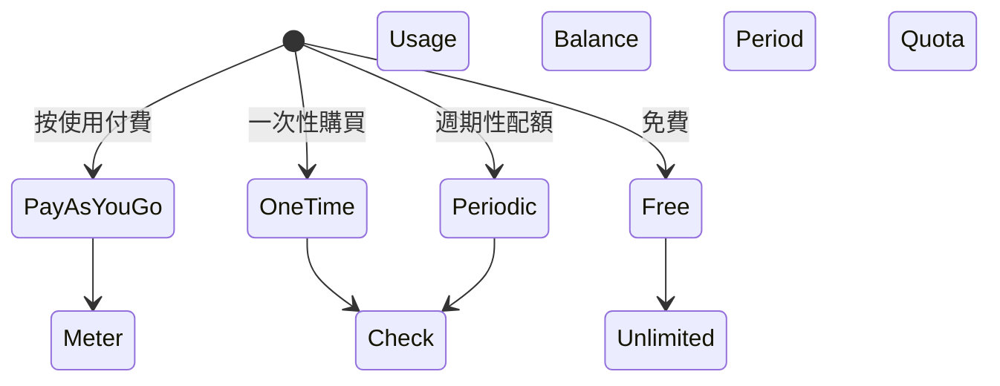
```mermaid
stateDiagram-v2
    [*] --> PayAsYouGo: 按使用付費
    [*] --> OneTime: 一次性購買
    [*] --> Periodic: 週期性配額
    [*] --> Free: 免費

    PayAsYouGo --> Meter Usage
    OneTime --> Check Balance
    Periodic --> Check Period Quota
    Free --> Unlimited
```

### 定價模型比較

| 模型 | 適用場景 | 特徵 |
| --- | --- | --- |
| PayAsYouGo | OpenAI、Anthropic | 按 token 付費，即時扣費 |
| OneTime | 預付費套餐 | 預購配額，用完為止 |
| Periodic | GLM 中國等 | 週期性配額重置 |
| Free | Ollama 本地模型 | 無成本限制 |

## Provider 類型分類

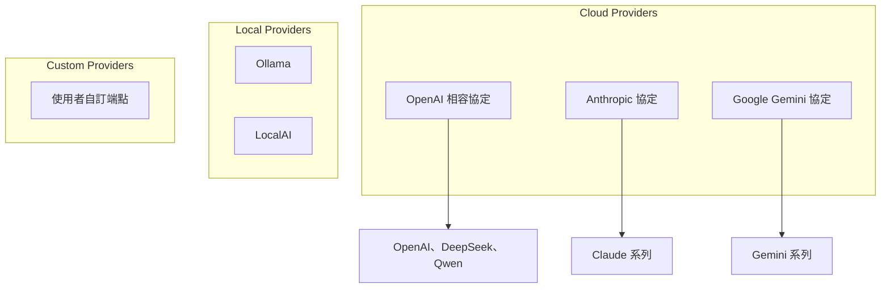
```mermaid
graph TB
    subgraph Cloud Providers
        A[OpenAI 相容協定]
        B[Anthropic 協定]
        C[Google Gemini 協定]
    end

    subgraph Local Providers
        D[Ollama]
        E[LocalAI]
    end

    subgraph Custom Providers
        F[使用者自訂端點]
    end

    A --> A1[OpenAI、DeepSeek、Qwen]
    B --> B1[Claude 系列]
    C --> C1[Gemini 系列]
```

## 熱重載機制

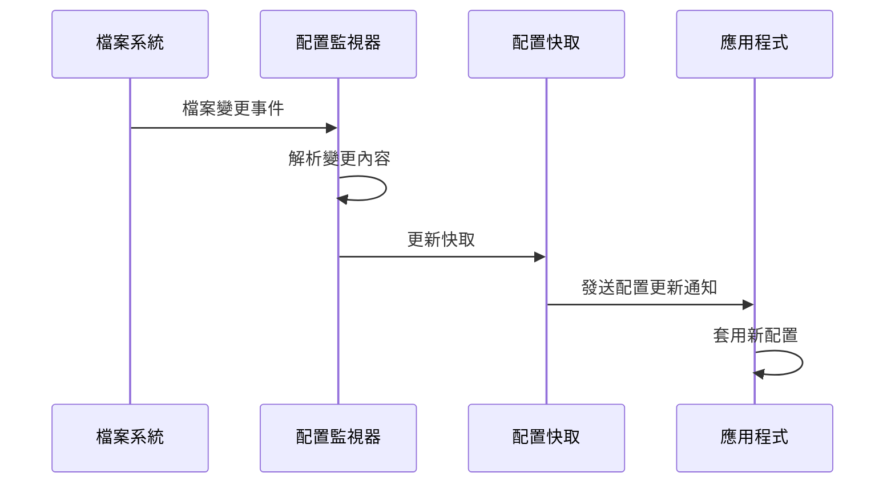
```mermaid
sequenceDiagram
    participant FS as 檔案系統
    participant Watcher as 配置監視器
    participant Cache as 配置快取
    participant App as 應用程式

    FS->>Watcher: 檔案變更事件
    Watcher->>Watcher: 解析變更內容
    Watcher->>Cache: 更新快取
    Cache->>App: 發送配置更新通知
    App->>App: 套用新配置
```

## 錯誤處理策略

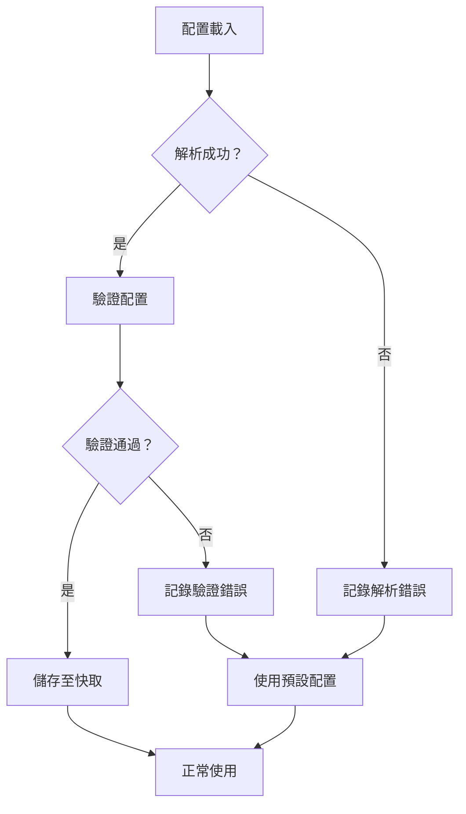
```mermaid
flowchart TB
    A[配置載入] --> B{解析成功？}
    B -->|是| C[驗證配置]
    B -->|否| D[記錄解析錯誤]

    C --> E{驗證通過？}
    E -->|是| F[儲存至快取]
    E -->|否| G[記錄驗證錯誤]

    D --> H[使用預設配置]
    G --> H

    F --> I[正常使用]
    H --> I
```

## 可擴充性設計

### 新增 Provider

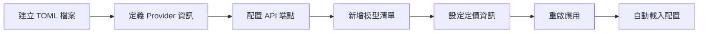
```mermaid
flowchart LR
    A[建立 TOML 檔案] --> B[定義 Provider 資訊]
    B --> C[配置 API 端點]
    C --> D[新增模型清單]
    D --> E[設定定價資訊]
    E --> F[重啟應用]
    F --> G[自動載入配置]
```

### 配置驗證規則

| 欄位 | 驗證規則 | 錯誤處理 |
| --- | --- | --- |
| provider.id | 非空、唯一 | 拒絕載入，記錄錯誤 |
| api.base_url | 有效 URL 格式 | 使用預設值 |
| models[].id | 非空 | 跳過該模型 |
| pricing.model | 列舉值檢查 | 預設 PayAsYouGo |

## 安全考量

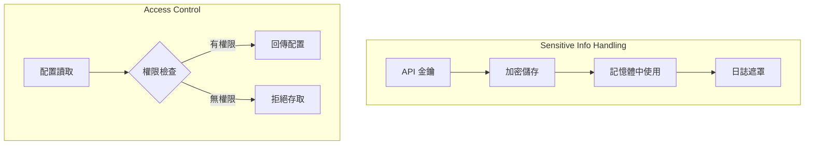
```mermaid
flowchart TB
    subgraph Sensitive Info Handling
        A[API 金鑰] --> B[加密儲存]
        B --> C[記憶體中使用]
        C --> D[日誌遮罩]
    end

    subgraph Access Control
        E[配置讀取] --> F{權限檢查}
        F -->|有權限| G[回傳配置]
        F -->|無權限| H[拒絕存取]
    end
```

## 未來擴充

| 功能 | 說明 | 優先級 |
| --- | --- | --- |
| 配置熱重載 | 執行時載入外部配置檔案 | 高 |
| 配置驗證 | 啟動時驗證配置完整性 | 高 |
| 配置合併 | 使用者配置覆蓋預設配置 | 中 |
| 配置匯入/匯出 | 支援配置檔案匯入/匯出 | 中 |
| Agent 更新 | 從官方文件自動更新配置 | 低 |

# Provider 元資料管理設計

## 概述

Provider 元資料管理系統負責從官方 LLM Provider 文件動態獲取配置資訊，實現配置資料的自動化更新與驗證。

## 核心問題

目前實作包含硬編碼的使用統計，缺乏動態 Provider 資料支援。需要建立一個自動化的元資料獲取與管理機制。

## 架構設計

### 資料流架構

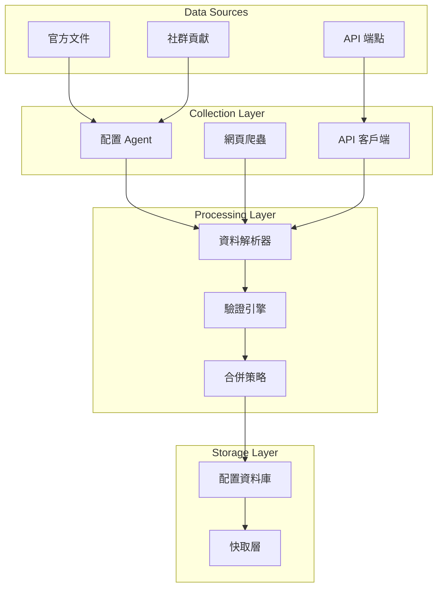
```mermaid
flowchart TB
    subgraph Data Sources
        A[官方文件]
        B[API 端點]
        C[社群貢獻]
    end

    subgraph Collection Layer
        D[配置 Agent]
        E[網頁爬蟲]
        F[API 客戶端]
    end

    subgraph Processing Layer
        G[資料解析器]
        H[驗證引擎]
        I[合併策略]
    end

    subgraph Storage Layer
        J[配置資料庫]
        K[快取層]
    end

    A --> D
    B --> F
    C --> D
    D --> G
    E --> G
    F --> G
    G --> H
    H --> I
    I --> J
    J --> K
```

### 配置優先級模型

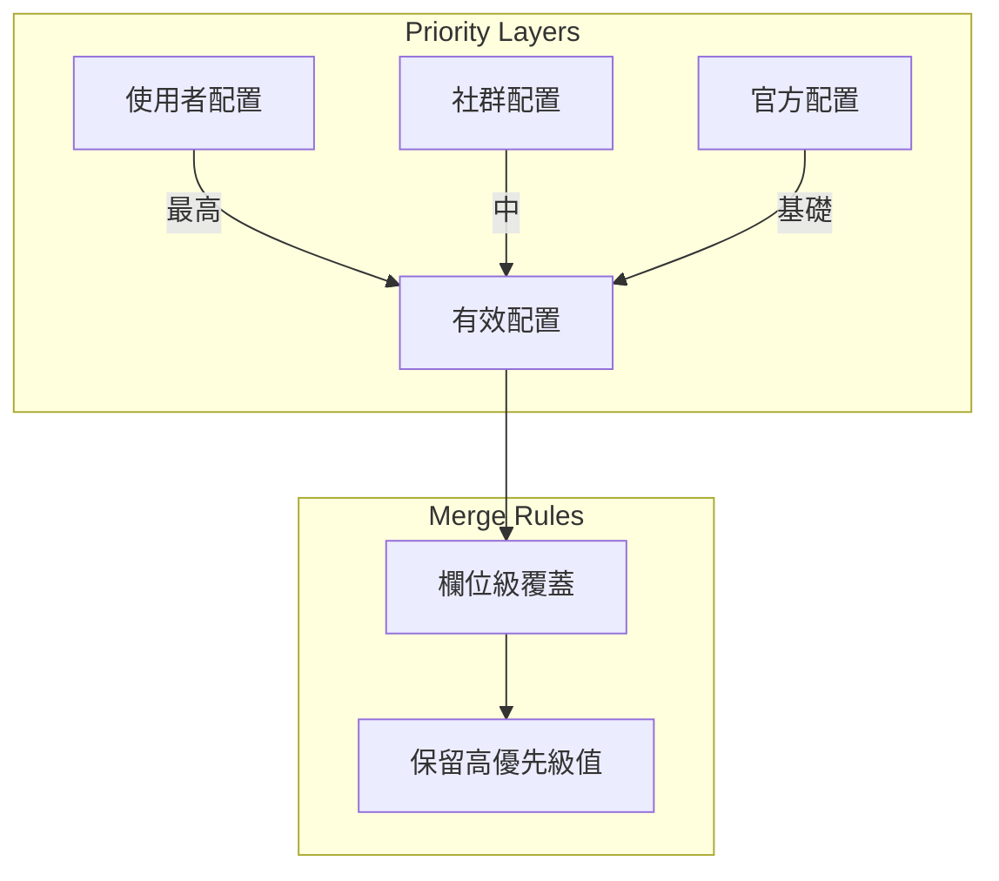
```mermaid
graph TB
    subgraph Priority Layers
        A[使用者配置] -->|最高| D[有效配置]
        B[社群配置] -->|中| D
        C[官方配置] -->|基礎| D
    end

    subgraph Merge Rules
        D --> E[欄位級覆蓋]
        E --> F[保留高優先級值]
    end
```

## 元資料結構

### Provider 配置階層

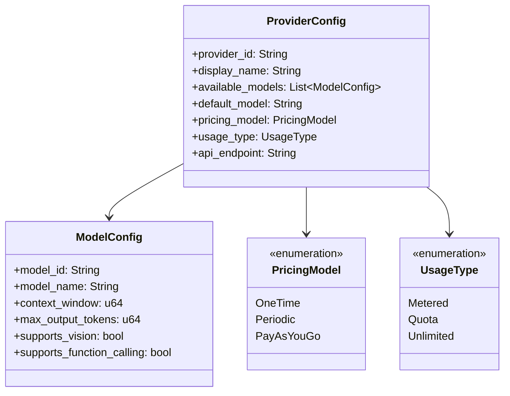
```mermaid
classDiagram
    class ProviderConfig {
        +provider_id: String
        +display_name: String
        +available_models: List~ModelConfig~
        +default_model: String
        +pricing_model: PricingModel
        +usage_type: UsageType
        +api_endpoint: String
    }

    class ModelConfig {
        +model_id: String
        +model_name: String
        +context_window: u64
        +max_output_tokens: u64
        +supports_vision: bool
        +supports_function_calling: bool
    }

    class PricingModel {
        <<enumeration>>
        OneTime
        Periodic
        PayAsYouGo
    }

    class UsageType {
        <<enumeration>>
        Metered
        Quota
        Unlimited
    }

    ProviderConfig --> ModelConfig
    ProviderConfig --> PricingModel
    ProviderConfig --> UsageType
```

### 配置來源分類

| 來源類型 | 說明 | 可靠度 | 更新頻率 |
| --- | --- | --- | --- |
| Official | Provider 官方文件 | 高 | 自動定期 |
| Community | 社群貢獻資料 | 中 | 手動更新 |
| UserOverride | 使用者自訂 | 最高 | 即時 |

## Agent 收集系統

### 收集流程

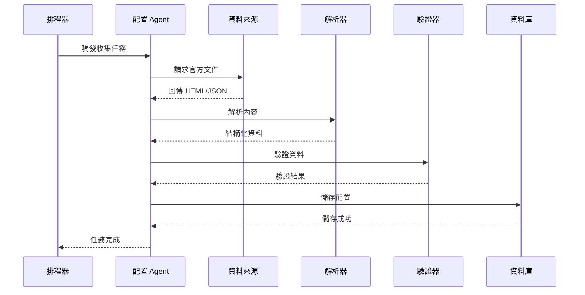
```mermaid
sequenceDiagram
    participant Scheduler as 排程器
    participant Agent as 配置 Agent
    participant Source as 資料來源
    participant Parser as 解析器
    participant Validator as 驗證器
    participant DB as 資料庫

    Scheduler->>Agent: 觸發收集任務
    Agent->>Source: 請求官方文件
    Source-->>Agent: 回傳 HTML/JSON
    Agent->>Parser: 解析內容
    Parser-->>Agent: 結構化資料
    Agent->>Validator: 驗證資料
    Validator-->>Agent: 驗證結果
    Agent->>DB: 儲存配置
    DB-->>Agent: 儲存成功
    Agent-->>Scheduler: 任務完成
```

### Provider Agent 職責

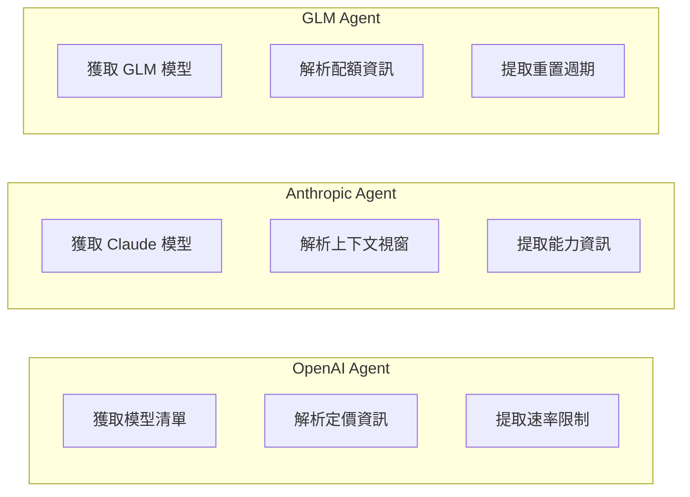
```mermaid
flowchart LR
    subgraph OpenAI Agent
        A1[獲取模型清單]
        A2[解析定價資訊]
        A3[提取速率限制]
    end

    subgraph Anthropic Agent
        B1[獲取 Claude 模型]
        B2[解析上下文視窗]
        B3[提取能力資訊]
    end

    subgraph GLM Agent
        C1[獲取 GLM 模型]
        C2[解析配額資訊]
        C3[提取重置週期]
    end
```

## 資料驗證機制

### 驗證流程

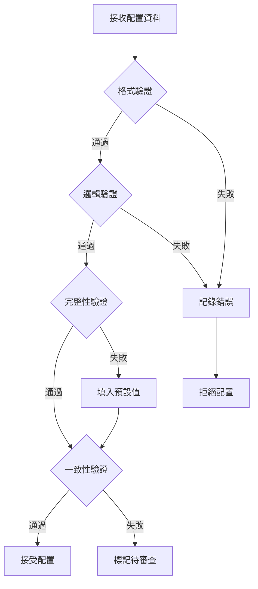
```mermaid
flowchart TB
    A[接收配置資料] --> B{格式驗證}
    B -->|通過| C{邏輯驗證}
    B -->|失敗| D[記錄錯誤]

    C -->|通過| E{完整性驗證}
    C -->|失敗| D

    E -->|通過| F{一致性驗證}
    E -->|失敗| G[填入預設值]

    F -->|通過| H[接受配置]
    F -->|失敗| I[標記待審查]

    G --> F
    D --> J[拒絕配置]
```

### 驗證規則

| 驗證類型 | 檢查內容 | 失敗處理 |
| --- | --- | --- |
| 格式驗證 | 資料型別、欄位格式 | 拒絕並記錄 |
| 邏輯驗證 | 值範圍、列舉值 | 使用預設值 |
| 完整性驗證 | 必要欄位存在 | 填入預設值 |
| 一致性驗證 | 跨欄位關係正確 | 標記待審查 |

## 配置合併策略

### 欄位級合併

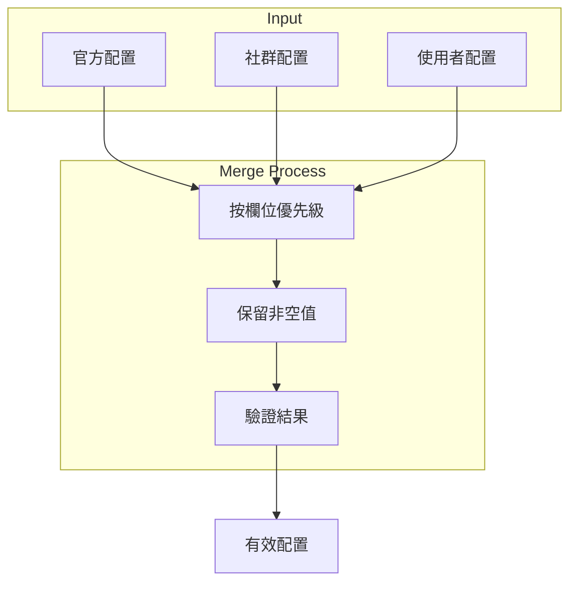
```mermaid
flowchart TB
    subgraph Input
        A[官方配置]
        B[社群配置]
        C[使用者配置]
    end

    subgraph Merge Process
        D[按欄位優先級]
        E[保留非空值]
        F[驗證結果]
    end

    A --> D
    B --> D
    C --> D
    D --> E
    E --> F
    F --> G[有效配置]
```

### 合併範例

| 欄位 | 官方值 | 社群值 | 使用者值 | 最終值 |
| --- | --- | --- | --- | --- |
| context_window | 128000 | - | 64000 | 64000 |
| max_concurrent | 100 | 50 | - | 50 |
| pricing_model | PayAsYouGo | - | - | PayAsYouGo |

## 使用者配置介面

### 配置檔案結構

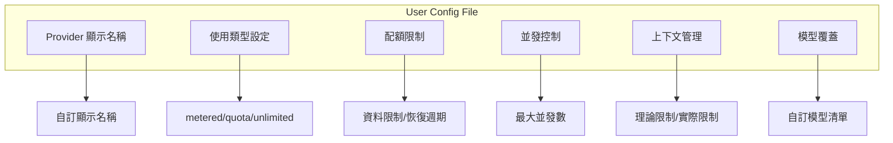
```mermaid
graph TB
    subgraph User Config File
        A[Provider 顯示名稱]
        B[使用類型設定]
        C[配額限制]
        D[並發控制]
        E[上下文管理]
        F[模型覆蓋]
    end

    A --> A1[自訂顯示名稱]
    B --> B1[metered/quota/unlimited]
    C --> C1[資料限制/恢復週期]
    D --> D1[最大並發數]
    E --> E1[理論限制/實際限制]
    F --> F1[自訂模型清單]
```

## 排程更新機制

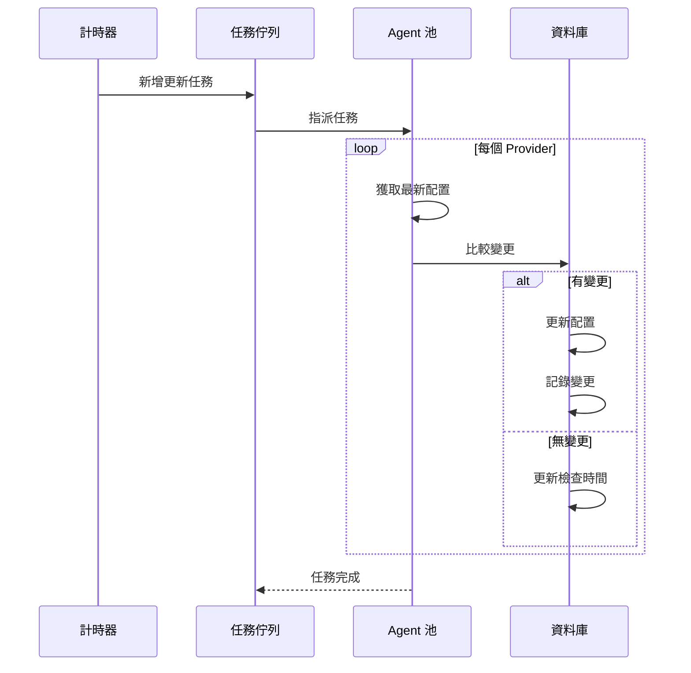
```mermaid
sequenceDiagram
    participant Timer as 計時器
    participant Queue as 任務佇列
    participant Agent as Agent 池
    participant DB as 資料庫

    Timer->>Queue: 新增更新任務
    Queue->>Agent: 指派任務

    loop 每個 Provider
        Agent->>Agent: 獲取最新配置
        Agent->>DB: 比較變更
        alt 有變更
            DB->>DB: 更新配置
            DB->>DB: 記錄變更
        else 無變更
            DB->>DB: 更新檢查時間
        end
    end

    Agent-->>Queue: 任務完成
```

## 錯誤處理

### 收集失敗處理

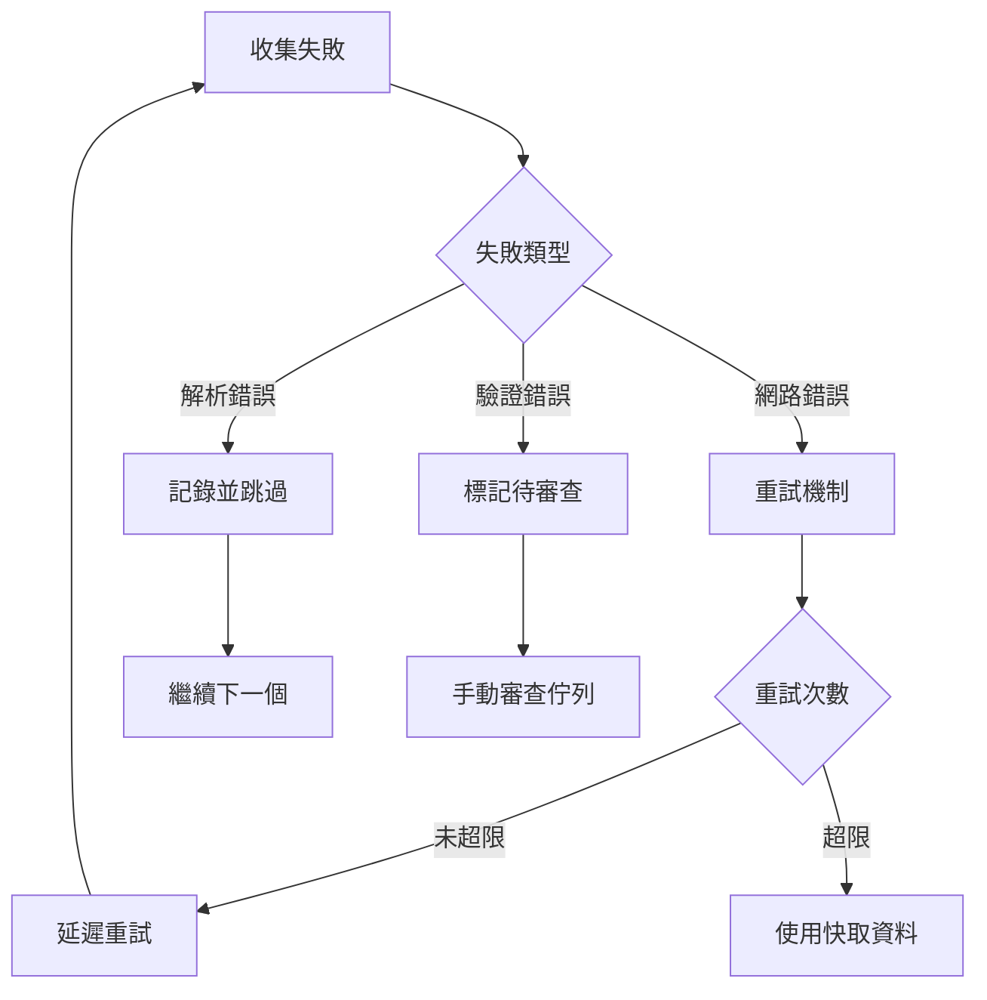
```mermaid
flowchart TB
    A[收集失敗] --> B{失敗類型}
    B -->|網路錯誤| C[重試機制]
    B -->|解析錯誤| D[記錄並跳過]
    B -->|驗證錯誤| E[標記待審查]

    C --> F{重試次數}
    F -->|未超限| G[延遲重試]
    F -->|超限| H[使用快取資料]

    G --> A
    D --> I[繼續下一個]
    E --> J[手動審查佇列]
```

## 可擴充性設計

### 新增 Provider

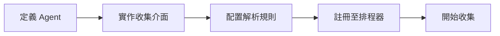
```mermaid
flowchart LR
    A[定義 Agent] --> B[實作收集介面]
    B --> C[配置解析規則]
    C --> D[註冊至排程器]
    D --> E[開始收集]
```

### 擴充點

| 擴充類型 | 說明 | 實作方式 |
| --- | --- | --- |
| 新 Provider | 新增配置來源 | 實作 Provider Agent 介面 |
| 新欄位 | 擴充配置結構 | 更新資料模型與驗證規則 |
| 新驗證規則 | 新增驗證邏輯 | 新增驗證器實作 |

## Layer3 Agent 實作

### ProviderScratch Agent

`ProviderScratch` 是第一個 Layer3 官方 Agent，作為爬取設施的範例實作。

```mermaid
flowchart TB
    subgraph ProviderScratch Agent
        A[Agent 入口] --> B{執行模式}
        B -->|TUI 模式| C[互動介面]
        B -->|CI 模式| D[自動執行]

        C --> E[選擇 Provider]
        D --> F[讀取環境變數]

        E --> G[調用技能]
        F --> G

        G --> H[爬取文件]
        H --> I[解析資料]
        I --> J[生成 TOML]

        J --> K{確認提交？}
        K -->|是| L[寫入工作區]
        K -->|否| M[丟棄變更]

        L --> N[請求使用者提交]
    end
```

### 技能架構

每個 Provider 對應一個獨立的技能：

```mermaid
graph LR
    subgraph Skills
        A[openai]
        B[anthropic]
        C[glm]
        D[deepseek]
        E[qwen]
        F[gemini]
    end

    subgraph Shared Components
        G[文件爬蟲]
        H[資料解析器]
        I[TOML 生成器]
    end

    A --> G
    B --> G
    C --> G
    D --> G
    E --> G
    F --> G

    G --> H
    H --> I
```

### 目錄結構

```mermaid
flowchart LR
    Root[".amphoreus/provider_scratch/"]
    AT["agent.toml"]
    OV["overview/"]
    SK["skills/"]
    Root --> AT
    Root --> OV
    Root --> SK
    OV --> ZH["zhs.md"]
    SK --> OA["openai/"]
    SK --> AN["anthropic/"]
    SK --> GL["glm/"]
    SK --> DS["deepseek/"]
    SK --> QW["qwen/"]
    SK --> GE["gemini/"]
    OA --> OAP["prompt.md"]
    AN --> ANP["prompt.md"]
    GL --> GLP["prompt.md"]
    DS --> DSP["prompt.md"]
    QW --> QWP["prompt.md"]
    GE --> GEP["prompt.md"]
```

### CI 自動化

```mermaid
flowchart LR
    A[排程觸發] --> B[檢出程式碼]
    B --> C[執行 ProviderScratch]
    C --> D{檢測變更}
    D -->|有變更| E[建立分支]
    E --> F[提交變更]
    F --> G[建立 PR]
    G --> H[等待審查]
    D -->|無變更| I[完成]
```

### 環境變數

| 變數名稱 | 說明 |
| --- | --- |
| `AMPHOREUS_PROVIDER_SCRATCH_PROVIDERS` | 要爬取的 Provider 清單 |
| `AMPHOREUS_PROVIDER_SCRATCH_OUTPUT_DIR` | 輸出目錄路徑 |
| `AMPHOREUS_PROVIDER_SCRATCH_GIT_BRANCH` | 目標 Git 分支 |
| `AMPHOREUS_PROVIDER_SCRATCH_DRY_RUN` | 僅演練模式 |

## 未來規劃

| 功能 | 說明 | 優先級 |
| --- | --- | --- |
| 配置版本控制 | 追蹤配置變更歷史 | 高 |
| 變更通知 | 配置更新時通知使用者 | 中 |
| 配置回溯 | 支援回溯至歷史版本 | 中 |
| 智慧推薦 | 根據使用模式推薦配置 | 低 |
| GitHub 巡迴 Agent | 自動建立 PR 更新配置 | 高 |
