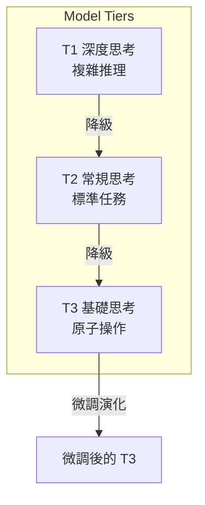
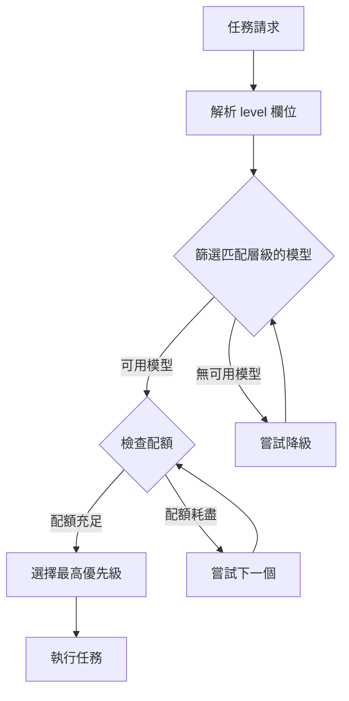
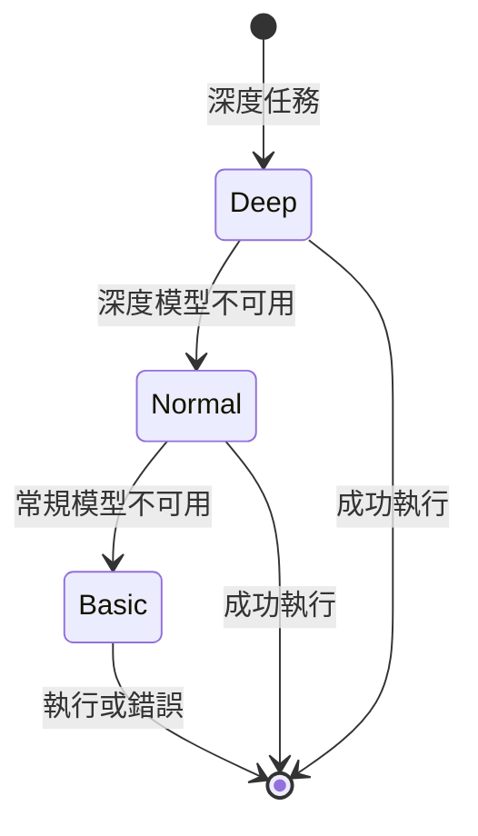
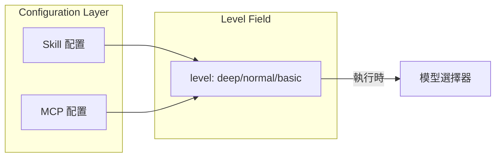
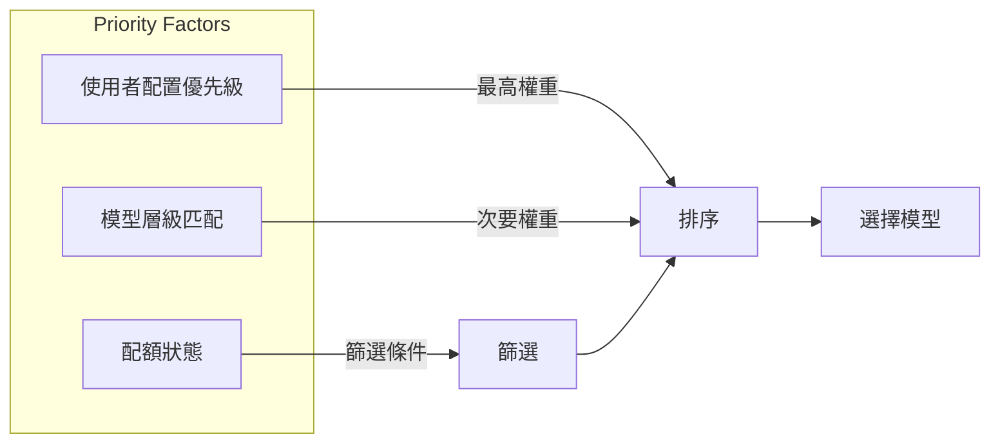
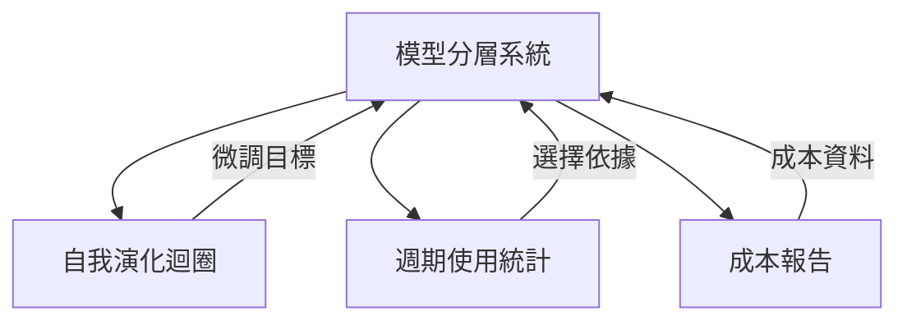

+++
title = "模型分層系統設計"
description = """模型分層系統是一個智慧模型選擇機制，根據任務複雜度分配適當的模型層級，最大化資源利用率同時確保品質。"""
lang = "zht"
category = "design"
subcategory = "core"
+++

# 模型分層系統設計

## 概述

模型分層系統是一個智慧模型選擇機制，根據任務複雜度分配適當的模型層級，最大化資源利用率同時確保品質。

> **相關文件**：本文件中定義的三層模型系統是[自我演化迴圈系統](04-self-evolution-loop.md)的基礎。

## 核心原則

### 三層模型體系

### 層級比較

| 層級 | 定位 | 成本 | 典型場景 |
| --- | --- | --- | --- |
| T1（深度） | 複雜推理、決策 | 最高 | 架構設計、問題分析 |
| T2（常規） | 標準任務 | 中等 | 程式碼撰寫、文件生成 |
| T3（基礎） | 原子操作 | 最低 | 檔案讀取、格式轉換 |

## 模型選擇機制

### 選擇流程

### 降級策略

## 配置機制

### Skill/MCP 層級標註

每個 Skill 和 MCP 工具透過 `level` 欄位宣告所需的模型層級：

### 優先級控制

## 與其他模組的關係

## 設計考量

### 成本最佳化

- 優先使用較低層級模型
- 自動降級避免任務失敗
- 配額監控警報

### 品質保證

- 複雜任務要求高層級
- 降級需可行性驗證
- 失敗時自動重試

### 可擴充性

- 支援自訂層級
- 靈活的優先級配置
- 可插拔的選擇策略
