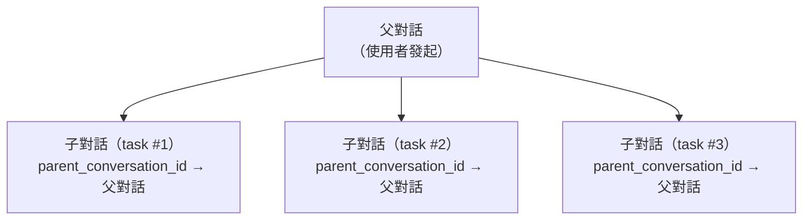

+++
title = "ADR-004：對話儲存生命週期管理"
description = """> 狀態：已接受（2026-06-10）"""
lang = "zht"
category = "design"
subcategory = "core"
+++

# ADR-004：對話儲存生命週期管理

> **狀態**：已接受（2026-06-10）
> **背景**：entelecheia + shittim-chest
> **啟發自**：[opencode #16101](https://github.com/anomalyco/opencode/issues/16101)

## 背景

opencode（一個可比的 AI 程式碼 Agent）在短短 2 個月內累積了 9GB 的對話歷史資料庫，消耗了約 30B 個 token。記憶體使用經常超過 30GiB，僅載入約 10 個專案。根本原因是缺乏對話生命週期管理：無 TTL、無自動清理、無儲存上限，以及無壓縮後回收。

若未處理，entelecheia 和 shittim-chest 面臨相同的基本問題：

- **entelecheia**：`conversations` 和 `messages` 資料庫表存在但從未被寫入；實際對話以無限制的 TOML 日誌檔案儲存；`dialogue_events` 表有 CRUD 程式碼但無遷移；配置限制（`MAX_DIALOGUE_HISTORY_LEN`、`MAX_DIALOGUE_RECORDS`、`DIALOGUE_TIMEOUT_MS`）被定義但從未被強制執行。
- **shittim-chest**：具有可運作的對話/訊息持久化，但沒有針對過期認證對話、陳舊工作區對話、巡航歷史或 webhook 遞送日誌的自動清理。

## 決策

實作一個統一的儲存生命週期管理系統，遵循以下原則：

### 1. 對話具有生命週期，而不僅僅是出生

- **TTL**：無活動超過 `CONVERSATION_TTL_DAYS`（預設 90 天）的對話在歸檔後符合清理資格。
- **先歸檔後刪除**：對話必須在 TTL 清理移除它們之前先歸檔（`is_archived = TRUE`）。
- **子對話**：父子對話關係透過 `parent_conversation_id` 追蹤。子對話可獨立歸檔並在 `CHILD_SESSION_RETENTION_DAYS`（預設 7 天）後清理。

### 2. 清理是自動的，而非手動的

- **背景任務**：定期清理按可配置的間隔執行（`CLEANUP_INTERVAL_MINUTES`，預設 60）。
- **混合策略**：啟動掃描 + 定期計時器。不需要使用者干預。
- **冪等性**：清理任務可安全地多次執行。

### 3. 壓縮實現儲存回收

- 標記為 `is_compacted = TRUE` 的訊息已被摘要化其內容。其詳細內容可在保留期後清理。
- 預設保守：僅清除已壓縮的訊息內容，保留元資料（工具名稱、時間戳、token 計數）。

### 4. 配置是集中式的

所有生命週期參數存在於 `StorageLifecycleConfig`（entelecheia）和 `CleanupConfig`（shittim-chest）中，從環境變數載入，具有合理的預設值。

### 5. 基於檔案的日誌是次要的

- `CHAT_LOG_ENABLED` 預設為 `false`。TOML 對話日誌檔案僅用於除錯。
- 當啟用時，日誌檔案在 `CHAT_LOG_RETENTION_DAYS`（預設 7）後清理。

## Schema 變更

### conversations 表（entelecheia）

新增欄位：

- `parent_conversation_id UUID REFERENCES conversations(conversation_id)` — 子對話追蹤
- `is_archived BOOLEAN NOT NULL DEFAULT FALSE` — 歸檔標誌
- `archived_at TIMESTAMPTZ` — 歸檔時間
- `metadata JSONB NOT NULL DEFAULT '{}'` — 可擴充元資料

### messages 表（entelecheia）

新增欄位：

- `is_compacted BOOLEAN NOT NULL DEFAULT FALSE` — 標記符合內容清理資格的已壓縮訊息
- `metadata JSONB NOT NULL DEFAULT '{}'` — 可擴充元資料

### dialogue_events 表（entelecheia）

先前有 CRUD 程式碼但無 `CREATE TABLE` 遷移。現已包含在 `baseline_tables.sql` 中。

### rbac_sessions 表（entelecheia）

kirino 對話持久化的新表（SQL 後端）。

## 實作階段

| 階段 | 說明 | 狀態 |
| --- | --- | --- |
| 0.1 | Schema 遷移修正（dialogue_events、conversations/messages 升級） | 已完成 |
| 1.2 | 統一配置命名空間（`StorageLifecycleConfig`） | 已完成 |
| 0.2 | 含 CRUD + 清理方法的 `ConversationStore` | 已完成 |
| 2.1 | 通用 `CleanupScheduler` 基礎設施 | 已完成 |
| 2.2 | entelecheia 清理任務接入 scepter `setup.rs` | 已完成 |
| 2.3 | shittim-chest 清理任務 | 已移除（該套件不存在） |
| 1.3 | kirino `PgSessionManager`（SQL 對話後端） | 已完成 |
| 3.1 | 強制執行現有對話限制（`max_dialogue_records`、`enforce_max_conversations`） | 已完成 |
| 3.2 | 對話日誌檔案預設關閉 + TTL 清理 | 已完成 |
| 4.1 | CLI 管理指令（`session stats`、`session purge`） | 已完成 |
| 5 | 子對話級聯 + 孤立對話生命週期 | 已完成 |

## 後果

### 正面

- 防止困擾 opencode 的無限制儲存增長
- 對話具有顯式生命週期：活躍 → 歸檔 → 清理
- 背景清理不需要使用者干預
- 配置驅動，具有合理的預設值
- PostgreSQL VACUUM 在刪除後回收磁碟空間（與 opencode 使用的 SQLite 不同）

### 負面

- 額外的背景任務消耗最低限度的 CPU/記憶體
- 已歸檔的對話在 TTL 後丟失詳細內容（設計如此）
- 需要監控以確保清理任務正在執行

### 已緩解的風險

- **資料丟失**：先歸檔後刪除提供寬限期。清理僅移除已歸檔的對話。
- **效能影響**：清理按可配置的間隔執行，使用 `updated_at`/`created_at` 上的索引查詢。
- **子對話孤立**：`parent_conversation_id` 追蹤關係；孤立對話 TTL 更短（30 天 vs 90 天）。

## 子對話生命週期設計（階段 5）

### 問題

opencode issue #16101 揭示 86% 的對話是由 `task()` 生成的子對話，占 75% 的儲存。這些子對話在沒有獨立生命週期管理的情況下累積。

### 架構



### 生命週期規則

1. **建立**：當技能鏈生成子任務時，建立一個新的對話，其 `parent_conversation_id` 設定為父對話的 `conversation_id`。

1. **獨立歸檔**：子對話可獨立於父對話進行歸檔。當子任務完成時，在 `CHILD_SESSION_RETENTION_DAYS`（預設 7 天）後自動歸檔。

1. **父對話歸檔時級聯**：當父對話歸檔時，所有子對話都被歸檔。當父對話刪除時，所有子對話都被刪除。

1. **孤立對話處理**：`parent_conversation_id` 指向已刪除/不存在的父對話的對話被視為孤立對話，在 `ORPHAN_CONVERSATION_TTL_DAYS`（預設 30 天）後清理。

1. **壓縮資格**：子對話在歸檔後立即符合訊息壓縮資格（無寬限期），因為父對話保留了摘要。

### 清理查詢

```sql
-- 歸檔父對話已歸檔的子對話
UPDATE conversations SET is_archived = TRUE, archived_at = NOW()
WHERE parent_conversation_id IN (
    SELECT conversation_id FROM conversations WHERE is_archived = TRUE
) AND is_archived = FALSE;

-- 刪除父對話已刪除的子對話
DELETE FROM conversations WHERE parent_conversation_id IS NOT NULL
    AND parent_conversation_id NOT IN (SELECT conversation_id FROM conversations);

-- 刪除超過保留期的已歸檔子對話
DELETE FROM conversations WHERE is_archived = TRUE
    AND archived_at < NOW() - (CHILD_SESSION_RETENTION_DAYS || ' days')::interval
    AND parent_conversation_id IS NOT NULL;
```

### 實作狀態

- `parent_conversation_id` 欄位存在於 `conversations` 表中（階段 0.1）
- `ConversationStore.cleanup_expired_conversations()` 處理基於 TTL 的清理（階段 0.2）
- `StorageLifecycleConfig.child_session_retention_days` 和 `orphan_conversation_ttl_days` 已配置（階段 1.2）
- 級聯查詢已在 `ConversationStore` 中實作：
  - `cascade_archive_children()` — 父對話歸檔時歸檔子對話
  - `cascade_delete_orphaned_children()` — 刪除父對話已刪除的子對話
  - `cleanup_expired_child_conversations()` — 已歸檔子對話的 TTL 清理
  - `cleanup_orphan_conversations()` — 清理缺少父對話的子對話
  - `enforce_max_dialogue_records()` — `dialogue_events` 數量的硬上限
  - `enforce_max_conversations()` — 活躍對話數量的硬上限
- 全部註冊為 scepter `setup.rs` 中的定期清理任務
