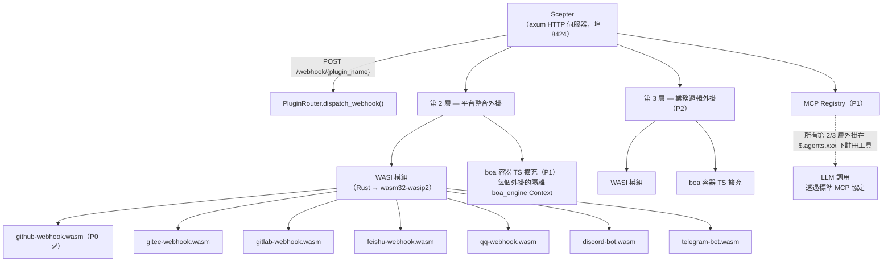
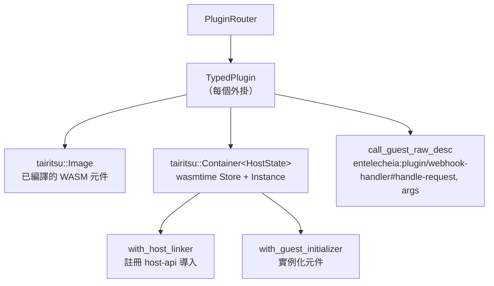

+++
title = "25 — WASI 外掛系統設計"
description = """WASI 外掛系統以 WASM 元件模型外掛取代先前的 Python/TypeScript webhook 鷹架，提供沙箱化、語言無關的平台整合（第 2 層）與業務邏輯擴充（第 3 層）。"""
lang = "zht"
category = "design"
subcategory = "core"
+++

# 25 — WASI 外掛系統設計

## 概述

WASI 外掛系統以 **WASM 元件模型**外掛取代先前的 Python/TypeScript webhook 鷹架，提供沙箱化、語言無關的平台整合（第 2 層）與業務邏輯擴充（第 3 層）。核心設計目標：

1. **雙重擴充機制**：第 2 層（平台整合）與第 3 層（業務邏輯）均支援 WASI 模組與 boa TS 擴充。
1. **統一 MCP 註冊**：所有外掛無論實作語言，均在 `$.agents.xxx` 下註冊工具。
1. **主機管理的 I/O**：主機（Scepter axum 伺服器）處理 HTTP 路由、WebSocket 與長連線；外掛僅處理邏輯。
1. **強沙箱化**：WASM 模組在 wasmtime 下執行，具有燃料限制與時代中斷。

## 架構



## WIT 介面定義

位於 `packages/shared/plugin_host/wit/plugin.wit`：

```wit
package entelecheia:plugin;

interface host-api {
    http-request:  func(method: string, url: string, headers: string, body: string) -> result<string, string>;
    forward-event: func(event-json: string) -> result<_, string>;
    query-ai:      func(message: string, context: option<string>) -> result<string, string>;
    log:           func(level: string, message: string);
    config-get:    func(key: string) -> option<string>;
    kv-get:        func(key: string) -> option<string>;
    kv-set:        func(key: string, value: string) -> result<_, string>;
    register-mcp-tool: func(tool-name: string, description: string, schema: string) -> result<_, string>;
}

interface webhook-handler {
    name: func() -> string;
    handle-request: func(method: string, path: string, headers: string, body: string) -> result<string, string>;
}

interface bot-handler {
    name: func() -> string;
    on-message: func(platform: string, message: string) -> result<option<string>, string>;
}

world layer2-plugin {
    import host-api;
    export webhook-handler;
}

world layer2-bot {
    import host-api;
    export bot-handler;
}
```

### 主機端 API 註冊

主機在元件實例化之前使用 wasmtime 的 `component::Linker::func_wrap` 註冊所有 `host-api` 函式：

```rust
let mut instance = linker.root().instance("entelecheia:plugin/host-api")?;

instance.func_wrap("http-request",
    |_: StoreContextMut<'_, HostState>,
     (method, url, headers, body): (String, String, String, String)| {
        Ok::<(Result<String, String>,), wasmtime::Error>(
            (api.http_request(method, url, headers, body),)
        )
    }
)?;
```

### Guest 端綁定

外掛使用 `wit_bindgen::generate!()` 生成 guest 端綁定：

```rust
wit_bindgen::generate!({
    path: "wit",
    world: "layer2-plugin",
});

struct GithubWebhookPlugin;
impl exports::entelecheia::plugin::webhook_handler::Guest for GithubWebhookPlugin {
    fn name() -> String { "github-webhook".to_string() }
    fn handle_request(method: String, path: String, headers: String, body: String)
        -> Result<String, String> { /* ... */ }
}
export!(GithubWebhookPlugin);
```

## 外掛主機架構

### Crate: `_shared_plugin_host`（`packages/shared/plugin_host/`）

| 模組 | 角色 |
| --- | --- |
| `plugin_state.rs` | `HostFunctions` — 實作所有 `host-api` 函式（HTTP、KV、配置、事件） |
| `plugin_loader.rs` | `TypedPlugin` — 建置 wasmtime 容器，註冊主機導入，透過動態 `call_guest_raw_desc` 調用 guest 匯出 |
| `plugin_router.rs` | `PluginRouter` — 管理已載入的外掛，分派 webhook/bot 請求，自動掃描 `plugins/` 目錄 |
| `host_functions.rs` | 重新匯出 `HostFunctions` 與 `HostApiProvider` trait |

### 執行時堆疊



### Guest 匯出名稱

由於 guest 端的 `wit_bindgen::generate!` 以 WIT 介面名稱匯出函式，主機使用完整限定名稱進行動態調用：

```text
entelecheia:plugin/webhook-handler#name
entelecheia:plugin/webhook-handler#handle-request
entelecheia:plugin/webhook-handler#on-message
```

### 非同步橋接

主機函式是同步的（wasmtime 需求），但實作需要非同步（HTTP、資料庫）。橋接使用 `tokio::task::block_in_place` + `Handle::block_on`：

```rust
instance.func_wrap("kv-get",
    move |_: StoreContextMut<'_, HostState>, (key,): (String,)| {
        let result = tokio::task::block_in_place(|| {
            let handle = tokio::runtime::Handle::current();
            handle.block_on(api.kv_get(&key))
        });
        Ok::<(Option<String>,), wasmtime::Error>((result,))
    }
)?;
```

Scepter 的 webhook 處理器使用 `tokio::task::spawn_blocking` 從非同步 axum 處理器調用同步 WASM 方法。

## Scepter 整合

### 路由註冊

`packages/scepter/src/app/setup.rs` — 新增至 axum router：

```rust
.merge(crate::api::plugin_webhook::create_plugin_webhook_routes())
```

### Webhook 處理器

`packages/scepter/src/api/plugin_webhook.rs`：

- `POST /webhook/{plugin_name}` — 提取路徑、標頭、內容
- 在 `tokio::task::spawn_blocking` 內部調用 `PluginRouter::dispatch_webhook()`
- 回傳外掛的回應或錯誤

### 外掛自動載入

啟動時，Scepter 建立一個 `PluginRouter` 並掃描 `plugins/`（或 `$PLUGIN_DIR`）中的 `.wasm` 檔案：

```rust
let plugin_dir = std::path::PathBuf::from(
    std::env::var("PLUGIN_DIR").unwrap_or_else(|_| "plugins".to_string()),
);
router.scan_and_load_dir(&plugin_dir)?;
```

## 外掛開發指南

### 建立 WASI 外掛

1. 在 `plugins/` 下初始化一個新的 crate：

```toml
# plugins/my-platform/Cargo.toml
[package]
name = "plugin-my-platform"
version = "0.1.0"
edition = "2024"

[lib]
crate-type = ["cdylib", "rlib"]

[dependencies]
wit-bindgen = "0.57"
serde = { version = "1", features = ["derive"] }
serde_json = "1"
```

1. 複製 WIT 檔案：

```text
plugins/my-platform/wit/plugin.wit  ← 符號連結或從 packages/shared/plugin_host/wit/ 複製
```

1. 實作 `Guest` trait：

```rust
// plugins/my-platform/src/lib.rs
wit_bindgen::generate!({ path: "wit", world: "layer2-plugin" });

use exports::entelecheia::plugin::webhook_handler::Guest;

struct MyPlatformPlugin;

impl Guest for MyPlatformPlugin {
    fn name() -> String { "my-platform".to_string() }
    fn handle_request(method: String, path: String, headers: String, body: String)
        -> Result<String, String> {
        // 使用 host-api 函式：log()、http-request()、kv-get() 等。
        log("info", &format!("received {} request", method));
        Ok(r#"{"status":"ok"}"#.to_string())
    }
}

export!(MyPlatformPlugin);
```

1. 配置 `.cargo/config.toml`：

```toml
[target.wasm32-wasip2]
rustflags = ["--cfg=unstable_wasi_extension", "--cfg=unstable_wasi_export_wasi_reactor"]
```

1. 建置：

```bash
cargo build --target wasm32-wasip2 --release -p plugin-my-platform --lib
```

1. 部署：將 `.wasm` 檔案複製到 `plugins/` 目錄（或設定 `PLUGIN_DIR`）。

## 主機函式參考

| 函式 | 簽章 | 說明 |
| --- | --- | --- |
| `http-request` | `(method, url, headers, body) → result<string, string>` | 發送 HTTP 請求（用於回覆外部平台） |
| `forward-event` | `(event-json) → result<_, string>` | 將結構化事件轉發給 Scepter |
| `query-ai` | `(message, context?) → result<string, string>` | 查詢 AI 管線（尚未連接） |
| `log` | `(level, message)` | 透過 Scepter 的 tracing 發送結構化日誌 |
| `config-get` | `(key) → option<string>` | 讀取外掛配置 |
| `kv-get` | `(key) → option<string>` | 持久化 KV 儲存（OAuth token 等） |
| `kv-set` | `(key, value) → result<_, string>` | 寫入持久化 KV 儲存 |
| `register-mcp-tool` | `(name, description, schema) → result<_, string>` | 註冊 MCP 工具（P1） |

## 安全模型

| 機制 | 實作 |
| --- | --- |
| **沙箱** | wasmtime 元件模型沙箱 — 預設無檔案系統、無網路存取 |
| **資源限制** | 燃料計量（每個指令記帳）+ 時代中斷（逾時），透過 tairitsu Container 建構器 |
| **僅主機 I/O** | 所有 I/O 透過主機函式進行；外掛無法開啟 sockets 或檔案 |
| **外掛隔離** | 每個外掛是獨立的 wasmtime 實例，具有自己的記憶體，無跨外掛共享 |
| **TS 沙箱（P1）** | 帶有 skemma 的 COMPUTE_TIMEOUT（120s）/ ABSOLUTE_CEILING（600s）的 boa_engine Context |

## 實作狀態

| 階段 | 元件 | 狀態 |
| --- | --- | --- |
| **P0** | GitHub webhook WASI 外掛 | ✅ 已完成 |
| **P0** | PluginRouter + Scepter 整合 | ✅ 已完成 |
| **P0** | HostFunctions（全部 8 個 host-api 函式） | ✅ 已完成 |
| **P1** | boa TS 擴充基礎設施 | 尚未開始 |
| **P1** | 透過 `$.agents.xxx` 的 MCP 工具註冊 | 尚未開始 |
| **P2** | 其餘平台外掛（Gitee、GitLab、Feishu、QQ、Discord、Telegram） | 尚未開始 |
| **P2** | 第 3 層業務邏輯外掛 | 尚未開始 |

## 關鍵檔案

| 檔案 | 用途 |
| --- | --- |
| `packages/shared/plugin_host/Cargo.toml` | wasmtime 43、tairitsu runtime、reqwest |
| `packages/shared/plugin_host/wit/plugin.wit` | 標準 WIT 介面定義 |
| `packages/shared/plugin_host/src/plugin_state.rs` | HostFunctions、HostApiProvider trait |
| `packages/shared/plugin_host/src/plugin_loader.rs` | TypedPlugin、主機函式註冊 |
| `packages/shared/plugin_host/src/plugin_router.rs` | PluginRouter、分派、scan_and_load_dir |
| `packages/scepter/src/api/plugin_webhook.rs` | Axum webhook 路由處理器 |
| `packages/scepter/src/app/setup.rs` | 路由註冊 + PluginRouter 初始化 |
| `plugins/github-webhook/` | 參考實作 |
| `plugins/github-webhook/src/lib.rs` | GitHub webhook 外掛（issues、PR、push、comment） |
