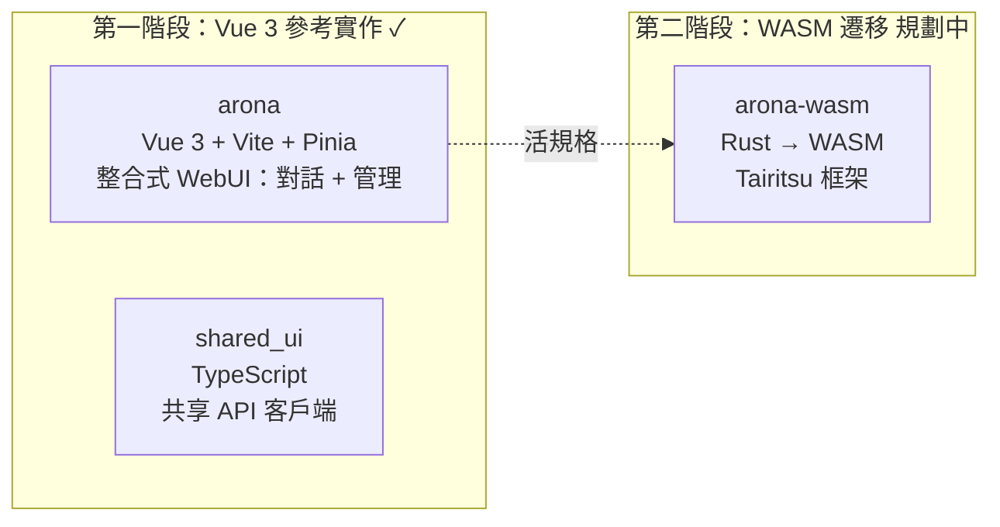
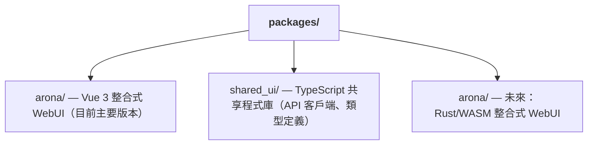

+++
title = "雙前端 WASM 遷移策略"
description = """shittim-chest 採用「先 Vue 3，後 WASM」的兩階段前端策略。Vue 3 版本作為生產級參考實作先行交付，Rust/WASM 版本在條件成熟時遷移。在兩個版本並行運作的期間，相同的使用者互動必須產生相同的結果。"""
lang = "zht"
category = "design"
subcategory = "webui"
+++

# 雙前端 WASM 遷移策略

## 概述

shittim-chest 採用「先 Vue 3，後 WASM」的兩階段前端策略。Vue 3 版本作為生產級參考實作先行交付，Rust/WASM 版本在條件成熟時遷移。在兩個版本並行運作的期間，相同的使用者互動必須產生相同的結果。

## 階段劃分



## 技術堆疊比較

| 維度 | 第一階段 (Vue 3) | 第二階段 (WASM) |
| --- | --- | --- |
| 語言 | TypeScript / Vue 3 SFC | Rust |
| 框架 | Vite + Pinia + Vue Router | Tairitsu（自主開發） |
| 建置產出 | JS/CSS 套件 | WASM 二進位檔 |
| 套件大小 | 較大 | 顯著更小 |
| 執行時期效能 | 良好 | 優秀（接近原生速度） |
| 開發者體驗 | 即時 HMR | 需等待編譯 |
| 生態系成熟度 | 成熟 | 早期階段 |

## 「活規格」原則

Vue 3 版本不僅是臨時實作，它作為 WASM 遷移的**可執行規格**：

1. **功能完整性**：WASM 版本中的每個功能必須與 Vue 3 版本行為一致
1. **API 契約**：兩個版本使用相同的 REST API 和 WebSocket 協定
1. **視覺一致性**：兩個版本在相同狀態下渲染相同的 UI
1. **漸進式替換**：arona 的對話和管理功能可獨立遷移至 WASM

## WASM 遷移決策門檻

在條件成熟之前不會開始向 WASM 遷移。決策門檻：

| 條件 | 說明 |
| --- | --- |
| Tairitsu 框架成熟度 | 元件庫、路由、狀態管理、i18n 等基礎設施必須完備 |
| WASM 生態系覆蓋率 | `web-sys` / `wasm-bindgen` 必須支援所需的 Web API |
| 開發人力 | 有足夠的人員同時維護兩個版本並推進遷移 |
| 效能需求 | Vue 3 版本在實際場景中遇到效能瓶頸 |

## 前端套件結構



`shared_ui/` 包含共享前端程式碼：

- API 客戶端（認證、對話、提供者管理等）
- 認證工具（JWT 儲存、刷新、攔截器）
- 類型定義（領域列舉、請求/回應類型）

## 前端開發指令

```bash
just build-frontend  # 建置兩個前端 (pnpm build:all)
dev.py               # 監視 + 檔案變更時自動重建
```

在開發模式下，`dev.py` 監視原始檔並在變更時執行 `pnpm build`。後端在同一埠上同時提供靜態資源和 API 端點——無需獨立的開發伺服器或代理。

## 設計原則

1. **Vue 3 先交付功能**：不要等待 WASM。使用者現在就可以使用功能完整的對話和管理介面。
1. **WASM 是增強，非替代**：遷移不影響現有使用者——兩個版本使用相同的後端 API。
1. **後端與框架無關**：`shittim_chest` 後端不知道前端實作方式。任何 HTTP/WS 客戶端都可以整合。
1. **Tairitsu 是依賴，非內部開發**：WASM 遷移的開始取決於外部 Tairitsu 框架的成熟度。
