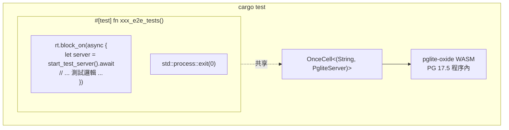

+++
title = "內嵌測試資料庫 (pglite-oxide)"
description = """shittim-chest 使用 [pglite-oxide](https://crates.io/crates/pglite-oxide) 作為內嵌 PostgreSQL，用於所有整合和端對端測試。無需外部 Postgres、Docker 或 `testcontainers`——測試透過單一 `cargo test` 指令在任何機器上執行。"""
lang = "zht"
category = "design"
subcategory = "webui"
+++

# 內嵌測試資料庫 (pglite-oxide)

## 概述

shittim-chest 使用 [pglite-oxide](https://crates.io/crates/pglite-oxide) 作為內嵌 PostgreSQL，用於所有整合和端對端測試。無需外部 Postgres、Docker 或 `testcontainers`——測試透過單一 `cargo test` 指令在任何機器上執行。

## 設計動機

先前，整合測試依賴於 `postgresql_embedded`，它在執行時期下載完整的 PostgreSQL 二進位檔（約 100 MB）。這導致啟動緩慢、平台特定故障和 CI 不穩定。pglite-oxide 透過 wasmer 執行時期將 PostgreSQL 17.5 封裝為 WASM 模組——程序內、可攜且快速（約 96 毫秒冷啟動）。

## 架構



## 關鍵決策

| 決策 | 理由 |
| --- | --- |
| `pglite-oxide` (WASM) 優於 `postgresql_embedded`（原生二進位檔） | 無需約 100 MB 下載、無平台特定 PG 二進位檔、約 96 毫秒啟動 |
| `pglite-oxide` 優於 `pglite-rust-bindings` | 發布於 crates.io (v0.5.0)、更快的啟動速度、成熟的建置器 API 及擴充功能支援 |
| `tower::ServiceExt::oneshot` 優於 `reqwest` | 避免 sqlx 連線池背景任務與 hyper HTTP 伺服器之間的 tokio 執行時期死結 |
| 單一 `#[test]` 執行器搭配 `std::process::exit(0)` | sqlx `PgPool` 產生持續的背景任務（閒置回收器、健康檢查），使 tokio 執行時期保持活躍。`exit(0)` 繞過此懸掛 |
| `max_connections=1` | PGlite 基本限制——僅支援單一連線 |
| `OnceCell<(String, PgliteServer)>` | 在同一次二進位檔執行中的子測試間共享 PG 實例；`PgliteServer` 必須保持存活（不被丟棄） |
| `pglite-oxide` 僅在 `[dev-dependencies]` 中 | wasmer 執行時期不得洩漏到生產建置中 |

## 測試框架模式

```rust
// tests/common/mod.rs
static PG: OnceCell<(String, PgliteServer)> = OnceCell::const_new();

async fn ensure_pg_url() -> String {
    PG.get_or_init(|| async {
        let server = PgliteServer::builder()
            .start()
            .expect("Failed to start pglite-oxide");
        let url = server.database_url();
        // 連線、執行遷移、關閉初始連線
        (url, server)
    }).await.0.clone()
}

pub async fn start_test_server() -> TestServer {
    let db_url = ensure_pg_url().await;
    let db = Database::connect(/* max_connections=1 */).await;
    // 建置 AppState、Router，回傳包裝 tower oneshot 的 TestServer
}
```

```rust
// tests/xxx_tests.rs
# [test]
fn xxx_e2e_tests() {
    let rt = tokio::runtime::Runtime::new().unwrap();
    rt.block_on(async {
        let mut server = common::start_test_server().await;
        // ... 所有使用 server.request() 的子測試 ...
    });
    std::process::exit(0);
}
```

## 建立的資料表

所有 13 個資料表都透過 SeaORM 遷移在測試設定期間建立：

`auth_users`、`sessions`、`api_keys`、`oauth_connections`、`channel_configs`、`channel_messages`、`channel_pairings`、`conversations`、`messages`、`llm_providers`、`remote_devices`、`device_sessions`、`system_settings`、`workspace_sessions`

## PGlite 限制

1. **單一連線**：`max_connections` 必須為 1。多個連線池連接到同一個 PGlite 實例將會懸掛。
1. **嚴格的類型轉換**：PGlite 比標準 PostgreSQL 更嚴格。像 `uuid_column = text_value` 這樣的查詢將會失敗——必須始終明確轉換類型。
1. **不支援並行測試執行器**：所有共享一個 PGlite 實例的非同步測試必須在單一 `#[test]` 函式中循序執行。
1. **連線池丟棄時懸掛**：`sqlx::PgPool::close()` 可能無限期懸掛。使用 `std::process::exit(0)` 終止測試程序。
