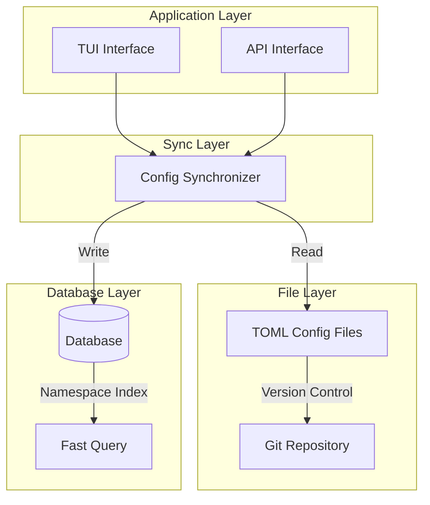
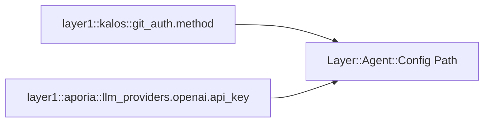
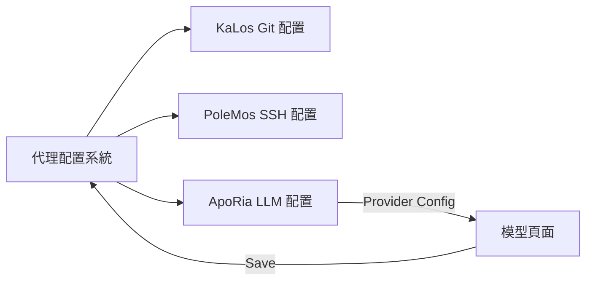

# 代理配置系統設計

## 概述

代理配置系統提供統一的配置管理機制，支援 TOML 檔案儲存與資料庫持久化，實作配置版本管理與熱重載。

## 核心原則

### 雙層儲存架構



### 配置命名空間

採用階層式命名空間設計：



## 架構設計

### 配置生命週期

```mermaid
stateDiagram-v2
    [*] --> Default: 系統預設值
    Default --> FileConfig: 載入 TOML
    FileConfig --> DbSync: 同步至資料庫
    DbSync --> Active: 配置生效

    Active --> Updated: 使用者修改
    Updated --> Validated: 格式驗證
    Validated --> DbSync: 儲存變更

    Active --> HotReload: 熱重載觸發
    HotReload --> Active: 無需重啟
```

### TUI 配置介面

```mermaid
graph TB
    subgraph Agent Document Modal
        Tabs[Overview | Config | MCP | Skills]
        Tabs --> Content[Content Area]
    end

    subgraph Configuration Page
        Groups[Configuration Group List]
        Groups --> Group1[Git Auth Config]
        Groups --> Group2[Source Management Config]
        Groups --> AddGroup[Add New Config Group]
    end

    Content --> Groups
```

## 與其他模組的關聯



## 設計考量

### 安全性

- 敏感配置加密儲存
- 存取權限控制
- 配置變更稽核

### 可擴展性

- 支援自訂配置類型
- 靈活的驗證規則
- 可插拔的配置處理器

### 一致性

- 檔案與資料庫同步
- 配置版本管理
- 衝突偵測與解決
