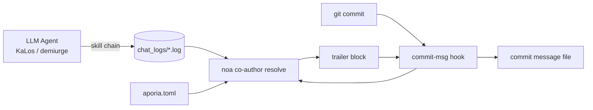

# AI 代理識別與提交共同作者策略

## 概述

本文件規範如何在 celestia-island 專案
（`noa`、`entelecheia`、`evernight`）中的 AI 生成提交上標記**來源元資料**：哪些
模型編寫了變更、透過哪個提供者/平台存取、消耗了
多少 Token、以及該變更是否在自主（YOLO）迭代下產生。

此機制是**務實的元資料**：每個由 AI 代理產生的提交都會附加一個
`Co-authored-by` 尾塊（以及可選的 `Token usage` 尾塊），由
`noa` 安裝並解析的 git `commit-msg` hook 添加。這不是法律
合規門檻；它是可追溯性，讓人工稽核者能夠追蹤哪個模型和哪個
提供者接觸了程式碼。

## 動機

| 關注點 | 如何幫助 |
| --- | --- |
| **可追溯性** | 每個提交記錄產生它的確切模型。 |
| **提供者問責** | 作者電子郵件編碼了提供者/平台，包括第三方中繼。 |
| **反投毒** | 如果中繼或提供者傳輸了受損資料，共同作者尾塊可識別來源。 |
| **成本追蹤** | 可選的 `Token usage` 區塊記錄每個模型的上傳/下載/快取。 |
| **自主模式標記** | 在 YOLO 巡航控制下完全執行的鏈運行會標記 `Entelecheia` 權威。 |

## 提供者身份模型

作者電子郵件使用單一信任命名空間 — `celestia.world` — 本地
部分編碼**誰提供了模型**：

```text
Display Name <provider-or-platform-id@celestia.world>
```

提供者 ID 是每個提供者配置中宣告的**強制 `website_domain`** 欄位
（提供者註冊表入口 TOML 和本地 `aporia.toml`）。它**不是**從 API `base_url` 推導出來的 — 單一提供者可能
暴露多個 `base_url` 主機（例如 `zhipu_glm` 同時服務 `open.bigmodel.cn` 和
`api.z.ai`，但其規範網域是 `zhipuai.cn`）。如果提供者缺少
`website_domain`，則不會為其歸屬共同作者（解析器會跳過它，而非
從 URL 或模型前綴猜測）。

- **第一方提供者**透過其規範網域識別：

`anthropic.com`、`deepseek.com`、`openai.com`、`zhipuai.cn`、`google.com`、...

- **第三方/中繼提供者**保留其自己的網域，使中繼可見：

`opencode.ai`、`jdcloud.com`、`openrouter.ai`、`dashscope.aliyuncs.com`、...

這意味著透過不同路由存取的*相同*模型是可區分的：

```text
GLM 5 <zhipuai.cn@celestia.world>              # 直接來自智譜 AI
GLM 5 <jdcloud.com@celestia.world>           # GLM 5 透過京東雲服務
Deepseek V4 Pro <deepseek.com@celestia.world> # 直接來自 DeepSeek
Deepseek V4 Pro <opencode.ai@celestia.world>  # DeepSeek 透過 opencode 服務
```

## 共同作者尾塊規範

- 尾塊鍵：`Co-authored-by`（Git 識別的尾塊）。
- 值：`Display Name <local@celestia.world>`。
- **每個不同模型一個尾塊**，按使用順序排列。
- 顯示名稱從模型 ID（品牌 + 版本，標題大小寫）推導。
- 本地部分必須是有效的 RFC-5321 子網域（字母、數字、`.`、`-`）。

## YOLO 權威尾塊

當產生提交的整個思考鏈在 **YOLO 巡航控制**
（自主迭代）下執行時，會新增一個額外的共同作者：

```text
Co-authored-by: Entelecheia <demiurge@celestia.world>
```

YOLO 模式從以下任一來源偵測：

1. 會話聊天記錄中包含 `YOLO cruise control` / `YOLO auto` 標記，或
1. 存在 `/run/entelecheia/yolo_active` 哨兵檔案。

這使人類能夠立即看到「此提交是在沒有人類參與的情況下進行的」。

## 嵌入的 Token 用量

嵌入在 `Co-authored-by` 尾塊中每個模型的顯示名稱內（GitHub 能正確解析的一個尾塊）：

```text
Co-authored-by: Claude Opus 4.8 (↑ 12.5k ↓ 8.3k ●45.2k) <anthropic.com@celestia.world>
Co-authored-by: Deepseek V4 Pro (↑ 5.1k ↓ 3.2k) <deepseek.com@celestia.world>
```

規則：

- 用量以 `(↑ upload ↓ download)` 內嵌，僅在快取輸入 token 被報告且 > 0 時附加 `●cache`。
- `↑` = 提示/輸入 token；`↓` = 完成/輸出 token。
- 計數以千 (`k`) 為單位呈現，一位小數，去除尾隨零。

## 完整提交訊息範例

```python
fix(auto_fix): raise clippy/check timeouts from 180s to 300s

The previous 180s timeout was too tight for clean builds on a loaded
machine; raise it to 300s to avoid spurious validation failures.

Co-authored-by: Entelecheia <demiurge@celestia.world>
Co-authored-by: GLM 5 (↑ 36.4k ↓ 1.5k) <zhipuai.cn@celestia.world>
```

## noa Hook 安裝

`noa` 提供 hook 生命週期：

```text
noa hook install --repo <path> [--force] [--noa-bin <path>]
```

- 寫入 `.git/hooks/commit-msg`（模式 `0755`）。
- Hook 呼叫 `<noa> co-author resolve` 並將其 stdout 附加到提交

訊息檔案 (`$1`)。

- Hook **絕不阻止提交**：在任何解析器失敗時它會靜默地退出 `0`。
- 如果提交訊息已包含 `Co-authored-by:` 尾塊，則 hook 為

無操作（絕不重複或覆寫）。

- 環境變數 `NOA_COAUTHOR_DISABLE=1` 可為單次提交禁用 hook。

## noa 共同作者解析

```text
noa co-author resolve [--repo <path>] [--chat-log-dir <dir>]
                      [--aporia-config <path>] [--lookback-secs <n>]
```

解析器：

1. 載入提供者對應表：內建註冊表與 `aporia.toml` 提供者

配置合併（提供精確的 model→endpoint→provider 對應）。

1. 讀取最新的 entelecheia 聊天記錄並按模型彙總 token 用量。

使用 `--lookback-secs 0`（預設）時僅使用最近一筆記錄。

1. 偵測 YOLO 模式（聊天記錄標記或哨兵檔案）。
1. 建立共同作者列表（如果 YOLO 則 `Entelecheia` 權威優先，然後是模型）

和 token 用量區塊，並將尾塊列印到 stdout。

## 資料流



## entelecheia 整合

- `commit-msg` hook 安裝到 `/mnt/sdb1/entelecheia/.git/hooks/`。
- 所有由手術管線產生的提交（`packages/scepter/src/state_machine/skill_chain/execution/noa_post_chain.rs` 中的 `NoaMergeCommit` hook）

以及由 `KaLos:auto_fix` 自我修復循環產生的提交，都會經過 git `commit-msg` hook，
因此它們會自動標記。

- 無需變更提交呼叫點：hook 是單一插入點。

## evernight 整合

當 AI 代理透過 `evernight` 編排提交時（例如主機 A 上的代理 →
evernight SSH → 主機 B → `git commit`），主機端的 `commit-msg` hook 仍會
在本機觸發並標記提交。`evernight` 本身可能在作者電子郵件中作為**傳輸
提供者**出現（例如
`GLM 5 <evernight.celestia.world@celestia.world>`），使傳輸跳點可稽核。

## 安全考量

- 共同作者尾塊是**自我報告的**來源資訊，而非密碼學證明。

未來工作可能新增簽署證明。

- 解析器安全降級：缺少的聊天記錄、缺少的 `noa` 或解析錯誤

都會產生空白區塊，提交不受影響地繼續進行。

- 提供者識別碼來自本地 `aporia.toml`，因此使用者始終看到

他們*自己*配置的提供者。

## 提供者識別碼參考（初始註冊表）

| 提供者 ID | 品牌 | 端點提示 |
| --- | --- | --- |
| `zhipuai.cn` | GLM | `open.bigmodel.cn` |
| `deepseek.com` | Deepseek | `api.deepseek.com` |
| `anthropic.com` | Claude | `api.anthropic.com` |
| `openai.com` | GPT / OpenAI | `api.openai.com` |
| `google.com` | Gemini | `googleapis.com` |
| `dashscope.aliyuncs.com` | Qwen | `dashscope.aliyuncs.com` |
| `moonshot.cn` | Kimi | `api.moonshot.cn` |
| `mistral.ai` | Mistral | `api.mistral.ai` |
| `opencode.ai` | (中繼) | `opencode.ai` |
| `jdcloud.com` | (中繼) | `jdcloud.com` |
| `openrouter.ai` | (中繼) | `openrouter.ai` |
