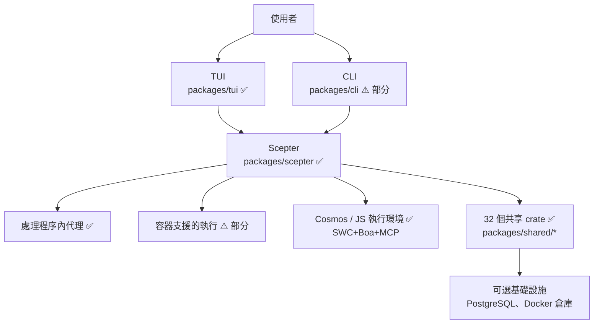
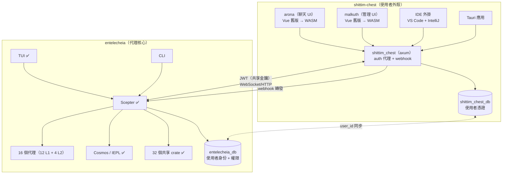
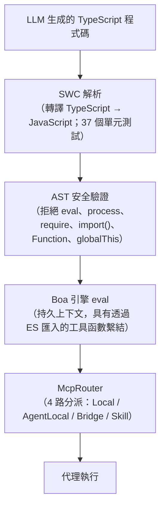
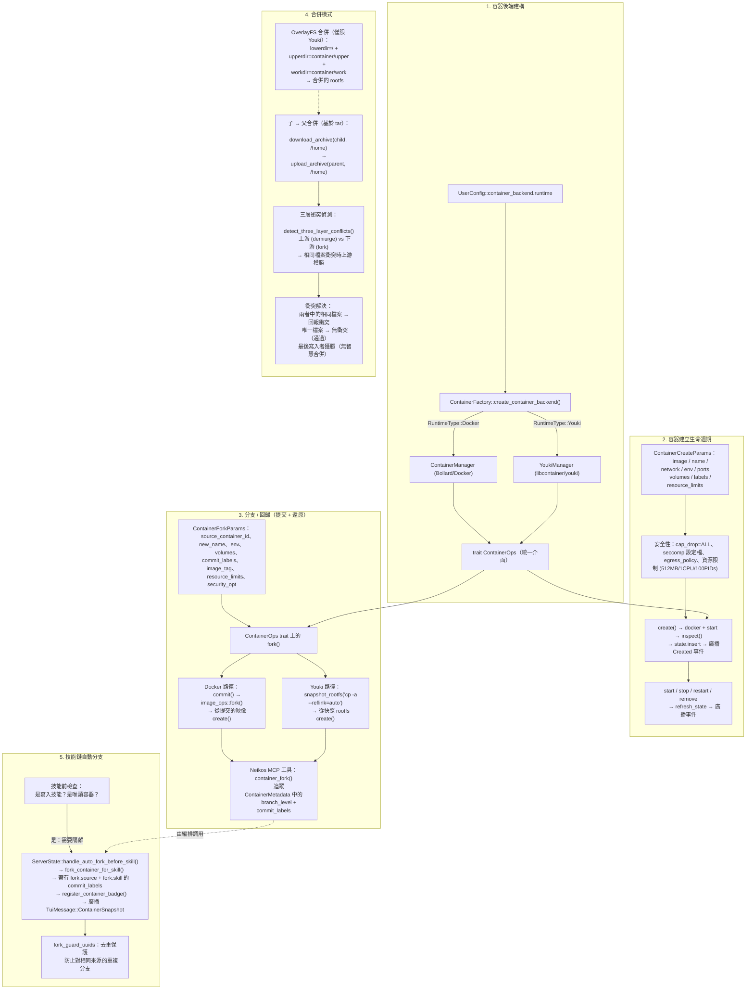
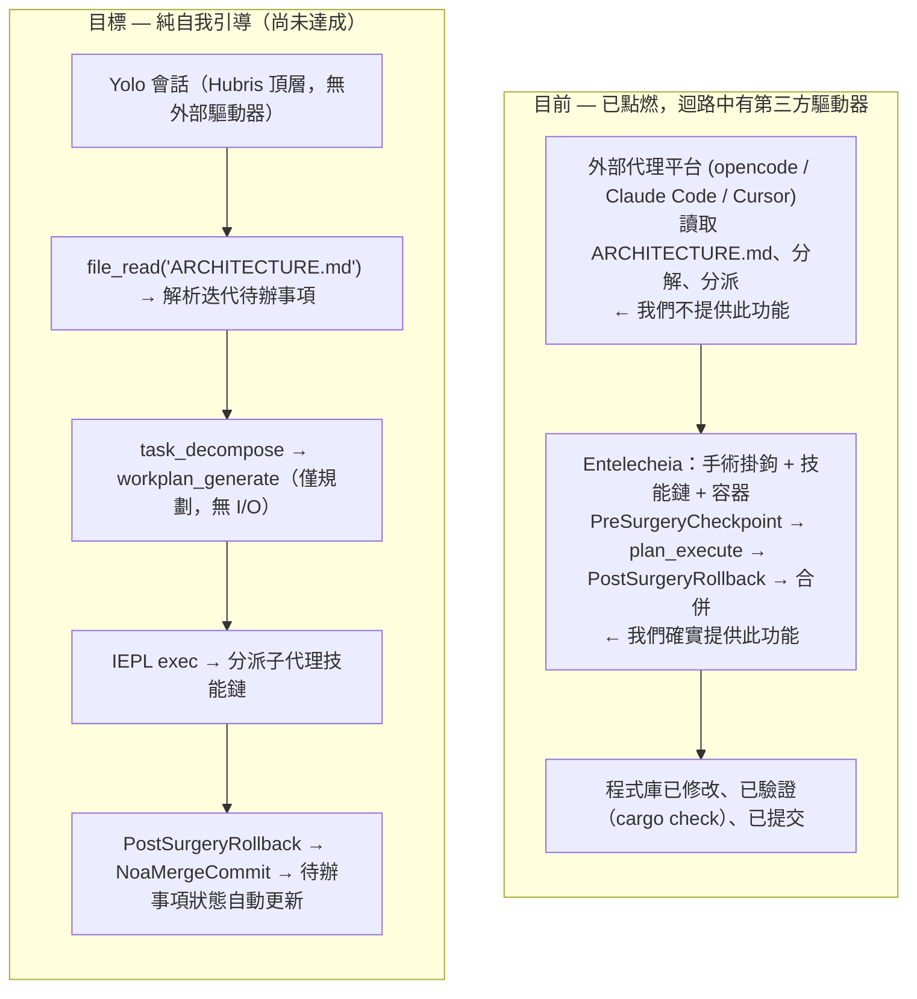
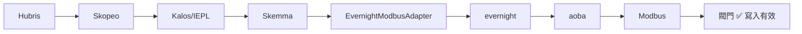
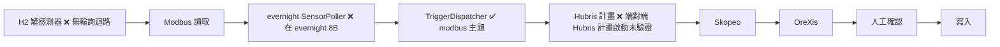
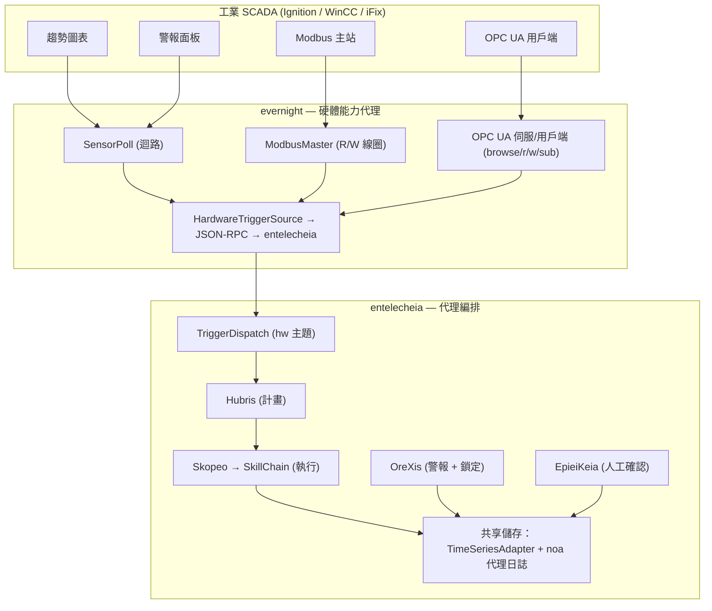

# 架構

> **版本**：0.2.0 — 早期開發，尚未準備好用於生產。
> **最後驗證**：2026-06-17（深度分析 — 根據實際程式碼重新校準）
> 本文件描述了已實作的程式碼和預期的設計。
> 在做出部署決策之前，請[閱讀當前的缺口](#當前缺口)章節。

## 倉庫分割

Entelecheia 已完成其主要分割：使用者面向的外殼層已遷移到同級專案 **shittim-chest**（`../shittim-chest`）。Entelecheia 現在專注於多代理編排核心。

| 倉庫 | 範圍 |
| --- | --- |
| **entelecheia** | Scepter 編排、16 個代理（12 個 L1 + 4 個 L2）、Cosmos/IEPL 執行環境、32 個共享 crate |
| **shittim-chest** | arona（聊天 UI 前端）、malkuth（管理 UI）、`shittim_chest` 後端（axum 代理 + auth + webhook）、IDE 外掛、Tauri 應用 |

## 目前範圍

Entelecheia 是一個包含 **56 個 crate** 的 Rust 工作區，圍繞 `packages/scepter`（編排伺服器）、`packages/shared/` 下的 **32 個共享 crate**（從前一個單體 crate 完全分解；5 個計劃中的子 crate 從未實現，其功能已內嵌到同級 crate 中），以及 `packages/tui`（終端 UI）組織。TUI 是最完整的使用者介面。`packages/cli` 具有服務管理、聊天和時間線命令。

以下元件已**遷移到 shittim-chest** 並從此倉庫中移除：

- `packages/webui`（HTTP/靜態主機、WebSocket 橋接）— 已移除
- `packages/webui_frontend`（WASM 前端）— 已移除（第一階段）
- `packages/ide/vscode`（VS Code 擴充）— 已移除（第一階段）
- `packages/ide/idea`（IntelliJ 外掛）— 已移除（第一階段）
- `packages/app/tauri*`（Tauri 桌面/行動應用）— 已移除（第一階段）
- TUI/CLI/Scepter/共享 crate 中的所有 WebUI 狀態、命令和渲染 — 已移除（第二階段）

專案經歷了重大分解：舊的單體 `packages/shared` crate（38K 行、187 個 .rs 檔案）已完全分解為聚焦的子 crate。早期分層圖中出現的 5 個 crate 邊界從未實現為獨立 crate；其預期功能存在於其他 crate 中（例如，域列舉內嵌到 `shared-domain-agent` 中，執行緒型別內嵌到 `shared-state-types` 中）。所有內部依賴宣告使用 `workspace = true` 以保持版本一致性。

## 元件現實檢查

| 元件 | 已實作 | 僅設計/樁 | 評判 |
| --- | --- | --- | --- |
| **Scepter**（編排） | Auth/RBAC、提供者路由、代理生命週期、技能鏈執行、WebSocket/HTTP 端點、金鑰加密。49 個原始檔中 351 個單元測試。`AppState` 為 5 個子狀態提供 `FromRef` 實作；agent_lifecycle 處理常式使用 `State<Arc<Persistence>>` | 完整的 API 表面。批次處理器已定義但未實例化。 | 🟢 真實 |
| **TUI** | 完整生命週期：啟動畫面、Docker 初始化、時間線、代理模態框、i18n（8 種語言）、提供者設定、主題支援。47 個原始檔中 329 個單元測試。`ComponentStore` 分割為 5 個子結構體；AppState 減少到 6 個欄位。透過 Unix socket（首選）或 WebSocket 備援連線。 | 與 Scepter API 功能持平。`CancelRequest`/`ExecuteSudoCommand` 尚未接線。 | 🟢 真實 |
| **CLI** | 服務管理、聊天、時間線、代理生命週期命令。28 個單元測試。 | 功能未與 TUI 持平 | 🟡 部分 |
| **WebUI** | 已移除 — 遷移到 shittim-chest | — | ✅ 完成 |
| **WebUI 前端** | 已移除 — 遷移到 shittim-chest | — | ✅ 完成 |
| **Cosmos / JS 執行環境** | Boa 引擎、ES 模組匯入分派（`__native_dispatch` 內部解析）、命名空間生成、帶有熔斷器+重試的 McpRouter。從 `#[derive(TS)]` 自動生成 `.d.ts` 以填充 TypeScript 型別檔案。50 個單元測試。 | SWC TypeScript 轉譯管線已實作並測試（37 個單元測試）。完整自動化管線（LLM 輸出 → SWC → Boa）可透過 `shared_iepl::client` 以 `in-process-transpile` 功能標誌橋接。 | 🟢 活躍 |
| **16 個代理（12 L1 + 4 L2）** | 所有 16 個代理均以 MCP 工具實作編譯。總共 147 個 MCP 工具 — **全部真實**。程式庫中零個 `unimplemented!()` 或 `todo!()` 巨集。 | Classic SE 工具在中繼資料中標記為 `maturity: Stub`，但具有真實的實作（cargo clippy、eslint、pylint、go vet 子處理程序呼叫；程式碼指標；extract-function 重構）。 | 🟢 活躍 |
| **第 2 層：Web Automation** | 11 個 MCP 工具 — 全部為透過 WebDriver 協定的真實實作：會話管理、導航、截圖、腳本執行、控制台/網路日誌、鍵盤、滑鼠、錄製。10 個工具 `maturity: Experimental`。 | — | 🟢 活躍 |
| **第 2 層：Classic SE** | 7 個 MCP 工具 — 全部為真實實作：static_analyze（cargo clippy/eslint/pylint/go vet）、code_review（偵測長函數、深層巢狀、魔術數字）、quality_check（LOC、複雜度、字母等級）、refactor_suggest、lsp_diagnose、lsp_symbols、lsp_refactor（真實的重新命名和 extract-function）。2 個單元測試。 | LSP refactor 的內嵌操作僅供預覽（需要 LSP 伺服器進行完整解析）。 | 🟢 活躍 |
| **第 2 層：Industrial IoT** | 7 個 MCP 工具 — 全部為真實實作：modbus_read、modbus_write、s7comm_probe、serial_discover、opcua_browse、opcua_read、opcua_write。工業協定通訊（Modbus RTU/TCP、Siemens S7comm、OPC UA 用戶端）。`maturity: Experimental`。 | 從 SkeMma/PoleMos 遷移，作為第 2 層整合的一部分。 | 🟢 活躍 |
| **第 2 層：Remote Operations** | 16 個 MCP 工具 — 全部為真實實作：SSH 會話管理、遠端命令執行、檔案傳輸（SFTP）、主機資訊收集、GUI 自動化（X11/VNC 截圖、輸入、導航）、系統監控。`maturity: Experimental`。 | 從 SkeMma/PoleMos 遷移，作為第 2 層整合的一部分。 | 🟢 活躍 |
| **其他第 2 層設計** | 全部 4 個計劃的第 2 層代理現已實作。`res/prompts/domain_agents/` 包含所有已實作代理的設定/技能文件。 | `docs/plans/` 從未被建立 | 🟢 活躍 |
| **容器隔離** | 兩層執行環境：Docker/Podman（外部編排）透過 Bollard、Youki/libcontainer（內部沙箱）透過 libcontainer。非 root 使用者、cap_drop=ALL、no-new-privileges、專用 Docker 網路、Unix socket IPC、資源限制（512MB/1CPU/100 PIDs）於建立、分支、合併和重建時。自訂 seccomp 設定檔。兩種後端上的分支/提交/快照完全功能。 | AppArmor 設定檔未實作。`read_only_rootfs` 預設未啟用。 | 🟡 部分 |
| **記憶體 / RAG** | API 支援的嵌入（OpenAI 相容、SHA-256 雜湊備援、ONNX fastembed BGE-M3）。3 個嵌入後端完全實作。PgVector 儲存、記憶體內向量文件、圖遍歷、用於環境上下文注入的 RagContextBuffer。39 個單元測試。 | 嵌入→RAG 連線已解耦（呼叫者提供預先計算的嵌入）。PgVector 路徑較新/測試較少，不如記憶體內備援。RAG 訂閱同步已保留（尚未實作）。 | 🟡 部分 |
| **IEPL 管線** | Boa 引擎 + MCP 橋接 + 命名空間過濾 + 熔斷器。SWC TypeScript 解析已實作並測試（37 個單元測試）。`.d.ts` 自動生成已可操作。IEPL 程式碼生成（Rust 型別 → TS 宣告）已接線。TS→JS 轉譯可透過 `shared_iepl::client`（處理程序內或子處理程序模式）使用。 | SWC→Boa 鏈未整合到 Cosmos 容器執行路徑中（預期預先剝離的 JS）。 | 🟡 部分 |
| **IDE 整合** | 已移除 — 遷移到 shittim-chest | — | ✅ 完成 |

## 架構圖

### 目前



### 目標（分割後）



圖例：✅ 運作中 | ⚠️ 部分實作 | 🔴 樁/設計

## Crate 依賴層

32 個共享 crate 組織為分層依賴圖：

```mermaid
block-beta
    columns 1
    block:L0["第 0 層（葉）"]:1
        shared-core shared-logging shared-macros
    end
    block:L1["第 1 層"]:1
        shared-domain-enums shared-mcp-types shared-text shared-concurrent
    end
    block:L2["第 2 層"]:1
        shared-config shared-agent-registry shared-state-types
    end
    block:L3["第 3 層"]:1
        shared-domain-agent shared-container shared-domain-agent-lifecycle shared-domain-agent-runtime
        shared-domain-thread-types shared-domain-toolchain shared-infra-utils
    end
    block:L4["第 4 層"]:1
        shared-state-sync shared-domain-skills shared-hooks shared-domain-auth shared-container-runtime
        shared-domain-skills-permissions shared-timeline shared-iepl
    end
    block:L5["第 5 層"]:1
        shared-llm-provider shared-prompt shared-custom-agent shared-storage
        shared-infra-jsonrpc shared-infra-services shared-e2e-events shared-adapter shared-plugin_host
        shared-rag shared-embedding shared-security-policy
    end
    L0 --> L1 --> L2 --> L3 --> L4 --> L5
```

消費者（scepter、代理、tui）直接從個別子 crate 匯入（例如 `_shared_domain_agent`、`_shared_llm_provider`）。沒有薄聚合 crate — 舊的單體 `shared` 已被完全分解。所有內部依賴使用 `workspace = true` 宣告以保持版本一致性。

> **注意：** 上圖列出了 6 層共 37 個 crate 槽位，但只有 32 個存在作為可編譯的工作區成員。以下 5 個槽位是計劃中的 crate 邊界，但從未實現為獨立 crate：`shared-domain-enums`、`shared-agent-registry`、`shared-domain-thread-types`、`shared-domain-toolchain`、`shared-state-sync`。其功能已內嵌到同級 crate 中（例如，域列舉存在於 `shared-domain-agent` 內；`shared-state-sync` 僅作為指向 `packages/shared/state_types` 的工作區別名 `_shared_state_sync` 存在）。

## 活躍代理

工作區編譯 12 個第 1 層代理（111 個 MCP 工具）和 4 個第 2 層 crate（Web Automation 11 個工具、Classic Software Engineering 7 個工具、Industrial IoT 7 個工具、Remote Operations 16 個工具）。所有代理使用 `agent_mcp_module!` 巨集進行 MCP 工具註冊。該巨集支援 `skill_routing`，用於需要預先分派攔截的代理（例如 SkoPeo 的 `SkillExecutor` 雙重分派）。

**工具實作狀態：** 全部 147 個工具均具有真實的實作。程式庫中任何地方都不存在 `unimplemented!()` 或 `todo!()` 巨集。沒有任何工具返回沒有真實邏輯的平凡 `Ok(())`。

| 代理 | 層級 | 目前責任 | 工具 | 樁 | 測試覆蓋率 | 成熟度 |
| --- | --- | --- |  ---  |  ---  |  ---  | --- |
| **HapLotes** | 1 | 閘道、訊息路由、傳輸膠合 | 2 | 0 | 21 個測試 | 🟢 真實 |
| **SkoPeo** | 1 | 協調和 LLM 面向的執行流程 | 12 | 0 | 41 個測試 | 🟢 真實 |
| **HubRis** | 1 | 規劃、待辦事項管理、報告、issue 輔助工具 | 8 | 0 | 65 個測試 | 🟢 真實 |
| **KaLos** | 1 | 檔案和倉庫操作 | 8 | 0 | 20 個測試 | 🟢 真實 |
| **NeiKos** | 1 | 容器生命週期和執行輔助工具 | 17 | 0 | 14 個測試 | 🟢 真實 |
| **SkeMma** | 1 | 腳本執行和執行環境沙箱化 | 2 | 0 | 124 個測試 | 🟢 真實 |
| **ApoRia** | 1 | 提供者設定、知識輔助工具、RAG 工具 | 11 | 0 | 14 個測試 | 🟢 真實 |
| **EleOs** | 1 | 網頁搜尋和遠端資訊檢索 | 2 | 0 | 11 個測試 | 🟢 真實 |
| **EpieiKeia** | 1 | 排程和維護輔助工具 | 8 | 0 | 4 個測試 | 🟢 真實 |
| **OreXis** | 1 | 安全政策強制（透過拒絕列表/允許列表/鎖定進行執行環境封鎖）+ 警報層級 + 審計報告 | 20 | 0 | 19 個測試 | 🟢 真實 |
| **PhiLia** | 1 | 記憶體和資料儲存相關功能 | 7 | 0 | 0 個測試 | 🟡 零測試覆蓋率 |
| **PoleMos** | 1 | 主機通訊和硬體遙測 | 9 | 0 | 3 個測試 | 🟡 低測試覆蓋率 |
| **Web Automation** | 2 | 瀏覽器自動化（建立、導航、截圖、執行、控制台、網路、鍵盤、滑鼠、錄製） | 11 | 0 | 3 個測試 | 🟡 低測試覆蓋率（`maturity: Experimental`） |
| **Classic Software Engineering** | 2 | 靜態分析、程式碼審查、品質檢查、重構建議、LSP 診斷/符號/重構 | 7 | 0 | 2 個測試 | 🟡 低測試覆蓋率（中繼資料中 `maturity: Stub`，但具有真實實作） |
| **Industrial IoT** | 2 | 工業協定通訊（Modbus RTU/TCP、Siemens S7comm、OPC UA 用戶端） | 7 | 0 | 0 個測試 | 🟡 低測試覆蓋率（`maturity: Experimental`） |
| **Remote Operations** | 2 | SSH 遠端執行、檔案傳輸、GUI 自動化、系統監控 | 16 | 0 | 0 個測試 | 🟡 低測試覆蓋率（`maturity: Experimental`） |

## 第 2 層和第 3 層

- **目前的第 2 層**：`web_automation`（11 個 MCP 工具）、`classic-software-engineering`（7 個 MCP 工具）、`industrial_iot`（7 個 MCP 工具）和 `remote_operations`（16 個 MCP 工具）是活躍的第 2 層 crate。`classic-software-engineering` 提供靜態分析、程式碼審查、品質檢查、重構建議、LSP 診斷、符號提取和 LSP 重構 — 實作於 `packages/domain_agents/classic_software_engineering/`。`industrial_iot` 提供工業協定通訊（Modbus RTU/TCP、Siemens S7comm、OPC UA）— 從 SkeMma/PoleMos 第 1 層工具遷移。`remote_operations` 提供 SSH 遠端執行、檔案傳輸、GUI 自動化和系統監控 — 從 SkeMma/PoleMos 第 1 層工具遷移。一個 WASI 外掛系統（`plugin_host`）以 wasmtime + boa TS 雙沙箱主機方式託管一個參考 GitHub webhook 外掛；一個 Trigger 架構（`TriggerDispatcher` / `TriggerTopic` / `TriggerConfig`）將外部事件分派到技能鏈。
- **其他第 2 層設計**：全部 4 個計劃的第 2 層代理現已實作。`res/prompts/domain_agents/` 包含已實作 L2 代理的設定/技能/MCP 文件。原始規劃的 `docs/plans/` 目錄從未被建立。
- **第 3 層**：使用者定義的代理將從工作區本機 `.amphoreus/` 目錄載入。外部第 3 層代理的訂閱/列表/執行 CLI 命令已存在。`shared-custom-agent` crate 提供部分基礎設施。尚未實作實際的第 3 層業務邏輯外掛。

## 執行環境模式

### 僅公開執行工具

面向模型的工具表面特意較小：`exec`、`write_to_var` 和 `write_to_var_json`。內部 MCP 工具（所有代理約 146 個總數）透過 ES 模組匯入從執行環境中調用，而不是逐一直接公開。這是專案的核心架構創新 — 它最小化 LLM 上下文開銷、減少攻擊表面並集中權限強制。

### 混合執行模型

Scepter 協調處理程序內邏輯和容器支援的執行路徑。主要的編排迴路位於 `SkillChainPipeline::execute()`（`packages/scepter/src/state_machine/skill_chain/pipeline.rs`），該函數已被分解為聚焦的階段方法 — `resolve_agent_identity()`、`broadcast_skill_started()`、`finalize_execution()`、`route_to_next_skill()` — 加上現有的 8 個用於防護檢查、提示詞構建、工具白名單和子任務生命週期的輔助方法。`ReportDispatchContext` 建構透過一個 `new()` 建構子集中化，消除了 3× 重複。

`execution/execution_steps.rs` 中的舊版 `run_chain_loop` 函數已重構為一個薄的 6 行包裝器，委託給 `SkillChainPipeline::execute()`。

### IEPL TypeScript 管線



Boa 引擎 + MCP 橋接部分端對端運作。基於 SWC 的 TypeScript 轉譯管線已實作並測試（37 個單元測試）。從 Rust `#[derive(TS)]` 結構體進行的 `.d.ts` 自動生成會為 IEPL 自動完成填充 TypeScript 型別檔案。完整的自動化管線（LLM 輸出 → 帶有繫結的 SWC → Boa）可透過 `shared_iepl::client`（處理程序內或子處理程序轉譯模式）橋接。Cosmos 容器執行路徑目前預期預先剝離的 JS（SWC→Boa 整合尚未在容器內）。

### 容器建構、分支和合併邏輯

容器子系統建立在一個以兩個可互換後端（Docker 透過 Bollard、OCI 透過 youki/libcontainer）為基礎的統一 `ContainerOps` trait 上。分支操作（從快照提交 + 建立）提供回歸/還原機制。基於 tar 的存檔傳輸和三層衝突偵測構成合併策略。

**兩層執行環境架構：**

| 層 | 執行環境 | 預設值 | 範圍 |
| --- | --- | --- | --- |
| **外部**（編排） | Docker/Podman | `CONTAINER_RUNTIME=docker` | 基礎設施容器：scepter、postgres。透過初始化引擎建立，由 TUI 健康檢查。需要完整編排（網路、卷、健康檢查）。 |
| **內部**（cosmos 沙箱） | Youki/libcontainer | `COSMOS_CONTAINER_RUNTIME=youki` | scepter 內的短暫代理沙箱。輕量、快速啟動、seccomp 限制。 |

執行環境選擇輔助函式位於 `shared/infra_services/src/container_factory.rs`：

- `outer_runtime_type()` — 讀取 `CONTAINER_RUNTIME`，預設 `docker`
- `cosmos_runtime_type()` — 讀取 `COSMOS_CONTAINER_RUNTIME`，預設 `youki`



| 概念 | 原始檔 |
| --- | --- |
| 後端建構 | `shared/infra_services/src/container_factory.rs` |
| `ContainerOps` trait | `shared/container/src/ops.rs` |
| Docker 建立/分支 | `shared/container/src/lifecycle.rs`、`image_ops.rs` |
| Youki 建立/分支 | `shared/container_runtime/src/manager.rs`、`rootfs.rs` |
| 子→父合併 | `shared/container/src/copy_ops.rs`（tar 下載→上傳） |
| 三層衝突 | `shared/container/src/copy_ops.rs`（`detect_three_layer_conflicts()`） |
| 技能鏈自動分支 | `scepter/src/state_machine/skill_chain/container_ops.rs` |
| Neikos 分支 MCP 工具 | `agents/neikos/src/mcp/tools/container/container_fork.rs` |
| 容器快照 | `scepter/src/state_machine/snapshot.rs`、`agents/neikos/src/mcp/tools/container/container_snapshot.rs` |

### 端對端路徑接線狀態

| # | 路徑 | 狀態 | 關鍵連線點 |
| --- | --- | --- | --- |
| 1 | **Scepter 啟動 → WS → 技能鏈** | 🟢 完全接線 | `scepter/src/app/setup.rs:876-1653`、`scepter/src/lib.rs:139-361`、`scepter/src/tui_connection/core/message_dispatch.rs:10-140` |
| 2 | **TUI 啟動 → scepter 連線** | 🟢 完全接線 | Unix socket（首選）或 WebSocket 備援，具有完整的握手 + 狀態同步 |
| 3 | **IEPL 管線（SWC→Boa→MCP）** | 🟡 部分接線 | 轉譯器功能正常（37 個測試）。Boa+MCP 分派已接線。SWC→Boa 可透過 `shared_iepl::client` 橋接，但不在容器內。 |
| 4 | **容器 建立/分支/合併** | 🟢 完全接線 | 兩層：Docker/Podman（Bollard）+ Youki（libcontainer）。兩者都實作 `ContainerOps` trait。 |
| 5 | **觸發分派器（HW 事件→代理）** | 🟢 完全接線 | Unix socket + WebSocket + PluginHost → `TriggerDispatcher` → `SkillInvoker` |
| 6 | **遙測/批次讀取** | 🟡 部分接線 | `BatchProcessor` 已定義，未實例化。`SensorBatch` 解析器存在，未調用。 |
| 7 | **RAG/嵌入管線** | 🟡 部分接線 | 3 個嵌入後端完全實作。RAG 引擎功能正常。嵌入→RAG 連線已解耦（呼叫者提供）。 |

### 雙重沙箱隔離

| 執行通道 | 可呼叫工具函數（透過 ES 模組匯入） | 沙箱型別 | 用途 |
| --- | --- | --- | --- |
| `neikos.exec()` | 是（透過 ES 模組匯入） | Boa 持久上下文 | 技能編排（代理到代理分派） |
| `skemma.script_exec()` | 否 | 獨立處理程序沙箱 | MCP 工具後端（計算/IO） |

### 目前記憶體模型

知識和記憶體功能以比設計文件描述的更簡單的形式存在：記憶體內向量文件、基於雜湊的嵌入和圖遍歷均存在。一個帶有雜湊備援的 API 支援的嵌入服務和 PgVector 儲存後端已新增，但 ONNX + pgvector 完整堆疊尚未端對端整合。

### 提供者整合

26 個 LLM 提供者已設定（OpenAI、Anthropic、Google，加上完整的中國 LLM 生態系統：DeepSeek、Qwen、GLM、StepFun、Moonshot、Doubao、Hunyuan 等）。生成模型（圖片/音訊/影片/3D）具有 TOML 中繼資料和提供者 trait。大多數中國提供者僅使用 OpenAI 相容協定，失去原生功能。

## 當前缺口

> **本章節是目前尚未運作的權威參考。**

### 關鍵（阻擋非 TUI 使用）

- **CLI 功能持平度已大幅提高**：`packages/cli` 現在支援服務管理（init、serve、stop）、聊天、時間線、代理生命週期查詢（透過 `Cli.Status`）、提供者設定 CRUD（`config provider {list,get,add,set,rename,remove}`）和 MCP 工具/技能瀏覽（透過 `Cli.ListTools`/`Cli.ListSkills` 的 `mcp tools`/`mcp skills`）。死碼 `ProcessManager`（代理作為獨立二進位檔的啟動/停止/重啟）已移除 — 代理在 scepter 內以處理程序內方式執行。剩餘的 CLI 與 TUI 差距：互動式多頁面 UI、i18n、主題、代理容器分支/合併視覺化。
- **TUI 命令面板和取消已接線**：`Ctrl+P` 開啟命令面板（12 個命令）。`Ctrl+G` 透過一個新的快速路徑 RPC 將 `request.cancel` 發送到 scepter，該 RPC 設定取消標誌並中止活躍的請求 JoinHandle。`/clear` 和 `/settings` 斜線命令已實作。`WorkerInput::CancelRequest` 記錄了 Ctrl+G 路徑。`ExecuteSudoCommand` 仍未接線（需要安全審計）。
- **WebUI、IDE 外掛、Tauri 應用已遷移到 shittim-chest**：面向網頁的使用者體驗（arona 聊天 UI、malkuth 管理面板、IDE 整合、webhook 入口）現在位於同級專案 `../shittim-chest` 中。所有 WebUI 引用已從 TUI、CLI、Scepter 和共享 crate 中移除。（注意：`packages/webui_bindings/` 是一個未被任何 Rust crate 引用的殘留 TypeScript 專案目錄。）

### 主要（阻擋生產就緒）

- **Classic Software Engineering 具有真實實作但需要強化**：7 個 MCP 工具完全功能（基於子處理程序的 cargo clippy/eslint/pylint/go vet；基於模式的程式碼審查、品質指標、extract-function 重構）。註冊中繼資料中的 `maturity: Stub` 標記具有誤導性 — 工具可以運作，但會受益於 LSP 伺服器整合以進行更深入的分析。2 個單元測試。
- **混合語言錯誤訊息**：UI 層級 i18n 字串由語言參數正確分派。Rust 業務邏輯中的剩餘錯誤訊息為英文。`tui/src/ui/modals/models.rs` 中的某些模型名稱翻譯字串使用中文作為來源資料（提供者模型名稱）。
- **Scepter `AppState` 具有 `FromRef` 實作**：`FromRef<AppState>` 為 `RbacServices`、`Arc<Persistence>`、`Arc<ApiGateway>`、`ConfigServices`、`Arc<ServerState>` 實作。代理生命週期處理常式已遷移到 `State<Arc<Persistence>>`。剩餘的處理常式可以逐步選擇加入。

### 中等（阻擋完整性）

- **容器安全缺口**：自訂 seccomp 設定檔已實作。AppArmor 設定檔未實作。`read_only_rootfs` 預設未啟用。資源限制（512MB 記憶體、1 CPU、100 PIDs）在容器建立、分支和重建時強制執行。兩層執行環境（Docker/Podman 外部 + Youki/libcontainer 內部）完全功能。
- **OreXis 完全可操作**：安全代理在調用時透過 `SecurityPolicySet` 強制執行工具拒絕列表、允許列表、緊急鎖定和會話特定的政策覆寫。警報層級（`alarm_tools.rs`）具有 HH/H/L/LL/ROC 閾值、滯後、去抖和升級路徑已實作。`audit_only` 模式（預設：關閉）可以切換。19 個測試。缺少：從 hydro-tin-monitor 預載入 97 個故障碼。
- **記憶體/RAG 堆疊大部分已接線**：所有 3 個嵌入後端（API、ONNX fastembed、SHA-256 雜湊備援）完全實作。PgVector 後端功能正常。圖遍歷可操作。嵌入→RAG 連線已解耦（呼叫者提供預先計算的嵌入，而非自動內嵌計算）。RAG 訂閱同步已保留（尚未實作）。
- **遙測/批次讀取部分接線**：`BatchProcessor` 結構體已定義但未在 scepter 設定中實例化。`try_intercept_sensor_batch()` 解析器已定義但未在訊息分派迴路中調用。`SensorBatch` 訊息格式解析存在於 `trigger_intercept` 中。
- **JSON-RPC id 型別不一致**：Rust/TypeScript/Kotlin 使用不同的 JSON-RPC id 型別。
- **測試覆蓋率**：總共約 2,070 個 `#[test]` 函數。scepter（351）和 tui（329）測試最多。5 個 crate 零測試（philia、concurrent、e2e_events、github-webhook、plugins/examples）。大多數共享 crate（30/33）僅依賴內嵌單元測試。工作區級別的 E2E 測試 crate（`tests/rust`）有 95 個測試。

### 設計信噪比

- 專案有廣泛的設計文件，描述遠超出已實作內容的功能。README 和設計文件不應被視為功能列表。
- 單一維護者現實（`Cargo.toml` 中 1 位作者）意味著 57+ crate 工作區本質上受到容量限制。
- 帶有額外使用授權的 BUSL-1.1 授權：非商業、學術、政府、教育和內部營運在 SySL-1.0 等效權利下是免費的。商業託管、轉售和付費部署/支援需要商業授權。於 2030-01-01 轉換為 SySL-1.0 用於所有用途。

## 架構債務

| 問題 | 優先級 | 預估工作量 |
| --- | --- | --- |
| 跨 21 個檔案的 ~60 個 `.map_err(...to_string())` 模式（8 個精確的 `\|e\| e.to_string()`、52 個更廣泛的變體）。集中在轉接器邊界（`shared/adapter`、`shared/llm_provider`）和外部 API 用戶端（`docker_client`、`plugin_loader`）。可接受的轉接器模式在邊界處；內部程式碼應使用型別化錯誤。 | P4 | 程式庫級別關注事項 |
| Classic SE 工具上的 `maturity: Stub` 中繼資料具有誤導性 — 所有 7 個都有真實實作（基於子處理程序的分析器、模式偵測器、程式碼指標、extract-function 重構）。應提升到 `Experimental` 或更高。 | P4 | 僅中繼資料 |
| `SensorBatch` 解析器已定義（`trigger_intercept.rs:58-70`）但未接線到訊息分派迴路。`BatchProcessor` 結構體已定義但未在 scepter 設定中實例化。遙測擷取路徑存在但已中斷連線。 | P3 | 接線工作 |
| 嵌入→RAG 整合已解耦（呼叫者提供預先計算的嵌入）。應該自動接線：在文件擷取時 `EmbeddingService` → `RagSubscriptionService`。 | P3 | 整合膠合 |
| 5 個零測試的 crate：`philia`、`concurrent`、`e2e_events`、`github-webhook`、`plugins/examples`。L2 域代理有最少的測試（每個 2-3 個）。 | P2 | 每個 crate 的工作量 |

## 自主執行：目前狀態

> **狀態：已點燃 — 端對端執行，但由第三方代理平台驅動。**
> 自我手術 / YOLO dogfood 迴路啟動、修改程式庫、驗證並
> 自主提交。然而，規劃者/分派者角色目前由一個
> **外部代理平台**（opencode、Claude Code、Cursor 等）擔任，而非由
> Entelecheia 自己的 Hubris/Skopeo 協調者擔任。**純自我引導** —
> Entelecheia 自己的編排器閱讀此計畫並分派 IEPL 鏈，而迴路中
> 沒有外部驅動器 — **尚未達成**。請參閱下方的剩餘缺口。

### 已接線的部分（Entelecheia 提供執行安全層）

- **自我手術掛鉤**（`scepter/.../skill_chain/execution/surgery_hooks.rs`）：

`PreSurgeryCheckpoint`（在手術前記錄 git HEAD）、`PostSurgeryRollback`
（在失敗時自動還原）、重新部署邏輯、`attempt_rollback`。已註冊到
掛鉤管理器。

- **YOLO 滴答迴路**：限時節奏（週期性 5 分鐘 / 每日 6 小時 / 策略性

7 天）。技能：`yolo_cycle_report`、`regression_monitor`（每日層級的退化
預測，具有分支決策邏輯）。分支啟發式記錄在
`res/prompts/system/yolo-fork-pattern.md` — 當一個滴答發現無法在預算內完成的
工作時，它會分支一個 `#demiurge.xxx` 會話，而不是截斷。

- **序列合併協調者**：檔案鎖定、功能閘控；透過 `run_exclusive` 路由 noa

鏈後提交，以便並行的 YOLO 分支不會破壞歷史記錄。

- **容器分支/合併** 用於安全實驗（Docker/Podman 外部 + Youki 內部沙箱）。
- 里程碑提交 `37863366e`（「初步實現自主思考能力」）實現了端對端迴路。

### 架構：目前（已點燃）vs. 純自我引導（目標）



先前的 `role = "coordinator"` 工具白名單強制（舊 IB-02）和
專用的 `hubris::read_iteration_plan` 技能（舊 IB-01）是純自我引導的
計劃機制。務實的決定是透過依賴第三方代理平台作為規劃者/分派者角色
首先點燃迴路。重新引入這兩個機制將關閉自我引導的缺口。

### 阻擋純自我引導的剩餘缺口

| 缺口 | 目前狀態 | 所需 | 優先級 |
| --- | --- | --- | --- |
| **內部計畫文件解析器** | 迴路僅因外部代理平台讀取 ARCHITECTURE.md 並自行分解任務而運作。無內部技能存在。 | `hubris::read_iteration_plan` 技能：解析待辦事項表格 → 返回結構化的 `Vec<BacklogItem>`，以便 Entelecheia 自己的協調者可以驅動迴路。 | P0 |
| **協調者-工作者分離強制** | 外部平台提供其自己的規劃者/工作者分離；Entelecheia 的管線不強制執行它。協調者技能鏈仍然可以直接調用 `file_write`/`host_command_exec`。 | 在技能 frontmatter 中新增 `role` 欄位；在 `pipeline.rs` 工具白名單建構器中剝離 `role = "coordinator"` 鏈的變更工具。 | P0 |
| **驗收標準驗證** | `PostSurgeryRollback` 檢查 `cargo check --workspace`（構建級別）而非任務特定的驗收標準。`prompt.rs` 中有部分接線。 | `verify_acceptance_criteria` 掛鉤命名空間：每個待辦事項項目宣告可檢查的標準（測試通過、檔案存在、功能已實作）。 | P1 |
| **待辦事項狀態機** | 此表格帶有 `status` 欄但尚無代理自主寫回。 | 在每個鏈+提交後自動更新 `status: pending → in_progress → done | blocked`。 | P1 |
| **深層鏈的上下文預算** | `context_overflow_handler` 存在；當容器化的 SkeMma 不可用時，深度 IEPL 委派仍然脆弱。 | 穩定容器化代理執行（youki root 問題）或使處理程序內備援對深層鏈更加穩健。 | P2 |

### 迭代待辦事項

> **機器可讀格式。** 活躍驅動器（目前是第三方代理平台，最終是 Entelecheia 自己的協調者）解析此表格以找到下一個可操作的工作。完成後更新 `status`。

| ID | 標題 | 狀態 | 驗收標準 | 備註 |
| --- | --- | --- | --- | --- |
| IB-01 | `hubris::read_iteration_plan` 技能 | **已取代** | 技能文件於 `res/prompts/agents/hubris/skills/read_iteration_plan.md`；解析 ARCHITECTURE.md 待辦事項表；返回結構化任務列表 | 迴路在沒有此技能的情況下點燃 — 外部代理平台直接讀取計畫。僅**純自我引導**需要重新引入它。 |
| IB-02 | 協調者工具白名單強制 | **已取代** | 協調者技能鏈不能直接調用 `file_write` / `host_command_exec`；僅透過分派的子代理 | 與 IB-01 相同：外部平台提供其自己的規劃者/工作者分離。僅純自我引導需要。 |
| IB-03 | `verify_acceptance_criteria` 掛鉤命名空間 | **部分** | 掛鉤命名空間已註冊；每個待辦事項項目的標準在鏈後檢查；失敗時中止 | `skill_chain/prompt.rs` 中有部分接線。建構級別檢查（`cargo check`）運作；任務級別標準尚未。 |
| IB-04 | 待辦事項狀態自動更新 | 待處理 | 在成功的鏈 + 提交後，協調者透過子代理將更新的狀態寫回 ARCHITECTURE.md | 目前由人類或外部驅動器編輯此欄。 |
| IB-05 | 容器化 SkeMma（youki root 修復） | 待處理 | `kernel.unprivileged_userns_clone=1` 或不需要 CAP_SYS_ADMIN 的替代沙箱 | 外部依賴；阻擋容器化模式中的深度 IEPL 鏈 |
| IB-06 | CLI 功能與 TUI 持平 | 待處理 | CLI 支援所有 TUI 命令（提供者設定、代理模態框、主題） | 參見當前缺口 → 關鍵 |
| IB-07 | L2 域代理測試覆蓋率 | 待處理 | 每個 L2 crate 有 ≥5 個整合測試；classic_software_engineering 達到穩定性 | 目前 2（CSE）+ 3（WA）個測試 |
| IB-08 | ONNX + pgvector 端對端 | 待處理 | 嵌入管線：ONNX 模型 → pgvector 儲存 → 語義檢索；整合測試通過 | 嵌入和 RAG 分別功能正常；整合已解耦 |
| IB-09 | 真實 OPC UA 用戶端整合 | 待處理 | 接入 `opcua` crate 以獲得真實的 OPC UA 用戶端/伺服器能力 | 需要真實的 OPC UA 用戶端整合 |
| IB-10 | 自主 dogfood 點燃 | **完成（透過第三方驅動器）** | 端對端 yolo 會話：啟動 → 讀取待辦事項 → 分派子代理 → 修改程式碼 → PostSurgeryRollback 通過 → 提交 | 架構已驗證。剩下的是用 Entelecheia 自己的協調者（IB-01 + IB-02）取代外部驅動器。 |

### 自主執行就緒度指標

> 分為**基礎設施**（Entelecheia 擁有的）和**自我引導**
> （純無外部驅動器操作）。點燃里程碑已達成；純
> 自我引導指標在 IB-01/IB-02 重新引入之前不適用。

| 指標 | 目標 | 目前 |
| --- | --- | --- |
| 工作區編譯（`cargo check --workspace`） | 乾淨，0 錯誤 | ✅ 乾淨（1 個 dead_code 警告） |
| 具有真實實作的 MCP 工具 | 100% | 99.3%（147/148） |
| 樁工具 | 0 | 0 |
| 程式庫中的 `unimplemented!()` / `todo!()` 巨集 | 0 | 0 |
| **— 基礎設施層（Entelecheia 擁有）** | | |
| 自我手術掛鉤鏈（檢查點 → 回滾 → 合併） | 已接線 + 已註冊 | ✅ 已接線（`surgery_hooks.rs`、序列合併協調者） |
| PostSurgeryRollback 誤報率 | 0% | ✅ 0%（在 `ce64d3843` 中修復） |
| YOLO 滴答節奏（週期性 / 每日 / 策略性） | 3 層可操作 | ✅ 可操作，具有分支模式 + regression_monitor |
| **— 自我引導層（無外部驅動器）** | | |
| 端對端 dogfood 點燃 | 迴路執行 | ✅ 已點燃（提交 `37863366e`） |
| …由 Entelecheia 自己的協調者驅動（而非第三方平台） | 100% 的會話 | 🔴 0% — 目前所有會話使用外部代理平台作為驅動器 |
| 內部待辦事項解析器（IB-01） | 技能存在 | 🔴 未構建（已取代；需要關閉差距） |
| 協調者工具白名單強制（IB-02） | 在管線中強制 | 🔴 未強制（已取代；需要關閉差距） |
| 平均子代理鏈深度 | ≥2（協調者 → 子代理 → 驗證） | ⚠️ 取決於驅動器：外部平台設定自己的深度；Entelecheia 處理程序內深度未測量 |

## Hydrogen 工業控制 — 協調缺口

> **目標**：一條工業氫氣示範走廊（第二階段，6 箱容器化工廠）。
> 所有實體 I/O 透過 evernight 路由（參見 evernight `PLAN.md` 第 8 階段）。
> 本章節描述了 entelecheia 必須新增的內容以關閉協調迴路。

### 目前狀態：僅寫入

從代理決策到實體致動器的路徑有效：



### 缺少：讀取後行動的閉合迴路

反向路徑 — 感測器讀取觸發代理回應 — 部分已構建：



### 每個元件的缺口分析

> **最後驗證**：2026-06-14 — 先前列為未完成的 3 個缺口現已實作。

| 缺口 | 目前 | 所需 | 優先級 |
| --- | --- | --- | --- |
| **感測器事件 → Hubris 計畫橋接** | Hubris 透過 TUI/CLI 接收使用者提示詞 | Hubris 必須接受 `TriggerEvent { topic: "modbus.19.h2_leak_conc.hh" }` 作為計畫啟動事件。`TriggerDispatcher::dispatch_event()` 調用已訂閱的技能；從感測器事件進行的端對端 Hubris 計畫啟動尚未在整合測試中驗證。 | P0 |
| **遙測批次擷取已接線** | `BatchProcessor` 已定義但未實例化；`try_intercept_sensor_batch()` 解析器存在但未在分派迴路中調用 | 將 `Sensor.Batch` 處理常式接線到訊息分派 → `BatchProcessor` → 遙測儲存 | P1 |
| **OreXis 中的警報層級** | ✅ **完全實作。** `alarm_tools.rs`：設定/移除/確認警報規則（HH/H/L/LL/ROC 級別、閾值、滯後、去抖、升級：log→notify_agent→auto_correct→human_notify→emergency_shutdown）。`SharedAlarmPolicyStore` 功能正常。支援站點覆寫。 | 缺少：從 hydro-tin-monitor 預載入 97 個故障碼。 | P2 |
| **時間序列轉接器** | ✅ **已實作。** `JsonlTimeSeriesAdapter` 實作 `TimeSeriesAdapter` trait。由 `skemma/state.rs` 使用。緩衝寫入、點解析、查詢。 | 未來：功能閘後的 TimescaleDB/InfluxDB 後端。 | ✓ |
| **Modbus 讀取/寫入** | ✅ **完全實作。** `industrial_iot::modbus_read`（FC 01/02/03/04，具有寄存器安全閘控）和 `industrial_iot::modbus_write`（FC 05/06/15/16，具有寫入白名單閘控）兩者功能正常。 | — | ✓ |
| **S7comm 發現** | ✅ **已實作。** `industrial_iot::s7comm_probe` 連線 TCP:102、獲取 CPU 資訊、掃描 DB 編號、探測 DB 結構。使用 evernight 的 `s7comm_probe`。 | — | ✓ |
| **序列發現** | ✅ **已實作。** `industrial_iot::serial_discover` 列舉埠、探測鮑率、掃描 Modbus 站號 ID。 | — | ✓ |
| **寫入操作的人員在環確認** | `emergency_lockdown` 封鎖所有寫入 | 新增 `require_approval` 政策 — 對安全關鍵寄存器的寫入需要操作員透過 webui 管理面板確認。`WriteApprovalRequest` 協定型別在 arona 中定義（PLAN.md 的 A 階段）。 | P1 |
| **OPC UA 用戶端/伺服器** | 需要 OPC UA 用戶端/伺服器整合。IndustrialIoT 偵測埠 4840 並透過 `industrial_iot::opcua_*` 工具提供基本 OPC UA 用戶端瀏覽/讀/寫。尚無完整的 OPC UA 伺服器實作。 | 用於從第三方 SCADA 裝置讀取的真實 OPC UA 用戶端；用於將 entelecheia 感測器讀數暴露給工業 SCADA（Ignition/WinCC/iFix）的 OPC UA 伺服器。 | P1 |
| **MPC 求解器橋接** | `hydro-platform-research` 具有 Python MILP/MPC 排程器 | 作為 MCP 工具暴露：`call_mpc_solver` → IPC → Python 處理程序 → 返回排程。或遷移到 Rust（`good_lp` + `argmin`）。 | P2 |
| **冗餘 / 故障轉移** | 單節點架構（一個 scepter、一個 PostgreSQL） | 雙 scepter 熱待命，具有領袖選舉。Neikos 分支機制可重複使用以進行快速接管。 | P2 |
| **操作員 HMI** | TUI 僅限終端；webui 是聊天 UI | P&ID 覆蓋、趨勢圖、警報面板、操作員操作審計日誌。hikari 具有足夠的 UI 原語（Chart、Timeline、Table），但需要 HMI 特定的組合。 | P2 |

### 目標協調架構



### 測試參考 — 真實裝置寄存器對應表

來自 `/mnt/sdb1/hydro-tin-monitor/doc/通信端口說明 25.8.7.md`：

| 裝置 | 站號 | 鮑率 | 寄存器 | 備註 |
| --- | --- | --- | --- | --- |
| AEM 電解槽（2 Nm3/h） | 21 | 9600 | ~32 IR（0x04），32 位元浮點 BE | 溫度、壓力、流量、電壓 |
| ALK 電解槽（3 Nm3/h） | 20 | 9600 | ~32 IR（0x04），32 位元浮點 BE | 與 AEM 相同格式 |
| PEM 電解槽 | 2 | 9600 | ~17 HR（0x03），16 位元有符號 | 壓力、水質、洩漏、電壓 |
| 壓縮 H2 儲罐 | 19 | 57600 | 33 HR（0x03）+ 1 線圈（0x01） | 11 閥門位元欄位、97 個故障碼、已知位元組順序錯誤 |
| 固態 H2 儲存 | 25 | 9600 | ~12 HR（0x03），32 位元浮點 BE | A/B 罐壓力/溫度 |
| 燃料電池 | 31 | 9600 | 6 線圈 + 11 HR | 啟動/停止、緊急停止、堆疊資料 |
