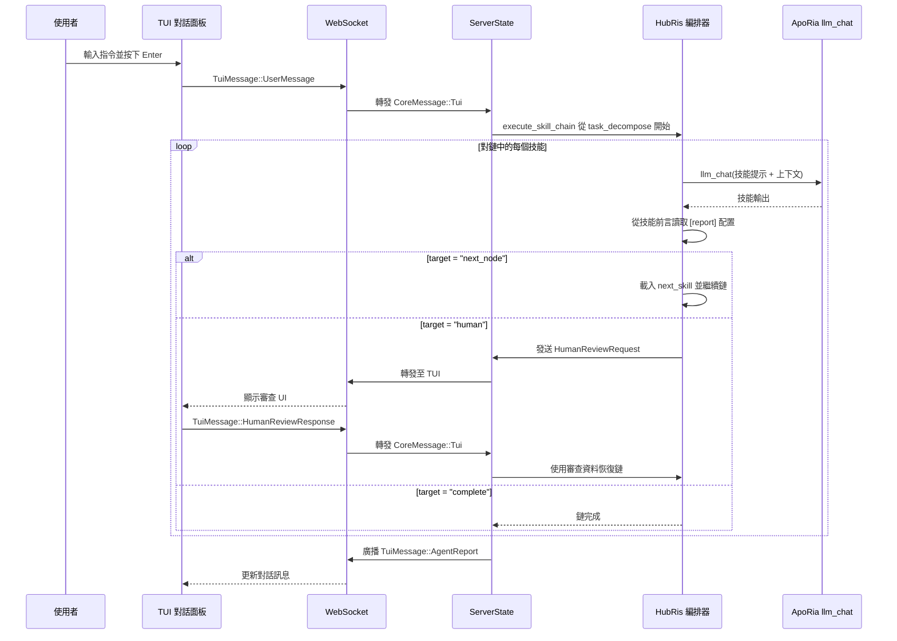

# 對話編排設計（HubRis + ApoRia）

## 背景

HubRis 是一個「純技能代理」— 所有能力都是透過 ApoRia `llm_chat`
呼叫的僅提示技能。在實作報告路由層之後，技能透過 TOML 前言的
`[report]` 區段宣告其路由行為，取代硬編碼的編排邏輯。

## 目標

1. 技能在前言中宣告路由行為（非硬編碼）。
1. 通用的技能鏈執行器取代硬編碼的兩階段管線。
1. 人類審查是第一級路由目標。
1. 提示語言清理：技能/MCP 扁平檔案僅限英文。

## 技能報告配置（TOML 前言）

```toml
[report]
target = "next_node"              # "next_node" | "parent" | "human" | "complete"
next_skill = "workplan_generate"  # 當 target = "next_node" 時為必要
```

## HubRis 技能鏈

```text
task_decompose → workplan_generate → operator → workplan_execute → submit_report → human
```

## 端到端流程



## 報告路由目標

| 目標         | 行為                                                        |
| --- | --- |
| `next_node`  | 執行器載入 `next_skill` 中命名的技能並執行它。     |
| `parent`     | 將控制權傳回父編排器（保留用於巢狀鏈）。 |
| `human`      | 暫停鏈，發送 `HumanReviewRequest` 至 TUI，收到 `HumanReviewResponse` 時恢復。 |
| `complete`   | 終止鏈並傳回累積的 `AgentReport`。  |

## 檔案結構（階段 1）

```text
res/prompts/agents/hubris/skills/
  task_decompose.md
  workplan_generate.md
  operator.md
  workplan_execute.md
  submit_report.md
```

每個檔案是一個扁平的 Markdown 文件，僅限英文，具有包含
`[report]` 區段和任何其他技能元資料的 TOML 前言。

## 人類語言配置

代理執行時期配置包含一個 `human_language` 欄位，使用原生語言
名稱（例如 `"中文"`、`"English"`、`"日本語"`）。這控制所有
面向使用者輸出的語言，而不影響僅限英文的技能提示檔案。

## 預設模型策略

啟動時使用 `glm-4.7-flash` 作為標準化環境預設模型。
ApoRia `llm_chat` 預設使用該模型，以保持開發和
測試成本低廉。

## 失敗後備策略

1. 如果技能失敗：傳回失敗訊息並結束當前鏈。
1. 如果 ApoRia 離線：傳回 `Agent not ready` 訊息。
1. 如果人類審查逾時：傳回逾時通知而不阻塞

後續聊天。
