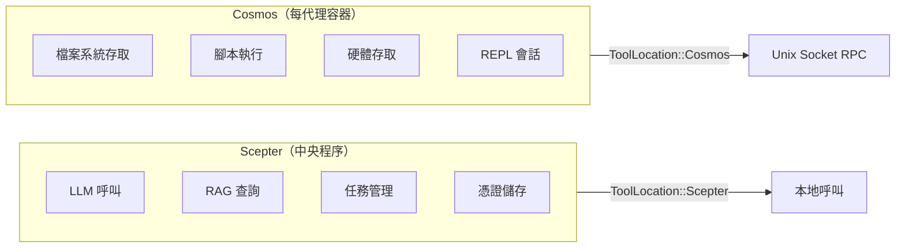
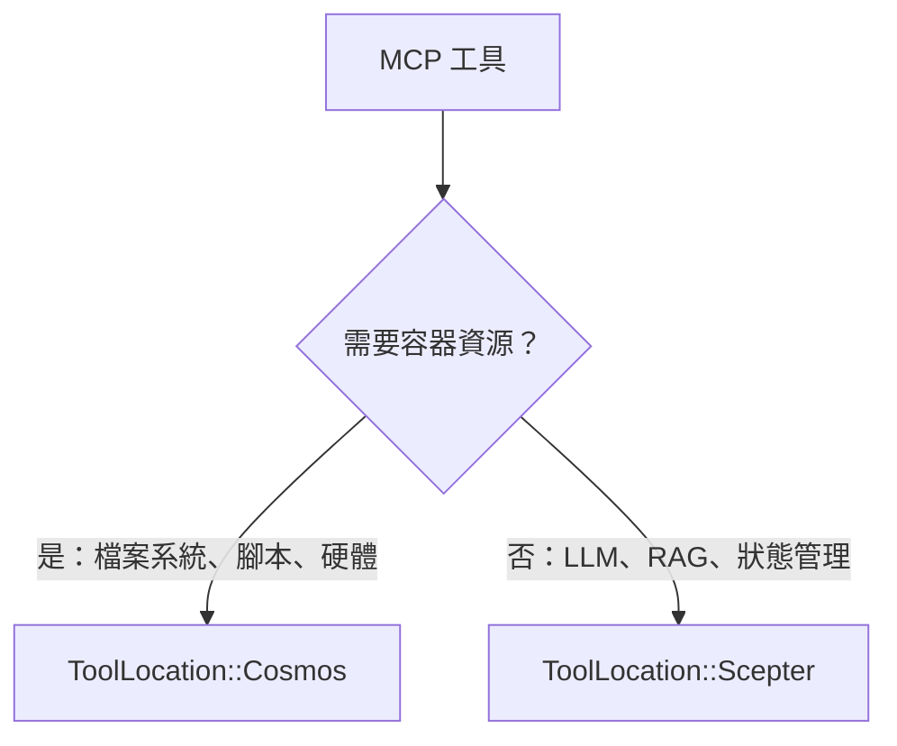
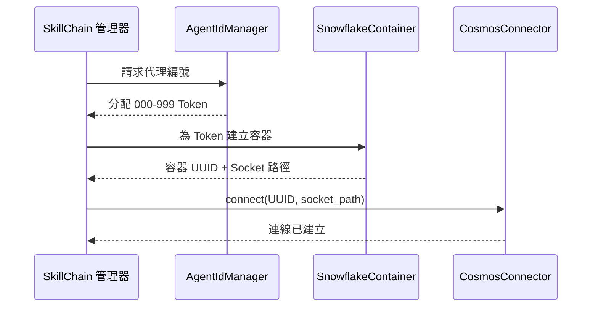
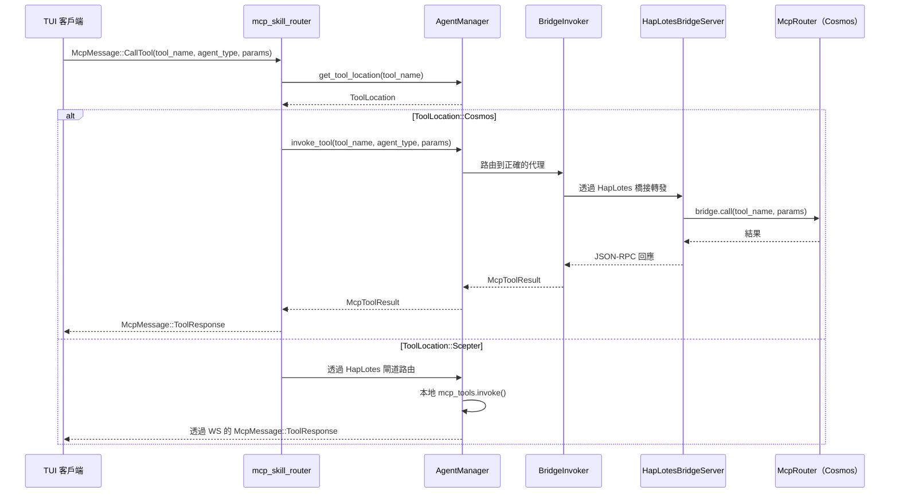
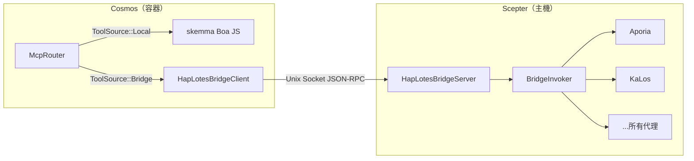
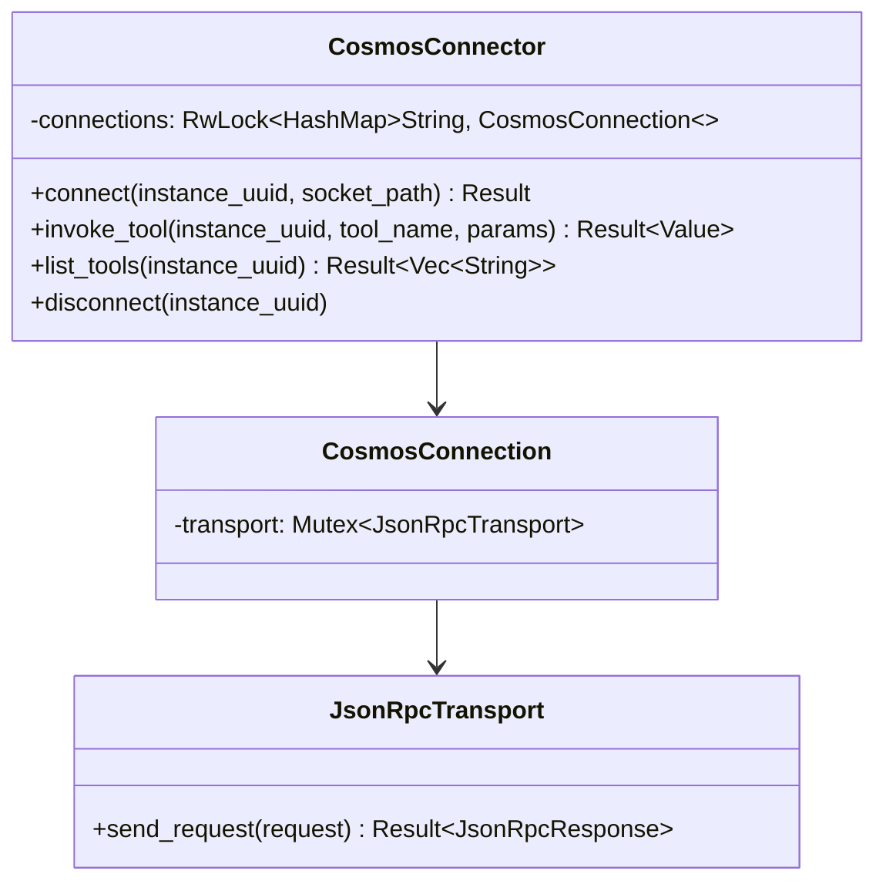
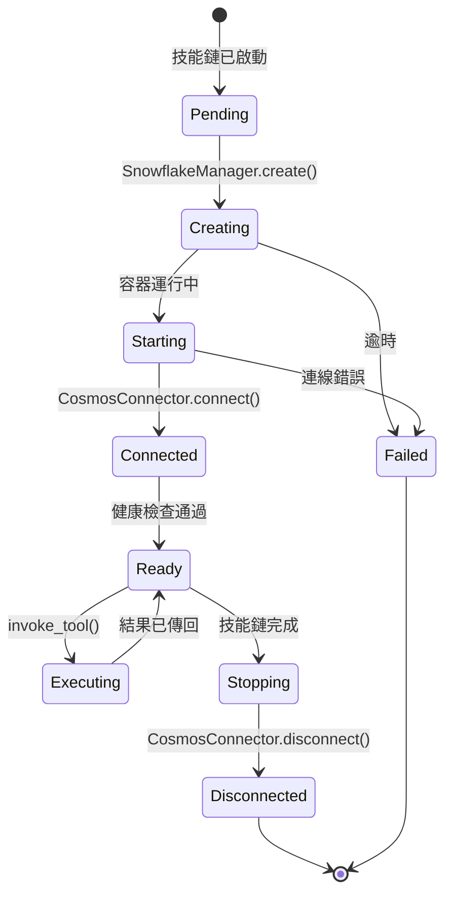
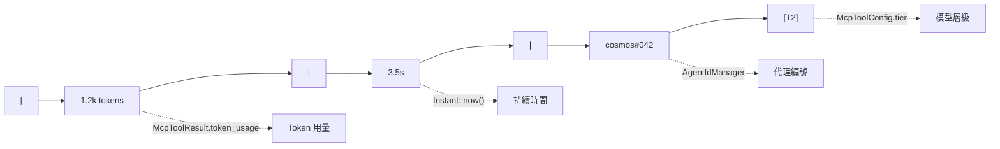
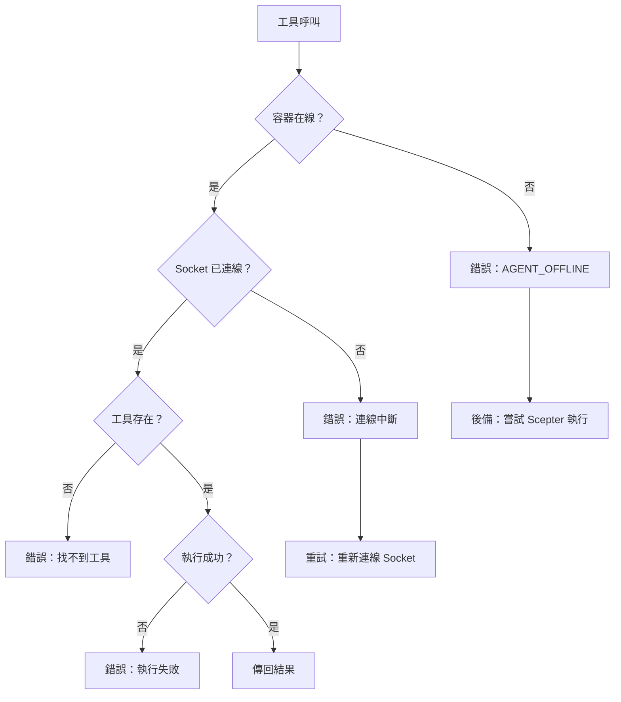

# Cosmos 容器排程與 Token 路由設計

## 概述

本文件描述 Cosmos 容器排程架構：如何將標記為 `ToolLocation::Cosmos` 的 MCP 工具透過 Unix Socket JSON-RPC 路由到對應的容器，以及 Token（代理編號）系統如何綁定容器身份和路由。

## I. 工具位置模型

### 雙重執行環境



### ToolLocation 列舉

| 變體 | 執行位置 | 傳輸 |
| --- | --- | --- |
| `Scepter`（預設） | 程序內，透過 `McpToolInvoker` | 直接函數呼叫 |
| `Cosmos` | 容器內，透過 `CosmosConnector` | Unix Socket JSON-RPC |

### 位置決策標準



需要容器資源的工具（檔案系統、腳本執行、硬體存取）標記為 `Cosmos`。集中式服務（LLM、RAG、任務管理、人類互動）保持為 `Scepter`。

## II. Token 系統與容器身份

### 代理編號分配



### Token 屬性

| 屬性 | 描述 |
| --- | --- |
| 格式 | 三位數字：`000`-`999` |
| 分配器 | 技能鏈中的 `AgentIdManager` |
| 綁定 | 每個技能鏈面板一個 Token |
| 顯示 | 在 TUI 狀態行中顯示為 `cosmos#NNN` |
| 持久性 | 跨代理重啟後仍存活 |

## III. 請求路由流程

### TUI 發起的 MCP 呼叫



### 關鍵路由邏輯

路由決策發生在 `mcp_skill_router.rs` 中：

1. 檢查 `agent_manager.get_tool_location(tool_name)`
1. 如果 `ToolLocation::Cosmos` 且容器化模式活躍：

   - 呼叫 `agent_manager.invoke_tool()`，透過 `BridgeInvoker` → HapLotes 橋接 → Cosmos 的 `McpRouter` 路由
   - Cosmos 的 `McpRouter` 本地派送（skemma）或透過橋接回到 Scepter 用於遠端代理
   - 直接向 TUI 傳回 `McpMessage::ToolResponse`

1. 否則：透過 HapLotes 閘道路由到代理程序

## IV. CosmosConnector / 橋接架構

### HapLotes 橋接（當前）

HapLotes 橋接是 Scepter 與 Cosmos 容器之間的**唯一通訊通道**。



### 連線池（CosmosConnector — Scepter 端）



### JSON-RPC 協定

所有方法名稱使用 `UnixMethod` 列舉以實現編譯期型別安全：

| UnixMethod 變體 | 方向 | 參數 |
| --- | --- | --- |
| `UnixMethod::McpCall` | Scepter → Cosmos | `{ tool_name, parameters }` |
| `UnixMethod::McpListTools` | Scepter → Cosmos | 無 |
| `UnixMethod::ReplSnapshot` | Scepter → Cosmos | `{ path }` |
| `UnixMethod::ReplRestore` | Scepter → Cosmos | `{ path }` |
| `UnixMethod::BridgeCall` | Cosmos → Scepter | `{ tool_name, parameters }` |
| `UnixMethod::BridgeListTools` | Cosmos → Scepter | 無 |

### 回應格式

```json
{
  "success": true,
  "data": { ... },
  "error": null
}
```

## V. 容器生命週期



### 容器代理

在 Cosmos 容器內部，僅 skemma 本地運行（Boa JS 引擎）。所有其他代理工具透過 HapLotes 橋接路由回 Scepter：

| 代理 | 角色 | 在 Cosmos 中？ |
| --- | --- | --- |
| SkeMma | 腳本執行（Boa JS） | **本地**（程序內） |
| Aporia | LLM 聊天 | 透過橋接 → Scepter |
| KaLos | 檔案 I/O | 透過橋接 → Scepter |
| NeiKos | 容器管理 | 透過橋接 → Scepter |
| EleOs | 網頁搜尋 | 透過橋接 → Scepter |
| 所有其他 | 各種 | 透過橋接 → Scepter |

## VI. 狀態行整合

### 顯示格式

在 TUI `AgentDetailPage` 中，狀態行顯示：



| 區段 | 來源 |
| --- | --- |
| `1.2k tokens` | `McpToolResult.token_usage` |
| `3.5s` | 從 `Instant::now()` 的持續時間 |
| `cosmos#042` | 來自 `AgentIdManager` 的代理編號 |
| `[T2]` | 來自 `McpToolConfig.tier` 的模型層級 |

## VII. 錯誤處理

### 失敗模式



### 優雅降級

當容器不可用時，系統可以選擇性地降級到 `Scepter` 本地執行，如果工具已註冊了本地實作。

## VIII. 未來擴充

| 功能 | 描述 | 優先級 |
| --- | --- | --- |
| 容器池化 | 跨技能鏈重用容器 | 中 |
| 健康監控 | 定期容器健康檢查 | 高 |
| 資源限制 | 每個容器的 CPU/記憶體限制 | 高 |
| 多容器工具 | 橫跨多個容器的工具 | 低 |
| 容器遷移 | 在主機之間移動運行中的容器 | 低 |
