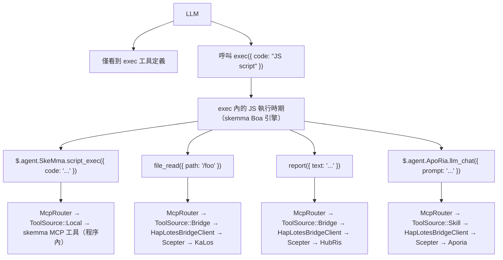
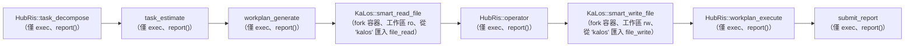
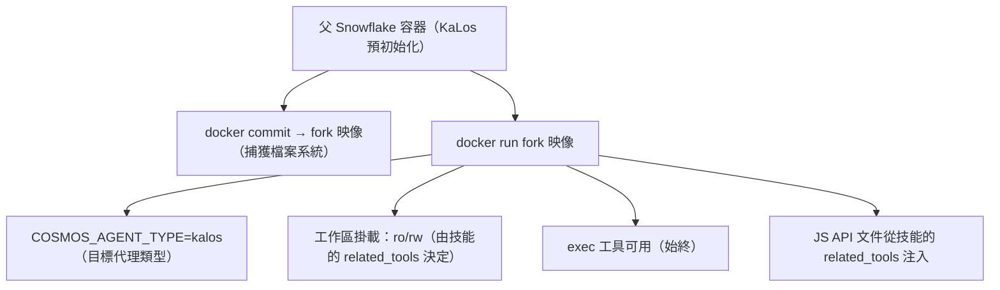

# 跨代理技能路由架構

## 問題

技能鏈（`execute_skill_chain`）使用僅執行微核心架構。LLM 僅看到三個工具：`exec`、`write_to_var`、`write_to_var_json` — 無每代理工具白名單、無每技能工具定義。所有 MCP 工具呼叫都發生在 TypeScript 執行時期（IEPL 引擎）內，透過 ES 模組匯入和跨代理 TS API，如 `file_read()`。

## 設計原則

1. **僅執行微核心** — LLM 絕不直接獲得 MCP 工具定義。它有三個工具：`exec`、`write_to_var` 和 `write_to_var_json`。所有工具呼叫都在 IEPL 引擎的 TS 執行時期內發生。
1. **`related_tools` 驅動一切** — 技能在其 TOML 前言中宣告 `related_tools`。這些名稱變成注入到 LLM 提示中的 TS API 文件（例如 `file_read()`、`report()`）。
1. **透過 TS API → McpRouter 路由** — 在 `exec` 的 IEPL 執行時期內，ES 模組匯入透過 `McpRouter` 路由到正確的 MCP 工具實作。跨代理呼叫如 `file_read()` 解析到 KaLos 代理的 `file_read` 實作。
1. **容器隔離** — 子容器透過 `docker commit` fork 繼承父容器檔案系統。工作區基於技能的 `related_tools` 以唯讀或讀寫模式掛載。
1. **`related_tools` 決定讀寫模式** — `skill_needs_write_access()` 檢查 `related_tools` 中是否有寫入工具名稱（`file_write`、`file_edit` 等）以決定 fork 容器的掛載模式。

## 架構

### 僅執行微核心流程



### 技能鏈執行流程



### 容器 Fork 機制



## 實作細節

### 核心組件

| 組件 | 檔案 | 職責 |
| --- | --- | --- |
| `skill_to_agent_name()` | `skill_chain.rs` | 查詢擁有給定技能的代理名稱 |
| `skill_needs_write_access()` | `skill_chain.rs` | 檢查 `related_tools` 中是否有寫入工具名稱以決定 fork 容器掛載模式 |
| `fork_for_sub_skill()` | `snowflake_manager.rs` | 執行 `docker commit` + `docker run`；基於 `skill_needs_write_access()` 以 ro/rw 掛載工作區 |
| `find_by_agent_type()` | `snowflake_manager.rs` | 以相反順序搜尋，傳回最近的 fork 容器 |
| `McpRouter` | `packages/cosmos/src/bin/cosmos/mcp_router.rs` | 路由 ES 模組匯入呼叫：`ToolSource::Local` → skemma、`ToolSource::Bridge` → HapLotes |
| `HapLotesBridgeClient` | `packages/agents/haplotes/src/bridge/client.rs` | Cosmos → Scepter 橋接：`bridge_call()`、`bridge_list_tools()` |
| `BridgeInvoker` | `packages/scepter/src/agent_manager/bridge_invoker.rs` | Scepter 端：將工具呼叫路由到正確的已註冊代理 |
| `build_js_api_docs()` | `skill_chain.rs` | 從技能的 `related_tools` 生成 JS API 文件以進行提示注入 |
| `build_skill_user_prompt(agent_name, ...)` | `skill_chain.rs` | 組合帶有注入的 JS API 文件的技能提示 |

### JS API 文件如何生成

技能的 TOML 前言宣告 `related_tools`：

```toml
# smart_read_file.md
related_tools = ["file_read", "file_list", "file_exists"]
```

系統將每個工具解析到其擁有的代理，並從 `.d.ts` 宣告生成 TS API 文件：

```typescript
// 注入到 LLM 提示中作為可用 API（帶有來自 .d.ts 的型別宣告）：
file_read({ path: string }): Promise<string>
file_list({ dir: string }): Promise<string[]>
file_exists({ path: string }): Promise<boolean>
report({ text: string }): Promise<void>
```

LLM 在其 `exec` 程式碼中呼叫這些 API；McpRouter 派送到正確代理的 MCP 工具實作。

### Fork 生命週期

1. **建立**：`docker commit` 父容器 → fork 映像 → `docker run` 子容器
1. **連線**：`CosmosConnector` 連線到子容器的 Unix Socket
1. **橋接**：Fork 容器內的 `HapLotesBridgeClient` 連線到 Scepter 的 `HapLotesBridgeServer`
1. **執行**：LLM 使用 JS 程式碼呼叫 `exec`；JS 執行時期使用 McpRouter → 橋接 → Scepter 代理
1. **清理**：當鏈結束時，`snowflake.remove()` 銷毀容器 + `docker rmi` 清理映像

### 工作區掛載策略

| 技能類型 | `related_tools` 特徵 | 工作區掛載 |
| --- | --- | --- |
| 唯讀（smart_read_file） | 僅 file_read、file_list、file_exists | `:ro`（唯讀） |
| 寫入（smart_write_file） | 包含 file_write、file_edit、file_delete | `:rw`（讀寫） |

### 跨代理工具路由

在 `exec` 的 JS 執行時期內，McpRouter 透過 HapLotes 橋接解析工具呼叫：

```mermaid
flowchart TB
    subgraph Bridge["橋接呼叫"]
        A1["exec({ code: &quot;file_read({path:'/foo'})&quot; })"] --> B1["McpRouter 解析 &quot;kalos&quot; + &quot;file_read&quot;"]
        B1 --> C1["tool_to_source → ToolSource::Bridge"]
        C1 --> D1["HapLotesBridgeClient → bridge.call(&quot;kalos.file_read&quot;, params)"]
        D1 --> E1["Scepter 的 HapLotesBridgeServer → BridgeInvoker"]
        E1 --> F1["路由到 KaLos 代理 → file_read MCP 工具"]
    end
    subgraph Local["本地呼叫"]
        A2["exec({ code: &quot;$.agent.SkeMma.script_exec({code:'1+1'})&quot; })"] --> B2["McpRouter 解析 &quot;skemma&quot; + &quot;script_exec&quot;"]
        B2 --> C2["tool_to_source → ToolSource::Local"]
        C2 --> D2["直接呼叫 skemma MCP 工具（程序內 Boa 引擎）"]
    end
```



### 寫入權限偵測

```rust
fn skill_needs_write_access(skill: &Skill) -> bool {
    const WRITE_TOOLS: &[&str] = &["file_write", "file_edit", "file_delete", "file_rename"];
    skill.related_tools.iter().any(|t| WRITE_TOOLS.contains(&t.as_str()))
}
```

此函數從技能的 TOML 前言讀取 `related_tools`。如果存在任何寫入工具，fork 容器的工作區將以讀寫模式掛載。

## 配置

### 技能 TOML 前言

```toml
# smart_read_file.md
+++
related_tools = ["file_read", "file_list", "file_exists"]

[[next_action]]
agent = "hubris"
name = "operator"
+++

# smart_write_file.md
+++
related_tools = ["file_write", "file_edit"]

[[next_action]]
agent = "hubris"
name = "workplan_execute"
+++
```

### next_action 鏈（技能 TOML）

```toml
# workplan_generate.md
[[next_action]]
agent = "kalos"
name = "smart_read_file"

# smart_read_file.md
[[next_action]]
agent = "hubris"
name = "operator"

# operator.md
[[next_action]]
agent = "kalos"
name = "smart_write_file"

# smart_write_file.md
[[next_action]]
agent = "hubris"
name = "workplan_execute"
```

## 技能 JS API 參考

| 技能 | 代理 | JS API（來自 `related_tools`） | 狀態 |
| --- | --- | --- | --- |
| `smart_read_file` | KaLos | `file_read()`、`file_list()`、`file_exists()` | ✅ 已實作 |
| `smart_write_file` | KaLos | `file_write()`、`file_edit()` | ✅ 已實作 |
| `exec_script` | SkeMma | `$skeMma.script_exec()` | 待實作 |
| `smart_command` | SkoPeo | `$skoPeo.smart_command_execute()` | 待實作 |

## 風險與考量

1. **容器資源** — 每個 fork 建立一個新的 Docker 容器；鏈結束時容器會自動清理。
1. **Token 成本** — 每個 fork 有其自己獨立的 LLM 上下文；JS API 文件每個技能增加適度開銷。
1. **Fork 鏈深度** — 目前無深度限制；僅當 `step_index > 1` 時 fork 才會發生。
1. **上下文傳遞** — 父 → 子透過報告內容傳遞；可能需要截斷策略。
1. **並行安全性** — 當多個鏈同時 fork 相同的代理類型時，反向順序搜尋確保每個使用其最新的 fork。
1. **API 表面控制** — LLM 只能呼叫注入文件中列出的 JS API；McpRouter 拒絕未知的工具名稱。
