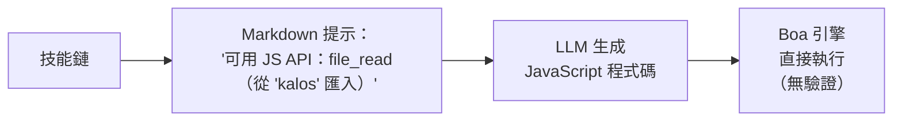
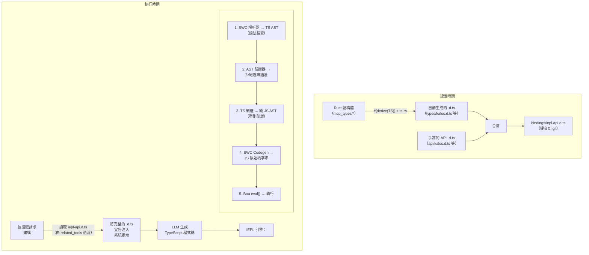
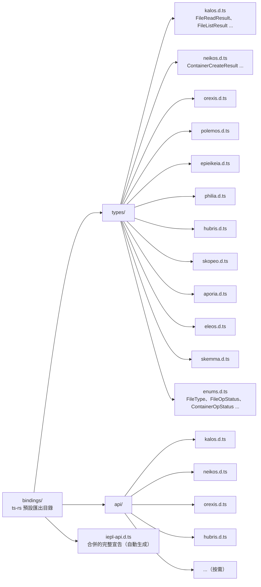
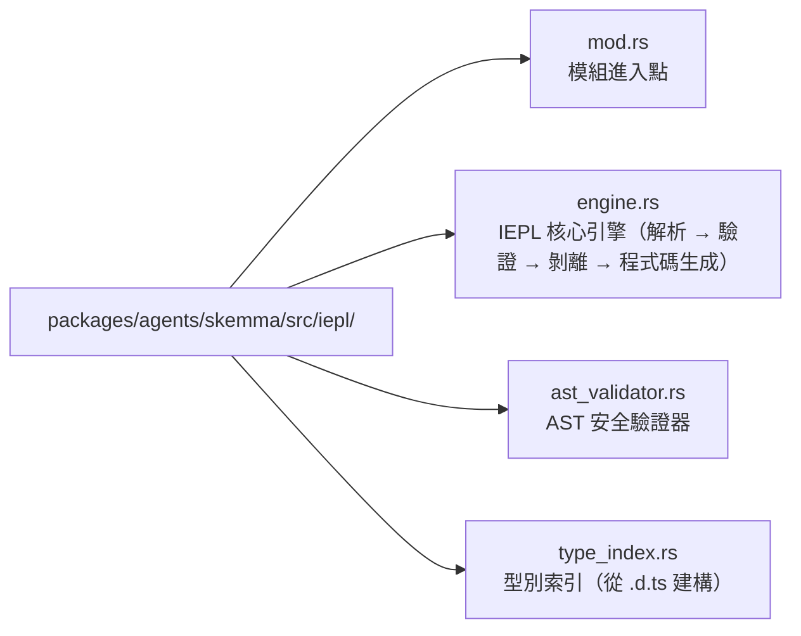

# 22 — IEPL TypeScript 執行引擎設計

## 概述

IEPL（In-Execution Prompt Language）執行引擎是對現有 Cosmos/SkeMma JS 執行時期的架構升級，將 LLM 生成的執行程式碼從 JavaScript 升級為 TypeScript。核心變更包括：

1. **內建 SWC crate**：嚴格的語法檢查、型別剝離和 LLM 生成 TypeScript 的轉譯
1. **Rust derive → TypeScript 型別生成**：透過 `ts-rs` 自動匯出 Rust 結構體到 `.d.ts` 宣告檔案
1. **型別安全的技能提示**：注入完整的 `.d.ts` 宣告而非硬編碼的函數列表，顯著提升穩健性

## 當前狀態與問題

### 當前執行流程



### 現有問題

| 問題 | 描述 |
| --- | --- |
| **無型別約束** | LLM 生成的 JS 程式碼沒有任何靜態型別資訊；參數拼字錯誤僅在執行時期被捕獲 |
| **脆弱的介面描述** | `build_report_tool_instruction()` 硬編碼文字列表，如 `- file_read（從 'kalos' 匯入）`，無法表達參數型別或傳回值結構 |
| **無預驗證** | LLM 程式碼直接進入 Boa `eval()`；語法錯誤僅在執行時發現 |
| **模式與提示解耦** | `McpSchemaWriter` 生成 JSON 模式檔案，但從未用於提示注入 |
| **工具參數無型別** | 當前工具參數作為 `serde_json::Value` 傳遞，透過 `get("field")` 手動提取，無型別安全保證 |

### 涉及的關鍵檔案

| 檔案 | 當前職責 |
| --- | --- |
| `packages/agents/skemma/src/js_runtime/runtime.rs` | Boa JS 執行時期，`exec()` 直接呼叫 `eval()` |
| `packages/agents/skemma/src/mcp/tools/script_exec.rs` | 僅接受 `"javascript"` 語言 |
| `packages/cosmos/src/bin/cosmos/js_repl/js_commands.rs` | 動態生成 `globalThis.$agent.tool = (...) => ...` |
| `packages/scepter/src/state_machine/skill_chain/prompt.rs:51` | `build_report_tool_instruction()` 硬編碼 API 列表 |
| `packages/shared/src/mcp_types/*.rs` | 所有 MCP 工具結果型別定義（僅 serde，無 TS 匯出） |
| `packages/shared/src/mcp_types/schema.rs` | `McpSchemaWriter` 生成 JSON 模式（未被提示使用） |

## 目標架構



## 技術選擇

### 1. Rust → TypeScript 型別生成：`ts-rs`

| 屬性 | 值 |
| --- | --- |
| Crate | `ts-rs`（Aleph-Alpha/ts-rs） |
| 版本 | ≥ 12.0 |
| 星數 | 1,772 |
| 下載數 | ~7.3M |
| 授權 | MIT |

**理由：**

- 與專案現有 `serde` 生態系統深度相容（`serde-compat` 功能自動識別 `rename`/`rename_all`/`skip` 等）
- `#[derive(TS)]` 非侵入式，不變更現有的結構體定義
- 支援 `#[ts(export)]` 在 `cargo test` 期間自動匯出到 `bindings/` 目錄
- 生成標準的 TypeScript `type` 別名，可直接用於 `.d.ts`
- 支援跨檔案匯入、泛型、聯合型別
- 豐富的生態系統整合：`chrono-impl`、`uuid-impl`、`serde-json-impl`

**排除的替代方案：**

| Crate | 排除原因 |
| --- | --- |
| `specta` | 偏向 Tauri/rspc 生態系統；此情境中不需要函數型別匯出 |
| `typeshare` | CLI 驅動，不便於 CI 整合；生成 `interface` 而非 `type`（對 LLM 提示無實際差異） |
| `tsify` | 綁定 `wasm-bindgen`；本專案非 WASM 工作流程 |

### 2. TypeScript 解析與轉譯：SWC

| Crate | 目的 |
| --- | --- |
| `swc_core`（功能：`ecma_parser`） | 將 TS 原始碼解析為 AST |
| `swc_core`（功能：`ecma_ast`） | AST 節點型別 |
| `swc_core`（功能：`ecma_visit`） | AST 遍歷/轉換 |
| `swc_core`（功能：`ecma_transforms_typescript`） | TS → JS 型別剝離 |
| `swc_core`（功能：`ecma_codegen`） | AST → 原始碼生成 |

**關鍵能力：**

- 完整的 TypeScript 語法支援（泛型、條件型別、映射型別、裝飾器等）
- 高效能的 Rust 原生實作（比 tsc 快 20-70 倍）
- 型別剝離（`strip`）將 TS AST 轉換為 JS AST
- 語法層級錯誤報告（未閉合的括號、無效 Token 等）

**限制：**

- SWC **不執行完整的型別檢查**（無 `tsc --noEmit` 等效功能）。這意味著它無法捕獲語意錯誤，如「呼叫不存在的屬性」
- 對於此情境這是可接受的：LLM 生成的程式碼主要需要語法正確性保證；Boa 引擎提供執行時期動態型別安全
- 如果未來需要完整的型別檢查，可以引入 AST 層級的自訂驗證（參見下方的「AST 驗證器」）

## 詳細設計

### 階段 1：ts-rs 型別匯出基礎設施

#### 1.1 新的工作區依賴

```toml
# Cargo.toml（工作區）
[workspace.dependencies]
ts-rs = { version = "12", features = ["serde-compat", "format"] }
```

#### 1.2 為 MCP 型別添加 `#[derive(TS)]`

`packages/shared/src/mcp_types/` 下的所有結構體獲得 `ts-rs` derive：

```rust
// packages/shared/src/mcp_types/kalos.rs
use ts_rs::TS;

# [derive(Debug, Clone, Serialize, Deserialize, TS)]
# [ts(export)]
pub struct FileReadResult {
    pub path: String,
    pub size_bytes: u64,
    pub content: String,
}

# [derive(Debug, Clone, Serialize, Deserialize, TS)]
# [ts(export)]
pub struct FileListResult {
    pub path: String,
    pub total_count: usize,
    pub entries: Vec<FileEntry>,
}

// ... 其他型別類似處理
```

列舉需要 `str_enum!` 巨集適應：

```rust
// packages/shared/src/mcp_types/enums.rs
// 現有的 str_enum! 巨集生成的列舉需要額外的 TS derive

# [derive(Debug, Clone, Copy, PartialEq, Eq, Serialize, Deserialize, TS)]
pub enum FileType {
    File,
    Directory,
}
// 注意：str_enum! 巨集需要擴充以同時 derive TS
// 或單獨為現有巨集生成的列舉添加 #[derive(TS)]
```

#### 1.3 `.d.ts` 檔案佈局



#### 1.4 手寫 API `.d.ts` 範例

```typescript
// bindings/api/kalos.d.ts

import type {
  FileReadResult,
  FileListResult,
  FileWriteResult,
  FileEditResult,
  FileDeleteResult,
  FileExistsResult,
  MkDirResult,
  FileInfoResult,
} from "../types/kalos";

export interface KalosApi {
  /**
   * 讀取檔案內容
   * @param params.path - 檔案路徑（絕對路徑）
   */
  file_read(params: { path: string }): Promise<FileReadResult>;

  /**
   * 寫入檔案
   * @param params.path - 檔案路徑
   * @param params.content - 檔案內容
   */
  file_write(params: { path: string; content: string }): Promise<FileWriteResult>;

  /**
   * 編輯檔案（尋找和取代）
   * @param params.path - 檔案路徑
   * @param params.old_string - 要取代的原始字串
   * @param params.new_string - 取代後的字串
   */
  file_edit(params: {
    path: string;
    old_string: string;
    new_string: string;
  }): Promise<FileEditResult>;

  file_delete(params: { path: string }): Promise<FileDeleteResult>;
  file_exists(params: { path: string }): Promise<FileExistsResult>;
  file_list(params: { path: string }): Promise<FileListResult>;
  file_get_info(params: { path: string }): Promise<FileInfoResult>;
  file_create_dir(params: { path: string }): Promise<MkDirResult>;
}
```

#### 1.5 建置時期合併腳本

在 `packages/shared/build.rs` 或獨立的 `xtask` 中：

```rust
// xtask/src/bin/iepl_codegen.rs
// 1. 執行 cargo test 以觸發 ts-rs 匯出
// 2. 讀取 bindings/types/*.d.ts + bindings/api/*.d.ts
// 3. 按代理分組和合併，生成最終的 iepl-api.d.ts
// 4. 輸出到 bindings/iepl-api.d.ts
```

或更簡單地，在 `packages/shared/src/mcp_types/` 中新增一個 `iepl_codegen` 模組，在測試期間觸發匯出和合併。

**關鍵原則：一旦生成，`.d.ts` 檔案即提交到 git 並成為原始碼樹的永久部分。** 後續的 Rust 型別變更會重新生成並提交更新。

### 階段 2：IEPL 執行引擎

#### 2.1 新的 SWC 依賴

```toml
# Cargo.toml（工作區）
[workspace.dependencies]
swc_core = { version = "65", features = [
    "ecma_parser",
    "ecma_ast",
    "ecma_visit",
    "ecma_transforms_base",
    "ecma_transforms_typescript",
    "ecma_codegen",
    "common",
] }
```

#### 2.2 IEPL 引擎核心

在 `packages/agents/skemma/src/` 下新增 `iepl/` 模組：



##### engine.rs — 核心轉譯流程

```rust
use anyhow::{anyhow, Result};
use swc_core::{
    common::{errors::ColorConfig, SourceFile, SourceMap, GLOBALS},
    ecma::{
        ast::Program,
        codegen::{text_writer::JsWriter, Emitter},
        parser::{lexer::Lexer, Parser, StringInput, Syntax, TsSyntax},
        transforms::{
            base::fixer::fixer,
            typescript::strip,
        },
        visit::FoldWith,
    },
};

pub struct IeplEngine {
    cm: Arc<SourceMap>,
}

pub struct TranspileResult {
    pub js_code: String,
    pub parse_errors: Vec<String>,
}

impl IeplEngine {
    pub fn new() -> Self {
        Self {
            cm: Arc::new(SourceMap::default()),
        }
    }

    /// 將 TypeScript 程式碼轉譯為 JavaScript
    pub fn transpile(&self, ts_code: &str) -> Result<TranspileResult> {
        let fm = self.cm.new_source_file(
            swc_core::common::FileName::Custom("iepl-input".into()),
            ts_code.into(),
        );

        // 1. 解析 TS → AST
        let mut parse_errors = Vec::new();
        let module = self.parse_ts(&fm, &mut parse_errors)?;

        if !parse_errors.is_empty() {
            return Err(anyhow!("TypeScript 解析錯誤：\n{}", parse_errors.join("\n")));
        }

        // 2. AST 安全驗證
        let validator = AstValidator::new();
        validator.validate(&module)?;

        // 3. 型別剝離 TS → JS
        let mut transforms = swc_core::common::pass::Optional::new(
            strip::strip_typescript(swc_core::common::comments::NoComments),
            true,
        );
        let program = module.fold_with(&mut transforms);

        // 4. AST → JS 原始碼
        let js_code = self.emit(program)?;

        Ok(TranspileResult {
            js_code,
            parse_errors,
        })
    }

    fn parse_ts(
        &self,
        fm: &SourceFile,
        errors: &mut Vec<String>,
    ) -> Result<Program> {
        let lexer = Lexer::new(
            Syntax::Typescript(TsSyntax {
                tsx: false,
                decorators: true,
                dts: false,
                no_early_errors: false,
                disallowAmbiguousJSXLike: true,
            }),
            Default::default(),
            StringInput::from(fm),
            None,
        );
        let mut parser = Parser::new_from(lexer);
        match parser.parse_program() {
            Ok(program) => Ok(program),
            Err(e) => {
                errors.push(format!("{:?}", e));
                Err(anyhow!("無法解析 TypeScript"))
            }
        }
    }

    fn emit(&self, program: Program) -> Result<String> {
        let mut buf = Vec::new();
        let writer = JsWriter::new(self.cm.clone(), "\n", &mut buf, None);
        let mut emitter = Emitter {
            cfg: Default::default(),
            cm: self.cm.clone(),
            comments: None,
            wr: writer,
        };
        emitter.emit_program(&program)?;
        Ok(String::from_utf8(buf)?)
    }
}
```

##### ast_validator.rs — 安全驗證器

```rust
use anyhow::{anyhow, Result};
use swc_core::ecma::ast::{Module, Program};
use swc_core::ecma::visit::{Visit, VisitWith};

/// 驗證 AST 不包含危險模式
pub struct AstValidator {
    violations: Vec<String>,
}

impl AstValidator {
    pub fn new() -> Self {
        Self {
            violations: Vec::new(),
        }
    }

    pub fn validate(&self, program: &Program) -> Result<()> {
        // 實作危險模式偵測
        // - 禁止 eval() / Function() 呼叫
        // - 禁止動態 import()
        // - 禁止存取 __proto__ / constructor
        // - 禁止 with 陳述式
        // - 可選：禁止存取不在允許列表上的全域變數
        if self.violations.is_empty() {
            Ok(())
        } else {
            Err(anyhow!("AST 驗證違規：\n{}", self.violations.join("\n")))
        }
    }
}
```

#### 2.3 整合到 script_exec

修改 `packages/agents/skemma/src/mcp/tools/script_exec.rs`：

```rust
// 之前（第 53 行）：
if !matches!(language.as_str(), "javascript" | "js" | "node") {
    return McpToolResult::failure(format!(
        "不支援的語言：'{}'。僅支援 JavaScript。", language
    ));
}

// 之後：
let executable_code = match language.as_str() {
    "typescript" | "ts" => {
        let engine = crate::iepl::IeplEngine::new();
        match engine.transpile(code) {
            Ok(result) => result.js_code,
            Err(e) => return McpToolResult::failure(format!("TS 轉譯錯誤：{}", e)),
        }
    }
    "javascript" | "js" | "node" => code.to_string(),
    _ => {
        return McpToolResult::failure(format!(
            "不支援的語言：'{}'。僅支援 TypeScript 和 JavaScript。",
            language
        ));
    }
};
```

#### 2.4 整合到 Cosmos JS REPL

修改 `packages/cosmos/src/bin/cosmos/js_repl/mod.rs` 中的執行路徑，在呼叫 `runtime.exec()` 之前添加 IEPL 轉譯步驟。

### 階段 3：技能提示型別注入

#### 3.1 當前提示建構

`prompt.rs:51` 的 `build_report_tool_instruction()`：

```rust
// 當前：硬編碼 API 列表
let items: Vec<String> = available_apis
    .iter()
    .map(|a| format!("- ${}", a))
    .collect();
parts.push(format!("\n可用 JS API：\n{}", items.join("\n")));
```

這會生成：

```text
可用 JS API：
- file_read（從 'kalos' 匯入）
- file_write（從 'kalos' 匯入）
- report()
```

#### 3.2 新的提示建構

```rust
pub(super) fn build_report_tool_instruction(
    next_targets: &[String],
    related_tools: &[RelatedTool],  // 變更為接受完整的 RelatedTool 資訊
) -> String {
    let mut parts = Vec::new();

    // 從 bindings/ 載入按代理分組的 .d.ts
    let type_declarations = load_iepl_type_declarations(related_tools);
    if !type_declarations.is_empty() {
        parts.push(format!(
            "你正在編寫 TypeScript 程式碼。可用的 API 型別宣告：\n\n\
             ```typescript\n{}\n```",
            type_declarations
        ));
    }

    // ... next_targets 和 mcp_conv 保持不變
}
```

注入到提示中的範例內容：

```typescript
你正在編寫 TypeScript 程式碼。可用的 API 型別宣告：

```

// === 型別（從 Rust 自動生成） ===
type `FileReadResult` = { path: string; `size_bytes`: number; content: string };
type `FileListResult` = { path: string; `total_count`: number; entries: Array<{ name: string; `file_type`: "file" | "directory" }> };
type `FileWriteResult` = { path: string; `size_bytes`: number; status: "created" | "deleted" | "edited" | "written" };

// === API（手寫） ===
interface KalosApi {
`file_read`(params: { path: string }): Promise<`FileReadResult`>;
`file_write`(params: { path: string; content: string }): Promise<`FileWriteResult`>;
`file_list`(params: { path: string }): Promise<`FileListResult`>;
// ...
}

declare const $kalos: KalosApi;

```text

#### 3.3 .d.ts 載入器

```

// packages/shared/src/iepl/decl_loader.rs

use `include_dir`::{Dir, `include_dir`};

static IEPL_BINDINGS: Dir = `include_dir`!("$CARGO_MANIFEST_DIR/../../../bindings");

pub struct `IeplDeclLoader`;

impl `IeplDeclLoader` {
/// 載入按 `related_tools` 過濾的所需 .d.ts 宣告
pub fn `load_for_tools`(`related_tools`: &[`RelatedTool`]) -> String {
let mut declarations = Vec::new();

// 收集涉及的代理集合
let agents: std::collections::HashSet<&str> = `related_tools`
.iter()
.map(|t| t.agent_name.as_str())
.collect();

for agent in &agents {
// 載入自動生成的型別宣告
if let Some(`types_file`) = IEPL_BINDINGS.get_file(format!("types/{}.d.ts", agent)) {
if let Ok(content) = std::str::`from_utf8`(types_file.contents()) {
declarations.push(content.to_string());
}
}

// 載入手寫的 API 宣告
if let Some(`api_file`) = IEPL_BINDINGS.get_file(format!("api/{}.d.ts", agent)) {
if let Ok(content) = std::str::`from_utf8`(api_file.contents()) {
declarations.push(content.to_string());
}
}
}

declarations.join("\n\n")
}
}

```text

#### 3.4 JS 命名空間建構器升級

`js_commands.rs` 的 `build_tool_namespace_js()` 保持生成 JavaScript 函數包裝器不變（Boa 引擎僅執行 JS），但提示端的介面描述由 `.d.ts` 而非硬編碼提供。

## 資料流比較

### 當前（JavaScript）

```

flowchart TD
Meta["技能元資料\`nrelated_tools`：\n- kalos.file_read\n- kalos.file_write"]
Meta --> Build["`build_report_tool_instruction`\n→ '- `file_read`（匯入）'\n→ '- `file_write`（匯入）'\n（硬編碼文字）"]
Build -->|"注入到\n系統提示"| LLM1["LLM 生成 JavaScript\`nfile_read`({path:'x'})\n（無型別檢查）"]
LLM1 --> Boa1["Boa eval() 直接執行\n（無預驗證）"]

```text

### 目標（TypeScript + IEPL）

```

flowchart TD
Meta2["技能元資料\`nrelated_tools`：\n- kalos.file_read\n- kalos.file_write"]
Meta2 --> Loader["`IeplDeclLoader`\n→ types/kalos.d.ts\n→ api/kalos.d.ts\n（完整型別宣告）"]
Loader -->|"注入到\n系統提示"| LLM2["LLM 生成 TypeScript\nconst r: `FileReadResult` =\n  await `file_read`(\n    {path: 'x'}\n  );\n（型別約束）"]
LLM2 --> IEPL["IEPL 引擎\n1. SWC 解析 → AST（語法檢查）\n2. AST 驗證器（安全檢查）\n3. 剝離型別 → JS（型別剝離）\n4. 程式碼生成 → JS 字串"]
IEPL --> Boa2["Boa eval() 執行"]

```text

## 穩健性改進分析

### 比較：當前 vs IEPL

| 維度 | 當前（JS + 硬編碼列表） | IEPL（TS + .d.ts） |
|-----------|------------------------------|-------------------|
| **LLM 對介面的理解** | 看到 `- file_read（從 'kalos' 匯入）` | 看到完整的 `file_read(params: {path: string}): Promise<FileReadResult>` |
| **參數錯誤** | LLM 猜測參數名稱 | LLM 知道確切的參數型別 |
| **傳回值使用** | 不知道傳回哪些欄位 | 知道 `FileReadResult` 的完整結構 |
| **語法錯誤** | 僅在執行時期發現 | 在轉譯前由 SWC 拒絕 |
| **介面變更** | 需要手動更新硬編碼文字 | 修改 Rust 結構體 → 重新生成 .d.ts → 自動反映在提示中 |
| **新工具入門** | 修改 prompt.rs 邏輯 | 添加 ts-rs derive + 手寫 api .d.ts |
| **型別匯出維護** | 無 | .d.ts 在 git 中具有可追蹤的 diff |

### LLM 提示品質改進

LLM 看到的當前提示片段：

```

可用 JS API：

- `file_read`（從 'kalos' 匯入）
- `file_write`（從 'kalos' 匯入）
- report()

```text

在 IEPL 下 LLM 看到的提示片段：

```

declare const $kalos: {
`file_read`(params: { path: string }): Promise<{ path: string; `size_bytes`: number; content: string }>;
`file_write`(params: { path: string; content: string }): Promise<{ path: string; `size_bytes`: number; status: "created" | "deleted" | "edited" | "written" }>;
`file_list`(params: { path: string }): Promise<{ path: string; `total_count`: number; entries: Array<{ name: string; `file_type`: "file" | "directory" }> }>;
};
// hubris 工具可透過 ES 模組匯入使用：import { report } from 'hubris'
report(params: { summary: string }): Promise<{ summary: string }>;
};

```text

後者提供：
- 精確的參數名稱和型別
- 完整的傳回值結構
- 聯合型別字面值（例如 `"file" | "directory"`）
- TypeScript 原生的 `Promise<>` 表達非同步語義

## 新工作區依賴摘要

```

# 新增

ts-rs = { version = "12", features = ["serde-compat", "format"] }
`swc_core` = { version = "65", features = [
"`ecma_parser`",
"`ecma_ast`",
"`ecma_visit`",
"`ecma_transforms_base`",
"`ecma_transforms_typescript`",
"`ecma_codegen`",
"common",
] }

```text

## 新 Crate 結構

```

flowchart LR
SkemmaIepl["packages/agents/skemma/src/iepl/"] --> SM1["mod.rs\npub mod engine; pub mod `ast_validator`;"]
SkemmaIepl --> SM2["engine.rs\`nIeplEngine`：transpile(`ts_code`) -> Result&lt;`TranspileResult`&gt;"]
SkemmaIepl --> SM3["ast_validator.rs\`nAstValidator`：安全模式偵測"]
SharedIepl["packages/shared/src/iepl/"] --> SH1["mod.rs\npub mod `decl_loader`;"]
SharedIepl --> SH2["decl_loader.rs\`nIeplDeclLoader`：載入按 `related_tools` 過濾的 .d.ts"]
Bindings["bindings/\n生成的產物，在 git 中追蹤"] --> BTypes["types/\nts-rs 自動匯出"]
Bindings --> BApi["api/\n手寫和維護"]
Bindings --> BIepl["iepl-api.d.ts\n合併產物（可選）"]
BTypes --> BT1["kalos.d.ts"]
BTypes --> BT2["neikos.d.ts"]
BTypes --> BT3["..."]
BApi --> BA1["kalos.d.ts"]
BApi --> BA2["neikos.d.ts"]
BApi --> BA3["..."]

```text

## 實作路徑

### 階段 1：ts-rs 基礎設施（~2–3 天）

1. 添加 `ts-rs` 工作區依賴
2. 為所有 `mcp_types/*.rs` 結構體添加 `#[derive(TS)]`
3. 擴充 `str_enum!` 巨集以與 `ts-rs` derive 相容
4. 執行 `cargo test` 生成 `bindings/types/*.d.ts`
5. 手寫 `bindings/api/*.d.ts`（每個代理一個檔案）
6. 撰寫合併腳本以生成 `bindings/iepl-api.d.ts`
7. 提交所有 `.d.ts` 到 git

### 階段 2：IEPL 執行引擎（~3–5 天）

1. 添加 `swc_core` 工作區依賴
2. 實作 `iepl/engine.rs`：解析 → 剝離 → 程式碼生成
3. 實作 `iepl/ast_validator.rs`：危險模式偵測
4. 修改 `script_exec.rs` 以支援 TypeScript 語言
5. 整合到 Cosmos JS REPL 執行路徑
6. 端到端測試：TS 程式碼 → SWC → JS → Boa

### 階段 3：提示型別注入（~2–3 天）

1. 實作 `IeplDeclLoader`
2. 修改 `build_report_tool_instruction()` 以使用 .d.ts
3. 更新 `execution_steps.rs` 中的系統提示建構邏輯
4. 驗證 LLM 生成的 TS 程式碼品質改進

### 階段 4：清理與最佳化（~1–2 天）

1. 移除或棄用 `McpSchemaWriter`（被 .d.ts 系統取代）
2. 添加 CI 步驟：在 `cargo test` 之後，檢查 `bindings/` 中的未提交變更
3. 文件更新

## 風險與緩解

| 風險 | 緩解措施 |
|------|-----------|
| SWC 編譯時間增加 | `swc_core` 按需功能，最小化匯入 |
| `str_enum!` 巨集與 `ts-rs` 衝突 | 巨集擴充或為列舉單獨實作 `TS` trait |
| `.d.ts` 過大，超過提示 Token 限制 | 透過 `related_tools` 精確過濾，僅注入當前技能所需的型別 |
| Boa 不支援 `async/await` | SWC 可配置降級為回呼風格（或等待 Boa 未來版本支援） |
| ts-rs 版本與 serde 版本不相容 | 鎖定工作區版本，CI 驗證 |

## 擴充可能性

1. **AST 層級型別檢查**：在 SWC AST 上實作輕量型別檢查（驗證 ES 模組匯入呼叫使用宣告的參數）
2. **.d.ts 版本管理**：在 `.d.ts` 檔案標頭添加版本號碼，在 LLM 提示中包含版本資訊
3. **增量更新**：當 Rust 型別變更時，CI 自動偵測 `bindings/` diff 並提醒更新
4. **多語言執行**：IEPL 框架可擴充以支援其他語言（Python 透過 RustPython 等）
5. **執行時期型別驗證**：在 Boa exec 前/後添加 serde 驗證，確保 LLM 使用的參數和傳回值符合型別定義
