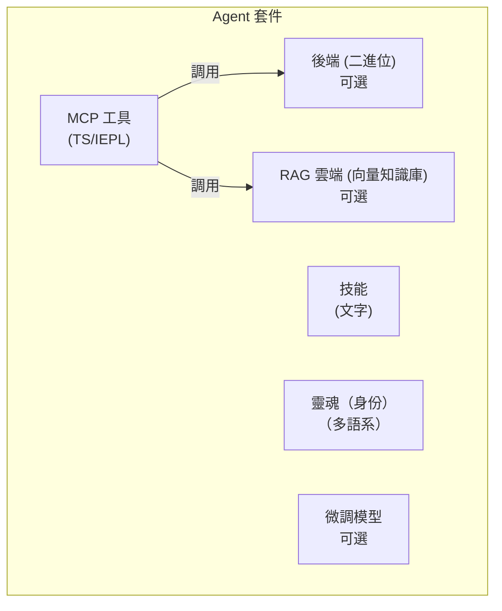

# 第 2/3 層 Agent 套件規範

> **狀態**：草案 v1 — 2026-06-26
> **範圍**：定義第 2 層與第 3 層 Agent 的自包含套件格式。

## 概述

第 2/3 層 Agent 是一個由最多五個元件組成的**自包含套件**。套件是發佈的單位——可獨立安裝、更新與移除。



## 五個元件

### 1. MCP 工具（IEPL TypeScript）

主要的工具介面。以 TypeScript 原始碼撰寫，在 IEPL 沙箱（Boa JS 執行時）中執行。每個工具檔案匯出一個函式：

```typescript
// mcp/memory_store.ts
import type { McpResult } from '@entecheia/sdk';

export async function memory_store(params: {
  text: string;
  node_type: string;
  entity_type?: string;
  properties?: Record<string, string>;
}): Promise<McpResult> {
  // 工具邏輯——可調用後端原語、組合其他工具、
  // 或向雲端服務發送 HTTP 請求。
  const result = await backend.memory_store(params);
  return { ok: true, data: result };
}
```

工具可以是：

- **純 TS**：純邏輯，組合其他工具或轉換資料
- **後端支援**：調用 MCP 後端提供的原語
- **雲端支援**：調用遠端 API（RAG、模型、外部服務）

TypeScript 原始碼是純文字——可進行版本控制、審查與發佈，無需編譯。自助式打包設施可選擇性地將多個 `.ts` 檔案打包成單一 `bundle.js` 以提升載入效率。

### 2. MCP 後端（可選二進位）

某些工具需要超越 IEPL 沙箱的能力（檔案 I/O、硬體存取、資料庫連接）。這些由**二進位後端**提供——一個與 scepter 程序並行執行的 Rust 二進位檔。

- 後端編譯進 Docker 映像，存放在 scepter 的「口袋」（`/workspace-base/target/` 目錄）中。
- 執行時，scepter 透過 `backend` 模組導入，動態將二進位路徑傳遞給 IEPL 環境。
- 後端暴露原始操作；所有組合與編排都在 TS 層進行。

後端介面範例（從 Rust 自動生成）：

```typescript
// 從 Rust 後端自動生成
declare module 'backend' {
  export function memory_store_raw(params: {...}): Promise<McpResult>;
  export function memory_query_raw(query: string): Promise<McpResult>;
}
```

### 3. 技能（純文字）

技能提示是帶有 TOML 前置資訊的 markdown 檔案。它們定義 Agent **如何**執行任務——系統提示、工具白名單、執行模式與管線結構。

```markdown
+++
name = "memory_consolidate"
agent = "philia"
related_tools = ["memory_consolidate", "memory_query"]
location = "scepter"
execution_mode = "read"

[features]
tier = "worker"
+++

# memory_consolidate

將記憶節點整合為可供結構化回想的片段...
```

技能與語言無關（`#` 內容為提示模板）。它們是純文字——無需編譯，無二進位。

### 4. RAG 資料庫（可選，雲端託管）

一個向量知識庫，為 Agent 提供特定領域的知識。託管於 Entelecheia 的雲端基礎設施。

- 可選：Agent 可在沒有 RAG 的情況下運作（能力降低）。
- 查詢受限：當配額耗盡時，查詢回傳空結果——Agent 優雅降級。
- 在 manifest 中以 URL + API 金鑰引用，不打包在套件中。

### 5. 微調模型（可選，雲端託管）

一個針對 Agent 特定領域微調的模型。同樣為雲端託管。

- 可選：Agent 預設使用平台通用模型（如 GLM-5）。
- 未來可能開放權重以支援自託管。
- 在 manifest 中以模型 ID 引用。

## 套件目錄結構

```text
packages/agents/{agent_name}/
├── manifest.toml           # 套件元資料與配置
├── mcp/
│   ├── *.ts                # TypeScript 工具實作（IEPL）
│   └── *.md                # 工具文件（參數、回傳值）
├── backend/                # 可選 Rust 後端
│   ├── Cargo.toml
│   └── src/
│       └── lib.rs
├── skills/
│   └── *.md                # 技能提示
├── soul/
│   └── {lang}.md           # 各語系的 Agent 人格
├── rag.toml                # 可選：RAG 資料庫引用
└── model.toml              # 可選：微調模型引用
```

## manifest.toml 格式

```toml
[package]
name = "philia"              # 必須與目錄名稱一致
version = "0.2.0"
description = "認知記憶系統——儲存、查詢、整合"
layer = 2                    # 2 = 平台 Agent，3 = 擴充
category = "complex_tool"    # simple_tool | complex_tool | coordinator

[dependencies]
# 此 Agent 調用其工具的其他 Agent 套件
aporia = "0.2.0"

[backend]
# 純 TS Agent 可完全省略
type = "rust"
binary = "philia"            # /workspace-base/target/debug/ 中的二進位名稱
provides = [                 # 暴露給 TS 層的原語
  "memory_store_raw",
  "memory_query_raw",
  "memory_consolidate_raw",
]

[rag]
# 若不使用雲端 RAG 則省略
provider = "entelecheia-cloud"
database_id = "philia-knowledge-v1"
endpoint = "https://rag.entelecheia.ai/v1"

[model]
# 若使用預設平台模型則省略
provider = "entelecheia-cloud"
model_id = "philia-ft-v1"
endpoint = "https://model.entelecheia.ai/v1"
```

## TS SDK（`@entecheia/sdk`）

SDK 為工具作者提供型別與工具函式：

```typescript
// @entecheia/sdk — 型別
export interface McpResult {
  ok: boolean;
  data?: unknown;
  error?: string;
}

export interface McpToolParams {
  [key: string]: unknown;
}

// @entecheia/sdk — 工具函式
export function rag_search(query: string): string;        // RAG 搜尋（同步、快取）
export function llm_chat(prompt: string): Promise<string>; // LLM 調用
export function vars_get(key: string): unknown;           // 跨技能狀態
export function vars_set(key: string, value: unknown): void;
```

`backend` 模組根據 manifest 中的 `[backend].provides` 清單為每個 Agent 自動生成。它提供圍繞二進位原語的型別化包裝器。

## 層級架構

| 層級 | Agent | 發佈方式 | 套件？ | 容器？ |
| --- | --- | --- | --- | --- |
| L1 | SkeMma, HapLotes, HubRis, KaLos, NeiKos, ApoRia, EleOs, EpieiKeia, OreXis, PhiLia, PoleMos, SkoPeo | 內建於映像 | 僅後端（Rust crate） | 否（程序內） |
| L2 | ClassicSoftwareEngineering, WebAutomation, WebUiPanel, IndustrialIoT | 內建於映像 | **完整套件**（TS + 技能 + 靈魂） | 是（e-skemma） |
| L3 | 使用者安裝的擴充 | 動態安裝 | **完整套件** | 是（e-skemma） |

- **第 1 層**（12 個 Agent）：核心平台 Agent。其 Rust crate 提供原始操作（檔案 I/O、記憶、容器、硬體等）。它們不是套件——它們就是平台。其工具以可導入模組的形式暴露（如 `import { file_write } from 'kalos'`）。
- **第 2 層**（4 個 Agent）：首批真正的套件。它們**沒有二進位後端**——純粹是第 1 層原語的 TS/IEPL 組合。隨映像發佈，作為套件格式的範例。
- **第 3 層**：使用者安裝的套件。與 L2 相同格式，但動態載入。可選擇性地宣告二進位後端（由使用者編譯，透過 scepter 注入）。

## 遷移路徑

現有的 Rust Agent crate（`packages/agents/*/src/`）將成為**後端**。其 MCP 工具文件（`res/prompts/agents/*/mcp/*.md`）移入套件。技能提示（`res/prompts/agents/*/skills/*.md`）移入套件。靈魂檔案（`res/prompts/soul/`）移入套件。

舊的 `shared/plugin_host`（基於 wasm）由 `shared/iepl` 中已有的 IEPL TS 執行時取代，無需 wasm 編譯。
