# 命名空間架構：`vars`、`refs`、`env`

> **註（2026-06）**：LLM 可見的工具表面已從 5 個原語減少至 3 個。`ref_add` 和 `ref_remove` **不再暴露給 LLM**——`agent_allowed_tools()` 僅回傳 `exec`、`write_to_var`、`write_to_var_json`。`__refs` 命名空間仍作為內部資料結構存在（快照/還原、提示注入），但不再由模型直接變更。下方描述 `ref_add`/`ref_remove` 分派的章節記錄的是殘餘的內部管道，而非 LLM 的工具表面。

## 概述

Entelecheia 在 IEPL JavaScript 執行時（`globalThis.$`）內提供了三個共享命名空間，作為跨技能、跨 Agent 的通訊基底。這些命名空間在 **Cosmos 執行時層級** 運行，意味著所有 Agent 和技能在單一對話中透明地共享它們。

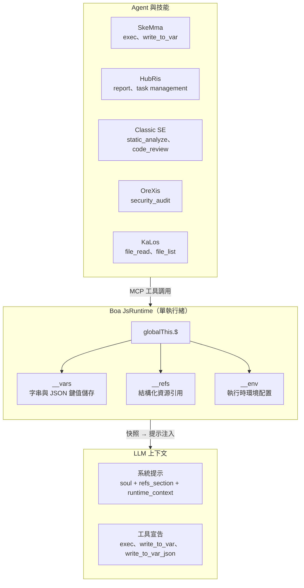

### 設計原則

| 原則 | 說明 |
| --- | --- |
| **單一事實來源** | 每個命名空間有且只有一個模組（`var_namespace.rs`、`ref_namespace.rs`、`namespace.rs`）生成引用該命名空間的**所有** JS 程式碼字串 |
| **惰性初始化** | `__vars` 和 `__refs` 在 `JsRuntime::new()` 時初始化一次，並在技能鏈之間持久存在；`__env` 在命名空間 JS 求值期間初始化 |
| **快照/還原** | 完整的 `__vars` + `__refs` 狀態可快照和還原，實現對話持久化 |
| **提示注入** | 快照資料驅動富含上下文的系統提示——LLM 看到可用的變數名稱、引用摘要和環境設定 |
| **工具存取控制** | 所有 3 個 cosmos 內部工具（`exec`、`write_to_var`、`write_to_var_json`）透過 `agent_allowed_tools()` 授予每個 Agent；個別技能 SOP 定義使用哪個 |

---

## 命名空間比較

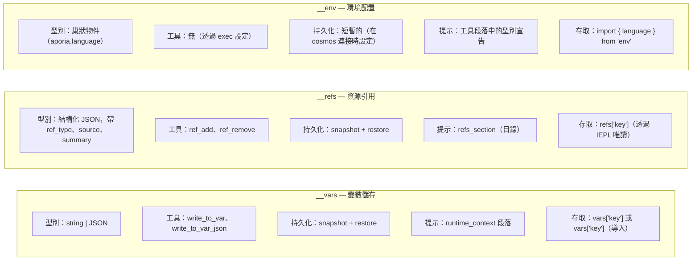

---

## 1. `__vars` — 變數儲存（`vars`）

### 1.1 目的

`__vars` 是技能鏈中**主要的步驟間通訊機制**。技能使用 `write_to_var` / `write_to_var_json` 來持久化計算結果，後續步驟（或技能）在 `exec` 區塊中從 `__vars` 讀取。

### 1.2 模組架構

所有 `__vars` JS 程式碼生成集中於 `packages/shared/core/src/var_namespace.rs`。

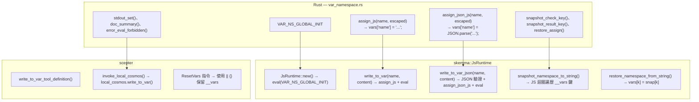

### 1.3 初始化序列

```text
JsRuntime::new()
  → context.eval("globalThis.$ = globalThis.$ || {}; globalThis.__vars = {}; globalThis.__refs = {};")
  → __vars 初始化為空物件
```

初始化在 `build_namespace_js()`（設定 `__env` 和 `$.variant`）**之前**執行，確保 `__vars` 在命名空間模組載入時始終可用。

> **注意：** `__refs` 透過 `VAR_NS_GLOBAL_INIT`（定義於 `var_namespace.rs`）與 `__vars` 一起初始化。`ref_namespace.rs` 中獨立的 `REF_NS_GLOBAL_INIT` 存在是為了對稱，但從未被直接調用——實際初始化發生在 `JsRuntime::new()` 中。

### 1.4 操作

| 操作 | 工具名稱 | 類型 | 行為 |
| --- | --- | --- | --- |
| 儲存字串 | `write_to_var` | 阻塞 | 為 JS 逸出內容，eval `vars['name'] = 'content'` |
| 儲存 JSON | `write_to_var_json` | 阻塞 | 驗證 JSON，eval `vars['name'] = JSON.parse('content')` |
| 在 exec 中讀取 | `exec` | FireAndForget | 直接存取：`vars['name']` 或 `import vars from 'vars'` |
| 快照 | （內部） | — | 捕獲所有 `__vars` 鍵為 `{"$vars": {...}}` |
| 還原 | （內部） | — | 為每個鍵設定 `vars[k] = snap['$vars'][k]` |
| 重置 | （內部） | — | `__vars = __vars \|\| {}` — 保留現有值，確保結構 |

### 1.5 提示注入

在 `build_runtime_context()`（`prompt.rs:472`）中，變數儲存在系統提示中顯示為：

```text
## JS 執行時上下文

__vars（來自 write_to_var / write_to_var_json，共 N 個）：
  `var_1`、`var_2`、`var_3`、...（最多顯示 30 個）
  導入為：`import vars from 'vars';`  存取：`vars['key']`
```

### 1.6 輸出顯示

- 字串儲存：`vars['name'] set:\n{前 200 字元 / 5 行}...（共 total_chars 字元）`
- JSON 儲存：`vars['name'] set (已解析 JSON)：具有 3 個鍵的物件`
- 解析失敗：含內容預覽的錯誤（前 200 字元）

### 1.7 `vars` 合成模組

與 `env` 類似，`vars` 模組是一個 Boa 合成模組，包裝 `__vars` 以便於導入：

```python
import vars from 'vars';
// vars === __vars（即時引用）
const report = vars['analysis_results'];
```

**實作：** `packages/agents/skemma/src/js_runtime/module_loader.rs` 第 142-156 行。該模組使用 `Module::synthetic()` 搭配一個閉包，直接回傳 `globalThis.__vars`（即時引用，而非快照）。這意味著透過 `vars['key'] = value` 的修改等同於 `vars['key'] = value`。

---

## 2. `__refs` — 資源引用（`refs`）

### 2.1 目的

`__refs` 提供**結構化的跨 Agent 資源傳遞**。與 `__vars`（原始字串）不同，refs 攜帶型別化元資料（`ref_type`、`source`、`summary`）以及可選的負載。Agent 可以：

- **發布**對檔案、圖片或自身輸出的引用
- 在系統提示中按名稱/型別**發現**引用
- 在 IEPL exec 區塊中透過 `refs['name']` **存取**引用內容

### 2.2 模組架構

所有 `__refs` JS 程式碼生成集中於 `packages/shared/core/src/ref_namespace.rs`。

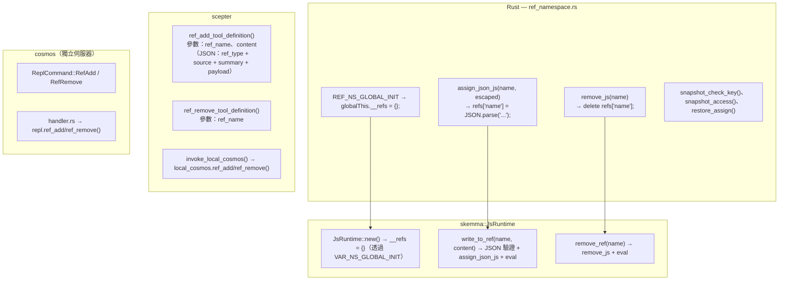

### 2.3 RefItem 結構

```typescript
// TypeScript 型別定義（來自 iepl-api.d.ts）
type RefType = "code" | "image" | "agent_output";

// 用於系統提示和 runtime_context 的名稱列表
type RefItemSummary = {
  name: string;
  ref_type: RefType;
  source: string;
  summary: string;
};

interface RefItem {
  name: string;        // 例如 "code:src/main.rs"、"image:diagram"、"agent:orexis/audit-1"
  ref_type: RefType;   // 用於排序/篩選的類別
  source: string;      // 提供者（"user"、Agent 名稱、工具名稱）
  summary: string;     // 用於提示顯示的單行描述
  files?: RefCodeFile[];   // 針對 "code" 引用
  images?: RefImage[];     // 針對 "image" 引用
  output?: RefAgentOutput; // 針對 "agent_output" 引用
}

interface RefCodeFile {
  path: string;
  language: string;
  content: string;
  selection?: { start_line: number; end_line: number; content: string };
}

interface RefImage {
  mime: string;          // 例如 "image/png"
  data: string;          // base64 編碼或 data URL
  description?: string;
}

interface RefAgentOutput {
  source_agent: string;  // Agent 名稱
  source_tool: string;   // 產生此輸出的工具
  content: Record<string, unknown>;
}
```

### 2.4 操作

| 操作 | 工具名稱 | 類型 | 行為 |
| --- | --- | --- | --- |
| 新增引用 | `ref_add` | 阻塞 | 驗證 JSON，eval `refs['name'] = JSON.parse('...')` |
| 移除引用 | `ref_remove` | FireAndForget | Eval `delete refs['name']` |
| 在 exec 中讀取 | （透過 `exec`） | — | `refs['name'].files[0].content` |
| 快照 | （內部） | — | 捕獲所有 `__refs` 鍵為 `{"$refs": {...}}` |
| 還原 | （內部） | — | 為每個鍵設定 `refs[k] = snap['$refs'][k]` |

### 2.5 提示注入

Refs 出現在系統提示的**兩個**位置：

#### 位置 1：`refs_section`（專用目錄）

```text
## 引用的資源（refs）

以下資源可透過 `refs['name']` 存取。
- `code:src/main.rs` [code] 來自 user — 主要 rust 檔案
- `image:architecture` [image] 來自 user — 系統架構圖
- `agent:orexis/audit-1` [agent_output] 來自 OreXis — 安全審計結果
```

由 `build_refs_section()` 在 `prompt.rs:426` 生成。每個 ref 顯示**名稱、型別、來源和摘要**——LLM 看到可用的內容，但必須透過 `exec` 區塊讀取內容。

#### 位置 2：`runtime_context`（名稱列表）

```text
__refs（來自使用者/Agent 的引用資源，共 3 個）：
  `code:src/main.rs`、`image:architecture`、`agent:orexis/audit-1`
  存取：`refs['name']` — 每個 ref 有 .ref_type、.source、.summary
```

### 2.6 可見性原則

> **Ref 名稱對所有 Agent 可見。Ref 內容則否。**

系統提示中的 `refs_section` 向每次技能執行暴露**目錄**（名稱、型別、來源、摘要）。然而，實際內容（`files[].content`、`images[].data`、`output.content`）僅可透過 IEPL exec 區塊中的顯式 `refs['name']` 存取來獲取。這意味著：

- OreXis 可以看到 `code:src/main.rs` 存在（從其摘要），但必須顯式讀取其內容以進行審計
- LLM 根據任務相關性決定何時解引用內容
- 沒有任何 Agent 能意外地將引用內容洩漏到對話流中

---

## 3. `__env` — 環境配置（`env`）

### 3.1 目的

`__env` 持有 IEPL 執行引擎和 Agent 所需的**執行時環境設定**。目前唯一的子鍵是 `env.aporia.language`，控制 Agent 輸出的語言。

### 3.2 模組架構

環境初始化位於 `packages/shared/iepl/src/namespace.rs`。

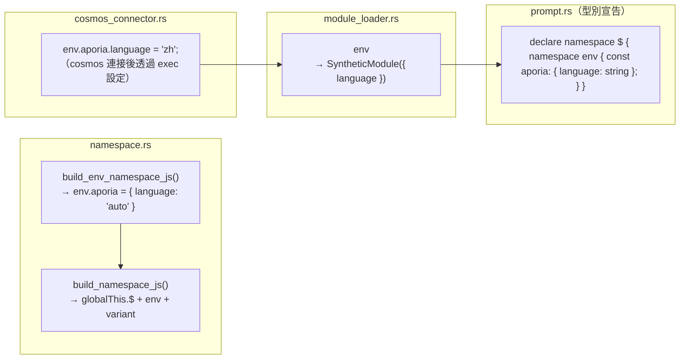

### 3.3 操作

| 操作 | 機制 | 行為 |
| --- | --- | --- |
| 初始化 | `build_namespace_js()` | `__env = __env \|\| {}; env.aporia = env.aporia \|\| { language: 'auto' }` |
| 設定語言 | 透過 cosmos connector 的 `exec` 調用 | `env.aporia.language = 'zh'` |
| 在 IEPL 中讀取 | `import { language } from 'env'` | 回傳 `env.aporia.language`，預設為 `'auto'` |
| 快照/還原 | **不支援** | `__env` 不包含在快照/還原中——它是短暫的，每次 cosmos 連接時重新初始化 |

### 3.4 語言流程

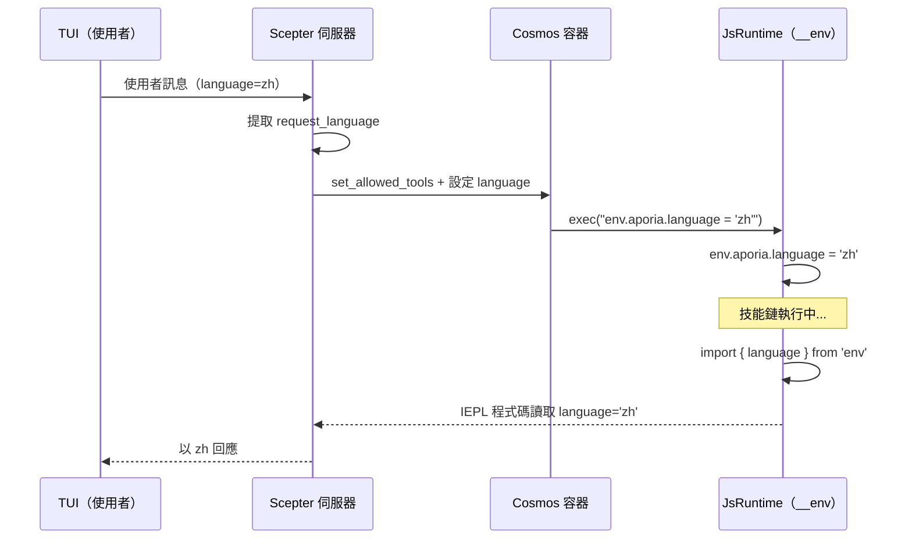

### 3.5 `$.variant` — 向後相容的存取器

**檔案：** `packages/shared/iepl/src/namespace.rs:199-207`

`build_variant_namespace_js()` 建立一個循環自引用屬性：

```javascript
Object.defineProperty(globalThis.$, 'variant', {
  get: function() { return globalThis.$; },
  set: function(val) { Object.assign(globalThis.$, val); },
  configurable: true,
  enumerable: true,
});
```

這允許以 `$.variant.tools.agent.method()` 撰寫的程式碼解析到與 `$.tools.agent.method()` 相同的物件。它存在是為了與替代命名空間存取模式的向後相容性。

> **快照注意：** 因為 `$.variant` 是一個循環引用（`$.variant === $`），嘗試 `JSON.stringify` 會拋出 `TypeError`。快照 JS 程式碼顯式地直接針對 `__vars` 和 `__refs`，而不是迭代 `globalThis.$` 的鍵，從而避免了這個問題。

---

## 4. 快照與還原架構

### 4.1 為什麼需要快照/還原？

`LocalCosmosRuntime` 在一個專用執行緒中執行一個**單一的長期存活的 `JsRuntime`**。在技能鏈執行之間，執行時狀態（`__vars`、`__refs`）自然持久存在。然而，快照用於：

1. **提示注入** — `build_runtime_context()` 和 `build_refs_section()` 讀取快照 JSON 以填充系統提示
1. **對話持久化** — 在磁碟上傾印/還原以用於崩潰恢復或對話遷移
1. **容器同步** — 透過 `cosmos_set_rag_context()` 推送狀態到 cosmos 容器

### 4.2 快照格式

```json
{
  "$vars": {
    "var_name_1": "value",
    "parsed_json": { "key": "value" }
  },
  "$refs": {
    "code:src/main.rs": {
      "ref_type": "code",
      "source": "user",
      "summary": "main rust file",
      "files": [{ "path": "src/main.rs", "language": "rust", "content": "..." }]
    }
  },
  "__lexical": {
    "my_const": 42
  }
}
```

### 4.3 快照程式碼流程

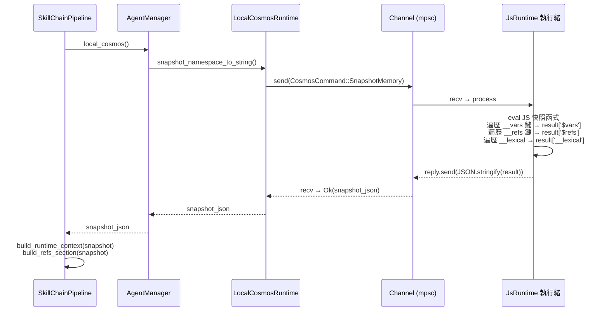

### 4.4 快照 JS 程式碼（部署形式）

> **注意：** 以下顯示的 JS 程式碼是 Rust 程式碼在執行時動態建構的**部署形式**。它不以 Rust 字串常量的形式儲存在原始碼中。`__lexical` 段落是從在先前的 `exec()` 調用期間追蹤的 `self.lexical_var_names` 生成的。參見 `packages/agents/skemma/src/js_runtime/runtime.rs:549-607` 中 Rust 字串建構器的實作。

快照函式直接存取已知的命名空間樹：

```javascript
(function() {
    var result = {};
    if (globalThis.$ && globalThis.__vars) {
        var dollarVars = {};
        var dollarKeys = Object.keys(globalThis.__vars);
        for (var j = 0; j < dollarKeys.length; j++) {
            var dk = dollarKeys[j];
            try {
                var dv = globalThis.vars[dk];
                if (typeof dv === 'function') continue;
                dollarVars[dk] = dv;
            } catch(e) {}
        }
        if (Object.keys(dollarVars).length > 0) {
            result['$vars'] = dollarVars;
        }
    }
    if (globalThis.$ && globalThis.__refs) {
        var dollarRefs = {};
        var refsKeys = Object.keys(globalThis.__refs);
        for (var j = 0; j < refsKeys.length; j++) {
            var dk = refsKeys[j];
            try {
                var dv = globalThis.refs[dk];
                if (typeof dv === 'function') continue;
                dollarRefs[dk] = dv;
            } catch(e) {}
        }
        if (Object.keys(dollarRefs).length > 0) {
            result['$refs'] = dollarRefs;
        }
    }
    // ... __lexical 捕獲 ...
    return JSON.stringify(result);
})( )
```

### 4.5 還原程式碼（部署）

```javascript
(function() {
    var snap = JSON.parse(snapshot_string);
    if (snap['$vars'] && globalThis.$) {
        Object.keys(snap['$vars']).forEach(function(k) {
            try { globalThis.vars[k] = snap['$vars'][k]; } catch(e) {}
        });
    }
    if (snap['$refs'] && globalThis.$) {
        Object.keys(snap['$refs']).forEach(function(k) {
            try { globalThis.refs[k] = snap['$refs'][k]; } catch(e) {}
        });
    }
    if (snap['__lexical']) {
        Object.keys(snap['__lexical']).forEach(function(k) {
            try { globalThis[k] = snap['__lexical'][k]; } catch(e) {}
        });
    }
})()
```

---

## 5. 工具註冊與存取控制

### 5.1 Cosmos 內部工具

所有五個 cosmos 層級工具被**普遍授予**所有 Agent：

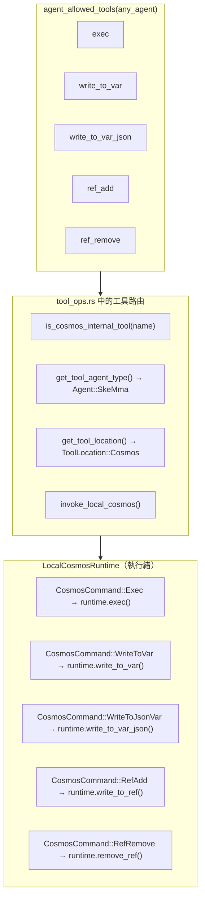

### 5.2 工具定義

| 工具 | 調用模式 | 需求 | 參數結構 |
| --- | --- | --- | --- |
| `exec` | FireAndForget | `code: string` | 單一 JS 程式碼字串 |
| `write_to_var` | Blocking | `var_name、content` | `{var_name: string, content: string}` |
| `write_to_var_json` | Blocking | `var_name、content` | `{var_name: string, content: string（有效 JSON）}` |
| `ref_add` | Blocking | `ref_name、content` | `{ref_name: string, content: string（JSON: ref_type + source + summary）}` |
| `ref_remove` | FireAndForget | `ref_name` | `{ref_name: string}` |

### 5.3 獨立 Cosmos 伺服器

`cosmos` 二進位檔（獨立 JS 執行時伺服器）透過相同的 `JsRuntime` 介面分派所有工具名稱，包括保留為殘餘內部管道的已棄用 `ref_add`/`ref_remove` 處理器。只有三個 LLM 可見的原語（`exec`、`write_to_var`、`write_to_var_json`）暴露給模型；請參閱本文檔頂部的棄用說明。

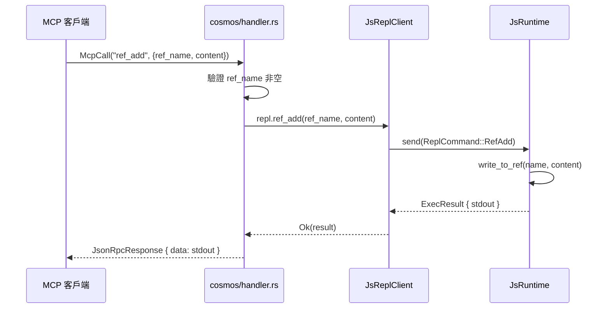

### 5.4 `is_cosmos_internal_tool` — 路由輔助函式

**檔案：** `packages/scepter/src/agent_manager/tool_ops.rs:7-13`

```rust
fn is_cosmos_internal_tool(tool_name: &str) -> bool {
    tool_name == cosmos::EXEC
        || tool_name == cosmos::WRITE_TO_VAR
        || tool_name == cosmos::WRITE_TO_VAR_JSON
        || tool_name == cosmos::REF_ADD
        || tool_name == cosmos::REF_REMOVE
}
```

此輔助函式服務兩個關鍵目的：

1. **Agent 型別解析** — `get_tool_agent_type()` 對內部工具回傳 `Agent::SkeMma`，因為它們在 Cosmos 執行時中執行（而非在領域 Agent 的程序中）。
1. **備援路由** — 當容器化的 cosmos 調用對內部工具失敗時，系統備援到本地 cosmos 執行時。對於非內部工具，備援改為進入程序內執行。這確保 cosmos 操作在容器化模式下永遠不會靜默失敗。

### 5.5 容器化 vs 本地 Cosmos 路由

系統支援兩種 Cosmos 執行時執行模式，在 Agent 註冊時選擇：

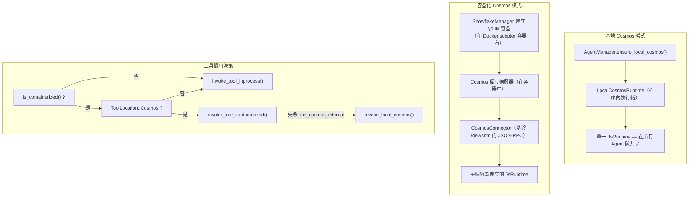

**關鍵差異：**

| 方面 | 本地模式 | 容器化模式 |
| --- | --- | --- |
| `__vars` / `__refs` | 在所有 Agent 間共享 | 在容器內共享，容器間隔離 |
| `__env` | 直接透過 `exec` 設定 | 透過 `CosmosConnector` JSON-RPC 調用設定 |
| 效能 | 零序列化開銷 | 每次調用需要 JSON-RPC 序列化 |
| 安全性 | 僅 Boa 沙箱 | Boa + seccomp + youki 沙箱 |
| 容器執行時 | 僅 Docker/Podman | Docker/Podman（外部）+ youki（內部 cosmos） |
| 使用場景 | 非容器化 Agent（layer=1） | 容器化 Agent（layer=2+） |

### 5.6 命名空間 JS 組裝

完整的命名空間 JavaScript 由 `build_scepter_namespace_config_and_js()` 組裝，位於 `packages/scepter/src/services/local_cosmos/namespace.rs:116-124`：

```rust
pub async fn build_scepter_namespace_config_and_js(
    registry: &SharedAgentRegistry,
    scepter_tools: &HashSet<String>,
    plugin_router: &PluginRouter,
) -> (NamespaceConfig, String) {
    let config = build_namespace_config(registry, scepter_tools, plugin_router).await;
    let js = build_namespace_js(&config);
    (config, js)
}
```

此函式：

1. 從 `AgentRegistry` 收集所有已註冊 Agent 的 MCP 工具
1. 建構帶有各 Agent 工具清單和元資料（sync/async、`unwrap_data`）的 `NamespaceConfig`
1. 透過 `build_namespace_js(&config)` 生成命名空間 JS，該函式：

   - 建立 `globalThis.$`（若缺失）
   - 初始化 `env.aporia` 為 `{ language: 'auto' }`
   - 定義 `$.variant` 屬性（回傳 `globalThis.$` 的循環 getter）
   - 透過 `register_tool_modules_with_rag()` 註冊所有 Agent 工具模組

命名空間 JS 的求值時機：

- **一次** 在 `LocalCosmosRuntime::new()` 啟動時
- **按需** 在技能鏈重建期間透過 `CosmosCommand::RebuildNamespace`

---

## 6. 系統提示組裝順序

在 `pipeline.rs:869-882` 中組裝的完整系統提示：

```text
你是 {Agent} {skill_name} 技能執行引擎。忠實地執行該技能。

[capability_section]
  → Agent 特定能力描述
  → TypeScript 型別宣告（IEPL API 型別、env）
  → 導入指令提示
  → 參數安全規則與資料持久化指引

[tool_decls_section]
  → ## 可用工具 API
  → 所有可用 MCP 工具的 .d.ts 內容

[container_context]
  → 容器執行模式徽章、分支資訊、限制

[soul_section]
  → ## 靈魂身份：{name}
  → Agent 的人格與操作原則

[refs_section]
  → ## 引用的資源（refs）
  → 目錄：名稱、型別、來源、摘要

[output_section]
  → 下一個目標 Agent 路由
  → MCP report 調用慣例

[runtime_context]
  → ## JS 執行時上下文
  → __vars 名稱（附導入提示）
  → __refs 名稱（附存取提示）
  → 詞法變數名稱

[rag_section]
  → Philia 記憶段落（相關的歷史互動）
  → Aporia 知識段落（相關文件）

[skill_chain_note]
  → 鏈導航："這是第 N 步，共 M 步" 或 "最後一步"
```

### 段落位置理由

| 段落 | 位置 | 理由 |
| --- | --- | --- |
| Agent 身份 + 技能名稱 | 第一句 | 立即設定角色 |
| 工具宣告 | soul 之前 | LLM 需要知道可用工具後，人格才能影響選擇 |
| Soul | 工具之後、refs 之前 | 人格影響如何解讀 refs |
| Refs 段落 | soul 之後、output 之前 | LLM 在決定產出什麼之前知道可用資源 |
| 輸出路由 | runtime_context 之前 | LLM 在讀取上下文之前知道將結果發送到哪裡 |
| 執行時上下文 | RAG 之前、鏈備註之前 | Vars 和 refs 為知識檢索提供執行上下文 |

---

## 7. ResetVars 行為

在鏈中切換技能時，調用 `ResetVars` 來清理執行時狀態。該指令使用**非破壞性**初始化：

```javascript
globalThis.$ = globalThis.$ || {};
globalThis.__vars = globalThis.__vars || {};
globalThis.__refs = globalThis.__refs || {};
```

這意味著：

- **現有值持久存在** — `__vars` 和 `__refs` 保持完好
- **損壞狀態可恢復** — 若 `__refs` 被意外刪除，會重新建立
- **技能隔離是可選的** — 技能應該只讀取它們知道的變數（透過執行時上下文提示中的名稱）
- **無強制清理** — 管理變數命名空間污染是 LLM 的責任

---

## 8. 實作檔案地圖

| 元件 | 檔案 | 行數 | 說明 |
| --- | --- | --- | --- |
| `__vars` 常數與生成器 | `packages/shared/core/src/var_namespace.rs` | 1-211 | 所有 vars 的 JS 程式碼生成 |
| `__refs` 常數與生成器 | `packages/shared/core/src/ref_namespace.rs` | 1-145 | 所有 refs 的 JS 程式碼生成 |
| `__env` 生成 | `packages/shared/iepl/src/namespace.rs` | 193-197 | `build_env_namespace_js()` |
| `$.variant` 生成 | `packages/shared/iepl/src/namespace.rs` | 199-207 | `build_variant_namespace_js()` |
| `JsRuntime` 初始化 | `packages/agents/skemma/src/js_runtime/runtime.rs` | 153 | `eval(VAR_NS_GLOBAL_INIT)` |
| `write_to_var` 實作 | 同上 | 349-403 | 字串變數儲存 |
| `write_to_var_json` 實作 | 同上 | 405-443 | JSON 變數儲存 |
| `write_to_ref` 實作 | 同上 | 445-492 | 帶型別提取的 ref 儲存 |
| `remove_ref` 實作 | 同上 | 494-503 | ref 移除 |
| `snapshot_namespace_to_string` | 同上 | 549-607 | 生成快照 JS |
| `restore_namespace_from_string` | 同上 | 617-646 | 生成還原 JS |
| `LocalCosmosRuntime` | `packages/scepter/src/services/local_cosmos/runtime.rs` | 1-507 | 執行緒安全的 cosmos 指令通道 |
| `CosmosCommand` 列舉 | 同上 | 21-65 | 所有 cosmos 操作變體（含 SnapshotMemory、Shutdown） |
| `ResetVars` 處理器 | 同上 | 448-460 | 非破壞性重置 |
| `RebuildNamespace` 處理器 | 同上 | 478-494 | 重新初始化工具模組 |
| 工具定義 | `packages/scepter/src/agent_manager/tool_ops.rs` | 1-795 | 全部 5 個 cosmos 工具定義 |
| `is_cosmos_internal_tool` | 同上 | 7-13 | 路由輔助函式 |
| `invoke_local_cosmos` | 同上 | 714-787 | 工具分派至 LocalCosmosRuntime |
| `build_runtime_context` | `packages/scepter/src/state_machine/skill_chain/prompt.rs` | 472-598 | 提示：vars + refs + lexical |
| `build_refs_section` | 同上 | 426-470 | 提示：refs 目錄 |
| 系統提示組裝 | `packages/scepter/src/state_machine/skill_chain/pipeline.rs` | 869-882 | 完整系統提示格式字串 |
| 允許的工具清單 | `packages/shared/domain_skills/src/tool_names.rs` | 265-273 | 通用 cosmos 工具存取 |
| Cosmos 獨立處理器 | `packages/cosmos/src/handler.rs` | 447-521 | `ref_add` / `ref_remove` 分派 |
| Cosmos JsReplClient | `packages/cosmos/src/js_repl/mod.rs` | 442-467 | `ref_add()` / `ref_remove()` 方法 |
| ReplCommand 列舉 | 同上 | 57-96 | `RefAdd` / `RefRemove` 變體 |
| IEPL TypeScript 型別 | `packages/shared/bindings/iepl-api.d.ts` | 133-154 | RefItem、RefType、__refs 宣告 |
| `vars` 模組 | `packages/agents/skemma/src/js_runtime/module_loader.rs` | 142-156 | `__vars` 即時引用匯出 |
| `env` 模組 | 同上 | 160-172 | Language 值匯出 |
| 命名空間 JS 組裝 | `packages/scepter/src/services/local_cosmos/namespace.rs` | 116-124 | `build_scepter_namespace_config_and_js` |
| CosmosConnector 語言設定器 | `packages/scepter/src/services/cosmos_connector.rs` | 351-363 | 容器中的 `env.aporia.language` |
| E2E 測試 | `packages/agents/skemma/tests/mcp_test.rs` | 1677-1726 | `refs_and_snapshot_tests` 模組 |
| 單元測試 | `packages/agents/skemma/src/js_runtime/runtime.rs` | 679-746 | `write_to_ref`、snapshot、restore 測試 |
| Ref 命名空間測試 | `packages/shared/core/src/ref_namespace.rs` | 99-145 | JS 程式碼生成模式測試 |

---

## 9. 橫切關注重點

### 9.1 執行緒安全

- `LocalCosmosRuntime` 在一個專用執行緒（名為 `"local-cosmos"`）中擁有一個**單一的 `JsRuntime`**
- 所有操作透過 `mpsc::channel<CosmosCommand>` 序列化
- `JsRuntime` 從不被多個執行緒存取——執行緒安全由通道模式強制執行
- `AgentManager` 持有 `OnceCell<Arc<LocalCosmosRuntime>>` 用於惰性初始化

### 9.2 記憶體限制

| 限制 | 值 | 執行位置 |
| --- | --- | --- |
| 提示中的最大 vars 數 | 30 | `build_runtime_context()` — `MAX_NAMES` 常數 |
| 提示中的最大 refs 數 | 30 | `build_refs_section()` — `.take(30)` |
| runtime_context 中的最大 refs 數 | 30 | `build_runtime_context()` — `MAX_NAMES` 常數 |
| Exec 程式碼軟限制 | N/A（已停用） | 外部容器限制 + 斷路器 |
| Exec 逾時（SkeMma） | 預設 120s | `skemma/COMPUTE_TIMEOUT` |
| Exec 絕對上限 | 600s | `skemma/ABSOLUTE_CEILING` |

### 9.3 錯誤處理

| 錯誤 | 處理方式 |
| --- | --- |
| `write_to_var_json` 含無效 JSON | 回傳含預覽的錯誤（前 200 字元） |
| `ref_add` 含無效 JSON | 回傳 `SkemmaError::JsEval` 含預覽 |
| 循環引用的快照（`$.variant`） | 靜默捕獲 `TypeError`，跳過該鍵 |
| 快照中缺少 `__refs` | `build_refs_section` 回傳空字串 |
| ResetVars 後 `__refs` 損壞 | `|| {}` 保證重新初始化 |

### 9.4 RebuildNamespace 生命週期

在非容器化技能鏈中切換技能時，命名空間 JS 可能需要**重建**以包含鏈中發現的新 Agent 工具：

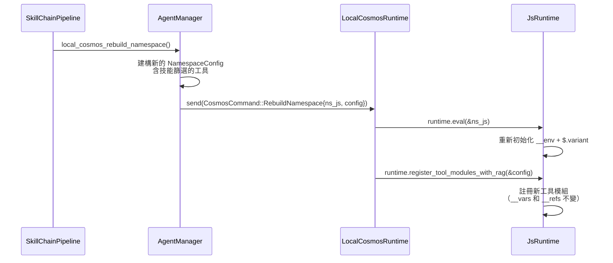

> **關鍵不變量：** `RebuildNamespace` 僅更新工具註冊和環境設定。它**不**重置 `__vars` 或 `__refs`——這些由 `ResetVars` 單獨處理。

### 9.5 容器化模式中的語言傳播

當 Agent 在 youki 容器中執行時（巢狀於 Docker scepter 容器內），`env.aporia.language` 值透過 `CosmosConnector` 設定：

```rust
// packages/scepter/src/services/cosmos_connector.rs:351-363
let lang_code = format!(
    "env.aporia.language = {};",
    serde_json::to_string(&lang).unwrap_or_else(|_| "\"en\"".to_string())
);
connector.cosmos_exec(&container_uuid, &lang_code).await?;
```

這透過 JSON-RPC 傳輸向 cosmos 容器發送一個 `exec` MCP 調用，該調用在容器的隔離 `JsRuntime` 中求值 JS 賦值。完整的語言傳播路徑為：

```text
TUI 請求語言 → Scepter（提取 request_language）
  → [本地模式] 直接 exec("env.aporia.language = 'zh'")
  → [容器化] CosmosConnector::cosmos_exec(json_rpc_call)
      → cosmos handler → js_runtime.eval(...)
```

### 9.6 安全性

- `exec` 驗證：所有程式碼在 Boa 求值前通過 SWC AST 語法驗證
- `exec` 區塊中的 `eval()` 使用被檢測並阻止，並引導使用 `write_to_var`
- `ref_add` 內容通過 `JSON.parse()`——無法注入任意程式碼
- 沒有命名空間工具暴露原始的 Boa 上下文存取
- Cosmos 容器在具有 seccomp 配置的沙箱化 youki 容器中執行，每個都巢狀於 Docker/Podman scepter 容器內（雙層容器隔離）
