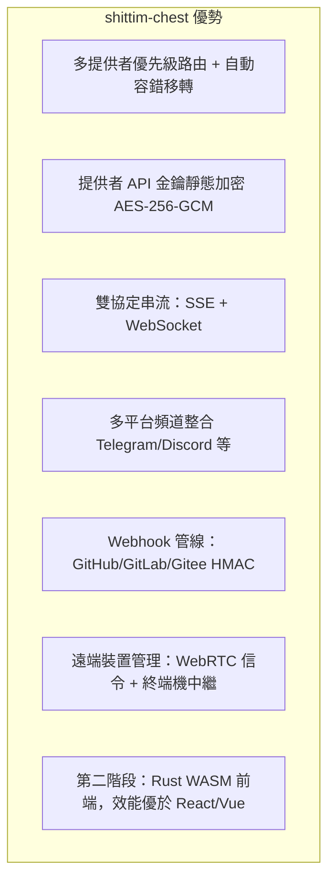

# 產品定位與競爭格局

## 概述

shittim-chest 是一個鬆耦合的 LLM WebUI 平台，直接競爭對手為 Open WebUI、LobeChat 等。其與 entelecheia 的整合為可選功能，而非架構先決條件。

## 核心定位

| 維度 | 說明 |
| --- | --- |
| 本質 | 一個獨立的、多提供者的 LLM 對話 WebUI |
| 競爭者 | Open WebUI、LobeChat、NextChat |
| 與 entelecheia 的關係 | 鬆耦合：透過 JWT 代理進行可選整合 |
| 獨立性 | 無需 entelecheia 即可提供完整的對話體驗 |

## 與 Open WebUI 的差異化

## 與 entelecheia 的邊界

| shittim-chest | entelecheia |
| --- | --- |
| 使用者認證 (argon2 + JWT) | 使用者身分與權限 (RBAC) |
| 工作階段管理 | Agent 編排 (scepter) |
| 對話資料 (對話/訊息) | Cosmos 容器執行時期 |
| LLM 提供者管理 + 金鑰加密 | IEPL TypeScript 執行引擎 |
| Webhook 入口 (HMAC 驗證 + 轉發) | Agent 工具調用 |
| 前端渲染 (arona) | WebSocket Agent 頻道 |
| 遠端裝置工作階段 + 信令中繼 | polemos 裝置 Agent |
| 多平台頻道設定 | — |

**關鍵原則**：shittim-chest 僅持有「使用者端」資料；entelecheia 僅持有「Agent 端」資料。兩者透過 JWT 認證的 HTTP/WebSocket 通訊，絕不存取彼此的資料庫。

## 架構演進路線圖

| 階段 | 狀態 | 內容 |
| --- | --- | --- |
| P1-P6 | 已完成 | 獨立對話、認證、提供者管理、Webhook、代理橋接、裝置管理 |
| P7 | 規劃中 | 語音輸入/輸出 (STT Docker 容器 + TTS 代理) |
| P8 | 規劃中 | PWA 行動版 + Tauri Mobile |
| P9 | 規劃中 | Rust WASM 前端遷移 (arona → Tairitsu) |

## 設計理念

1. **獨立優先**：所有核心功能不依賴於 entelecheia。僅需 `LLM_DEFAULT_PROVIDER_*` 環境變數即可獨立啟動對話功能。
1. **鬆耦合整合**：entelecheia 整合為可選代理層。使用者可選擇僅使用 LLM 對話，或透過 entelecheia 啟用 Agent 編排。
1. **漸進式 WASM**：Vue 3 前端先作為「活規格」交付；WASM 遷移有明確的決策門檻（框架成熟度、生態系覆蓋率、開發人力）。
1. **Docker 原生**：所有伺服器端元件透過 bollard Docker API 管理，不依賴 docker-compose。
