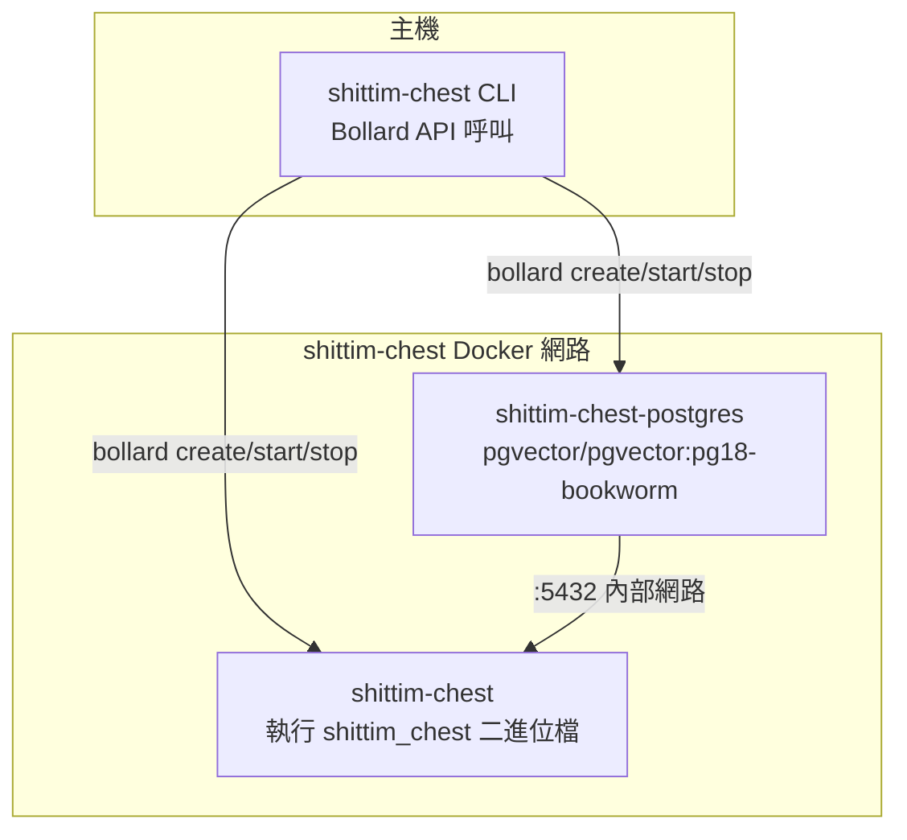

# CLI 封裝器架構：基於 Bollard 的 Docker 容器編排

## 概述

`packages/cli/` 是一個 Rust 二進位檔，透過 Bollard Docker API 直接管理容器生命週期，完全取代 docker-compose 和 shell 指令稿。CLI 在主機上執行，而伺服器二進位檔 (`shittim_chest`) 在容器內執行。

## 為何不使用 docker-compose

| 維度 | docker-compose | bollard（目前方案） |
| --- | --- | --- |
| 依賴性 | 需獨立安裝 docker-compose | 重用 Docker Engine API |
| 可程式化 | YAML 宣告式，邏輯受限 | Rust 原生，任意控制流程 |
| 健康檢查 | depends_on + condition 為事件驅動 | 主動輪詢；死亡偵測無需逾時 |
| 錯誤處理 | 容器退出 = 失敗 | 重試 + 日誌收集 + 詳細錯誤資訊 |
| 資源清理 | `down -v` 全有或全無 | 按容器/網路/磁碟區精細清理 |
| 整合 | 外部工具 | 以程式庫形式嵌入，可擴展更多邏輯 |

## 容器拓撲



## 容器命名與資源

| 常數 | 值 | 用途 |
| --- | --- | --- |
| `NET` | `shittim-chest` | Docker 橋接網路 |
| `PG` | `shittim-chest-postgres` | PostgreSQL 容器名稱 |
| `APP` | `shittim-chest` | 應用容器名稱 |
| `VOL` | `shittim-chest-pgdata` | PG 資料磁碟區 |
| `PG_IMG` | `pgvector/pgvector:pg18-bookworm` | PG 映像 |
| `RUNTIME_IMG` | `debian:bookworm-slim` | 開發模式執行時期映像 |
| `BUILD_IMG` | `shittim-chest` | 發布模式建置映像 |

## 指令對應

| 指令 | 行為 |
| --- | --- |
| `dev [--clean]` | 一次性啟動：env → 網路 → 磁碟區 → PG → cargo build → 遷移 → 啟動 → 串流日誌 |
| `up` | 發布模式：docker build 映像 → 遷移 → 背景啟動 (restart=unless-stopped) |
| `down [--clean]` | 停止容器（可選磁碟區 + 網路清理） |
| `migrate` | 在一次性容器中執行 db-migrate（最多重試 5 次，間隔 2 秒） |
| `logs` | 串流追蹤應用容器日誌 |
| `status` | 檢查 PG 和應用容器執行狀態 + 健康檢查狀態 |
| `build` | 建置完整 Docker 映像 (`docker build -t shittim-chest`) |

## 環境變數傳遞

```text
.env 檔案 → dotenvy::from_path_iter → HashMap<String, String>
→ 合併 SHITTIM_CHEST_HOST / PORT / DATABASE_URL
→ Vec<String> = ["KEY=VALUE", ...]
→ bollard Config::env()
```

CLI 不從 `.env` 讀取自身設定——它僅將完整的 `.env` 內容傳遞給容器內的 `shittim_chest` 程序。密碼和連接埠透過兩個特定金鑰 `SHITTIM_CHEST_DB_PASSWORD` 和 `SHITTIM_CHEST_PORT` 讀取。

## 日誌記錄慣例

CLI 日誌直接輸出到 stderr，使用與 entelecheia 相同的格式：

- `tracing-subscriber` + `ShortTimer` (HH:MM:SS 格式)
- `.compact()` 緊湊模式
- `.with_target(false)` 隱藏模組路徑
- `--log-level` CLI 參數（預設 `info`）

## 設計原則

1. **CLI 不執行業務邏輯**：所有業務邏輯位於容器內的 `shittim_chest` 二進位檔中
1. **容器是不可變單元**：CLI 建立/銷毀容器，絕不修改執行中的容器
1. **網路隔離**：PG 連接埠不暴露給主機，僅可在內部 Docker 網路中存取
1. **被動輪詢健康檢查**：不依賴 Docker 事件（不可靠）；直接輪詢 inspect 結果
