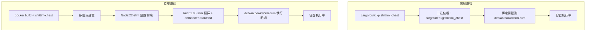

# 雙模式部署路徑：開發模式 vs 發布模式

## 概述

shittim-chest 支援兩種部署模式：開發模式（本機快速迭代，無需 Node，無需映像建置）和發布模式（完整 Docker 映像，內嵌前端靜態檔案）。兩種模式共用相同的容器拓撲和網路。

## 設計動機

建置完整的 Docker 映像（Node 前端建置 + Rust 編譯 + `embedded-frontend`）需要 30 秒以上，不適合日常開發迭代。開發模式利用主機的增量 Rust 編譯快取，將二進位檔綁定掛載到最小執行時期容器中，以實現亞秒級重啟時間。

## 路徑比較



| 維度 | 開發模式 (`just dev`) | 發布模式 (`just up`) |
| --- | --- | --- |
| 前端 | 由 Vite 建置，後端透過 `just dev` 提供服務 | 內嵌於二進位檔 (`embedded-frontend` 功能) |
| 需要 Node | 是（用於 Vite 建置） | 是（在 Docker 內） |
| 二進位檔來源 | 本機 `cargo build` | 在 Docker 內編譯 |
| 容器基礎映像 | `debian:bookworm-slim` | `debian:bookworm-slim`（多階段建置結果） |
| 重啟速度 | < 5 秒（增量編譯後） | 30-60 秒（完整建置） |
| 使用情境 | 日常開發、除錯 | CI/生產部署 |
| 容器啟動方式 | `Config.cmd = ["shittim_chest"]` | 映像包含 ENTRYPOINT |

## 開發模式實作細節

### 本機編譯

```rust
async fn cargo_build() -> Result<()> {
    Command::new("cargo")
        .args(["build", "-p", "shittim_chest"])
        .status().await?;
}
```

編譯輸出路徑固定為 `$PWD/target/debug/shittim_chest`（debug 設定檔，保留除錯符號）。

### 綁定掛載啟動

```rust
let config = Config::<String> {
    image: Some("debian:bookworm-slim".into()),   // 最小執行時期
    cmd: Some(vec!["shittim_chest".to_string()]),
    host_config: Some(HostConfig {
        binds: Some(vec![
            format!("{bin_path}:/usr/local/bin/shittim_chest:ro")
        ]),
        network_mode: Some(NET.into()),
        port_bindings: ...,
        ..
    }),
    env: Some(container_env(password, port)),
    ..
};
```

關鍵要點：

- 二進位檔以唯讀方式掛載 (`:ro`)，防止在容器內意外修改
- 二進位檔位置為 `/usr/local/bin/shittim_chest`，在容器內直接執行
- 基礎映像 `debian:bookworm-slim` 提供所需的 glibc 執行時期

### 遷移執行

遷移透過一次性容器執行：

```bash
docker run --rm --network shittim-chest \
  -v $PWD/target/debug/shittim_chest:/usr/local/bin/shittim_chest:ro \
  -e SHITTIM_CHEST_DATABASE_URL=... \
  debian:bookworm-slim \
  shittim_chest db-migrate
```

自動重試最多 5 次（間隔 2 秒），以處理 PG 尚未完全就緒的情況。

## 發布模式實作細節

### Dockerfile 多階段建置

```dockerfile
# 階段 1：前端 → Node:22-slim + pnpm → pnpm build:all → /app/dist/
# 階段 2：建置器 → Rust:1.85-slim + COPY dist/ → cargo build --features embedded-frontend
# 階段 3：執行時期 → debian:bookworm-slim + ca-certificates + COPY 二進位檔
```

### embedded-frontend 功能

```rust
# [cfg(feature = "embedded-frontend")]
{
    static FRONTEND_DIR: Dir<'_> = include_dir!("$CARGO_MANIFEST_DIR/../dist");
    // 掛載到 Axum Router 的 /static/* 路徑
}
```

此功能使用 `include_dir!` 巨集在編譯時將前端建置產出嵌入到二進位檔中。在發布模式下，無需額外的反向代理即可提供完整 SPA 服務。

## 遷移與啟動函式命名

為避免混淆，程式碼明確區分兩組函式：

| 開發路徑 | 發布路徑 |
| --- | --- |
| `run_migrate_dev()` | `run_migrate_release()` |
| `start_app_dev()` | `start_app_release()` |
| `cargo_build()` | `build_image()` |

## 前端開發

在開發模式下，`dev.py` 在檔案變更時重新建置前端資源。後端在同一埠上同時提供靜態檔案和 API（開發用 :3000，生產用 :80）。
