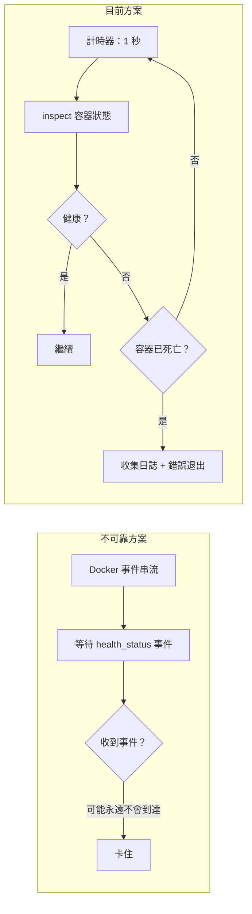

# PostgreSQL 健康檢查策略

## 概述

CLI 封裝器必須在啟動應用容器之前確保 PostgreSQL 已就緒。本文件定義了被動輪詢健康檢查策略背後的設計決策——拒絕 Docker 事件（不可靠）和固定逾時（不靈活）。

## 為何不使用 Docker 事件



在 Docker 事件串流中，`container` 過濾器對於 `health_status` 事件不可靠——尤其是在 PG 容器重新啟動後。實際上，事件可能永遠不會觸發，導致 CLI 無限期等待。

## 輪詢策略

```text
while true:
    sleep 1s
    state = docker.inspect_container(PG)
    if state.health.status == HEALTHY:
        break
    if !state.running:
        bail!(collect_logs(PG))
```

| 參數 | 值 | 理由 |
| --- | --- | --- |
| 輪詢間隔 | 1 秒 | 響應足夠快，無 inspect 開銷 |
| 逾時 | 無 | 無硬性逾時；PG 可能有冷啟動 |
| 死亡偵測 | 每次輪詢 | 容器不存在 → 立即報錯並傾印最後 50 行日誌 |

## PostgreSQL 容器健康檢查設定

```rust
HealthConfig {
    test:        ["CMD-SHELL", "pg_isready -U shittim_chest"],
    interval:    5_000_000_000,   // 5 秒（奈秒）
    timeout:     5_000_000_000,   // 5 秒
    retries:     10,
    start_period: 30_000_000_000, // 30 秒初始寬限期
}
```

| 參數 | 值 | 理由 |
| --- | --- | --- |
| `pg_isready` | 使用者層級 | 比 TCP 埠偵測更可靠；確保 PG 完全接受連線 |
| `interval: 5s` | 適中 | 避免頻繁重試和日誌雜訊 |
| `retries: 10` | 高 | 遷移和 initdb 可能耗時較長；充足的重試次數 |
| `start_period: 30s` | 長 | pg18 initdb 首次啟動可能較慢 |

## 資料磁碟區掛載路徑

```rust
Mount {
    target: "/var/lib/postgresql",     // pg18 新路徑
    source: "shittim-chest-pgdata",
    typ: MountTypeEnum::VOLUME,
}
```

pg18 將資料目錄從 `/var/lib/postgresql/data` 更改為 `/var/lib/postgresql`。使用錯誤路徑會導致 PG 啟動後找不到資料。

## 遷移重試

資料庫遷移有獨立的 5 次重試邏輯：

```text
for retry in 0..5:
    execute docker run --rm ... shittim_chest db-migrate
    if success: break
    sleep 2s
```

即使在 `wait_healthy` 返回後，遷移仍可能因 PG 仍在完成恢復而失敗。短重試處理此關鍵窗口。

## 日誌收集

當容器崩潰時，自動收集最後 50 行日誌：

```rust
async fn collect_logs(docker: &Docker, name: &str) -> String {
    docker.logs(name, LogsOptions { tail: "50", stdout: true, stderr: true, .. })
}
```

這對於除錯 PG 啟動失敗至關重要——initdb 錯誤、權限問題、埠衝突等僅在容器日誌中可見。
