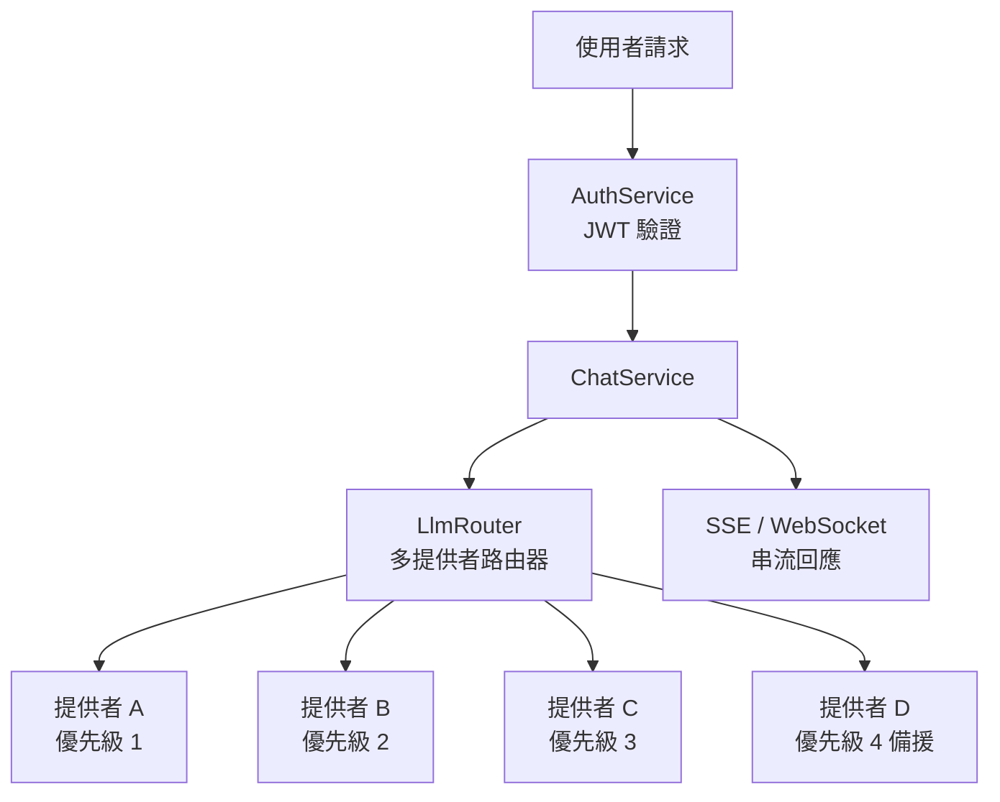
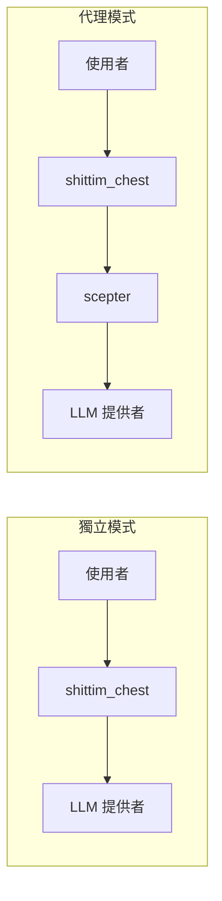

# 獨立的 LLM 架構

## 概述

shittim-chest 擁有完全獨立的 LLM 路由層，不依賴於 entelecheia。使用者可以設定多個 LLM 提供者，內建路由器會根據優先級和可用性自動選擇。這是 shittim-chest 相對於 Open WebUI 的核心差異化能力。

## 架構



## 核心能力

### 1. 多提供者優先級路由

```text
每個提供者有一個優先級欄位（數字越小 = 優先級越高）。
請求從最高優先級到最低優先級依次嘗試：
  → 提供者 A (priority=1) 可用 → 使用
  → 不可用 → 提供者 B (priority=2) 可用 → 使用
  → 不可用 → ... → 回傳錯誤
```

### 2. 自動容錯移轉

當高優先級提供者回傳錯誤（逾時、速率限制、無法連線）時，路由器會自動切換到下一個可用提供者，對使用者透明。

### 3. API 金鑰加密儲存

所有提供者 API 金鑰使用 AES-256-GCM 進行靜態加密，儲存在 `shittim_chest_db` 中。加密金鑰透過 `ENCRYPTION_KEY` 環境變數提供。即使資料庫遭到入侵，API 金鑰仍無法讀取。

### 4. 雙協定串流

| 協定 | 端點 | 使用情境 |
| --- | --- | --- |
| SSE | `/api/chat/stream` | 簡易 HTTP 串流、代理相容、瀏覽器原生支援 |
| WebSocket | `/ws/chat/stream` | 雙向通訊、支援取消和即時互動 |

### 5. OpenAI 相容性

所有提供者介面遵循 OpenAI `/v1/chat/completions` 格式，可整合任何 OpenAI API 相容服務（DeepSeek、OpenAI、本機 Ollama/LM Studio 等）。

## 提供者管理

### 設定來源

| 方法 | 使用情境 |
| --- | --- |
| 環境變數 (`LLM_DEFAULT_PROVIDER_*`) | 快速啟動、單一提供者場景 |
| 資料庫 CRUD (`/api/providers/*`) | 多提供者、動態管理 |
| arona 管理面板 | 圖形化管理 |

### 種子提供者

首次啟動時，若設定了 `LLM_DEFAULT_PROVIDER_*` 環境變數，`db-init` 會自動建立一個種子提供者。之後可透過 arona 管理面板新增更多提供者。

## 獨立模式 vs 代理模式



| 模式 | 條件 | 行為 |
| --- | --- | --- |
| 獨立 | scepter 未設定（或 `Proxy: disabled`） | 直接呼叫 LLM 提供者 |
| 代理 | scepter URL 已設定 | 透過代理層轉發至 entelecheia Agent 處理 |

獨立模式完全提供完整的對話體驗：對話管理、訊息持久化、搜尋、匯出。代理模式則新增 Agent 編排能力。

## 技術實作

- **路由器**：`packages/shittim_chest/src/llm/router.rs`，支援優先級選擇 + 容錯移轉
- **客戶端**：`packages/shittim_chest/src/llm/client.rs`，基於 `reqwest` + `rustls`（無 OpenSSL 依賴）
- **提供者 CRUD**：`packages/shittim_chest/src/api/providers.rs`，標準 REST 端點
- **加密**：`aes-gcm` crate，`ENCRYPTION_KEY` 環境變數
