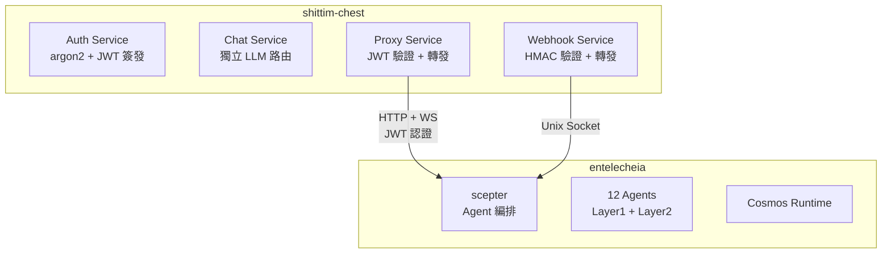

# 與 entelecheia 的鬆耦合設計

## 概述

shittim-chest 與 entelecheia 之間的整合基於 JWT 認證的 HTTP/WebSocket 代理橋接。此設計允許 shittim-chest 在沒有 entelecheia 的情況下完全獨立運作，同時在需要時按需啟用 Agent 編排能力。

## 邊界設計



## 資料所有權

| shittim_chest_db | entelecheia_db |
| --- | --- |
| auth_users (密碼雜湊) | user_identities (user_id) |
| sessions (活躍工作階段) | groups |
| refresh_tokens | group_memberships |
| oauth_connections | role_assignments |
| api_keys (加密的提供者金鑰) | group_permissions (提供者配額) |
| conversations | agent_configs |
| messages | cosmos_state |
| llm_providers (提供者設定) | iepl_state |
| remote_devices (裝置記錄) | |
| device_sessions | |
| channel_configs | |
| webhook_logs (傳遞日誌) | |

**原則**：shittim-chest 持有「使用者端」資料；entelecheia 持有「Agent 端」資料。`user_id` 是兩端之間的連結金鑰。

## JWT 認證協定

### 金鑰共享

shittim-chest 和 scepter 透過相同的 `JWT_SECRET` 環境變數共享 JWT 簽署金鑰。雙方都可以獨立驗證對方簽發的 JWT。

### Token 結構

```json
{
  "sub": "user-uuid",
  "groups": ["admin", "developer"],
  "exp": 1710000000,
  "iat": 1709996400
}
```

| 欄位 | 說明 |
| --- | --- |
| `sub` | 使用者 UUID（跨兩個資料庫共享） |
| `groups` | 使用者所屬的群組列表 |
| `exp` | 到期時間（預設 1 小時） |
| `iat` | 簽發時間 |

### 登入流程

```text
使用者 → shittim_chest: POST /api/auth/login
shittim_chest: 驗證 argon2 密碼
shittim_chest → scepter: GET /api/user/{id}/permissions
scepter → entelecheia_db: 查詢群組和權限
scepter → shittim_chest: { groups, permissions }
shittim_chest: 簽發 JWT (access + refresh)
shittim_chest → 使用者: tokens
```

## 代理橋接

### HTTP 代理

```text
瀏覽器 → shittim_chest:80/api/proxy/chat (JWT 在 Header 中)
shittim_chest: 驗證 JWT
shittim_chest → scepter:8424/api/chat (轉發 JWT)
scepter → Agent → LLM → scepter → shittim_chest → 瀏覽器
```

### WebSocket 代理

```text
瀏覽器 → shittim_chest:80/api/proxy/ws (JWT 在 Header 中)
shittim_chest: 驗證 JWT
shittim_chest ↔ scepter:8424/ws (雙向轉發 + JWT)
瀏覽器 ↔ scepter: 全雙工 Agent 互動
```

### 速率限制與監控

在代理層，shittim-chest 負責：

- 速率限制（按使用者 / 按 IP）
- 使用量日誌記錄
- 連線生命週期管理
- 異常斷線時重新連線

## Webhook 管線

```text
GitHub/GitLab/Gitee → POST /api/webhook/{source} → HMAC 驗證 → 解析事件 → Unix socket → scepter
```

shittim-chest 處理 HMAC 驗證和事件解析；scepter 根據事件觸發 Agent 動作（例如自動程式碼審查）。

## 獨立運作模式

當環境變數中未設定 scepter URL 或 `SHITTIM_CHEST_SCEPTER_PROXY` 設為 `disabled` 時：

- `/api/proxy/*` 端點回傳 503（服務不可用）
- `/api/devices/*` 端點回傳 503
- 對話完全使用內建 LlmRouter
- 所有其他功能（認證、對話、提供者管理、webhook 入口）正常運作

這使得 shittim-chest 可以作為完整的獨立 LLM WebUI 部署，無需 entelecheia。
