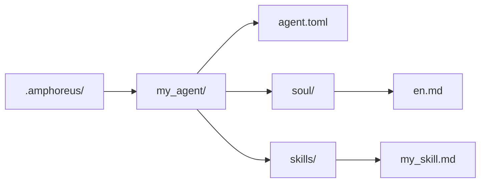

# Agent 開發教學

> 以當前倉庫現實為準的 Agent 開發說明

## 概述

當前倉庫中有三種實際可用的擴充層級。

| 層級 | 當前含義 |
| --- | --- |
| Layer1 | 以 Rust crate 實作並編譯進 workspace 的核心 Agent |
| Layer2 | Web Automation 這一活躍內建領域 Agent，加上若干歸檔或規劃材料 |
| Layer3 | 使用者自訂 Agent（計劃中，尚未實作） |

不要再把歷史文件中出現的所有 Layer2 方案都理解為當前仍然活躍的內建 Agent。

## Layer3 是最簡單的擴充路徑

> **注意**：Layer3 目前僅處於設計階段。`.amphoreus/` 目錄、Agent 載入器（`Layer3Workspace`）及設定框架尚未實作。本節描述的是未來使用的目標設計。

如果你希望擴充 Entelecheia（玄樞），但不修改 Rust workspace，優先使用 Layer3（待實作後）。

### 最小結構

### Layer3 當前能提供什麼

- 基於 prompt 的 soul 檔案
- 基於 prompt 的 skill
- 複用現有平台工具
- 載入時的預檢掃描

### Layer3 當前不能自動提供什麼

- 新的 Rust MCP 後端
- 完整沙箱保證
- 每條 skill/tool 路徑天然具備生產可用性

## 內建 Agent 開發

內建 Agent 是位於 `packages/agents/<agent>/` 下的 Rust crate。

常見組成包括：

- `src/lib.rs`
- `src/state.rs`
- `src/skills.rs`
- `src/mcp/registry.rs`
- `src/mcp/tools/*.rs`

同時還需要在 `res/prompts/agents/<agent>/` 下維護對應文件。

## 當前對 Layer2 的建議

倉庫歷史上曾包含大量 Layer2 領域 Agent 設計。當前應按以下方式理解：

- 當前 workspace 中活躍的內建 Layer2 crate 是 Web Automation
- 舊 Layer2 文件很多描述的是設計目標或歸檔材料
- 新的內建 Layer2 開發應被視為真實產品開發，而不是僅靠恢復文件即可「啟用」

## 當前安全提示

- 預檢掃描已存在，但仍是基於關鍵字的規則掃描。
- 工具是否可用，取決於對應 MCP 工具背後的真實實作。
- 文件中提到的部分工具和 skill 仍可能是部分實作或 stub。

## 參考路徑

- `packages/shared/custom_agent/src/`
- `packages/agents/hubris/`
- `packages/agents/kalos/`
- `packages/agents/aporia/`
- `res/prompts/agents/`

## 測試建議

當前更建議直接驗證：

- Layer3 的解析與載入
- skill 解析
- Rust 中 MCP 工具的直接測試
- 你實際修改的那條 agent/tool 路徑

不要再把舊架構文案當成「某個 Layer2 路徑已經活躍」的證據。
