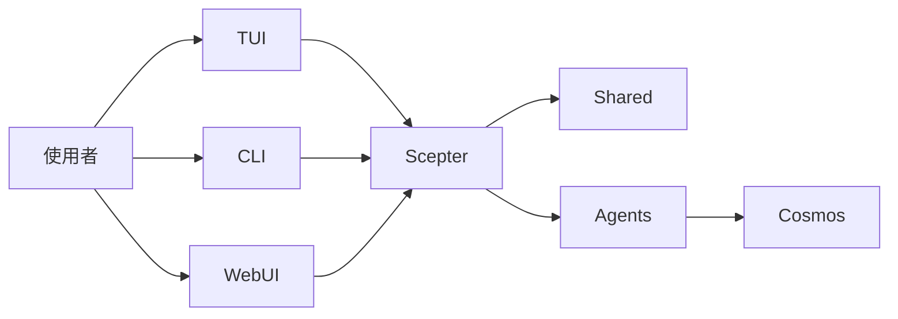

+++
title = "架構"
description = """> 以當前執行時結構為準，而不是目標態想像圖"""
lang = "zht"
category = "guides"
subcategory = "core"
+++

# 架構

> 以當前執行時結構為準，而不是目標態想像圖

## 執行時概覽

當前平台的核心是 `packages/scepter`、`packages/shared` 和 `packages/tui`。

## 當前最成熟的部分

- Scepter 服務端編排
- Shared 中的設定、工具名、prompt 和狀態類型
- TUI 使用者鏈路
- 基於容器的執行路徑

## 當前仍屬部分實作的部分

- CLI 命令覆蓋度
- 進階 memory / RAG 整合
- 大多數領域化 Layer2 方案

## 當前活躍的 Agent 結構

### Layer1

workspace 當前編譯 12 個 Layer1 Agent，涵蓋訊息路由、規劃、檔案、容器、腳本、知識、搜尋、排程、安全、記憶與裝置相關能力。

### Layer2

當前 workspace 有兩個活躍的內建 Layer2 crate：**Web Automation**（瀏覽器自動化）和**經典軟體工程**（靜態分析、程式碼審查、品質度量、重構、LSP 診斷/符號/重構）。舊文件中列出的 11 個專用 Agent 描述的是這兩個之外已歸檔或規劃中的內容。

### Layer3

Layer3 仍是基於 `.amphoreus/` 的自訂 Agent 擴充點（設計階段，尚未實作）。

## 執行模型

### 模型可見工具

模型通常只看到：

- `exec`
- `write_to_var`
- `write_to_var_json`

內部 MCP 工具透過執行時間接呼叫。

### 處理程序內與容器路徑

部分邏輯在 Scepter 處理程序內執行，另一部分工作則透過容器化路徑和執行時輔助模組完成。

### WebUI / IDE / Tauri

Web UI（arona）、管理面板（plana）、IDE 外掛與 Tauri 應用已遷移至姊妹專案 **shittim-chest** 並從本倉庫移除。本倉庫的首選介面是 **TUI**；Web/IDE 層位於 shittim-chest，透過 JWT + WebSocket/HTTP 與 Scepter 通訊。

## Memory 與知識能力

RAG 與 memory 比舊概覽所述更成熟，但仍有部分整合膠水待補：

- 已實作三種嵌入後端：API（OpenAI 相容）、本地 ONNX 推理（`FastEmbeddingService`，預設 BGE-M3）、SHA-256 雜湊兜底
- 記憶態向量文件與 **PgVector** 儲存（HNSW 索引）均可用
- 圖走訪與混合檢索（RRF 融合）已可用
- embedding→RAG 自動接線和 RAG 訂閱同步仍待整合
