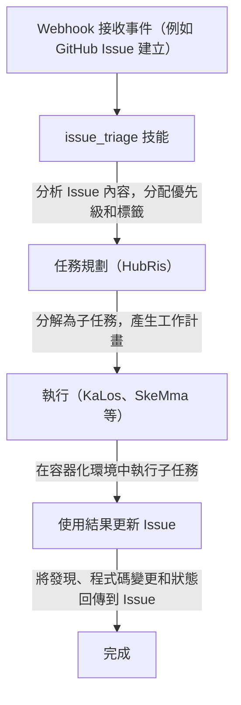

# Issue 追蹤整合

> 將外部 Issue 追蹤系統連接到 Entelecheia（玄樞） 的 Agent 工作流
> 當前狀態說明：HubRis 當前確實提供 issue 的建立、更新、搜尋和評論輔助能力，倉庫中也存在 webhook 整合。但本文不應被理解為「已經存在一個完整統一的跨平台 issue 產品面」。

---

## 目錄

- [概述](#概述)
- [容器三層識別](#容器三層識別)
- [繫結 ID 格式](#繫結-id-格式)
- [Agent 如何與 Issue 互動](#agent-如何與-issue-互動)
- [Issue 驅動的工作流](#issue-驅動的工作流)
- [平台前綴註冊表](#平台前綴註冊表)
- [容器 Fork 分支命名](#容器-fork-分支命名)
- [WebUI 整合](#webui-整合)

---

## 概述

當前 Entelecheia 的 issue 相關能力主要來自兩個方向：

- webhook 整合可把外部事件轉發進系統
- HubRis 提供 issue 風格的增刪改查輔助能力

跨平台 issue 自動化可以視為已經存在的方向與部分實作，但不應預設認為本文中的每條工作流都已經完整閉環。

---

## 容器三層識別

Entelecheia 中的容器使用三層 ID 系統，在不同上下文中維護身分：

| 層級 | 格式 | 生命週期 | 用途 |
| --- | --- | --- | --- |
| UUID | 標準 UUID（例如 `550e8400-e29b-41d4-a716-446655440000`） | 永久 | 資料庫主鍵、跨重啟追蹤 |
| 繫結 ID | `@platform#id`（例如 `@github#234`） | 穩定 | 外部資源繫結、分支命名 |
| 執行時 ID | `#xxx`（例如 `#616`） | 每次工作階段 | TUI 顯示、Unix socket 路由 |

**繫結 ID** 將容器連結到外部平台資源。它在 Scepter 重啟後保持穩定，不像執行時 ID 在每次啟動時重新分配。

---

## 繫結 ID 格式

繫結 ID 的通用格式為：

```text
@platform#id[@#floor]
```

- `platform` —— 平台前綴（例如 `github`、`gitee`、`gitlab`）
- `id` —— 平台上的 Issue 或資源編號
- `@#floor` —— 可選的樓層號，用於巢狀引用（例如評論）

### 範例

| 繫結 ID | 含義 |
| --- | --- |
| `@github#123` | GitHub Issue #123 |
| `@gitee#456` | Gitee Issue #456 |
| `@gitlab#789` | GitLab Issue #789 |
| `@github#123@#5` | GitHub Issue #123 的第 5 條評論 |
| `@feishu#abc123` | 飛書訊息話題 abc123 |

繫結 ID 用於：

- 容器標籤和元資料
- Issue 驅動開發的分支名稱
- Agent 技能參數
- WebUI Issue 列表過濾

---

## Agent 如何與 Issue 互動

Agent 透過 HubRis MCP 工具與外部 Issue 互動。這些工具封裝了平台特定的 API：

### 可用的 Issue 操作

| 工具 | 描述 |
| --- | --- |
| `$.agent.HubRis.issue_create()` | 在外部平台上建立新 Issue |
| `$.agent.HubRis.issue_update()` | 更新現有 Issue（標題、正文、狀態、標籤） |
| `$.agent.HubRis.issue_search()` | 跨平台搜尋 Issue 並套用篩選器 |
| `$.agent.HubRis.issue_comment()` | 向現有 Issue 新增評論 |

### 在 exec 程式碼中使用

```typescript
$.agent.HubRis.issue_create({
  platform: "github",
  repository: "celestia-island/entelecheia",
  title: "Fix WebSocket reconnection logic",
  body: "The WebSocket client does not retry on connection loss.",
  labels: ["bug", "priority:high"]
});
```

```typescript
$.agent.HubRis.issue_search({
  platform: "github",
  repository: "celestia-island/entelecheia",
  state: "open",
  labels: ["bug"]
});
```

```typescript
$.agent.HubRis.issue_comment({
  binding_id: "@github#123",
  body: "Investigation complete. Root cause identified in src/ws/client.rs:42."
});
```

---

## Issue 驅動的工作流

預設的 Issue 驅動工作流遵循以下流水線：



### 逐步範例

1. 開發者建立了標題為 "Memory leak in container cleanup" 的 Issue `@github#42`
1. GitHub Webhook 將事件轉發到 Scepter
1. `issue_triage` 技能將其分類為 **bug**，優先級為 **high**
1. HubRis 分解任務：(a) 重現洩漏 (b) 找到根因 (c) 實作修復
1. KaLos 讀取相關原始檔，SkeMma 執行診斷腳本
1. Agent 提交修復並在 `@github#42` 上評論解決方案

---

## 平台前綴註冊表

平台前綴映射是可設定的。預設註冊表包括：

| 前綴 | 平台 | Issue URL 模式 |
| --- | --- | --- |
| `github` | GitHub | `https://github.com/{repo}/issues/{id}` |
| `gitee` | Gitee | `https://gitee.com/{repo}/issues/{id}` |
| `gitlab` | GitLab | `https://gitlab.com/{repo}/-/issues/{id}` |
| `feishu` | 飛書 / Lark | 內部訊息連結 |
| `discord` | Discord | 頻道訊息連結 |
| `telegram` | Telegram | 聊天訊息連結 |

### 國際化支援

平台前綴支援國際化名稱。例如，飛書可以透過以下方式引用：

- `@feishu#123`（英文名稱）
- `@飛書#123`（中文名稱）

前綴註冊表內部會將這些標準化為規範前綴。

---

## 容器 Fork 分支命名

當 Agent 為 Issue 驅動的工作建立分支時，分支遵循命名約定：

### 格式

```text
cosmos-<binding_id>-<reason>
```

或

```text
cosmos-<uuid8>-<reason>
```

### 範例

| 分支名稱 | 上下文 |
| --- | --- |
| `cosmos-@github#42-fix-memory-leak` | 修復 GitHub Issue #42 |
| `cosmos-@gitee#15-add-ci-pipeline` | Gitee Issue #15 的功能開發 |
| `cosmos-a1b2c3d4-refactor-auth-module` | 使用 UUID 前綴的內部任務 |

繫結 ID 格式確保分支可以追溯到其原始 Issue。

---

## WebUI 整合

Entelecheia WebUI 提供了跨所有連接平台的 Issue 統一檢視。

### 左側邊欄 —— 聚合 Issue 列表

- 在單一列表中顯示所有平台的 Issue
- 每條記錄顯示：平台圖示、Issue 編號、標題、狀態、分配的 Agent
- 點選 Issue 開啟其詳情檢視

### 過濾

Issue 可以按以下條件過濾：

- **平台**：僅顯示 GitHub、Gitee、GitLab 等
- **狀態**：開放、已關閉、進行中
- **優先級**：高、中、低（從標籤派生）
- **分配的 Agent**：按當前正在處理該 Issue 的 Agent 過濾

### Issue 詳情檢視

詳情檢視顯示：

- 完整的 Issue 標題和正文（從 Markdown 渲染）
- 平台連結（在瀏覽器中開啟原始 Issue）
- Agent 活動日誌（技能呼叫、發佈的評論）
- 關聯的容器和分支

---

## 下一步

- 閱讀 [Webhook 平台設定](webhook-setup.md)連接您的平台
- 瀏覽[架構](architecture.md)了解 HubRis Agent 設計
- IDE 整合已遷移至 [shittim-chest](https://github.com/celestia-island/shittim-chest) 兄弟倉庫
