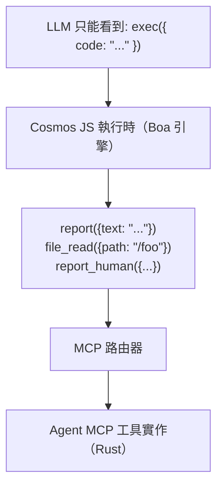
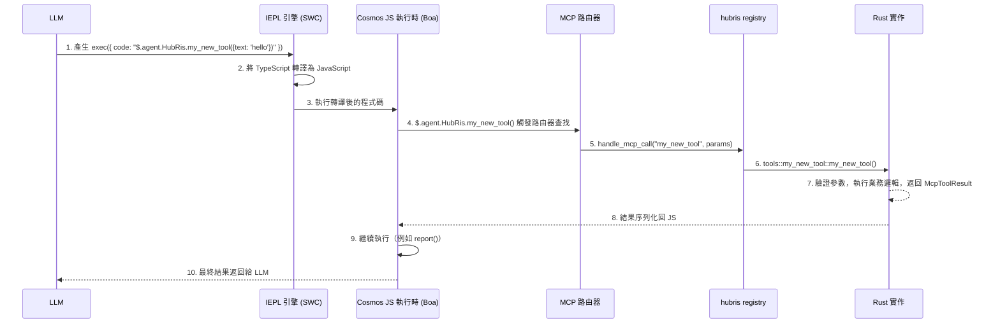

# MCP 工具開發教學

> 如何在 Entelecheia（玄樞） 平台中建立和註冊 MCP 工具

-----------------------------------------------------------------------------

## 目錄

- [Exec-Only 微核心](#exec-only-微核心)
- [MCP 工具結構](#mcp-工具結構)
- [新增新的 MCP 工具](#新增新的-mcp-工具)
- [最佳實踐](#最佳實踐)
- [測試 MCP 工具](#測試-mcp-工具)

-----------------------------------------------------------------------------

## Exec-Only 微核心

Entelecheia 使用**微核心架構**進行工具存取。LLM 只能看到三個工具——`exec`、`write_to_var`、`write_to_var_json`——所有實際工作都在其 TypeScript 執行時（IEPL 引擎）內部完成。



**核心原則**：LLM 永遠不會直接呼叫 MCP 工具。它產生透過 ES 模組匯入呼叫工具函式 API 的 TypeScript 程式碼（例如 `import { report } from 'hubris'; report()`），IEPL 引擎將其轉譯為 JavaScript 並分發到實際的 Rust 實作。

- ES 模組匯入 — 通用模式（例如 `import { report } from 'hubris'; report()`、`file_read()`）
- `exec`、`write_to_var`、`write_to_var_json` 是所有 Agent 僅註冊的三個工具（參見 `packages/shared/domain_skills/src/tool_names.rs:265-283`）

Skill 的 TOML frontmatter 中的 `related_tools` 宣告決定了哪些 ES 模組匯入 API 會在傳送給 LLM 的提示詞中提供文件。

-----------------------------------------------------------------------------

## MCP 工具結構

一個 MCP 工具由三部分組成：

1. **Rust 實作** — 實際邏輯，位於 `packages/agents/<agent>/src/mcp/tools/`
1. **Registry 分發** — 路由，位於 `packages/agents/<agent>/src/mcp/registry.rs`
1. **工具名稱常數** — 字串常數，位於 `packages/shared/domain_skills/src/tool_names.rs`

### mcp/registry.rs 中的工具定義

每個 Agent 都有一個 `handle_mcp_call` 函式，將工具名稱路由到對應的實作：

```rust
// packages/agents/kalos/src/mcp/registry.rs

use serde_json::Value;
use tracing::info;
use crate::{mcp::tools, state::KalosState};
use _shared::skills::{mcp_tools::McpToolResult, tool_names};

pub async fn handle_mcp_call(
    state: &std::sync::Arc<tokio::sync::RwLock<KalosState>>,
    tool_name: &str,
    parameters: Value,
) -> McpToolResult {
    info!("Calling Kalos MCP tool: {}", tool_name);

    match tool_name {
        tool_names::kalos::FILE_READ => tools::file_read(state, parameters).await,
        tool_names::kalos::FILE_WRITE => tools::file_write(state, parameters).await,
        tool_names::kalos::FILE_EDIT => tools::file_edit(state, parameters).await,
        // ...
        _ => McpToolResult::failure(format!("Unknown tool: {}", tool_name)),
    }
}
```

### 使用 validate_required_params 進行參數驗證

對於有必需參數的工具，使用共享的驗證輔助函式：

```rust
use _shared::skills::mcp_tools::validate_required_params;

pub async fn my_tool(parameters: Value) -> McpToolResult {
    if let Some(failure) = validate_required_params(
        &parameters,
        &["title", "content"],  // 必需參數名稱
        "my_tool",              // 用於錯誤訊息的工具名稱
    ) {
        return failure;
    }

    let title = parameters.get("title").unwrap().as_str().unwrap();
    // ...
}
```

`validate_required_params` 檢查每個必需參數是否存在且為非空字串。如果全部有效則返回 `None`，否則返回包含描述性錯誤資訊的 `Some(McpToolResult::failure(...))`。

參考：`packages/shared/domain_skills/src/mcp_tools.rs:12-41`。

### 返回值：McpToolResult

每個工具必須返回一個 `McpToolResult`。主要的建構函式：

```rust
// 成功並返回任意 JSON 資料
McpToolResult::success(serde_json::to_value(my_struct).unwrap_or_default())

// 成功並返回可序列化的結構體
McpToolResult::success_struct(&my_result)

// 成功並返回純文字
McpToolResult::success_text("Operation completed".into())

// 成功並返回 LLM 用量追蹤
McpToolResult::success_with_usage(
    "Result text".into(),
    Some("gpt-4".into()),
    Some((prompt_tokens, completion_tokens)),
)

// 失敗並返回錯誤訊息
McpToolResult::failure("Missing required parameter: title".into())

// 失敗並返回多條錯誤
McpToolResult::failure_lines(vec!["Error 1".into(), "Error 2".into()])
```

參考：`packages/shared/domain_skills/src/mcp_tools.rs:62-136`。

-----------------------------------------------------------------------------

## 新增新的 MCP 工具

本步驟指南以 HubRis 為例，演示如何為現有 Agent 新增新的工具。

### 步驟 1：新增工具名稱常數

編輯 `packages/shared/domain_skills/src/tool_names.rs`：

```rust
/// HubRis tool names
pub mod hubris {
    pub const REPORT: &str = "report";
    pub const CREATE_TODO: &str = "create_todo";
    // ... 現有工具 ...
    pub const MY_NEW_TOOL: &str = "my_new_tool";  // 新增此行
}
```

### 步驟 2：實作工具

建立新檔案 `packages/agents/hubris/src/mcp/tools/my_new_tool.rs`：

```rust
use serde::Serialize;
use serde_json::Value;
use std::sync::Arc;
use tokio::sync::RwLock;

use crate::state::HubrisState;
use _shared::skills::mcp_tools::{validate_required_params, McpToolResult};

# [derive(Serialize, Debug, Clone)]
struct MyNewToolResult {
    id: String,
    message: String,
}

pub async fn my_new_tool(
    state: &Arc<RwLock<HubrisState>>,
    parameters: Value,
) -> McpToolResult {
    if let Some(failure) = validate_required_params(&parameters, &["text"], "my_new_tool") {
        return failure;
    }

    let text = parameters.get("text").and_then(|v| v.as_str()).unwrap();
    let id = uuid::Uuid::now_v7().to_string();

    let result = MyNewToolResult {
        id,
        message: format!("Processed: {}", text),
    };

    McpToolResult::success(serde_json::to_value(result).unwrap_or_default())
}
```

### 步驟 3：在模組中註冊

編輯 `packages/agents/hubris/src/mcp/tools/mod.rs`：

```rust
pub mod report;
pub mod todo_ops;
pub mod my_new_tool;  // 新增此行
```

### 步驟 4：新增到 Registry 分發

編輯 `packages/agents/hubris/src/mcp/registry.rs`：

```rust
pub async fn handle_mcp_call(
    state: &Arc<RwLock<HubrisState>>,
    todo_store: &Option<Arc<TodoStore>>,
    tool_name: &str,
    parameters: Value,
) -> McpToolResult {
    match tool_name {
        // ... 現有工具 ...
        tool_names::hubris::MY_NEW_TOOL => {
            crate::mcp::tools::my_new_tool::my_new_tool(state, parameters).await
        },
        _ => McpToolResult::failure(format!(
            "HubRis does not provide tool: {}",
            tool_name
        )),
    }
}
```

### 步驟 5：建立 MCP 工具文件

建立 `res/prompts/agents/hubris/mcp/my_new_tool.md`：

```markdown
+++
name = "my_new_tool"
agent = "hubris"

[description]
en = "Process text and return a structured result."
zhs = "處理文字並返回結構化結果。"
+++

# my_new_tool

Process text and return a structured result.

## Parameters

- **text** (string, required): The text to process

## Returns

### Success

\`\`\`json
{ "id": "...", "message": "Processed: ..." }
\`\`\`

### Failure

\`\`\`text
Missing required parameter(s) for my_new_tool: text
\`\`\`
```

### 步驟 6：透過 Skill 中的 related_tools 暴露

為了讓 LLM 感知到你的工具，將其新增到 Skill 的 frontmatter 中：

```toml
[[related_tools]]
agent_name = "hubris"
tool_name = "my_new_tool"
```

這會將工具的 API 文件注入到 Skill 提示詞中，使 LLM 能夠呼叫 `$.agent.HubRis.my_new_tool()`。

### 步驟 7：透過 exec 使用（提示詞注入）

當 LLM 處理一個 `related_tools` 中列出了 `my_new_tool` 的 Skill 時，它會產生 TypeScript 程式碼：

```typescript
const result: { id: string; message: string } = await $.agent.HubRis.my_new_tool({ text: "some content to process" });
```

IEPL 引擎將 TypeScript 轉譯為 JavaScript，然後 Cosmos JS 執行時攔截呼叫，透過 MCP 路由器分發到 Rust 實作，並將結果返回到 JavaScript 上下文。

### 完整呼叫鏈



-----------------------------------------------------------------------------

## 最佳實踐

### 1. 始終使用 write_to_var 處理多行輸出

在 `exec` 程式碼中構造多行字串時，使用 `write_to_var` 避免 Token 開銷過大的內聯字串：

```typescript
// 不推薦——大型內聯字串
exec({ code: "report({text: 'line1\\nline2\\nline3\\n...very long...'})" })

// 推薦——逐步構建
exec({ code: `
  let output: string = '';
  $write_to_var('step1', 'First part of the content');
  $write_to_var('step2', 'Second part of the content');
  output = $read_var('step1') + '\\n' + $read_var('step2');
  report({text: output});
` })
```

### 2. 使用 env.aporia.language 設定輸出語言

產出面向使用者文字的 Skill 應該檢查組態的輸出語言：

```typescript
const lang: string = env.aporia.language;  // 例如 "en"、"zhs"、"ja"
const greeting: string = lang === "en" ? "Hello" : lang === "zhs" ? "你好" : "Hello";
```

Skill 的 frontmatter 可以宣告此依賴：

```toml
config = ["user_language"]
```

### 3. 使用 TypeScript，始終使用 const/let，絕不使用 var

`exec` 中的所有程式碼都應使用 TypeScript 語法：

```typescript
// 正確
const result = file_read({path: '/src/main.rs'});
let items: string[] = result.content.split('\n');

// 錯誤
var result = file_read({path: '/src/main.rs'});
```

### 4. 逐步構建物件

對於複雜的參數物件，逐步構建它們：

```typescript
let params: Record<string, unknown> = {};
params.title = "My Task";
params.description = "Detailed description";
params.priority = "high";

if (hasDueDate) {
    params.due_date = dueDate;
}

$.agent.HubRis.create_todo(params);
```

### 5. 透過 report() 報告結果

每個 Skill 必須在結束前至少呼叫一次 `report()`。這是擷取結果並將其路由到 Skill 鏈中下一步的方式：

```typescript
report({text: "Task decomposition complete. Found 3 sub-tasks."});
```

多次呼叫會被聚合——所有內容在思考階段結束時會合併。

### 6. 參數命名慣例

- 參數名稱使用 `snake_case`（例如 `parent_id`、`due_date`、`workspace_id`）
- 字串 ID 應使用 UUID 格式
- 時間戳應使用 ISO 8601 / RFC 3339 格式
- 可選參數應記錄明確的預設值

### 8. IEPL 批次優先工具設計（關鍵）

在傳統 MCP 中，工具是細粒度的——CPU、記憶體、磁碟分別呼叫不同的工具。在 IEPL 中，每次往返都會消耗 LLM Token 和延遲。**設計工具時最多透過 1-2 次呼叫返回所有相關資料。**

```rust
// 不推薦：三個獨立的工具分別獲取裝置資訊
pub const CPU_INFO: &str = "cpu_info";
pub const MEMORY_INFO: &str = "memory_info";
pub const STORAGE_INFO: &str = "storage_info";

// 推薦：一個工具返回完整的系統組態
pub const SYSTEM_INFO: &str = "system_info";
// 返回: { cpu: {...}, memory: {...}, storage: {...}, pci: [...], gpu: {...}, os: {...} }
```

對於從外部來源（裝置、協定、資料庫）讀取資料的工具，接受 `scan` 或 `ranges` 參數以支援批次查詢：

```typescript
// 批次 Modbus 讀取——一次呼叫讀取多個暫存器範圍
const result = $.agent.SkeMma.modbus_read({
  endpoint: "/dev/ttyUSB0",
  scan: [
    { register_type: "holding", start_address: 0, count: 10 },
    { register_type: "input", start_address: 100, count: 5 }
  ]
});
```

**細粒度工具僅在以下情況下可接受**：針對特定位址的寫操作，或呼叫者明確請求窄範圍資料的查詢。

### 7. 工具中的錯誤處理

返回描述性的錯誤訊息，幫助 LLM 自我糾正：

```rust
// 推薦——具體、可執行
McpToolResult::failure("Missing required parameter(s) for create_todo: title".into())

// 推薦——帶上下文
McpToolResult::failure(format!("TODO item {} not found", id))

// 不推薦——模糊不清
McpToolResult::failure("Error".into())
```

-----------------------------------------------------------------------------

## 測試 MCP 工具

### 單元測試單個工具

透過構造 `Value` 參數並斷言 `McpToolResult`，直接測試每個工具函式：

```rust
# [tokio::test]
async fn test_report_success() {
    use std::sync::Arc;
    use tokio::sync::RwLock;

    let state = Arc::new(RwLock::new(HubrisState::new()));
    let params = serde_json::json!({
        "text": "Test report content"
    });

    let result = crate::mcp::tools::report::report(&state, params).await;

    assert!(result.success);
    assert!(result.data.get("summary").is_some());

    // 驗證狀態已更新
    let state = state.read().await;
    assert_eq!(state.pending_reports.len(), 1);
    assert_eq!(state.pending_reports[0], "Test report content");
}

# [tokio::test]
async fn test_report_empty_text() {
    let state = Arc::new(RwLock::new(HubrisState::new()));
    let params = serde_json::json!({
        "text": ""
    });

    let result = crate::mcp::tools::report::report(&state, params).await;

    assert!(!result.success);
    assert!(!result.error.is_empty());
}
```

### 測試 Registry 分發

測試 registry 是否正確路由工具名稱：

```rust
# [tokio::test]
async fn test_registry_routes_known_tool() {
    let state = Arc::new(RwLock::new(HubrisState::new()));
    let params = serde_json::json!({"text": "hello"});

    let result = handle_mcp_call(&state, &None, "report", params).await;
    assert!(result.success);
}

# [tokio::test]
async fn test_registry_rejects_unknown_tool() {
    let state = Arc::new(RwLock::new(HubrisState::new()));
    let params = serde_json::json!({});

    let result = handle_mcp_call(&state, &None, "nonexistent_tool", params).await;
    assert!(!result.success);
    assert!(result.error[0].contains("does not provide tool"));
}
```

### 測試參數驗證

直接測試 `validate_required_params` 輔助函式：

```rust
# [test]
fn test_validate_required_params_all_present() {
    let params = serde_json::json!({"title": "test", "content": "body"});
    let result = validate_required_params(&params, &["title", "content"], "test_tool");
    assert!(result.is_none());
}

# [test]
fn test_validate_required_params_missing() {
    let params = serde_json::json!({"title": "test"});
    let result = validate_required_params(&params, &["title", "content"], "test_tool");
    assert!(result.is_some());
    let failure = result.unwrap();
    assert!(!failure.success);
    assert!(failure.error[0].contains("content"));
}

# [test]
fn test_validate_required_params_empty_string() {
    let params = serde_json::json!({"title": ""});
    let result = validate_required_params(&params, &["title"], "test_tool");
    assert!(result.is_some());
}
```

### 使用資料庫 Store 進行測試

對於依賴資料庫 Store 的工具，通常使用記憶體或測試資料庫進行測試：

```rust
# [tokio::test]
async fn test_create_todo_success() {
    // 設定：建立測試 TodoStore（依賴測試基礎設施）
    let todo_store = create_test_store().await;
    let params = serde_json::json!({
        "title": "Test Task",
        "workspace_id": test_workspace_id.to_string()
    });

    let result = create_todo(&todo_store, params).await;

    assert!(result.success);
    let id = result.data.get("id").unwrap().as_str().unwrap();
    assert!(!id.is_empty());
    assert_eq!(result.data.get("title").unwrap().as_str(), Some("Test Task"));
}
```

### 執行測試

```bash
# 執行所有測試
just test

# 執行特定 Agent crate 的測試
cargo test -p hubris
cargo test -p kalos

# 執行特定測試
cargo test -p hubris test_report_success

# 帶輸出執行
cargo test -p hubris -- --nocapture
```

-----------------------------------------------------------------------------

## 快速參考：關鍵檔案

| 用途 | 路徑 |
| --- | --- |
| `McpToolResult` 定義 | `packages/shared/domain_skills/src/mcp_tools.rs` |
| `validate_required_params` | `packages/shared/domain_skills/src/mcp_tools.rs:12-41` |
| 工具名稱常數 | `packages/shared/domain_skills/src/tool_names.rs` |
| `agent_allowed_tools()` | `packages/shared/domain_skills/src/tool_names.rs:166-169` |
| HubRis MCP registry | `packages/agents/hubris/src/mcp/registry.rs` |
| HubRis report 工具 | `packages/agents/hubris/src/mcp/tools/report.rs` |
| HubRis TODO CRUD 工具 | `packages/agents/hubris/src/mcp/tools/todo_ops.rs` |
| KaLos MCP registry | `packages/agents/kalos/src/mcp/registry.rs` |
| MCP 工具文件範例 | `res/prompts/agents/hubris/mcp/` |
| Skill 提示詞範例 | `res/prompts/agents/hubris/skills/` |
