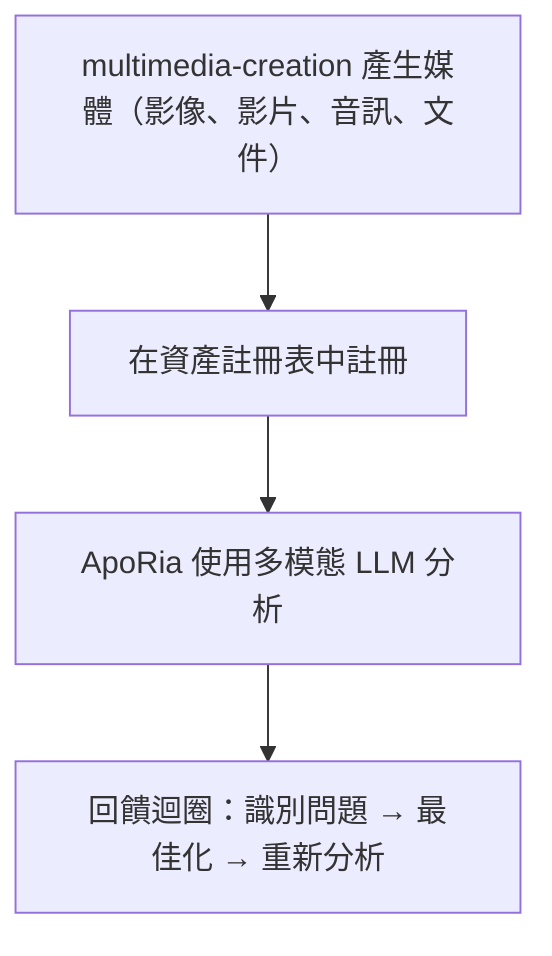

# 多模態流水線

> **⚠️ 已歸檔 Agent 參考 — 不在開發管線中**
> 本文件引用的 `multimedia-creation` Layer2 Agent已經**歸檔**。其 Rust 程式碼、`.d.ts` 繫結及 Agent 註冊均已刪除。本文描述的多模態管線是**設計目標**，不是已交付功能。除非開發者明確要求，否則不要實作或排期此管線的工作。
> 使用 multimedia-creation 和 ApoRia 產生、註冊和分析媒體
> 當前狀態說明：本文主要描述目標工作流。當前程式碼庫中確實存在 ApoRia 的多模態相關工具，但尚未完全達到下文所描述的集中式資產註冊表與完整閉環能力。

---

## 目錄

- [概述](#概述)
- [資產註冊表](#資產註冊表)
- [產生工具](#產生工具)
- [註冊](#註冊)
- [多模態分析](#多模態分析)
- [審查迴圈](#審查迴圈)
- [Office 文件](#office-文件)
- [完整範例](#完整範例)

---

## 概述

Entelecheia（玄樞） 當前包含多模態相關基礎模組，尤其是 ApoRia 側的早期工具。但這裡描述的 multimedia-creation -> 集中式資產註冊 -> 多模態審查閉環，更適合視為目標設計而不是完整現狀。



---

## 資產註冊表

資產註冊表是 ApoRia 管理的集中式媒體元資料儲存。它追蹤：

- 檔案路徑和儲存位置
- MIME 類型
- 產生元資料（提示詞、參數、時間戳）
- 分析歷史和品質評分

### 註冊 / 檢索工作流

```typescript
const asset = $.agent.ApoRia.media_asset_register({
  file_path: "/output/marketing-banner.png",
  mime_type: "image/png",
  metadata: {
    prompt: "A futuristic city skyline at sunset",
    generator: "multimedia-creation",
    model: "stable-diffusion-xl"
  }
});

const asset_id: string = asset.id;

const retrieved = $.agent.ApoRia.media_asset_retrieve({
  asset_id: asset_id
});
```

---

## 產生工具

multimedia-creation 為各種媒體類型提供產生工具。所有工具透過 exec 程式碼中的 `$multimedia-creation.<tool>()` 呼叫。

### 影像產生

```typescript
$multimedia-creation.image_generate({
  prompt: "A futuristic city skyline at sunset, cyberpunk style",
  width: 1024,
  height: 512,
  model: "stable-diffusion-xl",
  output_path: "/output/city-skyline.png"
});
```

### 影片產生

```typescript
$multimedia-creation.video_generate({
  prompt: "Camera panning across a mountain landscape at golden hour",
  duration_seconds: 10,
  fps: 24,
  resolution: "1080p",
  output_path: "/output/mountain-pan.mp4"
});
```

### 音訊產生

```typescript
$multimedia-creation.audio_generate({
  prompt: "Ambient electronic background music, calm and atmospheric",
  duration_seconds: 30,
  format: "mp3",
  output_path: "/output/ambient-bg.mp3"
});
```

### 文件產生

```typescript
$multimedia-creation.doc_generate({
  template: "technical-report",
  title: "Q4 Performance Analysis",
  content: report_markdown,
  format: "docx",
  output_path: "/output/q4-report.docx"
});
```

### 電子試算表產生

```typescript
$multimedia-creation.sheet_generate({
  title: "Budget Forecast 2025",
  data: budget_data,
  format: "xlsx",
  output_path: "/output/budget-2025.xlsx"
});
```

### 投影片產生

```typescript
$multimedia-creation.slide_generate({
  title: "Product Roadmap Presentation",
  sections: slide_sections,
  format: "pptx",
  output_path: "/output/roadmap.pptx"
});
```

---

## 註冊

產生媒體後，在資產註冊表中註冊，以便 ApoRia 進行分析：

```typescript
const result = $multimedia-creation.image_generate({
  prompt: "Product hero shot on white background",
  width: 1920,
  height: 1080,
  output_path: "/output/hero-shot.png"
});

const asset = $.agent.ApoRia.media_asset_register({
  file_path: result.output_path,
  mime_type: "image/png",
  metadata: {
    prompt: "Product hero shot on white background",
    generator: "multimedia-creation",
    dimensions: "1920x1080"
  }
});

const asset_id: string = asset.id;
```

---

## 多模態分析

ApoRia 透過 `$.agent.ApoRia.multimodal_chat()` 提供多模態分析。傳入一個或多個資產 ID 以及文字提示：

```typescript
const analysis = $.agent.ApoRia.multimodal_chat({
  prompt: "Analyze this image for composition, color balance, and visual hierarchy. Rate each aspect from 1-10.",
  asset_ids: [asset_id]
});
```

### 分析多個資產

```typescript
const comparison = $.agent.ApoRia.multimodal_chat({
  prompt: "Compare these two design variations. Which one has better visual balance and why?",
  asset_ids: [variant_a_id, variant_b_id]
});
```

### 帶上下文的分析

```typescript
const context_analysis = $.agent.ApoRia.multimodal_chat({
  prompt: "Does this image match the brand guidelines? Guidelines: primary color blue (#0066CC), clean layout, sans-serif typography.",
  asset_ids: [asset_id]
});
```

---

## 審查迴圈

多模態流水線支援迭代審查週期：

1. **產生** —— multimedia-creation 建立初始媒體
1. **註冊** —— 儲存到資產註冊表
1. **分析** —— ApoRia 使用多模態 LLM 評估媒體
1. **識別問題** —— 從分析中提取具體的改進點
1. **最佳化** —— multimedia-creation 根據回饋調整參數重新產生
1. **重新分析** —— ApoRia 評估最佳化後的輸出

### exec 程式碼中的審查迴圈範例

```typescript
let iteration: number = 0;
const max_iterations: number = 3;
const quality_threshold: number = 8.0;
let current_prompt: string = "A serene mountain lake at dawn, photorealistic";

while (iteration < max_iterations) {
  iteration++;

  const gen_result = $multimedia-creation.image_generate({
    prompt: current_prompt,
    width: 1024,
    height: 768,
    output_path: `/output/lake-v${iteration}.png`
  });

  const asset = $.agent.ApoRia.media_asset_register({
    file_path: gen_result.output_path,
    mime_type: "image/png",
    metadata: { prompt: current_prompt, iteration: iteration }
  });

  const analysis = $.agent.ApoRia.multimodal_chat({
    prompt: "Rate this image on composition (1-10), color harmony (1-10), and overall quality (1-10). Provide specific improvement suggestions.",
    asset_ids: [asset.id]
  });

  const overall_score: number = analysis.data.overall_quality;

  if (overall_score >= quality_threshold) {
    report({ text: `Quality threshold met at iteration ${iteration}. Score: ${overall_score}` });
    break;
  }

  const suggestions = analysis.data.improvement_suggestions;
  current_prompt = current_prompt + ". " + suggestions.join(". ");

  if (iteration === max_iterations) {
    report({ text: `Max iterations reached. Final score: ${overall_score}` });
  }
}
```

---

## Office 文件

multimedia-creation 可以產生 Office 相容的文件：

### Word 文件（`doc_generate`）

從 Markdown 或結構化內容產生 `.docx` 檔案。支援常見文件類型的範本：

- 技術報告
- 會議紀錄
- 提案

```typescript
$multimedia-creation.doc_generate({
  template: "meeting-notes",
  title: "Sprint Planning - Week 12",
  content: meeting_content,
  format: "docx",
  output_path: "/output/sprint-12-notes.docx"
});
```

### Excel 試算表（`sheet_generate`）

產生包含結構化資料、公式和格式的 `.xlsx` 檔案：

```typescript
$multimedia-creation.sheet_generate({
  title: "Monthly Revenue",
  data: revenue_data,
  format: "xlsx",
  output_path: "/output/revenue.xlsx"
});
```

### PowerPoint 簡報（`slide_generate`）

產生包含章節、項目符號和可選圖片嵌入的 `.pptx` 檔案：

```typescript
$multimedia-creation.slide_generate({
  title: "Quarterly Business Review",
  sections: [
    { title: "Revenue", bullets: ["Q1: $1.2M", "Q2: $1.5M"] },
    { title: "Goals", bullets: ["Launch v2.0", "Expand to APAC"] }
  ],
  format: "pptx",
  output_path: "/output/qbr.pptx"
});
```

---

## 完整範例

本範例演示完整的流水線：產生行銷影像、註冊、分析並最佳化。

### 步驟 1：產生初始影像

```typescript
const gen = $multimedia-creation.image_generate({
  prompt: "A modern SaaS product dashboard mockup, clean UI, blue and white color scheme",
  width: 1920,
  height: 1080,
  output_path: "/output/dashboard-v1.png"
});
```

### 步驟 2：註冊資產

```typescript
const asset = $.agent.ApoRia.media_asset_register({
  file_path: gen.output_path,
  mime_type: "image/png",
  metadata: {
    prompt: "SaaS dashboard mockup",
    purpose: "marketing",
    version: 1
  }
});
```

### 步驟 3：分析構圖

```typescript
const analysis = $.agent.ApoRia.multimodal_chat({
  prompt: "Analyze this dashboard mockup for: 1) Visual hierarchy, 2) Color consistency, 3) Readability of data elements. Provide a score (1-10) for each and specific suggestions for improvement.",
  asset_ids: [asset.id]
});
```

### 步驟 4：根據回饋最佳化

```typescript
const refined = $multimedia-creation.image_generate({
  prompt: "A modern SaaS product dashboard mockup, clean UI, blue and white color scheme. " + analysis.data.suggestions.join(". "),
  width: 1920,
  height: 1080,
  output_path: "/output/dashboard-v2.png"
});
```

### 步驟 5：註冊並重新分析

```typescript
const refined_asset = $.agent.ApoRia.media_asset_register({
  file_path: refined.output_path,
  mime_type: "image/png",
  metadata: {
    prompt: "SaaS dashboard mockup (refined)",
    purpose: "marketing",
    version: 2,
    previous_version: asset.id
  }
});

const final_analysis = $.agent.ApoRia.multimodal_chat({
  prompt: "Compare this refined version to the original. Has the visual hierarchy improved? Rate the overall quality 1-10.",
  asset_ids: [asset.id, refined_asset.id]
});

report({
  text: `Marketing image pipeline complete. Initial score: ${analysis.data.overall_score}, Refined score: ${final_analysis.data.overall_score}`
});
```

---

## 下一步

- 閱讀[基礎指南](fundamentals.md)了解 multimedia-creation 和 ApoRia Agent 詳情
- 瀏覽[架構](architecture.md)了解完整的 Agent 系統概覽
- 設定 [Webhook 整合](webhook-setup.md)從外部事件觸發產生
